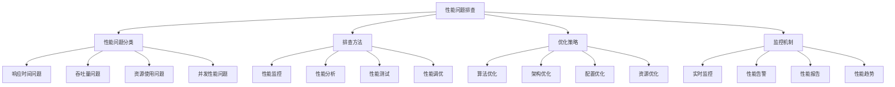

# 性能问题排查

## 🎯 核心定义

### 什么是性能问题排查？
性能问题排查是指对提示词工程系统中出现的性能问题进行系统化识别、分析、定位和优化的过程，通过建立完善的性能监控和排查机制，确保系统的高效运行和用户体验。

### 核心价值
- **性能优化**：提升系统性能和响应速度
- **用户体验**：改善用户体验和满意度
- **资源利用**：优化资源使用和成本控制
- **系统稳定**：提高系统稳定性和可靠性

## 📊 性能问题分类



## 🔍 性能问题详解

### 1. 响应时间问题
| 问题类型 | 问题表现 | 问题原因 | 优化方法 |
|----------|----------|----------|----------|
| **请求延迟** | 请求响应时间过长 | 网络延迟、处理时间过长 | 优化网络、减少处理时间 |
| **查询慢** | 数据库查询慢 | 查询语句不优化、索引缺失 | 优化查询、添加索引 |
| **计算慢** | 计算处理慢 | 算法复杂度高、计算量大 | 优化算法、减少计算量 |
| **IO慢** | 文件读写慢 | 磁盘IO瓶颈、文件系统问题 | 优化IO、使用SSD |

#### 响应时间问题排查模板
```markdown
响应时间问题排查模板：
请排查以下响应时间问题：
- 问题现象：[具体响应时间问题]
- 影响范围：[影响的范围和用户]
- 性能指标：[相关性能指标]
- 问题原因：[可能的原因分析]

排查步骤：
1. 性能监控：监控系统性能指标
2. 日志分析：分析系统日志和错误日志
3. 代码分析：分析代码性能和瓶颈
4. 资源检查：检查系统资源使用情况

优化建议：
- 算法优化：[优化算法的方法]
- 架构优化：[优化架构的方法]
- 配置优化：[优化配置的方法]
- 资源优化：[优化资源的方法]

示例：
请排查以下响应时间问题：
- 问题现象：API响应时间超过5秒
- 影响范围：影响所有用户，用户体验差
- 性能指标：平均响应时间5.2秒，95%响应时间8秒
- 问题原因：数据库查询慢，算法复杂度高

排查步骤：
1. 性能监控：使用APM工具监控API性能
2. 日志分析：分析应用日志和数据库日志
3. 代码分析：分析API代码和数据库查询
4. 资源检查：检查数据库和服务器资源使用

优化建议：
- 算法优化：优化提示词处理算法
- 架构优化：添加缓存层，减少数据库查询
- 配置优化：优化数据库连接池配置
- 资源优化：增加数据库服务器资源
```

### 2. 吞吐量问题
| 问题类型 | 问题表现 | 问题原因 | 优化方法 |
|----------|----------|----------|----------|
| **并发低** | 并发处理能力低 | 系统架构限制、资源不足 | 优化架构、增加资源 |
| **处理慢** | 批量处理慢 | 处理逻辑不优化、资源竞争 | 优化逻辑、减少竞争 |
| **队列积压** | 任务队列积压 | 处理速度慢、队列管理不当 | 提高处理速度、优化队列 |
| **瓶颈限制** | 系统瓶颈限制 | 单点故障、资源瓶颈 | 消除单点、优化资源 |

#### 吞吐量问题排查模板
```markdown
吞吐量问题排查模板：
请排查以下吞吐量问题：
- 问题现象：[具体吞吐量问题]
- 性能指标：[相关性能指标]
- 瓶颈分析：[系统瓶颈分析]
- 优化方向：[优化方向和建议]

排查方法：
1. 负载测试：进行负载测试和压力测试
2. 瓶颈分析：分析系统瓶颈和限制因素
3. 资源监控：监控系统资源使用情况
4. 性能分析：分析性能数据和趋势

优化策略：
- 架构优化：[优化系统架构的方法]
- 资源优化：[优化资源配置的方法]
- 算法优化：[优化处理算法的方法]
- 配置优化：[优化系统配置的方法]

示例：
请排查以下吞吐量问题：
- 问题现象：系统并发处理能力不足
- 性能指标：最大并发100，目标并发500
- 瓶颈分析：数据库连接池限制，CPU使用率高
- 优化方向：优化数据库连接，增加服务器资源

排查方法：
1. 负载测试：进行并发负载测试
2. 瓶颈分析：分析数据库和服务器瓶颈
3. 资源监控：监控CPU、内存、网络使用
4. 性能分析：分析并发性能数据

优化策略：
- 架构优化：采用分布式架构，增加服务器节点
- 资源优化：增加数据库连接池，优化内存配置
- 算法优化：优化提示词处理算法，减少计算量
- 配置优化：优化线程池配置，调整超时参数
```

### 3. 资源使用问题
| 问题类型 | 问题表现 | 问题原因 | 优化方法 |
|----------|----------|----------|----------|
| **内存泄漏** | 内存使用持续增长 | 内存管理不当、对象未释放 | 优化内存管理、及时释放对象 |
| **CPU过载** | CPU使用率过高 | 计算密集、算法不优化 | 优化算法、减少计算量 |
| **磁盘空间** | 磁盘空间不足 | 日志文件过大、数据积累 | 清理日志、优化存储 |
| **网络带宽** | 网络带宽不足 | 数据传输量大、网络配置不当 | 优化传输、调整网络配置 |

#### 资源使用问题排查模板
```markdown
资源使用问题排查模板：
请排查以下资源使用问题：
- 问题现象：[具体资源问题]
- 资源指标：[相关资源指标]
- 使用分析：[资源使用分析]
- 优化建议：[资源优化建议]

排查工具：
1. 系统监控：使用系统监控工具
2. 性能分析：使用性能分析工具
3. 内存分析：使用内存分析工具
4. 网络分析：使用网络分析工具

优化方案：
- 内存优化：[内存优化方案]
- CPU优化：[CPU优化方案]
- 存储优化：[存储优化方案]
- 网络优化：[网络优化方案]

示例：
请排查以下资源使用问题：
- 问题现象：内存使用率持续增长，最终导致系统崩溃
- 资源指标：内存使用率从60%增长到95%
- 使用分析：存在内存泄漏，对象未及时释放
- 优化建议：优化内存管理，及时释放对象

排查工具：
1. 系统监控：使用htop、top监控系统资源
2. 性能分析：使用JProfiler、VisualVM分析性能
3. 内存分析：使用内存分析工具检测泄漏
4. 网络分析：使用网络监控工具分析网络使用

优化方案：
- 内存优化：优化对象生命周期管理，及时释放资源
- CPU优化：优化算法，减少不必要的计算
- 存储优化：定期清理日志文件，优化数据存储
- 网络优化：优化数据传输，减少网络开销
```

### 4. 并发性能问题
| 问题类型 | 问题表现 | 问题原因 | 优化方法 |
|----------|----------|----------|----------|
| **锁竞争** | 数据库锁竞争 | 并发访问同一资源 | 优化锁策略、减少锁时间 |
| **线程阻塞** | 线程阻塞等待 | 资源竞争、死锁 | 优化线程管理、避免死锁 |
| **连接池** | 连接池耗尽 | 连接管理不当、连接泄漏 | 优化连接管理、及时释放连接 |
| **缓存失效** | 缓存频繁失效 | 缓存策略不当、数据更新频繁 | 优化缓存策略、减少失效 |

#### 并发性能问题排查模板
```markdown
并发性能问题排查模板：
请排查以下并发性能问题：
- 问题现象：[具体并发问题]
- 并发指标：[相关并发指标]
- 竞争分析：[资源竞争分析]
- 优化策略：[并发优化策略]

排查方法：
1. 并发测试：进行并发测试和压力测试
2. 锁分析：分析锁竞争和死锁情况
3. 线程分析：分析线程状态和阻塞情况
4. 资源分析：分析资源竞争和瓶颈

优化方案：
- 锁优化：[锁优化方案]
- 线程优化：[线程优化方案]
- 连接优化：[连接优化方案]
- 缓存优化：[缓存优化方案]

示例：
请排查以下并发性能问题：
- 问题现象：高并发时系统响应变慢，出现超时
- 并发指标：并发100时响应时间正常，并发200时响应时间翻倍
- 竞争分析：数据库锁竞争严重，连接池耗尽
- 优化策略：优化数据库锁策略，增加连接池大小

排查方法：
1. 并发测试：进行不同并发级别的压力测试
2. 锁分析：分析数据库锁等待和死锁情况
3. 线程分析：分析应用线程状态和阻塞情况
4. 资源分析：分析数据库连接池和系统资源使用

优化方案：
- 锁优化：优化数据库查询，减少锁持有时间
- 线程优化：优化线程池配置，增加线程数量
- 连接优化：增加数据库连接池大小，优化连接管理
- 缓存优化：增加缓存层，减少数据库访问
```

## 🛠️ 排查方法

### 1. 性能监控方法
| 监控类型 | 监控内容 | 监控工具 | 监控指标 |
|----------|----------|----------|----------|
| **系统监控** | CPU、内存、磁盘、网络 | htop、top、iostat | 使用率、响应时间、吞吐量 |
| **应用监控** | 应用性能、错误率 | APM工具、日志分析 | 响应时间、错误率、吞吐量 |
| **数据库监控** | 数据库性能、查询性能 | 数据库监控工具 | 查询时间、连接数、锁等待 |
| **网络监控** | 网络性能、带宽使用 | 网络监控工具 | 带宽使用、延迟、丢包率 |

#### 性能监控实施指南
```markdown
性能监控实施指南：

1. 系统监控实施
   - 监控指标：CPU使用率、内存使用率、磁盘IO、网络IO
   - 监控工具：htop、top、iostat、netstat
   - 监控频率：实时监控，1分钟采样
   - 告警阈值：CPU>80%、内存>85%、磁盘>90%

2. 应用监控实施
   - 监控指标：响应时间、错误率、吞吐量、并发数
   - 监控工具：APM工具、日志分析工具
   - 监控频率：实时监控，5秒采样
   - 告警阈值：响应时间>3秒、错误率>5%

3. 数据库监控实施
   - 监控指标：查询时间、连接数、锁等待、缓存命中率
   - 监控工具：数据库监控工具、慢查询日志
   - 监控频率：实时监控，1分钟采样
   - 告警阈值：查询时间>1秒、连接数>80%

4. 网络监控实施
   - 监控指标：带宽使用、延迟、丢包率、连接数
   - 监控工具：网络监控工具、ping、traceroute
   - 监控频率：实时监控，30秒采样
   - 告警阈值：延迟>100ms、丢包率>1%
```

### 2. 性能分析方法
| 分析方法 | 分析内容 | 分析工具 | 分析步骤 |
|----------|----------|----------|----------|
| **瓶颈分析** | 系统瓶颈、性能瓶颈 | 性能分析工具 | 识别瓶颈、分析原因、制定方案 |
| **趋势分析** | 性能趋势、变化规律 | 时间序列分析 | 收集数据、分析趋势、预测变化 |
| **对比分析** | 性能对比、优化效果 | 基准测试 | 设定基准、执行测试、对比分析 |
| **根因分析** | 问题根因、影响链条 | 5Why分析 | 问题描述、原因分析、根因确定 |

#### 性能分析实施指南
```markdown
性能分析实施指南：

1. 瓶颈分析方法
   - 瓶颈识别：使用监控工具识别系统瓶颈
   - 瓶颈分析：分析瓶颈原因和影响
   - 瓶颈优化：制定瓶颈优化方案
   - 效果验证：验证优化效果

2. 趋势分析方法
   - 数据收集：收集历史性能数据
   - 趋势识别：识别性能趋势和变化
   - 趋势分析：分析趋势原因和规律
   - 趋势预测：预测未来性能趋势

3. 对比分析方法
   - 基准设定：设定性能基准和标准
   - 测试执行：执行性能测试
   - 数据对比：对比测试结果和基准
   - 差异分析：分析差异原因和改进点

4. 根因分析方法
   - 问题描述：清晰描述性能问题
   - 原因分析：使用5Why方法分析原因
   - 影响分析：分析问题影响和范围
   - 根因确定：确定问题的根本原因
```

## 🔧 优化策略

### 1. 算法优化策略
| 优化类型 | 优化方法 | 优化效果 | 实施难度 |
|----------|----------|----------|----------|
| **时间复杂度** | 优化算法复杂度 | 减少计算时间 | 中等 |
| **空间复杂度** | 优化内存使用 | 减少内存占用 | 中等 |
| **数据结构** | 优化数据结构选择 | 提高访问效率 | 简单 |
| **算法选择** | 选择更优算法 | 整体性能提升 | 困难 |

#### 算法优化实施指南
```markdown
算法优化实施指南：

1. 时间复杂度优化
   - 算法分析：分析当前算法的时间复杂度
   - 算法选择：选择时间复杂度更低的算法
   - 算法实现：实现优化后的算法
   - 性能测试：测试算法性能提升效果

2. 空间复杂度优化
   - 内存分析：分析当前算法的内存使用
   - 内存优化：优化内存使用和分配
   - 数据结构优化：选择更节省内存的数据结构
   - 内存测试：测试内存优化效果

3. 数据结构优化
   - 结构分析：分析当前数据结构的使用
   - 结构选择：选择更适合的数据结构
   - 结构实现：实现优化后的数据结构
   - 性能测试：测试数据结构优化效果

4. 算法选择优化
   - 需求分析：分析算法需求和约束
   - 算法比较：比较不同算法的优劣
   - 算法选择：选择最适合的算法
   - 算法实现：实现选择的算法
```

### 2. 架构优化策略
| 优化类型 | 优化方法 | 优化效果 | 实施难度 |
|----------|----------|----------|----------|
| **分布式架构** | 采用分布式架构 | 提高并发能力 | 困难 |
| **缓存架构** | 增加缓存层 | 提高响应速度 | 中等 |
| **负载均衡** | 实现负载均衡 | 提高系统稳定性 | 中等 |
| **微服务架构** | 采用微服务架构 | 提高系统灵活性 | 困难 |

#### 架构优化实施指南
```markdown
架构优化实施指南：

1. 分布式架构优化
   - 架构设计：设计分布式架构方案
   - 服务拆分：将单体应用拆分为微服务
   - 服务部署：部署分布式服务
   - 性能测试：测试分布式架构性能

2. 缓存架构优化
   - 缓存设计：设计缓存架构和策略
   - 缓存实现：实现缓存层和缓存逻辑
   - 缓存配置：配置缓存参数和策略
   - 缓存测试：测试缓存效果和性能

3. 负载均衡优化
   - 负载均衡设计：设计负载均衡策略
   - 负载均衡实现：实现负载均衡器
   - 负载均衡配置：配置负载均衡参数
   - 负载均衡测试：测试负载均衡效果

4. 微服务架构优化
   - 微服务设计：设计微服务架构
   - 服务拆分：拆分业务为微服务
   - 服务治理：实现服务注册和发现
   - 性能测试：测试微服务架构性能
```

## 📈 监控机制

### 1. 实时监控机制
| 监控内容 | 监控指标 | 监控频率 | 告警阈值 |
|----------|----------|----------|----------|
| **系统性能** | CPU、内存、磁盘、网络 | 实时 | 使用率>80% |
| **应用性能** | 响应时间、错误率、吞吐量 | 5秒 | 响应时间>3秒 |
| **数据库性能** | 查询时间、连接数、锁等待 | 1分钟 | 查询时间>1秒 |
| **业务性能** | 业务指标、用户行为 | 实时 | 异常波动>20% |

#### 实时监控实施指南
```markdown
实时监控实施指南：

1. 系统性能监控
   - 监控指标：CPU使用率、内存使用率、磁盘IO、网络IO
   - 监控工具：Prometheus、Grafana、Zabbix
   - 监控频率：实时监控，1分钟采样
   - 告警配置：CPU>80%、内存>85%、磁盘>90%

2. 应用性能监控
   - 监控指标：响应时间、错误率、吞吐量、并发数
   - 监控工具：APM工具、New Relic、AppDynamics
   - 监控频率：实时监控，5秒采样
   - 告警配置：响应时间>3秒、错误率>5%

3. 数据库性能监控
   - 监控指标：查询时间、连接数、锁等待、缓存命中率
   - 监控工具：数据库监控工具、慢查询日志
   - 监控频率：实时监控，1分钟采样
   - 告警配置：查询时间>1秒、连接数>80%

4. 业务性能监控
   - 监控指标：业务指标、用户行为、转化率
   - 监控工具：业务监控平台、数据分析工具
   - 监控频率：实时监控，1分钟采样
   - 告警配置：异常波动>20%、转化率下降>10%
```

### 2. 性能告警机制
| 告警类型 | 告警条件 | 告警级别 | 告警处理 |
|----------|----------|----------|----------|
| **紧急告警** | 系统崩溃、服务不可用 | 紧急 | 立即处理 |
| **重要告警** | 性能严重下降、错误率过高 | 重要 | 1小时内处理 |
| **一般告警** | 性能异常、资源使用过高 | 一般 | 4小时内处理 |
| **提醒告警** | 性能趋势异常、资源使用增长 | 提醒 | 24小时内处理 |

#### 性能告警实施指南
```markdown
性能告警实施指南：

1. 紧急告警处理
   - 告警条件：系统崩溃、服务不可用、数据丢失
   - 告警级别：紧急（P0）
   - 响应时间：立即响应，5分钟内处理
   - 处理流程：自动恢复、人工介入、问题修复

2. 重要告警处理
   - 告警条件：性能严重下降、错误率过高、响应时间过长
   - 告警级别：重要（P1）
   - 响应时间：1小时内响应
   - 处理流程：问题分析、临时修复、根本修复

3. 一般告警处理
   - 告警条件：性能异常、资源使用过高、趋势异常
   - 告警级别：一般（P2）
   - 响应时间：4小时内响应
   - 处理流程：问题分析、优化方案、实施优化

4. 提醒告警处理
   - 告警条件：性能趋势异常、资源使用增长、容量预警
   - 告警级别：提醒（P3）
   - 响应时间：24小时内响应
   - 处理流程：趋势分析、容量规划、预防措施
```

## 🎓 学习要点

### 核心理解
- 性能问题排查是系统优化的重要环节
- 建立完善的性能监控机制是必要的
- 系统化的问题排查方法能提高效率
- 持续的性能优化是系统稳定运行的关键

### 实践建议
- 建立完善的性能监控和告警机制
- 定期进行性能分析和优化
- 积累性能问题排查经验
- 持续学习和改进性能优化方法

## 🔗 相关链接
- [[06-1-常见问题FAQ]] - 查看常见问题
- [[06-2-错误诊断与修复]] - 学习错误诊断
- [[06-4-最佳实践建议]] - 学习最佳实践
- [[04-2-1-效果评估指标]] - 学习性能评估
