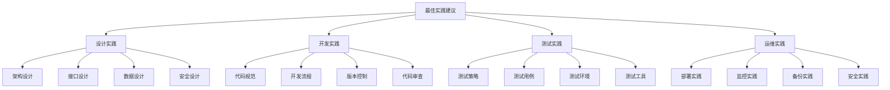

# 最佳实践建议

## 🎯 核心定义

### 什么是最佳实践建议？
最佳实践建议是指在提示词工程实践中总结出的成功经验、有效方法和优化策略，通过系统化的实践指导，帮助开发者避免常见问题，提高工作效率和系统质量。

### 核心价值
- **经验传承**：传承成功经验和最佳实践
- **效率提升**：提高开发效率和工作质量
- **风险规避**：避免常见问题和潜在风险
- **持续改进**：推动实践方法的持续优化

## 📊 最佳实践框架



## 🏗️ 设计实践

### 1. 架构设计最佳实践
| 实践原则 | 具体建议 | 实施方法 | 预期效果 |
|----------|----------|----------|----------|
| **模块化设计** | 将系统拆分为独立模块 | 按功能划分模块，定义清晰接口 | 提高可维护性和可扩展性 |
| **松耦合设计** | 减少模块间依赖 | 使用接口抽象，避免直接依赖 | 提高系统灵活性和可测试性 |
| **高内聚设计** | 模块内部功能紧密相关 | 相关功能组织在同一模块 | 提高代码可读性和维护性 |
| **可扩展设计** | 支持系统功能扩展 | 预留扩展点，使用插件架构 | 支持业务快速发展和变化 |

#### 架构设计实践指南
```markdown
架构设计实践指南：

1. 模块化设计实践
   - 模块划分：按业务功能和技术层次划分模块
   - 接口定义：定义清晰的模块接口和契约
   - 依赖管理：管理模块间的依赖关系
   - 模块测试：为每个模块编写独立测试

2. 松耦合设计实践
   - 接口抽象：使用接口和抽象类定义契约
   - 依赖注入：使用依赖注入减少硬编码依赖
   - 事件驱动：使用事件机制实现松耦合通信
   - 配置外部化：将配置信息外部化

3. 高内聚设计实践
   - 功能聚合：将相关功能聚合在同一模块
   - 数据封装：封装相关数据和操作
   - 职责单一：每个模块只负责一个职责
   - 接口简洁：保持接口简洁和专注

4. 可扩展设计实践
   - 扩展点设计：设计可扩展的架构点
   - 插件机制：支持插件式扩展
   - 配置驱动：使用配置驱动功能扩展
   - 版本兼容：保持向后兼容性
```

### 2. 接口设计最佳实践
| 实践原则 | 具体建议 | 实施方法 | 预期效果 |
|----------|----------|----------|----------|
| **RESTful设计** | 遵循REST设计原则 | 使用标准HTTP方法，资源化设计 | 提高接口一致性和可理解性 |
| **版本控制** | 支持接口版本管理 | 使用URL版本或Header版本 | 支持接口演进和兼容性 |
| **错误处理** | 统一错误处理机制 | 定义标准错误码和错误格式 | 提高错误处理一致性 |
| **文档化** | 完善的接口文档 | 使用Swagger等工具生成文档 | 提高接口可理解性和使用效率 |

#### 接口设计实践指南
```markdown
接口设计实践指南：

1. RESTful设计实践
   - 资源设计：将业务实体设计为资源
   - HTTP方法：正确使用GET、POST、PUT、DELETE
   - 状态码：使用标准HTTP状态码
   - 内容协商：支持多种内容格式

2. 版本控制实践
   - 版本策略：选择适合的版本控制策略
   - 版本标识：在URL或Header中标识版本
   - 兼容性：保持向后兼容性
   - 废弃策略：制定接口废弃和迁移策略

3. 错误处理实践
   - 错误码：定义统一的错误码体系
   - 错误格式：使用标准的错误响应格式
   - 错误信息：提供清晰的错误信息
   - 错误日志：记录详细的错误日志

4. 文档化实践
   - 接口文档：编写完整的接口文档
   - 示例代码：提供示例代码和调用示例
   - 变更记录：记录接口变更历史
   - 工具支持：使用工具自动生成文档
```

## 💻 开发实践

### 1. 代码规范最佳实践
| 规范类型 | 规范内容 | 实施方法 | 预期效果 |
|----------|----------|----------|----------|
| **命名规范** | 统一的命名约定 | 制定命名规范，使用工具检查 | 提高代码可读性和一致性 |
| **代码格式** | 统一的代码格式 | 使用代码格式化工具 | 提高代码可读性和维护性 |
| **注释规范** | 完善的代码注释 | 编写清晰的注释，使用文档工具 | 提高代码可理解性 |
| **结构规范** | 清晰的代码结构 | 遵循设计模式，保持结构清晰 | 提高代码可维护性 |

#### 代码规范实践指南
```markdown
代码规范实践指南：

1. 命名规范实践
   - 变量命名：使用有意义的变量名
   - 函数命名：使用动词开头的函数名
   - 类命名：使用名词开头的类名
   - 常量命名：使用全大写的常量名

2. 代码格式实践
   - 缩进规范：使用统一的缩进风格
   - 空格规范：使用统一的空格规则
   - 换行规范：使用统一的换行规则
   - 括号规范：使用统一的括号风格

3. 注释规范实践
   - 函数注释：为每个函数编写注释
   - 类注释：为每个类编写注释
   - 复杂逻辑：为复杂逻辑编写注释
   - 文档注释：使用文档注释工具

4. 结构规范实践
   - 模块结构：保持模块结构清晰
   - 函数长度：控制函数长度和复杂度
   - 类设计：遵循单一职责原则
   - 依赖关系：保持依赖关系清晰
```

### 2. 开发流程最佳实践
| 流程阶段 | 最佳实践 | 实施方法 | 预期效果 |
|----------|----------|----------|----------|
| **需求分析** | 深入理解业务需求 | 与业务方充分沟通，文档化需求 | 确保开发方向正确 |
| **设计评审** | 设计方案的评审机制 | 组织设计评审会议，记录评审结果 | 提高设计方案质量 |
| **开发实施** | 迭代式开发方法 | 采用敏捷开发，小步快跑 | 提高开发效率和灵活性 |
| **代码审查** | 强制代码审查流程 | 使用代码审查工具，建立审查标准 | 提高代码质量和团队协作 |

#### 开发流程实践指南
```markdown
开发流程实践指南：

1. 需求分析实践
   - 需求收集：全面收集业务需求
   - 需求分析：深入分析需求细节
   - 需求确认：与业务方确认需求
   - 需求文档：编写详细的需求文档

2. 设计评审实践
   - 设计准备：准备设计方案和文档
   - 评审组织：组织设计评审会议
   - 评审记录：记录评审意见和建议
   - 设计优化：根据评审结果优化设计

3. 开发实施实践
   - 迭代规划：制定迭代开发计划
   - 任务分解：将需求分解为开发任务
   - 进度跟踪：跟踪开发进度和质量
   - 风险控制：识别和控制开发风险

4. 代码审查实践
   - 审查标准：制定代码审查标准
   - 审查工具：使用代码审查工具
   - 审查流程：建立代码审查流程
   - 审查记录：记录审查结果和改进建议
```

## 🧪 测试实践

### 1. 测试策略最佳实践
| 测试类型 | 测试策略 | 实施方法 | 预期效果 |
|----------|----------|----------|----------|
| **单元测试** | 全面的单元测试覆盖 | 为每个函数编写单元测试 | 提高代码质量和可靠性 |
| **集成测试** | 模块间集成测试 | 测试模块间的交互和集成 | 确保模块集成正确 |
| **系统测试** | 端到端系统测试 | 测试完整业务流程 | 确保系统功能正确 |
| **性能测试** | 全面的性能测试 | 测试系统性能和负载能力 | 确保系统性能满足要求 |

#### 测试策略实践指南
```markdown
测试策略实践指南：

1. 单元测试实践
   - 测试覆盖：追求高代码覆盖率
   - 测试用例：编写全面的测试用例
   - 测试数据：准备充分的测试数据
   - 测试工具：使用合适的测试工具

2. 集成测试实践
   - 集成策略：制定集成测试策略
   - 测试环境：准备集成测试环境
   - 测试用例：编写集成测试用例
   - 测试执行：执行集成测试

3. 系统测试实践
   - 测试计划：制定系统测试计划
   - 测试用例：编写系统测试用例
   - 测试环境：准备系统测试环境
   - 测试执行：执行系统测试

4. 性能测试实践
   - 性能指标：定义性能测试指标
   - 测试工具：选择合适的性能测试工具
   - 测试场景：设计性能测试场景
   - 测试执行：执行性能测试
```

### 2. 测试环境最佳实践
| 环境类型 | 环境配置 | 管理方法 | 预期效果 |
|----------|----------|----------|----------|
| **开发环境** | 本地开发环境 | 使用Docker容器化 | 提高开发效率和环境一致性 |
| **测试环境** | 独立测试环境 | 自动化环境部署 | 确保测试环境稳定和可重复 |
| **预生产环境** | 接近生产的环境 | 使用生产数据副本 | 验证系统在生产环境的表现 |
| **生产环境** | 正式生产环境 | 严格的变更控制 | 确保生产环境稳定和安全 |

#### 测试环境实践指南
```markdown
测试环境实践指南：

1. 开发环境实践
   - 环境标准化：使用标准化的开发环境
   - 容器化：使用Docker等容器技术
   - 自动化：自动化环境配置和部署
   - 版本控制：管理环境配置版本

2. 测试环境实践
   - 环境隔离：确保测试环境独立
   - 数据管理：管理测试数据和环境
   - 自动化部署：自动化测试环境部署
   - 环境监控：监控测试环境状态

3. 预生产环境实践
   - 环境复制：复制生产环境配置
   - 数据同步：同步生产数据到预生产
   - 性能测试：在预生产环境进行性能测试
   - 发布验证：验证发布包的正确性

4. 生产环境实践
   - 变更控制：严格控制生产环境变更
   - 监控告警：建立完善的监控告警
   - 备份恢复：建立备份和恢复机制
   - 安全防护：加强生产环境安全防护
```

## 🚀 运维实践

### 1. 部署实践最佳实践
| 部署类型 | 最佳实践 | 实施方法 | 预期效果 |
|----------|----------|----------|----------|
| **自动化部署** | 全自动化部署流程 | 使用CI/CD工具链 | 提高部署效率和可靠性 |
| **蓝绿部署** | 零停机部署策略 | 维护两套生产环境 | 实现零停机部署和快速回滚 |
| **灰度发布** | 渐进式发布策略 | 逐步扩大发布范围 | 降低发布风险，快速发现问题 |
| **回滚机制** | 快速回滚能力 | 自动化回滚流程 | 快速恢复系统，减少故障影响 |

#### 部署实践指南
```markdown
部署实践指南：

1. 自动化部署实践
   - 构建自动化：自动化代码构建和打包
   - 测试自动化：自动化测试执行
   - 部署自动化：自动化部署到各环境
   - 验证自动化：自动化部署验证

2. 蓝绿部署实践
   - 环境准备：准备蓝绿两套环境
   - 切换策略：制定环境切换策略
   - 流量切换：控制流量切换过程
   - 回滚机制：建立快速回滚机制

3. 灰度发布实践
   - 发布策略：制定灰度发布策略
   - 流量控制：控制灰度发布流量
   - 监控告警：监控灰度发布过程
   - 问题处理：快速处理发布问题

4. 回滚机制实践
   - 回滚策略：制定回滚策略和流程
   - 回滚自动化：自动化回滚操作
   - 回滚验证：验证回滚效果
   - 回滚记录：记录回滚原因和过程
```

### 2. 监控实践最佳实践
| 监控类型 | 最佳实践 | 实施方法 | 预期效果 |
|----------|----------|----------|----------|
| **全链路监控** | 端到端监控覆盖 | 使用APM工具实现全链路监控 | 全面了解系统运行状态 |
| **实时告警** | 智能告警机制 | 设置合理的告警阈值和规则 | 及时发现和处理问题 |
| **性能监控** | 全面的性能监控 | 监控关键性能指标 | 确保系统性能满足要求 |
| **业务监控** | 业务指标监控 | 监控关键业务指标 | 确保业务正常运行 |

#### 监控实践指南
```markdown
监控实践指南：

1. 全链路监控实践
   - 监控覆盖：覆盖所有关键链路
   - 监控工具：使用专业的APM工具
   - 监控指标：定义关键监控指标
   - 监控展示：建立监控仪表板

2. 实时告警实践
   - 告警规则：设置合理的告警规则
   - 告警级别：定义告警级别和处理流程
   - 告警通知：建立告警通知机制
   - 告警处理：建立告警处理流程

3. 性能监控实践
   - 性能指标：定义关键性能指标
   - 性能基线：建立性能基线
   - 性能趋势：分析性能趋势
   - 性能优化：基于监控数据进行优化

4. 业务监控实践
   - 业务指标：定义关键业务指标
   - 业务基线：建立业务基线
   - 业务趋势：分析业务趋势
   - 业务优化：基于监控数据优化业务
```

## 🎓 学习要点

### 核心理解
- 最佳实践是成功经验的总结和传承
- 遵循最佳实践能提高工作效率和质量
- 最佳实践需要根据实际情况进行调整
- 持续学习和改进是保持最佳实践的关键

### 实践建议
- 建立最佳实践文档和知识库
- 定期回顾和更新最佳实践
- 在团队中推广最佳实践
- 持续学习和借鉴行业最佳实践

## 🔗 相关链接
- [[06-1-常见问题FAQ]] - 查看常见问题
- [[06-2-错误诊断与修复]] - 学习错误诊断
- [[06-3-性能问题排查]] - 学习性能排查
- [[05-1-1-提示词工程流程]] - 学习工程流程
