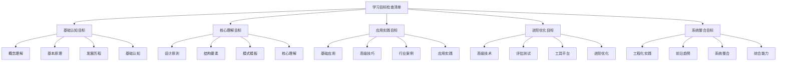

# 学习目标检查清单

## 🎯 核心定义

### 什么是学习目标检查清单？
学习目标检查清单是指根据提示词工程知识体系制定的系统性学习目标清单，通过结构化的目标设定和进度跟踪，帮助学习者明确学习方向，评估学习效果，确保学习目标的达成。

### 核心价值
- **目标明确**：清晰定义学习目标和期望成果
- **进度跟踪**：系统跟踪学习进度和完成情况
- **效果评估**：客观评估学习效果和知识掌握程度
- **持续改进**：基于评估结果持续优化学习策略

## 📊 学习目标框架



## 🎓 基础认知目标

### 1. 概念理解目标
| 学习目标 | 具体内容 | 评估标准 | 完成状态 |
|----------|----------|----------|----------|
| **理解提示词工程定义** | 掌握提示词工程的基本概念和定义 | 能够准确解释提示词工程的含义 | ⬜ 未开始 ⬜ 进行中 ⬜ 已完成 |
| **了解应用场景** | 了解提示词工程的主要应用场景 | 能够列举5个以上应用场景 | ⬜ 未开始 ⬜ 进行中 ⬜ 已完成 |
| **掌握核心价值** | 理解提示词工程的核心价值和意义 | 能够说明提示词工程的价值 | ⬜ 未开始 ⬜ 进行中 ⬜ 已完成 |
| **认识技术特点** | 了解提示词工程的技术特点 | 能够描述技术特点和优势 | ⬜ 未开始 ⬜ 进行中 ⬜ 已完成 |

#### 概念理解检查要点
```markdown
概念理解检查要点：

1. 提示词工程定义检查
   - 能够准确解释提示词工程的概念
   - 理解提示词工程与传统编程的区别
   - 掌握提示词工程的核心要素
   - 了解提示词工程的发展趋势

2. 应用场景检查
   - 了解文本生成应用场景
   - 了解问答系统应用场景
   - 了解内容创作应用场景
   - 了解代码生成应用场景

3. 核心价值检查
   - 理解提高效率的价值
   - 理解降低门槛的价值
   - 理解增强创造力的价值
   - 理解优化体验的价值

4. 技术特点检查
   - 了解自然语言交互特点
   - 了解上下文理解特点
   - 了解生成能力特点
   - 了解适应性特点
```

### 2. 基本原理目标
| 学习目标 | 具体内容 | 评估标准 | 完成状态 |
|----------|----------|----------|----------|
| **理解工作原理** | 掌握提示词工程的基本工作原理 | 能够解释工作原理和机制 | ⬜ 未开始 ⬜ 进行中 ⬜ 已完成 |
| **了解技术架构** | 了解提示词工程的技术架构 | 能够描述技术架构组成 | ⬜ 未开始 ⬜ 进行中 ⬜ 已完成 |
| **掌握核心算法** | 了解核心算法和实现原理 | 能够说明核心算法原理 | ⬜ 未开始 ⬜ 进行中 ⬜ 已完成 |
| **认识技术限制** | 了解技术限制和挑战 | 能够分析技术限制和挑战 | ⬜ 未开始 ⬜ 进行中 ⬜ 已完成 |

#### 基本原理检查要点
```markdown
基本原理检查要点：

1. 工作原理检查
   - 理解输入处理机制
   - 理解模型推理机制
   - 理解输出生成机制
   - 理解反馈优化机制

2. 技术架构检查
   - 了解前端交互层
   - 了解业务逻辑层
   - 了解模型服务层
   - 了解数据存储层

3. 核心算法检查
   - 了解自然语言处理算法
   - 了解机器学习算法
   - 了解深度学习算法
   - 了解优化算法

4. 技术限制检查
   - 了解计算资源限制
   - 了解数据质量限制
   - 了解模型能力限制
   - 了解应用场景限制
```

## 🧠 核心理解目标

### 1. 设计原则目标
| 学习目标 | 具体内容 | 评估标准 | 完成状态 |
|----------|----------|----------|----------|
| **掌握清晰性原则** | 理解并应用清晰性原则 | 能够设计清晰的提示词 | ⬜ 未开始 ⬜ 进行中 ⬜ 已完成 |
| **掌握具体性原则** | 理解并应用具体性原则 | 能够设计具体的提示词 | ⬜ 未开始 ⬜ 进行中 ⬜ 已完成 |
| **掌握上下文原则** | 理解并应用上下文原则 | 能够设计有上下文的提示词 | ⬜ 未开始 ⬜ 进行中 ⬜ 已完成 |
| **掌握角色设定原则** | 理解并应用角色设定原则 | 能够设计角色明确的提示词 | ⬜ 未开始 ⬜ 进行中 ⬜ 已完成 |

#### 设计原则检查要点
```markdown
设计原则检查要点：

1. 清晰性原则检查
   - 能够识别模糊的提示词
   - 能够优化提示词的清晰度
   - 能够避免歧义和误解
   - 能够提高理解准确性

2. 具体性原则检查
   - 能够设计具体的任务描述
   - 能够提供具体的示例
   - 能够设定具体的约束条件
   - 能够明确具体的输出要求

3. 上下文原则检查
   - 能够提供充分的背景信息
   - 能够建立清晰的上下文关系
   - 能够保持上下文一致性
   - 能够利用上下文信息

4. 角色设定原则检查
   - 能够设定明确的角色身份
   - 能够定义角色的专业领域
   - 能够描述角色的行为特征
   - 能够保持角色一致性
```

### 2. 结构要素目标
| 学习目标 | 具体内容 | 评估标准 | 完成状态 |
|----------|----------|----------|----------|
| **掌握Role角色设定** | 理解并应用角色设定要素 | 能够设计有效的角色设定 | ⬜ 未开始 ⬜ 进行中 ⬜ 已完成 |
| **掌握Task任务描述** | 理解并应用任务描述要素 | 能够设计清晰的任务描述 | ⬜ 未开始 ⬜ 进行中 ⬜ 已完成 |
| **掌握Context上下文** | 理解并应用上下文要素 | 能够设计丰富的上下文信息 | ⬜ 未开始 ⬜ 进行中 ⬜ 已完成 |
| **掌握Format输出格式** | 理解并应用输出格式要素 | 能够设计明确的输出格式 | ⬜ 未开始 ⬜ 进行中 ⬜ 已完成 |
| **掌握Constraints约束** | 理解并应用约束条件要素 | 能够设计合理的约束条件 | ⬜ 未开始 ⬜ 进行中 ⬜ 已完成 |

#### 结构要素检查要点
```markdown
结构要素检查要点：

1. Role角色设定检查
   - 能够设定合适的角色身份
   - 能够定义角色的专业能力
   - 能够描述角色的行为风格
   - 能够保持角色的一致性

2. Task任务描述检查
   - 能够明确任务的目标
   - 能够描述任务的步骤
   - 能够设定任务的优先级
   - 能够定义任务的完成标准

3. Context上下文检查
   - 能够提供充分的背景信息
   - 能够建立清晰的上下文关系
   - 能够保持上下文的一致性
   - 能够利用上下文信息

4. Format输出格式检查
   - 能够定义清晰的输出格式
   - 能够设定输出的结构要求
   - 能够明确输出的内容要求
   - 能够确保输出的可读性

5. Constraints约束检查
   - 能够设定合理的约束条件
   - 能够明确约束的范围和限制
   - 能够平衡约束和灵活性
   - 能够确保约束的有效性
```

## 🚀 应用实践目标

### 1. 基础应用目标
| 学习目标 | 具体内容 | 评估标准 | 完成状态 |
|----------|----------|----------|----------|
| **掌握文本生成应用** | 能够设计和实现文本生成应用 | 能够完成文本生成项目 | ⬜ 未开始 ⬜ 进行中 ⬜ 已完成 |
| **掌握问答系统应用** | 能够设计和实现问答系统 | 能够完成问答系统项目 | ⬜ 未开始 ⬜ 进行中 ⬜ 已完成 |
| **掌握内容创作应用** | 能够设计和实现内容创作应用 | 能够完成内容创作项目 | ⬜ 未开始 ⬜ 进行中 ⬜ 已完成 |
| **掌握代码生成应用** | 能够设计和实现代码生成应用 | 能够完成代码生成项目 | ⬜ 未开始 ⬜ 进行中 ⬜ 已完成 |

#### 基础应用检查要点
```markdown
基础应用检查要点：

1. 文本生成应用检查
   - 能够设计文本生成提示词
   - 能够实现文本生成功能
   - 能够优化文本生成质量
   - 能够处理文本生成问题

2. 问答系统应用检查
   - 能够设计问答系统架构
   - 能够实现问答功能
   - 能够优化问答准确性
   - 能够处理问答异常

3. 内容创作应用检查
   - 能够设计内容创作流程
   - 能够实现内容创作功能
   - 能够优化内容创作质量
   - 能够处理内容创作问题

4. 代码生成应用检查
   - 能够设计代码生成提示词
   - 能够实现代码生成功能
   - 能够优化代码生成质量
   - 能够处理代码生成问题
```

### 2. 高级技巧目标
| 学习目标 | 具体内容 | 评估标准 | 完成状态 |
|----------|----------|----------|----------|
| **掌握多轮对话设计** | 能够设计多轮对话系统 | 能够实现多轮对话功能 | ⬜ 未开始 ⬜ 进行中 ⬜ 已完成 |
| **掌握复杂任务分解** | 能够分解复杂任务 | 能够实现任务分解功能 | ⬜ 未开始 ⬜ 进行中 ⬜ 已完成 |
| **掌握错误处理优化** | 能够优化错误处理机制 | 能够实现错误处理功能 | ⬜ 未开始 ⬜ 进行中 ⬜ 已完成 |
| **掌握性能调优技巧** | 能够调优系统性能 | 能够实现性能优化 | ⬜ 未开始 ⬜ 进行中 ⬜ 已完成 |

#### 高级技巧检查要点
```markdown
高级技巧检查要点：

1. 多轮对话设计检查
   - 能够设计对话流程
   - 能够管理对话状态
   - 能够处理对话上下文
   - 能够优化对话体验

2. 复杂任务分解检查
   - 能够识别复杂任务
   - 能够分解任务步骤
   - 能够管理任务依赖
   - 能够协调任务执行

3. 错误处理优化检查
   - 能够识别错误类型
   - 能够设计错误处理策略
   - 能够实现错误恢复机制
   - 能够优化错误处理流程

4. 性能调优技巧检查
   - 能够识别性能瓶颈
   - 能够分析性能问题
   - 能够实施性能优化
   - 能够验证优化效果
```

## 🔧 进阶优化目标

### 1. 高级技术目标
| 学习目标 | 具体内容 | 评估标准 | 完成状态 |
|----------|----------|----------|----------|
| **掌握提示词链式设计** | 能够设计提示词链 | 能够实现提示词链功能 | ⬜ 未开始 ⬜ 进行中 ⬜ 已完成 |
| **掌握动态提示词生成** | 能够生成动态提示词 | 能够实现动态生成功能 | ⬜ 未开始 ⬜ 进行中 ⬜ 已完成 |
| **掌握多模态提示词** | 能够设计多模态提示词 | 能够实现多模态功能 | ⬜ 未开始 ⬜ 进行中 ⬜ 已完成 |
| **掌握提示词版本管理** | 能够管理提示词版本 | 能够实现版本管理功能 | ⬜ 未开始 ⬜ 进行中 ⬜ 已完成 |

#### 高级技术检查要点
```markdown
高级技术检查要点：

1. 提示词链式设计检查
   - 能够设计提示词链结构
   - 能够管理提示词链流程
   - 能够优化提示词链性能
   - 能够处理提示词链异常

2. 动态提示词生成检查
   - 能够设计动态生成算法
   - 能够实现动态生成功能
   - 能够优化生成质量
   - 能够处理生成异常

3. 多模态提示词检查
   - 能够设计多模态提示词
   - 能够处理多模态数据
   - 能够优化多模态效果
   - 能够处理多模态问题

4. 提示词版本管理检查
   - 能够设计版本管理策略
   - 能够实现版本管理功能
   - 能够优化版本管理流程
   - 能够处理版本管理问题
```

### 2. 评估测试目标
| 学习目标 | 具体内容 | 评估标准 | 完成状态 |
|----------|----------|----------|----------|
| **掌握效果评估指标** | 能够设计评估指标 | 能够实现评估功能 | ⬜ 未开始 ⬜ 进行中 ⬜ 已完成 |
| **掌握AB测试方法** | 能够设计AB测试 | 能够实现AB测试功能 | ⬜ 未开始 ⬜ 进行中 ⬜ 已完成 |
| **掌握质量保证流程** | 能够设计质量保证流程 | 能够实现质量保证功能 | ⬜ 未开始 ⬜ 进行中 ⬜ 已完成 |
| **掌握持续优化策略** | 能够设计优化策略 | 能够实现持续优化 | ⬜ 未开始 ⬜ 进行中 ⬜ 已完成 |

#### 评估测试检查要点
```markdown
评估测试检查要点：

1. 效果评估指标检查
   - 能够设计评估指标体系
   - 能够实现评估功能
   - 能够分析评估结果
   - 能够优化评估方法

2. AB测试方法检查
   - 能够设计AB测试方案
   - 能够实现AB测试功能
   - 能够分析AB测试结果
   - 能够优化AB测试方法

3. 质量保证流程检查
   - 能够设计质量保证流程
   - 能够实现质量保证功能
   - 能够监控质量指标
   - 能够优化质量保证流程

4. 持续优化策略检查
   - 能够设计优化策略
   - 能够实现持续优化
   - 能够监控优化效果
   - 能够调整优化策略
```

## 🏗️ 系统整合目标

### 1. 工程化实践目标
| 学习目标 | 具体内容 | 评估标准 | 完成状态 |
|----------|----------|----------|----------|
| **掌握提示词工程流程** | 能够设计工程流程 | 能够实现工程化流程 | ⬜ 未开始 ⬜ 进行中 ⬜ 已完成 |
| **掌握团队协作规范** | 能够设计协作规范 | 能够实现团队协作 | ⬜ 未开始 ⬜ 进行中 ⬜ 已完成 |
| **掌握文档知识管理** | 能够设计知识管理体系 | 能够实现知识管理 | ⬜ 未开始 ⬜ 进行中 ⬜ 已完成 |
| **掌握质量管控体系** | 能够设计质量管控体系 | 能够实现质量管控 | ⬜ 未开始 ⬜ 进行中 ⬜ 已完成 |

#### 工程化实践检查要点
```markdown
工程化实践检查要点：

1. 提示词工程流程检查
   - 能够设计完整的工程流程
   - 能够实现流程自动化
   - 能够监控流程执行
   - 能够优化流程效率

2. 团队协作规范检查
   - 能够设计协作规范
   - 能够实现团队协作
   - 能够监控协作效果
   - 能够优化协作流程

3. 文档知识管理检查
   - 能够设计知识管理体系
   - 能够实现知识管理
   - 能够维护知识库
   - 能够优化知识管理

4. 质量管控体系检查
   - 能够设计质量管控体系
   - 能够实现质量管控
   - 能够监控质量指标
   - 能够优化质量管控
```

### 2. 综合能力目标
| 学习目标 | 具体内容 | 评估标准 | 完成状态 |
|----------|----------|----------|----------|
| **掌握问题解决能力** | 能够解决复杂问题 | 能够独立解决技术问题 | ⬜ 未开始 ⬜ 进行中 ⬜ 已完成 |
| **掌握创新思维能力** | 能够创新思考 | 能够提出创新解决方案 | ⬜ 未开始 ⬜ 进行中 ⬜ 已完成 |
| **掌握沟通协作能力** | 能够有效沟通协作 | 能够与团队有效协作 | ⬜ 未开始 ⬜ 进行中 ⬜ 已完成 |
| **掌握持续学习能力** | 能够持续学习 | 能够自主学习新技术 | ⬜ 未开始 ⬜ 进行中 ⬜ 已完成 |

#### 综合能力检查要点
```markdown
综合能力检查要点：

1. 问题解决能力检查
   - 能够识别和分析问题
   - 能够设计解决方案
   - 能够实施解决方案
   - 能够验证解决效果

2. 创新思维能力检查
   - 能够提出创新想法
   - 能够设计创新方案
   - 能够实施创新项目
   - 能够评估创新效果

3. 沟通协作能力检查
   - 能够有效沟通
   - 能够团队协作
   - 能够项目管理
   - 能够领导团队

4. 持续学习能力检查
   - 能够自主学习
   - 能够知识更新
   - 能够技能提升
   - 能够适应变化
```

## 📊 学习进度跟踪

### 总体进度统计
| 学习阶段 | 目标数量 | 已完成 | 进行中 | 未开始 | 完成率 |
|----------|----------|--------|--------|--------|--------|
| **基础认知** | 8 | 0 | 0 | 8 | 0% |
| **核心理解** | 9 | 0 | 0 | 9 | 0% |
| **应用实践** | 8 | 0 | 0 | 8 | 0% |
| **进阶优化** | 8 | 0 | 0 | 8 | 0% |
| **系统整合** | 8 | 0 | 0 | 8 | 0% |
| **总计** | 41 | 0 | 0 | 41 | 0% |

### 学习计划建议
```markdown
学习计划建议：

1. 第一阶段（基础认知）
   - 时间：2-3周
   - 重点：概念理解、基本原理
   - 目标：建立基础知识框架

2. 第二阶段（核心理解）
   - 时间：3-4周
   - 重点：设计原则、结构要素
   - 目标：掌握核心设计理念

3. 第三阶段（应用实践）
   - 时间：4-5周
   - 重点：基础应用、高级技巧
   - 目标：提升实践应用能力

4. 第四阶段（进阶优化）
   - 时间：3-4周
   - 重点：高级技术、评估测试
   - 目标：掌握进阶优化技能

5. 第五阶段（系统整合）
   - 时间：2-3周
   - 重点：工程化实践、综合能力
   - 目标：形成系统化能力
```

## 🎓 学习要点

### 核心理解
- 学习目标检查清单是学习过程的重要指导工具
- 系统化的目标设定有助于提高学习效率
- 定期检查和评估学习进度是必要的
- 根据实际情况调整学习目标是重要的

### 实践建议
- 定期更新学习目标检查清单
- 记录学习进度和完成情况
- 根据评估结果调整学习策略
- 与学习伙伴分享学习经验

## 🔗 相关链接
- [[07-2-技能评估测试]] - 进行技能评估
- [[07-3-项目作品集]] - 查看项目作品
- [[07-4-学习进度追踪]] - 跟踪学习进度
- [[00-学习导航]] - 返回学习导航
