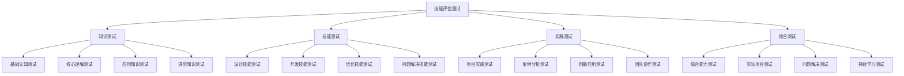

# 技能评估测试

## 🎯 核心定义

### 什么是技能评估测试？
技能评估测试是指通过系统化的测试题目和评估标准，对学习者在提示词工程领域的知识掌握程度、技能水平和实践能力进行客观评估的方法，帮助学习者了解自身水平，识别学习差距，制定针对性的学习计划。

### 核心价值
- **水平评估**：客观评估学习者的技能水平
- **差距识别**：识别知识盲点和技能差距
- **学习指导**：为后续学习提供针对性指导
- **能力认证**：为技能认证和能力证明提供依据

## 📊 评估测试框架



## 📚 知识测试

### 1. 基础认知测试
| 测试类型 | 测试内容 | 题目数量 | 时间限制 | 评分标准 |
|----------|----------|----------|----------|----------|
| **概念理解** | 提示词工程基本概念 | 10题 | 15分钟 | 每题10分，总分100分 |
| **基本原理** | 工作原理和技术架构 | 10题 | 15分钟 | 每题10分，总分100分 |
| **发展历程** | 技术发展历史和趋势 | 5题 | 10分钟 | 每题20分，总分100分 |
| **应用场景** | 主要应用领域和场景 | 5题 | 10分钟 | 每题20分，总分100分 |

#### 基础认知测试题目示例
```markdown
基础认知测试题目示例：

1. 概念理解测试（选择题）
   题目：提示词工程的核心目标是什么？
   A. 提高AI模型的准确性
   B. 优化人机交互体验
   C. 降低AI应用开发门槛
   D. 以上都是
   正确答案：D
   解析：提示词工程的核心目标包括提高准确性、优化交互体验、降低开发门槛等多个方面。

2. 基本原理测试（简答题）
   题目：请简述提示词工程的基本工作原理。
   评分标准：
   - 输入处理机制（25分）
   - 模型推理机制（25分）
   - 输出生成机制（25分）
   - 反馈优化机制（25分）

3. 发展历程测试（填空题）
   题目：提示词工程的发展经历了______、______、______三个阶段。
   正确答案：早期探索、技术成熟、应用普及
   解析：提示词工程经历了从早期探索到技术成熟再到应用普及的发展过程。

4. 应用场景测试（案例分析）
   题目：请分析提示词工程在教育领域的应用场景。
   评分标准：
   - 应用场景识别（40分）
   - 技术实现分析（30分）
   - 价值意义阐述（30分）
```

### 2. 核心理解测试
| 测试类型 | 测试内容 | 题目数量 | 时间限制 | 评分标准 |
|----------|----------|----------|----------|----------|
| **设计原则** | 清晰性、具体性、上下文、角色设定 | 8题 | 20分钟 | 每题12.5分，总分100分 |
| **结构要素** | Role、Task、Context、Format、Constraints | 10题 | 25分钟 | 每题10分，总分100分 |
| **模式模板** | 零样本、少样本、思维链、角色扮演 | 8题 | 20分钟 | 每题12.5分，总分100分 |
| **核心理解** | 综合理解和应用能力 | 5题 | 15分钟 | 每题20分，总分100分 |

#### 核心理解测试题目示例
```markdown
核心理解测试题目示例：

1. 设计原则测试（选择题）
   题目：以下哪个原则强调提供充分的背景信息？
   A. 清晰性原则
   B. 具体性原则
   C. 上下文原则
   D. 角色设定原则
   正确答案：C
   解析：上下文原则强调提供充分的背景信息，帮助AI更好地理解任务。

2. 结构要素测试（设计题）
   题目：请设计一个包含所有结构要素的提示词模板。
   评分标准：
   - Role角色设定（20分）
   - Task任务描述（20分）
   - Context上下文信息（20分）
   - Format输出格式（20分）
   - Constraints约束条件（20分）

3. 模式模板测试（应用题）
   题目：请使用思维链提示模式解决以下问题：如何提高团队协作效率？
   评分标准：
   - 问题分析（25分）
   - 思维链设计（25分）
   - 解决方案（25分）
   - 实施步骤（25分）

4. 核心理解测试（综合题）
   题目：请分析一个成功的提示词工程案例，说明其成功的关键因素。
   评分标准：
   - 案例选择（20分）
   - 成功因素分析（40分）
   - 技术实现分析（20分）
   - 经验总结（20分）
```

## 🛠️ 技能测试

### 1. 设计技能测试
| 测试类型 | 测试内容 | 题目数量 | 时间限制 | 评分标准 |
|----------|----------|----------|----------|----------|
| **提示词设计** | 设计有效的提示词 | 3题 | 30分钟 | 每题33.3分，总分100分 |
| **模板设计** | 设计可复用的模板 | 2题 | 25分钟 | 每题50分，总分100分 |
| **架构设计** | 设计系统架构 | 2题 | 35分钟 | 每题50分，总分100分 |
| **优化设计** | 优化现有设计 | 2题 | 25分钟 | 每题50分，总分100分 |

#### 设计技能测试题目示例
```markdown
设计技能测试题目示例：

1. 提示词设计测试（设计题）
   题目：请设计一个用于代码审查的提示词，要求能够识别代码中的潜在问题。
   评分标准：
   - 角色设定清晰（20分）
   - 任务描述具体（20分）
   - 上下文信息充分（20分）
   - 输出格式明确（20分）
   - 约束条件合理（20分）

2. 模板设计测试（设计题）
   题目：请设计一个通用的内容创作模板，适用于不同类型的创作任务。
   评分标准：
   - 模板结构完整（25分）
   - 适用性广泛（25分）
   - 可定制性强（25分）
   - 使用说明清晰（25分）

3. 架构设计测试（设计题）
   题目：请设计一个支持多模态的提示词工程系统架构。
   评分标准：
   - 架构设计合理（30分）
   - 模块划分清晰（25分）
   - 接口设计规范（25分）
   - 扩展性良好（20分）

4. 优化设计测试（优化题）
   题目：请优化以下提示词，提高其效果和效率。
   评分标准：
   - 问题识别准确（25分）
   - 优化方案合理（25分）
   - 优化效果明显（25分）
   - 优化过程清晰（25分）
```

### 2. 开发技能测试
| 测试类型 | 测试内容 | 题目数量 | 时间限制 | 评分标准 |
|----------|----------|----------|----------|----------|
| **代码实现** | 实现提示词工程功能 | 3题 | 45分钟 | 每题33.3分，总分100分 |
| **接口开发** | 开发API接口 | 2题 | 40分钟 | 每题50分，总分100分 |
| **系统集成** | 集成不同系统 | 2题 | 50分钟 | 每题50分，总分100分 |
| **性能优化** | 优化系统性能 | 2题 | 35分钟 | 每题50分，总分100分 |

#### 开发技能测试题目示例
```markdown
开发技能测试题目示例：

1. 代码实现测试（编程题）
   题目：请实现一个提示词模板引擎，支持变量替换和条件判断。
   评分标准：
   - 功能实现完整（30分）
   - 代码质量良好（25分）
   - 错误处理完善（25分）
   - 性能优化合理（20分）

2. 接口开发测试（开发题）
   题目：请开发一个RESTful API，用于提示词的管理和调用。
   评分标准：
   - 接口设计规范（25分）
   - 功能实现完整（25分）
   - 错误处理完善（25分）
   - 文档说明清晰（25分）

3. 系统集成测试（集成题）
   题目：请将提示词工程系统与现有的用户管理系统集成。
   评分标准：
   - 集成方案合理（30分）
   - 数据同步正确（25分）
   - 权限控制完善（25分）
   - 性能影响最小（20分）

4. 性能优化测试（优化题）
   题目：请优化一个响应时间过长的提示词处理系统。
   评分标准：
   - 问题分析准确（25分）
   - 优化方案合理（25分）
   - 优化效果明显（25分）
   - 优化过程清晰（25分）
```

## 🎯 实践测试

### 1. 项目实践测试
| 测试类型 | 测试内容 | 题目数量 | 时间限制 | 评分标准 |
|----------|----------|----------|----------|----------|
| **项目规划** | 规划提示词工程项目 | 1题 | 60分钟 | 总分100分 |
| **项目实施** | 实施完整的项目 | 1题 | 120分钟 | 总分100分 |
| **项目优化** | 优化项目性能和质量 | 1题 | 90分钟 | 总分100分 |
| **项目总结** | 总结项目经验和教训 | 1题 | 30分钟 | 总分100分 |

#### 项目实践测试题目示例
```markdown
项目实践测试题目示例：

1. 项目规划测试（规划题）
   题目：请规划一个智能客服系统的提示词工程项目。
   评分标准：
   - 需求分析准确（25分）
   - 技术方案合理（25分）
   - 实施计划详细（25分）
   - 风险评估充分（25分）

2. 项目实施测试（实施题）
   题目：请实施一个内容创作助手的提示词工程项目。
   评分标准：
   - 功能实现完整（30分）
   - 代码质量良好（25分）
   - 测试覆盖充分（25分）
   - 文档说明清晰（20分）

3. 项目优化测试（优化题）
   题目：请优化一个现有的提示词工程系统，提高其性能和用户体验。
   评分标准：
   - 问题识别准确（25分）
   - 优化方案合理（25分）
   - 优化效果明显（25分）
   - 优化过程清晰（25分）

4. 项目总结测试（总结题）
   题目：请总结一个提示词工程项目的经验教训和改进建议。
   评分标准：
   - 经验总结全面（30分）
   - 问题分析深入（25分）
   - 改进建议合理（25分）
   - 总结结构清晰（20分）
```

### 2. 案例分析测试
| 测试类型 | 测试内容 | 题目数量 | 时间限制 | 评分标准 |
|----------|----------|----------|----------|----------|
| **成功案例** | 分析成功案例 | 2题 | 40分钟 | 每题50分，总分100分 |
| **失败案例** | 分析失败案例 | 2题 | 40分钟 | 每题50分，总分100分 |
| **创新案例** | 分析创新案例 | 2题 | 40分钟 | 每题50分，总分100分 |
| **对比分析** | 对比分析不同案例 | 1题 | 30分钟 | 总分100分 |

#### 案例分析测试题目示例
```markdown
案例分析测试题目示例：

1. 成功案例测试（分析题）
   题目：请分析ChatGPT的成功因素，并说明对提示词工程的启示。
   评分标准：
   - 成功因素分析（40分）
   - 技术特点分析（30分）
   - 启示意义阐述（30分）

2. 失败案例测试（分析题）
   题目：请分析一个提示词工程项目的失败原因，并提出改进建议。
   评分标准：
   - 失败原因分析（40分）
   - 问题识别准确（30分）
   - 改进建议合理（30分）

3. 创新案例测试（分析题）
   题目：请分析一个创新的提示词工程应用案例，说明其创新点。
   评分标准：
   - 创新点识别（40分）
   - 技术实现分析（30分）
   - 应用价值评估（30分）

4. 对比分析测试（对比题）
   题目：请对比分析不同提示词工程平台的优缺点。
   评分标准：
   - 平台选择合理（20分）
   - 对比维度全面（30分）
   - 分析深入准确（30分）
   - 结论客观公正（20分）
```

## 🏆 综合测试

### 1. 综合能力测试
| 测试类型 | 测试内容 | 题目数量 | 时间限制 | 评分标准 |
|----------|----------|----------|----------|----------|
| **问题解决** | 解决复杂问题 | 2题 | 60分钟 | 每题50分，总分100分 |
| **创新思维** | 创新解决方案 | 2题 | 50分钟 | 每题50分，总分100分 |
| **沟通协作** | 团队协作能力 | 1题 | 40分钟 | 总分100分 |
| **持续学习** | 学习能力评估 | 1题 | 30分钟 | 总分100分 |

#### 综合能力测试题目示例
```markdown
综合能力测试题目示例：

1. 问题解决测试（解决题）
   题目：请解决一个大型企业部署提示词工程系统时遇到的技术和管理问题。
   评分标准：
   - 问题识别准确（25分）
   - 解决方案合理（25分）
   - 实施步骤清晰（25分）
   - 风险控制完善（25分）

2. 创新思维测试（创新题）
   题目：请设计一个创新的提示词工程应用，解决现有技术的局限性。
   评分标准：
   - 创新点突出（30分）
   - 技术方案可行（25分）
   - 应用价值明显（25分）
   - 实施计划详细（20分）

3. 沟通协作测试（协作题）
   题目：请设计一个跨部门协作的提示词工程项目实施方案。
   评分标准：
   - 协作方案合理（30分）
   - 沟通机制完善（25分）
   - 责任分工明确（25分）
   - 冲突处理机制（20分）

4. 持续学习测试（学习题）
   题目：请制定一个持续学习提示词工程技术的个人发展计划。
   评分标准：
   - 学习目标明确（25分）
   - 学习计划详细（25分）
   - 学习方法合理（25分）
   - 评估机制完善（25分）
```

## 📊 评估标准

### 1. 评分等级
| 等级 | 分数范围 | 能力描述 | 建议措施 |
|------|----------|----------|----------|
| **优秀** | 90-100分 | 完全掌握，能够独立解决复杂问题 | 继续深入学习，承担高级任务 |
| **良好** | 80-89分 | 基本掌握，能够解决一般问题 | 加强实践，提升应用能力 |
| **合格** | 70-79分 | 部分掌握，需要指导才能完成任务 | 系统学习，加强基础训练 |
| **待提高** | 60-69分 | 初步了解，需要大量学习 | 从基础开始，系统学习 |
| **不合格** | 0-59分 | 基本不了解，需要重新学习 | 重新制定学习计划 |

### 2. 评估维度
| 评估维度 | 权重 | 评估内容 | 评估方法 |
|----------|------|----------|----------|
| **知识掌握** | 30% | 理论知识掌握程度 | 知识测试成绩 |
| **技能水平** | 35% | 实践技能水平 | 技能测试成绩 |
| **应用能力** | 25% | 实际应用能力 | 实践测试成绩 |
| **综合能力** | 10% | 综合能力水平 | 综合测试成绩 |

### 3. 评估报告模板
```markdown
评估报告模板：

# 提示词工程技能评估报告

## 基本信息
- 姓名：[姓名]
- 评估日期：[日期]
- 评估类型：[评估类型]

## 测试成绩
- 知识测试：[分数]/100
- 技能测试：[分数]/100
- 实践测试：[分数]/100
- 综合测试：[分数]/100
- 总分：[总分]/100

## 能力评估
- 知识掌握：[等级]
- 技能水平：[等级]
- 应用能力：[等级]
- 综合能力：[等级]

## 优势分析
- [优势1]
- [优势2]
- [优势3]

## 不足分析
- [不足1]
- [不足2]
- [不足3]

## 改进建议
- [建议1]
- [建议2]
- [建议3]

## 学习计划
- 短期目标：[目标1]
- 中期目标：[目标2]
- 长期目标：[目标3]
```

## 🎓 学习要点

### 核心理解
- 技能评估测试是了解自身水平的重要工具
- 系统化的评估有助于识别学习差距
- 定期评估有助于跟踪学习进度
- 基于评估结果制定学习计划是必要的

### 实践建议
- 定期进行技能评估测试
- 根据评估结果调整学习策略
- 重点关注薄弱环节
- 持续跟踪学习进步

## 🔗 相关链接
- [[07-1-学习目标检查清单]] - 查看学习目标
- [[07-3-项目作品集]] - 查看项目作品
- [[07-4-学习进度追踪]] - 跟踪学习进度
- [[00-学习导航]] - 返回学习导航
