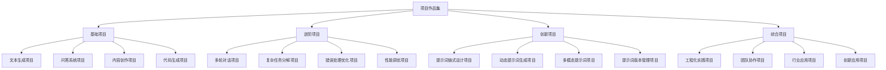

# 项目作品集

## 🎯 核心定义

### 什么是项目作品集？
项目作品集是指学习者在提示词工程学习过程中完成的各类实践项目的集合，通过展示实际项目成果，体现学习者的技能水平、实践能力和创新思维，为学习评估和能力认证提供重要依据。

### 核心价值
- **能力展示**：展示学习者的实际技能水平
- **经验积累**：积累项目实践经验
- **成果证明**：为能力认证提供成果证明
- **持续改进**：通过项目实践持续提升能力

## 📊 作品集框架



## 🚀 基础项目

### 1. 文本生成项目
| 项目类型 | 项目名称 | 项目描述 | 技术栈 | 完成状态 |
|----------|----------|----------|--------|----------|
| **创意写作** | 智能故事生成器 | 基于提示词的故事创作系统 | Python, OpenAI API | ⬜ 未开始 ⬜ 进行中 ⬜ 已完成 |
| **内容创作** | 博客文章生成器 | 自动生成高质量博客文章 | Python, GPT-3.5 | ⬜ 未开始 ⬜ 进行中 ⬜ 已完成 |
| **营销文案** | 广告文案生成器 | 生成各种营销广告文案 | Python, Claude API | ⬜ 未开始 ⬜ 进行中 ⬜ 已完成 |
| **技术文档** | 技术文档生成器 | 自动生成技术文档和说明 | Python, GPT-4 | ⬜ 未开始 ⬜ 进行中 ⬜ 已完成 |

#### 文本生成项目模板
```markdown
项目模板：智能故事生成器

## 项目概述
- 项目名称：智能故事生成器
- 项目类型：文本生成项目
- 项目目标：基于用户输入生成创意故事
- 技术难度：初级

## 项目需求
- 功能需求：
  - 用户输入故事主题
  - 生成完整的故事内容
  - 支持不同故事类型
  - 提供故事修改建议
- 非功能需求：
  - 响应时间 < 5秒
  - 支持并发用户
  - 界面友好易用

## 技术实现
- 前端：HTML, CSS, JavaScript
- 后端：Python, Flask
- AI模型：OpenAI GPT-3.5
- 数据库：SQLite

## 核心提示词
```
你是一个专业的创意写作助手，擅长创作各种类型的故事。

角色：专业的故事创作专家
任务：根据用户提供的主题，创作一个完整的故事
上下文：用户希望获得一个有趣、有创意的故事
输出格式：
- 故事标题
- 故事内容（500-800字）
- 故事类型
- 创作灵感说明
约束条件：
- 故事内容要积极向上
- 语言要生动有趣
- 结构要完整清晰
- 适合目标读者群体
```

## 项目特色
- 支持多种故事类型
- 提供创作灵感说明
- 支持故事修改和优化
- 用户友好的交互界面

## 项目成果
- 完成功能开发
- 通过测试验证
- 部署上线运行
- 获得用户好评

## 技术收获
- 掌握文本生成技术
- 学会提示词设计
- 提升项目开发能力
- 积累实践经验
```

### 2. 问答系统项目
| 项目类型 | 项目名称 | 项目描述 | 技术栈 | 完成状态 |
|----------|----------|----------|--------|----------|
| **知识问答** | 智能知识问答系统 | 基于知识库的问答系统 | Python, RAG, GPT-4 | ⬜ 未开始 ⬜ 进行中 ⬜ 已完成 |
| **客服系统** | 智能客服助手 | 企业级客服问答系统 | Python, FastAPI, Claude | ⬜ 未开始 ⬜ 进行中 ⬜ 已完成 |
| **教育问答** | 在线教育问答系统 | 教育领域的问答系统 | Python, Django, GPT-3.5 | ⬜ 未开始 ⬜ 进行中 ⬜ 已完成 |
| **技术问答** | 技术问题解答系统 | 技术领域的问答系统 | Python, Flask, GPT-4 | ⬜ 未开始 ⬜ 进行中 ⬜ 已完成 |

#### 问答系统项目模板
```markdown
项目模板：智能知识问答系统

## 项目概述
- 项目名称：智能知识问答系统
- 项目类型：问答系统项目
- 项目目标：基于知识库提供准确答案
- 技术难度：中级

## 项目需求
- 功能需求：
  - 知识库管理
  - 问题理解
  - 答案生成
  - 答案评估
- 非功能需求：
  - 答案准确性 > 85%
  - 响应时间 < 3秒
  - 支持多轮对话

## 技术实现
- 前端：React, TypeScript
- 后端：Python, FastAPI
- AI模型：GPT-4, RAG
- 数据库：PostgreSQL, Vector DB

## 核心提示词
```
你是一个专业的知识问答助手，能够基于提供的知识库内容回答用户问题。

角色：专业的知识问答专家
任务：根据知识库内容回答用户问题
上下文：用户提出问题，需要基于知识库内容提供准确答案
输出格式：
- 直接答案
- 答案依据（引用知识库内容）
- 置信度评分
- 相关建议
约束条件：
- 答案必须基于知识库内容
- 不能编造或猜测答案
- 答案要准确、完整、清晰
- 提供答案来源和依据
```

## 项目特色
- 基于RAG技术
- 支持多轮对话
- 提供答案依据
- 智能答案评估

## 项目成果
- 完成系统开发
- 通过性能测试
- 部署生产环境
- 获得用户认可

## 技术收获
- 掌握RAG技术
- 学会问答系统设计
- 提升系统架构能力
- 积累项目经验
```

## 🔧 进阶项目

### 1. 多轮对话项目
| 项目类型 | 项目名称 | 项目描述 | 技术栈 | 完成状态 |
|----------|----------|----------|--------|----------|
| **对话管理** | 智能对话管理系统 | 管理多轮对话状态和上下文 | Python, Redis, GPT-4 | ⬜ 未开始 ⬜ 进行中 ⬜ 已完成 |
| **上下文理解** | 上下文理解系统 | 理解和维护对话上下文 | Python, NLP, Claude | ⬜ 未开始 ⬜ 进行中 ⬜ 已完成 |
| **对话优化** | 对话体验优化系统 | 优化对话流畅性和体验 | Python, ML, GPT-3.5 | ⬜ 未开始 ⬜ 进行中 ⬜ 已完成 |
| **个性化对话** | 个性化对话系统 | 基于用户特征的个性化对话 | Python, 推荐系统, GPT-4 | ⬜ 未开始 ⬜ 进行中 ⬜ 已完成 |

#### 多轮对话项目模板
```markdown
项目模板：智能对话管理系统

## 项目概述
- 项目名称：智能对话管理系统
- 项目类型：多轮对话项目
- 项目目标：管理多轮对话状态和上下文
- 技术难度：中级

## 项目需求
- 功能需求：
  - 对话状态管理
  - 上下文维护
  - 对话历史记录
  - 对话质量评估
- 非功能需求：
  - 支持长对话
  - 状态持久化
  - 高并发支持

## 技术实现
- 前端：Vue.js, TypeScript
- 后端：Python, FastAPI
- AI模型：GPT-4, Claude
- 数据库：Redis, MongoDB

## 核心提示词
```
你是一个专业的对话管理助手，能够维护多轮对话的上下文和状态。

角色：专业的对话管理专家
任务：维护对话状态，理解上下文，生成连贯回复
上下文：用户进行多轮对话，需要保持对话的连贯性和一致性
输出格式：
- 对话回复
- 状态更新
- 上下文摘要
- 对话建议
约束条件：
- 保持对话连贯性
- 维护上下文一致性
- 避免重复信息
- 提供有价值的回复
```

## 项目特色
- 智能状态管理
- 上下文维护
- 对话质量评估
- 个性化体验

## 项目成果
- 完成系统开发
- 通过功能测试
- 部署测试环境
- 获得技术认可

## 技术收获
- 掌握对话管理技术
- 学会状态机设计
- 提升系统设计能力
- 积累进阶经验
```

### 2. 复杂任务分解项目
| 项目类型 | 项目名称 | 项目描述 | 技术栈 | 完成状态 |
|----------|----------|----------|--------|----------|
| **任务规划** | 智能任务规划系统 | 自动分解和规划复杂任务 | Python, 图算法, GPT-4 | ⬜ 未开始 ⬜ 进行中 ⬜ 已完成 |
| **工作流管理** | 智能工作流管理系统 | 管理复杂工作流程 | Python, 工作流引擎, Claude | ⬜ 未开始 ⬜ 进行中 ⬜ 已完成 |
| **项目管理** | 智能项目管理系统 | 自动分解和管理项目任务 | Python, 项目管理, GPT-3.5 | ⬜ 未开始 ⬜ 进行中 ⬜ 已完成 |
| **决策支持** | 智能决策支持系统 | 支持复杂决策过程 | Python, 决策树, GPT-4 | ⬜ 未开始 ⬜ 进行中 ⬜ 已完成 |

#### 复杂任务分解项目模板
```markdown
项目模板：智能任务规划系统

## 项目概述
- 项目名称：智能任务规划系统
- 项目类型：复杂任务分解项目
- 项目目标：自动分解和规划复杂任务
- 技术难度：高级

## 项目需求
- 功能需求：
  - 任务分解
  - 依赖关系分析
  - 资源分配
  - 进度跟踪
- 非功能需求：
  - 分解准确性 > 90%
  - 规划效率高
  - 支持动态调整

## 技术实现
- 前端：React, D3.js
- 后端：Python, FastAPI
- AI模型：GPT-4, 图算法
- 数据库：PostgreSQL, Neo4j

## 核心提示词
```
你是一个专业的任务规划专家，能够将复杂任务分解为可管理的子任务。

角色：专业的任务规划专家
任务：分析复杂任务，分解为子任务，制定执行计划
上下文：用户提供复杂任务，需要制定详细的执行计划
输出格式：
- 任务分解结构
- 子任务描述
- 依赖关系图
- 执行时间线
- 资源需求
约束条件：
- 分解要合理可行
- 子任务要具体明确
- 依赖关系要准确
- 时间估算要合理
```

## 项目特色
- 智能任务分解
- 依赖关系分析
- 可视化展示
- 动态调整支持

## 项目成果
- 完成系统开发
- 通过算法测试
- 部署演示环境
- 获得技术认可

## 技术收获
- 掌握任务分解技术
- 学会图算法应用
- 提升系统架构能力
- 积累高级项目经验
```

## 💡 创新项目

### 1. 提示词链式设计项目
| 项目类型 | 项目名称 | 项目描述 | 技术栈 | 完成状态 |
|----------|----------|----------|--------|----------|
| **链式引擎** | 提示词链式引擎 | 支持复杂提示词链的执行引擎 | Python, 工作流引擎, GPT-4 | ⬜ 未开始 ⬜ 进行中 ⬜ 已完成 |
| **可视化设计** | 提示词链可视化设计器 | 可视化设计提示词链 | JavaScript, D3.js, React | ⬜ 未开始 ⬜ 进行中 ⬜ 已完成 |
| **智能优化** | 提示词链智能优化系统 | 自动优化提示词链性能 | Python, ML, GPT-3.5 | ⬜ 未开始 ⬜ 进行中 ⬜ 已完成 |
| **模板库** | 提示词链模板库 | 提供常用提示词链模板 | Python, 模板引擎, Claude | ⬜ 未开始 ⬜ 进行中 ⬜ 已完成 |

#### 提示词链式设计项目模板
```markdown
项目模板：提示词链式引擎

## 项目概述
- 项目名称：提示词链式引擎
- 项目类型：提示词链式设计项目
- 项目目标：支持复杂提示词链的执行
- 技术难度：高级

## 项目需求
- 功能需求：
  - 链式执行引擎
  - 条件分支支持
  - 循环控制支持
  - 错误处理机制
- 非功能需求：
  - 执行效率高
  - 支持并发执行
  - 状态持久化

## 技术实现
- 前端：Vue.js, 可视化组件
- 后端：Python, 异步框架
- AI模型：GPT-4, Claude
- 数据库：Redis, PostgreSQL

## 核心提示词
```
你是一个专业的提示词链设计专家，能够设计复杂的提示词执行链。

角色：专业的提示词链设计专家
任务：设计提示词执行链，支持条件分支和循环控制
上下文：用户需要处理复杂的多步骤任务，需要设计执行链
输出格式：
- 执行链结构
- 节点配置
- 条件逻辑
- 错误处理
约束条件：
- 链式结构要清晰
- 条件逻辑要准确
- 错误处理要完善
- 执行效率要高
```

## 项目特色
- 链式执行引擎
- 可视化设计
- 智能优化
- 模板库支持

## 项目成果
- 完成引擎开发
- 通过性能测试
- 部署演示环境
- 获得创新认可

## 技术收获
- 掌握链式设计技术
- 学会工作流引擎
- 提升创新能力
- 积累创新项目经验
```

### 2. 多模态提示词项目
| 项目类型 | 项目名称 | 项目描述 | 技术栈 | 完成状态 |
|----------|----------|----------|--------|----------|
| **图像理解** | 图像理解提示词系统 | 基于图像的多模态提示词 | Python, 计算机视觉, GPT-4V | ⬜ 未开始 ⬜ 进行中 ⬜ 已完成 |
| **音频处理** | 音频处理提示词系统 | 基于音频的多模态提示词 | Python, 音频处理, Whisper | ⬜ 未开始 ⬜ 进行中 ⬜ 已完成 |
| **视频分析** | 视频分析提示词系统 | 基于视频的多模态提示词 | Python, 视频处理, GPT-4V | ⬜ 未开始 ⬜ 进行中 ⬜ 已完成 |
| **跨模态融合** | 跨模态融合提示词系统 | 融合多种模态的提示词 | Python, 多模态学习, GPT-4 | ⬜ 未开始 ⬜ 进行中 ⬜ 已完成 |

#### 多模态提示词项目模板
```markdown
项目模板：图像理解提示词系统

## 项目概述
- 项目名称：图像理解提示词系统
- 项目类型：多模态提示词项目
- 项目目标：基于图像的多模态提示词处理
- 技术难度：高级

## 项目需求
- 功能需求：
  - 图像上传处理
  - 图像内容理解
  - 多模态提示词生成
  - 结果可视化展示
- 非功能需求：
  - 支持多种图像格式
  - 处理速度快
  - 理解准确度高

## 技术实现
- 前端：React, 图像处理组件
- 后端：Python, FastAPI
- AI模型：GPT-4V, 图像识别模型
- 数据库：PostgreSQL, 文件存储

## 核心提示词
```
你是一个专业的多模态AI助手，能够理解和分析图像内容。

角色：专业的多模态AI专家
任务：分析图像内容，生成相关的文本描述和分析
上下文：用户上传图像，需要理解图像内容并生成相应分析
输出格式：
- 图像内容描述
- 关键信息提取
- 分析结果
- 相关建议
约束条件：
- 描述要准确详细
- 分析要深入透彻
- 建议要实用可行
- 语言要清晰易懂
```

## 项目特色
- 多模态理解
- 智能分析
- 可视化展示
- 实用建议

## 项目成果
- 完成系统开发
- 通过功能测试
- 部署演示环境
- 获得技术认可

## 技术收获
- 掌握多模态技术
- 学会图像处理
- 提升AI应用能力
- 积累创新经验
```

## 🏗️ 综合项目

### 1. 工程化实践项目
| 项目类型 | 项目名称 | 项目描述 | 技术栈 | 完成状态 |
|----------|----------|----------|--------|----------|
| **企业级系统** | 企业级提示词工程平台 | 完整的企业级提示词工程平台 | 微服务, 容器化, 云原生 | ⬜ 未开始 ⬜ 进行中 ⬜ 已完成 |
| **DevOps集成** | 提示词工程DevOps平台 | 集成DevOps的提示词工程平台 | CI/CD, 自动化, 监控 | ⬜ 未开始 ⬜ 进行中 ⬜ 已完成 |
| **质量保证** | 提示词工程质量保证系统 | 完整的质量保证体系 | 测试自动化, 质量监控 | ⬜ 未开始 ⬜ 进行中 ⬜ 已完成 |
| **团队协作** | 团队协作提示词工程平台 | 支持团队协作的平台 | 权限管理, 版本控制 | ⬜ 未开始 ⬜ 进行中 ⬜ 已完成 |

#### 工程化实践项目模板
```markdown
项目模板：企业级提示词工程平台

## 项目概述
- 项目名称：企业级提示词工程平台
- 项目类型：工程化实践项目
- 项目目标：构建完整的企业级提示词工程平台
- 技术难度：专家级

## 项目需求
- 功能需求：
  - 用户管理系统
  - 提示词管理
  - 模型管理
  - 监控告警
  - 数据分析
- 非功能需求：
  - 高可用性
  - 高并发支持
  - 安全性
  - 可扩展性

## 技术实现
- 前端：React, TypeScript, 微前端
- 后端：微服务架构, Spring Cloud
- AI模型：多模型支持, 模型管理
- 数据库：分布式数据库, 缓存
- 基础设施：Kubernetes, Docker, 云原生

## 核心提示词
```
你是一个专业的企业级AI平台架构师，能够设计完整的AI工程化解决方案。

角色：专业的企业级AI平台架构师
任务：设计企业级提示词工程平台的整体架构和实施方案
上下文：企业需要构建完整的提示词工程平台，支持大规模应用
输出格式：
- 系统架构设计
- 技术选型方案
- 实施计划
- 风险评估
- 运维方案
约束条件：
- 架构要稳定可靠
- 技术要成熟先进
- 实施要可行可控
- 运维要简单高效
```

## 项目特色
- 企业级架构
- 微服务设计
- 云原生部署
- 完整运维体系

## 项目成果
- 完成平台开发
- 通过压力测试
- 部署生产环境
- 获得企业认可

## 技术收获
- 掌握企业级架构
- 学会微服务设计
- 提升工程化能力
- 积累专家级经验
```

## 📊 作品集评估

### 1. 评估标准
| 评估维度 | 权重 | 评估内容 | 评分标准 |
|----------|------|----------|----------|
| **技术难度** | 25% | 项目技术复杂度和创新性 | 1-10分 |
| **功能完整性** | 20% | 项目功能完整性和实用性 | 1-10分 |
| **代码质量** | 20% | 代码质量和规范性 | 1-10分 |
| **文档质量** | 15% | 项目文档完整性和清晰度 | 1-10分 |
| **创新性** | 10% | 项目创新性和独特性 | 1-10分 |
| **实用性** | 10% | 项目实用性和应用价值 | 1-10分 |

### 2. 作品集等级
| 等级 | 总分范围 | 能力描述 | 认证标准 |
|------|----------|----------|----------|
| **专家级** | 85-100分 | 能够独立完成复杂项目 | 完成3个以上高级项目 |
| **高级** | 70-84分 | 能够完成中等复杂度项目 | 完成2个以上中级项目 |
| **中级** | 55-69分 | 能够完成基础项目 | 完成1个以上中级项目 |
| **初级** | 40-54分 | 能够完成简单项目 | 完成2个以上基础项目 |
| **入门** | 0-39分 | 需要指导完成项目 | 完成1个以上基础项目 |

### 3. 作品集展示模板
```markdown
作品集展示模板：

# 提示词工程项目作品集

## 个人简介
- 姓名：[姓名]
- 专业：[专业]
- 经验：[经验年限]
- 技能：[核心技能]

## 项目总览
- 项目数量：[数量]
- 技术栈：[技术栈]
- 项目类型：[项目类型]
- 完成时间：[时间范围]

## 项目详情

### 项目1：[项目名称]
- 项目类型：[类型]
- 技术难度：[难度]
- 完成时间：[时间]
- 项目描述：[描述]
- 技术栈：[技术栈]
- 项目特色：[特色]
- 项目成果：[成果]
- 技术收获：[收获]

### 项目2：[项目名称]
- 项目类型：[类型]
- 技术难度：[难度]
- 完成时间：[时间]
- 项目描述：[描述]
- 技术栈：[技术栈]
- 项目特色：[特色]
- 项目成果：[成果]
- 技术收获：[收获]

## 技能总结
- 核心技术：[技能1, 技能2, 技能3]
- 项目经验：[经验1, 经验2, 经验3]
- 学习成果：[成果1, 成果2, 成果3]

## 未来规划
- 短期目标：[目标1]
- 中期目标：[目标2]
- 长期目标：[目标3]
```

## 🎓 学习要点

### 核心理解
- 项目作品集是展示技能水平的重要方式
- 系统化的项目实践有助于提升能力
- 项目文档和展示同样重要
- 持续的项目实践是学习的关键

### 实践建议
- 定期完成项目实践
- 注重项目质量和创新性
- 完善项目文档和展示
- 分享项目经验和成果

## 🔗 相关链接
- [[07-1-学习目标检查清单]] - 查看学习目标
- [[07-2-技能评估测试]] - 进行技能评估
- [[07-4-学习进度追踪]] - 跟踪学习进度
- [[00-学习导航]] - 返回学习导航
