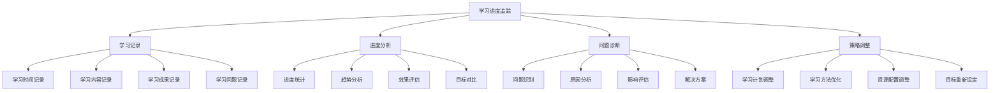

# 学习进度追踪

## 🎯 核心定义

### 什么是学习进度追踪？
学习进度追踪是指通过系统化的方法记录、分析和评估学习者在提示词工程学习过程中的进度、成果和问题，帮助学习者了解学习状态，调整学习策略，确保学习目标的达成。

### 核心价值
- **进度可视化**：清晰展示学习进度和成果
- **问题识别**：及时发现学习中的问题和困难
- **策略调整**：基于进度数据调整学习策略
- **目标达成**：确保学习目标的实现

## 📊 进度追踪框架



## 📝 学习记录

### 1. 学习时间记录
| 记录项目 | 记录内容 | 记录频率 | 记录工具 |
|----------|----------|----------|----------|
| **每日学习时间** | 学习时长、学习时段 | 每日 | 时间追踪应用 |
| **每周学习时间** | 周学习时长、学习分布 | 每周 | 周报模板 |
| **每月学习时间** | 月学习时长、学习趋势 | 每月 | 月报模板 |
| **学习效率** | 有效学习时间、效率指标 | 每日 | 效率分析工具 |

#### 学习时间记录模板
```markdown
学习时间记录模板：

# 学习时间记录

## 日期：[日期]
## 学习时长：[总时长]小时

### 学习时段记录
| 时段 | 开始时间 | 结束时间 | 学习内容 | 学习效果 | 备注 |
|------|----------|----------|----------|----------|------|
| 上午 | 09:00 | 10:30 | 基础认知学习 | 良好 | 注意力集中 |
| 下午 | 14:00 | 15:30 | 实践项目开发 | 优秀 | 进展顺利 |
| 晚上 | 19:00 | 20:30 | 知识复习总结 | 一般 | 有些疲劳 |

### 学习效率分析
- 有效学习时间：[时间]小时
- 学习效率：[效率]%
- 注意力集中度：[程度]
- 学习质量：[质量]

### 学习环境记录
- 学习地点：[地点]
- 学习工具：[工具]
- 学习资源：[资源]
- 学习伙伴：[伙伴]

### 学习状态记录
- 身体状态：[状态]
- 心理状态：[状态]
- 学习动机：[动机]
- 学习困难：[困难]

### 明日学习计划
- 学习目标：[目标]
- 学习内容：[内容]
- 学习时间：[时间]
- 学习重点：[重点]
```

### 2. 学习内容记录
| 记录项目 | 记录内容 | 记录频率 | 记录工具 |
|----------|----------|----------|----------|
| **知识点学习** | 学习内容、掌握程度 | 每次学习 | 学习笔记 |
| **技能练习** | 练习内容、练习效果 | 每次练习 | 练习记录 |
| **项目实践** | 项目进展、项目成果 | 每周 | 项目日志 |
| **问题解决** | 问题描述、解决方案 | 每次问题 | 问题记录 |

#### 学习内容记录模板
```markdown
学习内容记录模板：

# 学习内容记录

## 日期：[日期]
## 学习主题：[主题]

### 学习内容
- 主要知识点：[知识点1, 知识点2, 知识点3]
- 学习资源：[资源1, 资源2, 资源3]
- 学习方式：[方式1, 方式2, 方式3]

### 学习过程
1. 预习阶段
   - 预习内容：[内容]
   - 预习效果：[效果]
   - 预习问题：[问题]

2. 学习阶段
   - 学习重点：[重点]
   - 学习难点：[难点]
   - 学习收获：[收获]

3. 复习阶段
   - 复习内容：[内容]
   - 复习效果：[效果]
   - 复习问题：[问题]

### 掌握程度评估
- 知识点1：[掌握程度] - [具体表现]
- 知识点2：[掌握程度] - [具体表现]
- 知识点3：[掌握程度] - [具体表现]

### 学习成果
- 理论理解：[理解程度]
- 实践应用：[应用能力]
- 问题解决：[解决能力]
- 创新思维：[创新能力]

### 学习问题
- 遇到的问题：[问题描述]
- 问题原因：[原因分析]
- 解决方案：[解决方案]
- 解决效果：[解决效果]

### 学习反思
- 学习优点：[优点]
- 学习不足：[不足]
- 改进方向：[改进方向]
- 学习感悟：[感悟]
```

## 📈 进度分析

### 1. 进度统计
| 统计维度 | 统计内容 | 统计周期 | 统计工具 |
|----------|----------|----------|----------|
| **学习时长** | 总学习时长、平均学习时长 | 每日/每周/每月 | 时间统计工具 |
| **学习内容** | 学习章节、完成率 | 每周/每月 | 进度统计表 |
| **学习成果** | 项目完成数、技能掌握数 | 每月/每季度 | 成果统计表 |
| **学习质量** | 测试成绩、评估结果 | 每月/每季度 | 质量评估表 |

#### 进度统计模板
```markdown
进度统计模板：

# 学习进度统计

## 统计周期：[周期]
## 统计日期：[日期]

### 学习时长统计
- 总学习时长：[时长]小时
- 平均每日学习时长：[时长]小时
- 学习时长分布：
  - 工作日：[时长]小时
  - 周末：[时长]小时
  - 节假日：[时长]小时

### 学习内容统计
- 学习章节数：[数量]章
- 完成章节数：[数量]章
- 完成率：[百分比]%
- 学习内容分布：
  - 基础认知：[百分比]%
  - 核心理解：[百分比]%
  - 应用实践：[百分比]%
  - 进阶优化：[百分比]%

### 学习成果统计
- 完成项目数：[数量]个
- 掌握技能数：[数量]个
- 通过测试数：[数量]个
- 获得认证数：[数量]个

### 学习质量统计
- 平均测试成绩：[分数]分
- 技能评估等级：[等级]
- 项目作品质量：[质量]
- 学习满意度：[满意度]%

### 进度对比分析
- 与计划对比：[对比结果]
- 与上月对比：[对比结果]
- 与去年同期对比：[对比结果]
- 与目标对比：[对比结果]
```

### 2. 趋势分析
| 分析维度 | 分析内容 | 分析周期 | 分析工具 |
|----------|----------|----------|----------|
| **学习趋势** | 学习时长趋势、学习内容趋势 | 每月 | 趋势分析图 |
| **成果趋势** | 项目完成趋势、技能提升趋势 | 每季度 | 成果趋势图 |
| **质量趋势** | 测试成绩趋势、评估结果趋势 | 每季度 | 质量趋势图 |
| **效率趋势** | 学习效率趋势、时间利用趋势 | 每月 | 效率趋势图 |

#### 趋势分析模板
```markdown
趋势分析模板：

# 学习趋势分析

## 分析周期：[周期]
## 分析日期：[日期]

### 学习时长趋势
- 趋势方向：[上升/下降/稳定]
- 变化幅度：[幅度]%
- 趋势特点：[特点描述]
- 影响因素：[影响因素]

### 学习内容趋势
- 内容覆盖趋势：[趋势描述]
- 深度学习趋势：[趋势描述]
- 实践应用趋势：[趋势描述]
- 创新探索趋势：[趋势描述]

### 学习成果趋势
- 项目完成趋势：[趋势描述]
- 技能提升趋势：[趋势描述]
- 质量改善趋势：[趋势描述]
- 创新能力趋势：[趋势描述]

### 学习效率趋势
- 时间利用效率：[效率趋势]
- 学习质量效率：[效率趋势]
- 成果产出效率：[效率趋势]
- 问题解决效率：[效率趋势]

### 趋势预测
- 短期预测：[预测结果]
- 中期预测：[预测结果]
- 长期预测：[预测结果]
- 风险预警：[风险提示]
```

## 🔍 问题诊断

### 1. 问题识别
| 问题类型 | 问题表现 | 识别方法 | 严重程度 |
|----------|----------|----------|----------|
| **学习进度问题** | 进度滞后、完成率低 | 进度对比分析 | 高/中/低 |
| **学习质量问题** | 理解不深、应用能力差 | 测试评估分析 | 高/中/低 |
| **学习方法问题** | 效率低下、方法不当 | 效率分析 | 高/中/低 |
| **学习动机问题** | 兴趣下降、动力不足 | 心理状态分析 | 高/中/低 |

#### 问题识别模板
```markdown
问题识别模板：

# 学习问题识别

## 识别日期：[日期]
## 识别周期：[周期]

### 学习进度问题
- 问题表现：[具体表现]
- 问题程度：[严重程度]
- 影响范围：[影响范围]
- 问题原因：[可能原因]

### 学习质量问题
- 问题表现：[具体表现]
- 问题程度：[严重程度]
- 影响范围：[影响范围]
- 问题原因：[可能原因]

### 学习方法问题
- 问题表现：[具体表现]
- 问题程度：[严重程度]
- 影响范围：[影响范围]
- 问题原因：[可能原因]

### 学习动机问题
- 问题表现：[具体表现]
- 问题程度：[严重程度]
- 影响范围：[影响范围]
- 问题原因：[可能原因]

### 问题优先级
- 高优先级问题：[问题列表]
- 中优先级问题：[问题列表]
- 低优先级问题：[问题列表]

### 问题解决建议
- 立即解决：[解决建议]
- 计划解决：[解决建议]
- 长期改善：[改善建议]
```

### 2. 原因分析
| 分析维度 | 分析内容 | 分析方法 | 分析工具 |
|----------|----------|----------|----------|
| **内因分析** | 个人因素、能力因素 | 自我反思、能力评估 | 反思模板、评估工具 |
| **外因分析** | 环境因素、资源因素 | 环境评估、资源分析 | 环境评估表、资源清单 |
| **系统分析** | 学习系统、方法系统 | 系统分析、方法评估 | 系统分析工具、方法评估表 |
| **综合分析** | 多因素综合分析 | 综合分析、根因分析 | 综合分析工具、根因分析图 |

#### 原因分析模板
```markdown
原因分析模板：

# 学习问题原因分析

## 分析日期：[日期]
## 问题描述：[问题描述]

### 内因分析
- 个人因素：
  - 学习态度：[态度分析]
  - 学习能力：[能力分析]
  - 学习习惯：[习惯分析]
  - 学习动机：[动机分析]

- 能力因素：
  - 基础知识：[基础分析]
  - 学习技能：[技能分析]
  - 思维能力：[思维分析]
  - 实践能力：[实践分析]

### 外因分析
- 环境因素：
  - 学习环境：[环境分析]
  - 社会环境：[社会分析]
  - 家庭环境：[家庭分析]
  - 工作环境：[工作分析]

- 资源因素：
  - 学习资源：[资源分析]
  - 时间资源：[时间分析]
  - 经济资源：[经济分析]
  - 人力资源：[人力分析]

### 系统分析
- 学习系统：
  - 学习计划：[计划分析]
  - 学习方法：[方法分析]
  - 学习流程：[流程分析]
  - 学习评估：[评估分析]

- 方法系统：
  - 学习方法：[方法分析]
  - 时间管理：[时间分析]
  - 资源管理：[资源分析]
  - 问题解决：[解决分析]

### 综合分析
- 主要原因：[主要原因]
- 次要原因：[次要原因]
- 根本原因：[根本原因]
- 影响链条：[影响链条]

### 解决策略
- 针对主要原因：[解决策略]
- 针对次要原因：[解决策略]
- 针对根本原因：[解决策略]
- 系统优化策略：[优化策略]
```

## 🔄 策略调整

### 1. 学习计划调整
| 调整类型 | 调整内容 | 调整依据 | 调整频率 |
|----------|----------|----------|----------|
| **目标调整** | 学习目标、完成时间 | 进度分析、能力评估 | 每月/每季度 |
| **内容调整** | 学习内容、学习重点 | 兴趣分析、需求分析 | 每周/每月 |
| **方法调整** | 学习方法、学习策略 | 效率分析、效果评估 | 每月/每季度 |
| **资源调整** | 学习资源、时间分配 | 资源分析、时间分析 | 每月/每季度 |

#### 学习计划调整模板
```markdown
学习计划调整模板：

# 学习计划调整

## 调整日期：[日期]
## 调整周期：[周期]

### 调整原因
- 进度问题：[问题描述]
- 质量问题：[问题描述]
- 方法问题：[问题描述]
- 资源问题：[问题描述]

### 原计划回顾
- 学习目标：[原目标]
- 学习内容：[原内容]
- 学习方法：[原方法]
- 时间安排：[原安排]

### 调整方案
- 目标调整：
  - 新目标：[新目标]
  - 调整原因：[调整原因]
  - 预期效果：[预期效果]

- 内容调整：
  - 新内容：[新内容]
  - 调整原因：[调整原因]
  - 预期效果：[预期效果]

- 方法调整：
  - 新方法：[新方法]
  - 调整原因：[调整原因]
  - 预期效果：[预期效果]

- 时间调整：
  - 新安排：[新安排]
  - 调整原因：[调整原因]
  - 预期效果：[预期效果]

### 实施计划
- 实施步骤：[步骤列表]
- 实施时间：[时间安排]
- 实施资源：[资源需求]
- 实施监控：[监控方法]

### 风险控制
- 潜在风险：[风险列表]
- 风险应对：[应对策略]
- 应急预案：[应急方案]
- 监控机制：[监控机制]
```

### 2. 学习方法优化
| 优化类型 | 优化内容 | 优化方法 | 优化效果 |
|----------|----------|----------|----------|
| **学习方式优化** | 学习方式、学习工具 | 方式对比、工具评估 | 提高效率、改善体验 |
| **时间管理优化** | 时间分配、时间利用 | 时间分析、效率提升 | 提高时间利用率 |
| **资源利用优化** | 资源选择、资源整合 | 资源评估、资源整合 | 提高资源利用效率 |
| **问题解决优化** | 问题解决、问题预防 | 方法改进、预防机制 | 提高问题解决能力 |

#### 学习方法优化模板
```markdown
学习方法优化模板：

# 学习方法优化

## 优化日期：[日期]
## 优化周期：[周期]

### 现状分析
- 当前方法：[当前方法]
- 方法效果：[效果评估]
- 方法问题：[问题分析]
- 改进空间：[改进空间]

### 优化目标
- 效率目标：[效率目标]
- 质量目标：[质量目标]
- 体验目标：[体验目标]
- 成果目标：[成果目标]

### 优化方案
- 学习方式优化：
  - 新方式：[新方式]
  - 优化理由：[优化理由]
  - 实施方法：[实施方法]
  - 预期效果：[预期效果]

- 时间管理优化：
  - 新方法：[新方法]
  - 优化理由：[优化理由]
  - 实施方法：[实施方法]
  - 预期效果：[预期效果]

- 资源利用优化：
  - 新策略：[新策略]
  - 优化理由：[优化理由]
  - 实施方法：[实施方法]
  - 预期效果：[预期效果]

- 问题解决优化：
  - 新机制：[新机制]
  - 优化理由：[优化理由]
  - 实施方法：[实施方法]
  - 预期效果：[预期效果]

### 实施计划
- 实施步骤：[步骤列表]
- 实施时间：[时间安排]
- 实施资源：[资源需求]
- 实施监控：[监控方法]

### 效果评估
- 评估指标：[评估指标]
- 评估方法：[评估方法]
- 评估时间：[评估时间]
- 评估标准：[评估标准]
```

## 📊 进度追踪工具

### 1. 追踪工具推荐
| 工具类型 | 工具名称 | 主要功能 | 适用场景 |
|----------|----------|----------|----------|
| **时间追踪** | Toggl, RescueTime | 时间记录、效率分析 | 学习时间管理 |
| **进度管理** | Notion, Trello | 任务管理、进度跟踪 | 学习项目管理 |
| **数据分析** | Excel, Google Sheets | 数据分析、图表制作 | 学习数据分析 |
| **可视化** | Tableau, Power BI | 数据可视化、趋势分析 | 学习趋势展示 |

### 2. 自定义追踪模板
```markdown
自定义追踪模板：

# 学习进度追踪仪表板

## 总体概览
- 学习总时长：[时长]小时
- 学习完成率：[百分比]%
- 当前学习阶段：[阶段]
- 距离目标：[差距]

## 本周进度
- 本周学习时长：[时长]小时
- 本周完成内容：[内容]
- 本周学习成果：[成果]
- 本周学习问题：[问题]

## 本月趋势
- 学习时长趋势：[趋势图]
- 学习内容趋势：[趋势图]
- 学习成果趋势：[趋势图]
- 学习质量趋势：[趋势图]

## 问题预警
- 进度预警：[预警信息]
- 质量预警：[预警信息]
- 方法预警：[预警信息]
- 动机预警：[预警信息]

## 改进建议
- 立即改进：[改进建议]
- 计划改进：[改进建议]
- 长期优化：[优化建议]
```

## 🎓 学习要点

### 核心理解
- 学习进度追踪是学习管理的重要工具
- 系统化的进度追踪有助于提高学习效率
- 基于数据的分析能够发现学习问题
- 及时的策略调整是学习成功的关键

### 实践建议
- 建立系统化的进度追踪机制
- 定期分析学习数据和趋势
- 及时识别和解决学习问题
- 持续优化学习方法和策略

## 🔗 相关链接
- [[07-1-学习目标检查清单]] - 查看学习目标
- [[07-2-技能评估测试]] - 进行技能评估
- [[07-3-项目作品集]] - 查看项目作品
- [[00-学习导航]] - 返回学习导航
