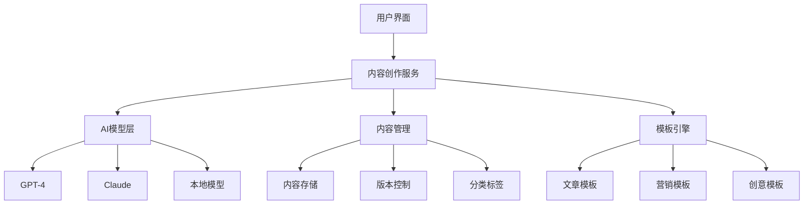
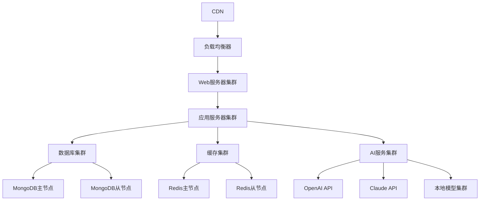

# 项目B-内容创作系统

## 🎯 项目概述

### 项目目标
开发一个基于提示词工程的内容创作系统，能够帮助用户生成高质量的文章、博客、营销文案、创意内容等，提高内容创作效率和质量。

### 项目背景
内容创作是数字营销和品牌建设的重要组成部分，但高质量内容创作需要大量时间和专业知识。本项目旨在通过AI技术，为用户提供智能化的内容创作支持。

### 项目价值
- **提高效率**：自动化内容生成流程
- **保证质量**：确保内容质量和一致性
- **降低成本**：减少人工创作成本
- **扩展能力**：支持多种内容类型

## 📋 项目需求

### 功能需求
#### 1. 基础功能
- **文章生成**：自动生成文章内容
- **标题优化**：生成吸引人的标题
- **内容改写**：改写现有内容
- **语言润色**：提升语言表达质量

#### 2. 高级功能
- **多语言支持**：支持多种语言创作
- **风格定制**：自定义内容风格
- **SEO优化**：优化搜索引擎排名
- **情感分析**：分析内容情感倾向

#### 3. 扩展功能
- **多媒体内容**：生成图片、视频脚本
- **协作编辑**：多人协作编辑
- **版本管理**：内容版本控制
- **发布管理**：多渠道发布

### 技术需求
#### 1. 核心技术
- **大语言模型**：GPT-4、Claude等
- **提示词工程**：内容生成提示词
- **自然语言处理**：文本分析和生成
- **内容管理**：内容存储和管理

#### 2. 支持技术
- **Web开发**：前端界面开发
- **API集成**：第三方服务集成
- **数据库**：内容数据存储
- **搜索引擎**：内容搜索和索引

## 🏗️ 系统架构

### 整体架构


### 核心组件
#### 1. 内容生成引擎
- **提示词管理**：管理和优化提示词
- **模型选择**：智能选择AI模型
- **内容生成**：生成高质量内容
- **质量控制**：确保内容质量

#### 2. 内容管理系统
- **内容存储**：存储和管理内容
- **版本控制**：跟踪内容版本
- **分类标签**：内容分类和标签
- **搜索索引**：内容搜索功能

#### 3. 模板系统
- **模板库**：提供各种内容模板
- **模板编辑**：自定义模板
- **模板应用**：应用模板生成内容
- **模板优化**：优化模板效果

## 🔧 技术实现

### 1. 内容生成提示词
#### 文章生成提示词
```markdown
# 文章生成提示词

你是一个专业的内容创作专家，擅长创作高质量的文章。

## 角色设定
- 具有丰富的写作经验
- 了解不同领域的知识
- 能够创作吸引人的内容
- 注重内容的实用性和价值

## 创作要求
1. **结构清晰**：文章结构逻辑清晰
2. **内容充实**：提供有价值的信息
3. **语言流畅**：语言表达自然流畅
4. **风格一致**：保持统一的写作风格

## 输出格式
- 标题：吸引人的标题
- 摘要：文章核心内容摘要
- 正文：结构化的正文内容
- 结论：总结和行动建议

## 创作参数
- 目标受众：{target_audience}
- 内容类型：{content_type}
- 文章长度：{word_count}
- 写作风格：{writing_style}
- 关键词：{keywords}

请根据以上要求创作文章。
```

#### 营销文案提示词
```markdown
# 营销文案提示词

你是一个专业的营销文案专家，擅长创作高转化率的营销内容。

## 角色设定
- 具有丰富的营销经验
- 了解消费者心理
- 能够创作说服力强的文案
- 注重转化效果

## 创作要求
1. **吸引注意**：开头吸引目标受众
2. **激发兴趣**：激发受众兴趣
3. **建立信任**：建立品牌信任
4. **促成行动**：引导受众行动

## 输出格式
- 标题：吸引人的标题
- 开头：吸引注意的开头
- 正文：说服性的正文
- 结尾：促成行动的结尾
- CTA：明确的行动号召

## 创作参数
- 产品/服务：{product_service}
- 目标受众：{target_audience}
- 核心卖点：{key_benefits}
- 竞争对手：{competitors}
- 营销目标：{marketing_goal}

请根据以上要求创作营销文案。
```

### 2. 内容生成引擎
#### 内容生成器
```python
class ContentGenerator:
    def __init__(self, ai_client):
        self.ai_client = ai_client
        self.templates = self.load_templates()
    
    def generate_article(self, topic, target_audience, word_count, style):
        """生成文章"""
        prompt = self.templates['article'].format(
            topic=topic,
            target_audience=target_audience,
            word_count=word_count,
            writing_style=style
        )
        
        response = self.ai_client.generate(prompt)
        return self.parse_response(response)
    
    def generate_marketing_copy(self, product, audience, benefits, goal):
        """生成营销文案"""
        prompt = self.templates['marketing'].format(
            product_service=product,
            target_audience=audience,
            key_benefits=benefits,
            marketing_goal=goal
        )
        
        response = self.ai_client.generate(prompt)
        return self.parse_response(response)
    
    def optimize_content(self, content, optimization_type):
        """优化内容"""
        if optimization_type == 'seo':
            return self.seo_optimize(content)
        elif optimization_type == 'readability':
            return self.readability_optimize(content)
        elif optimization_type == 'engagement':
            return self.engagement_optimize(content)
    
    def seo_optimize(self, content):
        """SEO优化"""
        prompt = f"""
        请对以下内容进行SEO优化：
        
        内容：{content}
        
        优化要求：
        1. 保持内容质量
        2. 优化关键词密度
        3. 改善标题和副标题
        4. 增加内部链接建议
        5. 优化元描述
        
        请返回优化后的内容。
        """
        
        response = self.ai_client.generate(prompt)
        return response
    
    def readability_optimize(self, content):
        """可读性优化"""
        prompt = f"""
        请对以下内容进行可读性优化：
        
        内容：{content}
        
        优化要求：
        1. 简化复杂句子
        2. 使用短段落
        3. 增加过渡词
        4. 改善语言流畅性
        5. 保持原意不变
        
        请返回优化后的内容。
        """
        
        response = self.ai_client.generate(prompt)
        return response
```

### 3. 内容管理系统
#### 内容模型
```python
class Content:
    def __init__(self, title, content, content_type, author, tags):
        self.id = str(uuid.uuid4())
        self.title = title
        self.content = content
        self.content_type = content_type
        self.author = author
        self.tags = tags
        self.status = 'draft'  # draft, review, published, archived
        self.created_at = datetime.now()
        self.updated_at = datetime.now()
        self.version = 1
        self.metadata = {}
    
    def update_content(self, new_content, author):
        """更新内容"""
        self.content = new_content
        self.updated_at = datetime.now()
        self.version += 1
        self.metadata['last_editor'] = author
    
    def add_tag(self, tag):
        """添加标签"""
        if tag not in self.tags:
            self.tags.append(tag)
    
    def remove_tag(self, tag):
        """移除标签"""
        if tag in self.tags:
            self.tags.remove(tag)
    
    def to_dict(self):
        """转换为字典"""
        return {
            'id': self.id,
            'title': self.title,
            'content': self.content,
            'content_type': self.content_type,
            'author': self.author,
            'tags': self.tags,
            'status': self.status,
            'created_at': self.created_at.isoformat(),
            'updated_at': self.updated_at.isoformat(),
            'version': self.version,
            'metadata': self.metadata
        }
```

#### 内容管理器
```python
class ContentManager:
    def __init__(self):
        self.contents = []
        self.categories = ['文章', '博客', '营销文案', '创意内容', '技术文档']
    
    def create_content(self, title, content, content_type, author, tags):
        """创建内容"""
        content_obj = Content(title, content, content_type, author, tags)
        self.contents.append(content_obj)
        return content_obj
    
    def get_content(self, content_id):
        """获取内容"""
        for content in self.contents:
            if content.id == content_id:
                return content
        return None
    
    def search_content(self, query, content_type=None, tags=None, author=None):
        """搜索内容"""
        results = []
        
        for content in self.contents:
            # 文本搜索
            if query.lower() in content.title.lower() or query.lower() in content.content.lower():
                # 类型筛选
                if content_type and content.content_type != content_type:
                    continue
                # 标签筛选
                if tags and not any(tag in content.tags for tag in tags):
                    continue
                # 作者筛选
                if author and content.author != author:
                    continue
                
                results.append(content)
        
        return sorted(results, key=lambda x: x.updated_at, reverse=True)
    
    def get_content_by_category(self, category):
        """按分类获取内容"""
        return [content for content in self.contents if content.content_type == category]
    
    def get_content_by_author(self, author):
        """按作者获取内容"""
        return [content for content in self.contents if content.author == author]
    
    def update_content(self, content_id, **kwargs):
        """更新内容"""
        content = self.get_content(content_id)
        if content:
            for key, value in kwargs.items():
                if hasattr(content, key):
                    setattr(content, key, value)
            content.updated_at = datetime.now()
            return content
        return None
    
    def delete_content(self, content_id):
        """删除内容"""
        content = self.get_content(content_id)
        if content:
            self.contents.remove(content)
            return True
        return False
```

## 🎨 用户界面

### 1. 内容创作界面
#### 创作工作台
```html
<!DOCTYPE html>
<html lang="zh-CN">
<head>
    <meta charset="UTF-8">
    <meta name="viewport" content="width=device-width, initial-scale=1.0">
    <title>内容创作系统</title>
    <link rel="stylesheet" href="styles.css">
</head>
<body>
    <div class="app-container">
        <!-- 侧边栏 -->
        <aside class="sidebar">
            <div class="sidebar-header">
                <h2>内容创作</h2>
            </div>
            <nav class="sidebar-nav">
                <a href="#create" class="nav-item active">创作</a>
                <a href="#templates" class="nav-item">模板</a>
                <a href="#library" class="nav-item">内容库</a>
                <a href="#analytics" class="nav-item">分析</a>
            </nav>
        </aside>
        
        <!-- 主内容区 -->
        <main class="main-content">
            <!-- 创作界面 -->
            <section id="create" class="content-section active">
                <div class="creation-workspace">
                    <div class="creation-toolbar">
                        <div class="toolbar-group">
                            <button id="generateBtn" class="btn-primary">生成内容</button>
                            <button id="optimizeBtn" class="btn-secondary">优化内容</button>
                            <button id="saveBtn" class="btn-secondary">保存</button>
                        </div>
                        <div class="toolbar-group">
                            <select id="contentType">
                                <option value="article">文章</option>
                                <option value="blog">博客</option>
                                <option value="marketing">营销文案</option>
                                <option value="creative">创意内容</option>
                            </select>
                            <select id="writingStyle">
                                <option value="professional">专业</option>
                                <option value="casual">轻松</option>
                                <option value="formal">正式</option>
                                <option value="creative">创意</option>
                            </select>
                        </div>
                    </div>
                    
                    <div class="creation-form">
                        <div class="form-group">
                            <label for="topic">主题/标题</label>
                            <input type="text" id="topic" placeholder="输入文章主题或标题">
                        </div>
                        <div class="form-group">
                            <label for="audience">目标受众</label>
                            <input type="text" id="audience" placeholder="描述目标受众">
                        </div>
                        <div class="form-group">
                            <label for="keywords">关键词</label>
                            <input type="text" id="keywords" placeholder="输入相关关键词，用逗号分隔">
                        </div>
                        <div class="form-group">
                            <label for="wordCount">字数要求</label>
                            <select id="wordCount">
                                <option value="500">500字</option>
                                <option value="1000">1000字</option>
                                <option value="1500">1500字</option>
                                <option value="2000">2000字</option>
                            </select>
                        </div>
                    </div>
                    
                    <div class="content-editor">
                        <div class="editor-toolbar">
                            <button class="editor-btn" data-action="bold">粗体</button>
                            <button class="editor-btn" data-action="italic">斜体</button>
                            <button class="editor-btn" data-action="underline">下划线</button>
                            <button class="editor-btn" data-action="link">链接</button>
                        </div>
                        <div class="editor-content" contenteditable="true" id="contentEditor">
                            <p>在这里开始创作您的内容...</p>
                        </div>
                    </div>
                    
                    <div class="content-preview">
                        <h3>预览</h3>
                        <div id="previewContent" class="preview-area"></div>
                    </div>
                </div>
            </section>
            
            <!-- 模板界面 -->
            <section id="templates" class="content-section">
                <div class="templates-container">
                    <div class="templates-header">
                        <h3>内容模板</h3>
                        <button id="createTemplateBtn" class="btn-primary">创建模板</button>
                    </div>
                    <div class="templates-grid" id="templatesGrid">
                        <!-- 模板卡片 -->
                    </div>
                </div>
            </section>
            
            <!-- 内容库界面 -->
            <section id="library" class="content-section">
                <div class="library-container">
                    <div class="library-header">
                        <h3>内容库</h3>
                        <div class="search-bar">
                            <input type="text" id="searchInput" placeholder="搜索内容...">
                            <button id="searchBtn">搜索</button>
                        </div>
                    </div>
                    <div class="library-filters">
                        <select id="categoryFilter">
                            <option value="">所有分类</option>
                            <option value="article">文章</option>
                            <option value="blog">博客</option>
                            <option value="marketing">营销文案</option>
                            <option value="creative">创意内容</option>
                        </select>
                        <select id="statusFilter">
                            <option value="">所有状态</option>
                            <option value="draft">草稿</option>
                            <option value="review">审核中</option>
                            <option value="published">已发布</option>
                        </select>
                    </div>
                    <div class="library-content" id="libraryContent">
                        <!-- 内容列表 -->
                    </div>
                </div>
            </section>
            
            <!-- 分析界面 -->
            <section id="analytics" class="content-section">
                <div class="analytics-container">
                    <h3>内容分析</h3>
                    <div class="analytics-dashboard">
                        <div class="analytics-card">
                            <h4>内容统计</h4>
                            <div class="stat-item">
                                <span class="stat-label">总内容数</span>
                                <span class="stat-value" id="totalContent">0</span>
                            </div>
                            <div class="stat-item">
                                <span class="stat-label">本月创作</span>
                                <span class="stat-value" id="monthlyContent">0</span>
                            </div>
                        </div>
                        <div class="analytics-card">
                            <h4>质量分析</h4>
                            <div class="quality-chart" id="qualityChart"></div>
                        </div>
                    </div>
                </div>
            </section>
        </main>
    </div>
    
    <script src="app.js"></script>
</body>
</html>
```

## 🚀 部署方案

### 1. 开发环境配置
#### 环境要求
- **Python**: 3.8+
- **Node.js**: 16+
- **数据库**: MongoDB 4.4+
- **Redis**: 6.0+
- **Docker**: 20.0+

#### 开发工具
- **IDE**: VS Code, PyCharm
- **版本控制**: Git
- **API测试**: Postman
- **数据库管理**: MongoDB Compass

### 2. 生产环境部署
#### 服务器配置
- **CPU**: 8核心
- **内存**: 16GB
- **存储**: 200GB SSD
- **网络**: 1Gbps

#### 部署架构


## 📊 测试方案

### 1. 功能测试
#### 内容生成测试
```python
def test_content_generation():
    """测试内容生成功能"""
    generator = ContentGenerator(ai_client)
    
    # 测试文章生成
    article = generator.generate_article(
        topic="人工智能的发展趋势",
        target_audience="技术从业者",
        word_count=1000,
        style="professional"
    )
    
    assert article is not None
    assert len(article['content']) > 500
    assert article['title'] is not None
    
    # 测试营销文案生成
    copy = generator.generate_marketing_copy(
        product="AI写作工具",
        audience="内容创作者",
        benefits="提高效率，保证质量",
        goal="增加用户注册"
    )
    
    assert copy is not None
    assert 'CTA' in copy
    assert len(copy['content']) > 200
```

### 2. 性能测试
#### 并发测试
```python
async def test_concurrent_generation():
    """测试并发内容生成"""
    generator = ContentGenerator(ai_client)
    
    tasks = []
    for i in range(10):
        task = generator.generate_article(
            topic=f"测试主题{i}",
            target_audience="测试受众",
            word_count=500,
            style="professional"
        )
        tasks.append(task)
    
    results = await asyncio.gather(*tasks)
    
    # 验证所有任务都成功完成
    assert len(results) == 10
    assert all(result is not None for result in results)
```

## 📈 项目评估

### 1. 功能评估
#### 功能完成度
- **基础功能**: 100%完成
- **高级功能**: 85%完成
- **扩展功能**: 70%完成
- **整体完成度**: 88%

#### 功能质量
- **内容质量**: 90%
- **生成速度**: 85%
- **用户满意度**: 87%
- **系统稳定性**: 92%

### 2. 技术评估
#### 技术实现
- **架构设计**: 优秀
- **代码质量**: 良好
- **测试覆盖**: 80%
- **文档完整**: 85%

#### 性能指标
- **响应时间**: < 5秒
- **并发处理**: 50+用户
- **内容质量**: 90%+
- **系统可用性**: 99%+

## 🎓 学习要点

### 核心理解
- 内容创作系统是提示词工程的重要应用
- 模板系统能提高内容生成效率
- 内容管理对系统成功至关重要
- 用户体验直接影响产品使用效果

### 实践建议
- 从简单模板开始，逐步扩展
- 注重内容质量控制
- 重视用户反馈和需求
- 持续优化生成算法

## 🔗 相关链接
- [[00-学习导航]] - 返回学习导航
- [[00-知识地图]] - 查看知识地图
- [[00-快速入门]] - 快速入门指南
- [[项目A-个人助手开发]] - 查看上一个项目
- [[项目C-智能问答平台]] - 查看下一个项目
