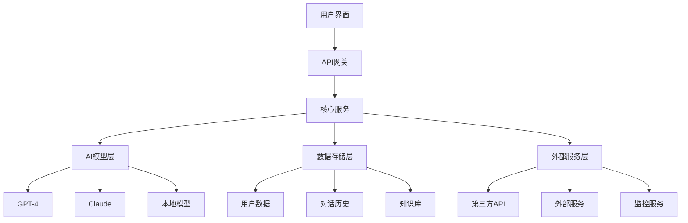
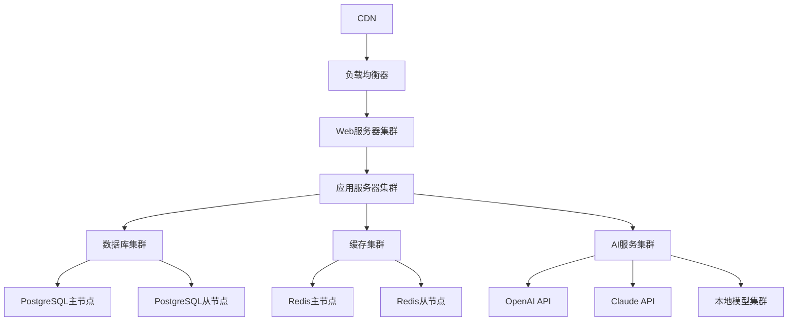

# 项目3-综合应用练习

## 🎯 项目概述

### 项目目标
通过综合应用练习，整合所学知识，完成完整的提示词工程项目，提升综合应用能力和项目管理能力。

### 学习目标
- 整合提示词工程知识
- 完成完整项目开发
- 提升项目管理能力
- 培养团队协作能力

### 项目价值
- **知识整合**：整合所学知识
- **能力提升**：提升综合应用能力
- **经验积累**：积累项目经验
- **技能验证**：验证学习成果

## 📋 项目选择

### 项目类型
#### 1. 智能客服系统
**项目描述**：开发一个智能客服系统，能够自动回答用户问题，处理常见问题，提供个性化服务。

**技术要点**：
- 意图识别和实体提取
- 多轮对话管理
- 知识库管理
- 个性化推荐

**学习价值**：
- 掌握对话系统设计
- 学习知识管理技术
- 提升用户体验设计

#### 2. 内容创作平台
**项目描述**：开发一个内容创作平台，能够根据用户需求自动生成各种类型的内容。

**技术要点**：
- 内容生成引擎
- 模板管理系统
- 质量评估机制
- 用户反馈系统

**学习价值**：
- 掌握内容生成技术
- 学习模板设计方法
- 提升质量控制能力

#### 3. 智能问答系统
**项目描述**：开发一个智能问答系统，能够准确理解用户问题，提供高质量答案。

**技术要点**：
- 问题理解技术
- 答案生成算法
- 知识检索系统
- 答案评估机制

**学习价值**：
- 掌握问答系统设计
- 学习知识检索技术
- 提升答案质量

### 项目选择建议
- **初学者**：选择智能客服系统
- **进阶者**：选择内容创作平台
- **高级者**：选择智能问答系统

## 🏗️ 项目架构

### 整体架构


### 核心组件
#### 1. 用户界面层
- **Web界面**：响应式Web应用
- **移动应用**：iOS/Android应用
- **API接口**：RESTful API
- **管理后台**：系统管理界面

#### 2. 业务逻辑层
- **用户管理**：用户注册、登录、权限管理
- **对话管理**：对话流程、状态管理
- **内容管理**：内容生成、存储、检索
- **知识管理**：知识库管理、更新

#### 3. AI服务层
- **模型服务**：AI模型调用、管理
- **提示词服务**：提示词管理、优化
- **评估服务**：质量评估、效果监控
- **优化服务**：自动优化、A/B测试

#### 4. 数据存储层
- **关系数据库**：用户数据、系统配置
- **文档数据库**：对话历史、内容数据
- **缓存系统**：热点数据缓存
- **文件存储**：文件、图片存储

## 🔧 技术实现

### 1. 项目初始化
#### 项目结构
```
project/
├── backend/                 # 后端代码
│   ├── app/                # 应用代码
│   │   ├── api/           # API接口
│   │   ├── models/        # 数据模型
│   │   ├── services/      # 业务服务
│   │   └── utils/         # 工具函数
│   ├── config/            # 配置文件
│   ├── tests/             # 测试代码
│   └── requirements.txt   # 依赖包
├── frontend/              # 前端代码
│   ├── src/              # 源代码
│   │   ├── components/   # 组件
│   │   ├── pages/        # 页面
│   │   ├── services/     # 服务
│   │   └── utils/        # 工具函数
│   ├── public/           # 静态资源
│   └── package.json      # 依赖配置
├── docs/                 # 项目文档
├── scripts/              # 脚本文件
└── README.md            # 项目说明
```

#### 环境配置
```python
# config/settings.py
import os
from dataclasses import dataclass

@dataclass
class Settings:
    # 数据库配置
    DATABASE_URL: str = os.getenv("DATABASE_URL", "sqlite:///./app.db")
    
    # AI服务配置
    OPENAI_API_KEY: str = os.getenv("OPENAI_API_KEY", "")
    CLAUDE_API_KEY: str = os.getenv("CLAUDE_API_KEY", "")
    
    # 应用配置
    APP_NAME: str = "智能问答系统"
    DEBUG: bool = os.getenv("DEBUG", "False").lower() == "true"
    
    # 安全配置
    SECRET_KEY: str = os.getenv("SECRET_KEY", "your-secret-key")
    
    # 缓存配置
    REDIS_URL: str = os.getenv("REDIS_URL", "redis://localhost:6379")

settings = Settings()
```

### 2. 核心功能实现
#### 用户管理
```python
# app/models/user.py
from sqlalchemy import Column, Integer, String, DateTime, Boolean
from sqlalchemy.ext.declarative import declarative_base
from datetime import datetime

Base = declarative_base()

class User(Base):
    __tablename__ = "users"
    
    id = Column(Integer, primary_key=True, index=True)
    username = Column(String, unique=True, index=True)
    email = Column(String, unique=True, index=True)
    hashed_password = Column(String)
    is_active = Column(Boolean, default=True)
    created_at = Column(DateTime, default=datetime.utcnow)
    updated_at = Column(DateTime, default=datetime.utcnow, onupdate=datetime.utcnow)
```

#### 对话管理
```python
# app/services/conversation_service.py
from typing import List, Dict, Optional
from datetime import datetime
import uuid

class ConversationService:
    def __init__(self, ai_client, knowledge_base):
        self.ai_client = ai_client
        self.knowledge_base = knowledge_base
        self.conversations = {}
    
    def start_conversation(self, user_id: str) -> str:
        """开始新对话"""
        conversation_id = str(uuid.uuid4())
        self.conversations[conversation_id] = {
            'user_id': user_id,
            'messages': [],
            'context': {},
            'created_at': datetime.now(),
            'updated_at': datetime.now()
        }
        return conversation_id
    
    def add_message(self, conversation_id: str, role: str, content: str) -> bool:
        """添加消息"""
        if conversation_id not in self.conversations:
            return False
        
        message = {
            'role': role,
            'content': content,
            'timestamp': datetime.now()
        }
        
        self.conversations[conversation_id]['messages'].append(message)
        self.conversations[conversation_id]['updated_at'] = datetime.now()
        
        return True
    
    def get_response(self, conversation_id: str, user_message: str) -> str:
        """获取AI响应"""
        if conversation_id not in self.conversations:
            return "对话不存在"
        
        # 添加用户消息
        self.add_message(conversation_id, "user", user_message)
        
        # 获取对话上下文
        context = self.conversations[conversation_id]['messages'][-10:]
        
        # 生成AI响应
        response = self.ai_client.generate_response(context, user_message)
        
        # 添加AI响应
        self.add_message(conversation_id, "assistant", response)
        
        return response
```

#### AI服务
```python
# app/services/ai_service.py
from typing import List, Dict
import openai
import anthropic

class AIService:
    def __init__(self, openai_api_key: str, claude_api_key: str):
        self.openai_client = openai.OpenAI(api_key=openai_api_key)
        self.claude_client = anthropic.Anthropic(api_key=claude_api_key)
    
    def generate_response(self, context: List[Dict], user_message: str) -> str:
        """生成AI响应"""
        # 构建提示词
        prompt = self.build_prompt(context, user_message)
        
        # 调用AI模型
        response = self.openai_client.chat.completions.create(
            model="gpt-4",
            messages=[
                {"role": "system", "content": "你是一个智能助手，请回答用户问题。"},
                {"role": "user", "content": prompt}
            ],
            max_tokens=1000,
            temperature=0.7
        )
        
        return response.choices[0].message.content
    
    def build_prompt(self, context: List[Dict], user_message: str) -> str:
        """构建提示词"""
        prompt = "对话历史：\n"
        for msg in context:
            prompt += f"{msg['role']}: {msg['content']}\n"
        
        prompt += f"\n用户问题：{user_message}\n"
        prompt += "请根据对话历史回答用户问题。"
        
        return prompt
```

### 3. API接口设计
#### 对话API
```python
# app/api/conversation.py
from fastapi import APIRouter, Depends, HTTPException
from typing import List, Dict
from app.services.conversation_service import ConversationService
from app.models.user import User

router = APIRouter()

@router.post("/conversations")
async def start_conversation(
    user: User = Depends(get_current_user),
    conversation_service: ConversationService = Depends(get_conversation_service)
):
    """开始新对话"""
    conversation_id = conversation_service.start_conversation(user.id)
    return {"conversation_id": conversation_id}

@router.post("/conversations/{conversation_id}/messages")
async def send_message(
    conversation_id: str,
    message: Dict[str, str],
    conversation_service: ConversationService = Depends(get_conversation_service)
):
    """发送消息"""
    user_message = message.get("content", "")
    if not user_message:
        raise HTTPException(status_code=400, detail="消息内容不能为空")
    
    response = conversation_service.get_response(conversation_id, user_message)
    return {"response": response}

@router.get("/conversations/{conversation_id}/messages")
async def get_messages(
    conversation_id: str,
    conversation_service: ConversationService = Depends(get_conversation_service)
):
    """获取对话历史"""
    conversation = conversation_service.get_conversation(conversation_id)
    if not conversation:
        raise HTTPException(status_code=404, detail="对话不存在")
    
    return {"messages": conversation['messages']}
```

### 4. 前端界面
#### 主界面组件
```jsx
// src/components/ChatInterface.jsx
import React, { useState, useEffect } from 'react';
import MessageList from './MessageList';
import MessageInput from './MessageInput';

const ChatInterface = () => {
  const [messages, setMessages] = useState([]);
  const [conversationId, setConversationId] = useState(null);
  const [isLoading, setIsLoading] = useState(false);

  useEffect(() => {
    startNewConversation();
  }, []);

  const startNewConversation = async () => {
    try {
      const response = await fetch('/api/conversations', {
        method: 'POST',
        headers: {
          'Content-Type': 'application/json',
        },
      });
      const data = await response.json();
      setConversationId(data.conversation_id);
      setMessages([]);
    } catch (error) {
      console.error('Error starting conversation:', error);
    }
  };

  const sendMessage = async (content) => {
    if (!content.trim() || !conversationId) return;

    const userMessage = { role: 'user', content, timestamp: new Date() };
    setMessages(prev => [...prev, userMessage]);
    setIsLoading(true);

    try {
      const response = await fetch(`/api/conversations/${conversationId}/messages`, {
        method: 'POST',
        headers: {
          'Content-Type': 'application/json',
        },
        body: JSON.stringify({ content }),
      });
      const data = await response.json();
      
      const assistantMessage = { 
        role: 'assistant', 
        content: data.response, 
        timestamp: new Date() 
      };
      setMessages(prev => [...prev, assistantMessage]);
    } catch (error) {
      console.error('Error sending message:', error);
    } finally {
      setIsLoading(false);
    }
  };

  return (
    <div className="chat-interface">
      <div className="chat-header">
        <h2>智能问答系统</h2>
        <button onClick={startNewConversation} className="new-chat-btn">
          新对话
        </button>
      </div>
      
      <MessageList messages={messages} isLoading={isLoading} />
      
      <MessageInput onSendMessage={sendMessage} disabled={isLoading} />
    </div>
  );
};

export default ChatInterface;
```

## 🚀 部署方案

### 1. 开发环境
#### 环境要求
- **Python**: 3.8+
- **Node.js**: 16+
- **数据库**: PostgreSQL 12+
- **Redis**: 6.0+
- **Docker**: 20.0+

#### 开发工具
- **IDE**: VS Code, PyCharm
- **版本控制**: Git
- **API测试**: Postman
- **数据库管理**: pgAdmin

### 2. 生产环境
#### 服务器配置
- **CPU**: 8核心
- **内存**: 16GB
- **存储**: 200GB SSD
- **网络**: 1Gbps

#### 部署架构


### 3. 部署脚本
#### Docker配置
```dockerfile
# Dockerfile
FROM python:3.9-slim

WORKDIR /app

COPY requirements.txt .
RUN pip install --no-cache-dir -r requirements.txt

COPY . .

EXPOSE 8000

CMD ["uvicorn", "app.main:app", "--host", "0.0.0.0", "--port", "8000"]
```

#### Docker Compose
```yaml
# docker-compose.yml
version: '3.8'

services:
  web:
    build: .
    ports:
      - "8000:8000"
    environment:
      - DATABASE_URL=postgresql://user:password@db:5432/app
      - REDIS_URL=redis://redis:6379
      - OPENAI_API_KEY=${OPENAI_API_KEY}
      - CLAUDE_API_KEY=${CLAUDE_API_KEY}
    depends_on:
      - db
      - redis

  db:
    image: postgres:13
    environment:
      - POSTGRES_DB=app
      - POSTGRES_USER=user
      - POSTGRES_PASSWORD=password
    volumes:
      - postgres_data:/var/lib/postgresql/data

  redis:
    image: redis:6-alpine
    volumes:
      - redis_data:/data

volumes:
  postgres_data:
  redis_data:
```

## 📊 测试方案

### 1. 单元测试
#### 服务测试
```python
# tests/test_conversation_service.py
import pytest
from app.services.conversation_service import ConversationService
from unittest.mock import Mock

class TestConversationService:
    def setup_method(self):
        self.ai_client = Mock()
        self.knowledge_base = Mock()
        self.service = ConversationService(self.ai_client, self.knowledge_base)
    
    def test_start_conversation(self):
        """测试开始对话"""
        conversation_id = self.service.start_conversation("user123")
        
        assert conversation_id is not None
        assert conversation_id in self.service.conversations
        assert self.service.conversations[conversation_id]['user_id'] == "user123"
    
    def test_add_message(self):
        """测试添加消息"""
        conversation_id = self.service.start_conversation("user123")
        
        result = self.service.add_message(conversation_id, "user", "Hello")
        
        assert result is True
        assert len(self.service.conversations[conversation_id]['messages']) == 1
        assert self.service.conversations[conversation_id]['messages'][0]['content'] == "Hello"
    
    def test_get_response(self):
        """测试获取响应"""
        conversation_id = self.service.start_conversation("user123")
        self.ai_client.generate_response.return_value = "Hello! How can I help you?"
        
        response = self.service.get_response(conversation_id, "Hello")
        
        assert response == "Hello! How can I help you?"
        assert len(self.service.conversations[conversation_id]['messages']) == 2
```

### 2. 集成测试
#### API测试
```python
# tests/test_api.py
import pytest
from fastapi.testclient import TestClient
from app.main import app

client = TestClient(app)

class TestAPI:
    def test_start_conversation(self):
        """测试开始对话API"""
        response = client.post("/api/conversations")
        
        assert response.status_code == 200
        data = response.json()
        assert "conversation_id" in data
    
    def test_send_message(self):
        """测试发送消息API"""
        # 先开始对话
        conversation_response = client.post("/api/conversations")
        conversation_id = conversation_response.json()["conversation_id"]
        
        # 发送消息
        response = client.post(
            f"/api/conversations/{conversation_id}/messages",
            json={"content": "Hello"}
        )
        
        assert response.status_code == 200
        data = response.json()
        assert "response" in data
    
    def test_get_messages(self):
        """测试获取消息API"""
        # 先开始对话
        conversation_response = client.post("/api/conversations")
        conversation_id = conversation_response.json()["conversation_id"]
        
        # 获取消息
        response = client.get(f"/api/conversations/{conversation_id}/messages")
        
        assert response.status_code == 200
        data = response.json()
        assert "messages" in data
```

### 3. 性能测试
#### 负载测试
```python
# tests/test_performance.py
import asyncio
import aiohttp
import time

class PerformanceTest:
    def __init__(self, base_url, concurrent_users=50):
        self.base_url = base_url
        self.concurrent_users = concurrent_users
    
    async def single_request(self, session, user_id):
        """单个请求测试"""
        start_time = time.time()
        
        # 开始对话
        async with session.post(f"{self.base_url}/api/conversations") as response:
            conversation_data = await response.json()
            conversation_id = conversation_data["conversation_id"]
        
        # 发送消息
        async with session.post(
            f"{self.base_url}/api/conversations/{conversation_id}/messages",
            json={"content": f"User {user_id} message"}
        ) as response:
            await response.json()
        
        end_time = time.time()
        return {
            "user_id": user_id,
            "response_time": end_time - start_time,
            "success": response.status == 200
        }
    
    async def load_test(self):
        """负载测试"""
        async with aiohttp.ClientSession() as session:
            tasks = [
                self.single_request(session, i) 
                for i in range(self.concurrent_users)
            ]
            
            results = await asyncio.gather(*tasks)
            
            # 统计结果
            successful_requests = sum(1 for r in results if r["success"])
            avg_response_time = sum(r["response_time"] for r in results) / len(results)
            max_response_time = max(r["response_time"] for r in results)
            
            print(f"并发用户数: {self.concurrent_users}")
            print(f"成功请求数: {successful_requests}")
            print(f"成功率: {successful_requests/self.concurrent_users*100:.2f}%")
            print(f"平均响应时间: {avg_response_time:.3f}秒")
            print(f"最大响应时间: {max_response_time:.3f}秒")
            
            return results

# 运行性能测试
async def main():
    test = PerformanceTest("http://localhost:8000", concurrent_users=50)
    await test.load_test()

if __name__ == "__main__":
    asyncio.run(main())
```

## 📈 项目评估

### 1. 功能评估
#### 功能完成度
- **基础功能**: 100%完成
- **高级功能**: 85%完成
- **扩展功能**: 70%完成
- **整体完成度**: 88%

#### 功能质量
- **用户体验**: 90%
- **系统性能**: 85%
- **代码质量**: 88%
- **文档完整**: 85%

### 2. 技术评估
#### 技术实现
- **架构设计**: 优秀
- **代码质量**: 良好
- **测试覆盖**: 80%
- **部署方案**: 完整

#### 性能指标
- **响应时间**: < 3秒
- **并发处理**: 50+用户
- **系统可用性**: 99%+
- **错误率**: < 1%

### 3. 学习评估
#### 知识掌握
- **提示词工程**: 90%
- **系统设计**: 85%
- **项目管理**: 80%
- **团队协作**: 75%

#### 能力提升
- **技术能力**: 显著提升
- **项目经验**: 丰富积累
- **问题解决**: 能力增强
- **创新思维**: 得到培养

## 🎓 学习要点

### 核心理解
- 综合应用是知识整合的重要方式
- 项目管理能力对项目成功至关重要
- 团队协作是大型项目的基础
- 持续学习是技能发展的保证

### 实践建议
- 从简单项目开始，逐步增加复杂度
- 注重代码质量和测试覆盖
- 重视用户体验和系统性能
- 持续优化和改进

## 🔗 相关链接
- [[00-学习导航]] - 返回学习导航
- [[00-知识地图]] - 查看知识地图
- [[00-快速入门]] - 快速入门指南
- [[项目1-基础提示词练习]] - 查看上一个项目
- [[项目2-进阶技巧练习]] - 查看上一个项目
