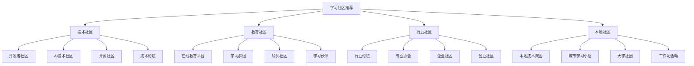

# 学习社区推荐

## 🎯 核心定义

### 什么是学习社区推荐？
学习社区推荐是指为提示词工程学习者推荐优质的学习社区、论坛、群组和平台，帮助学习者找到合适的学习环境，与其他学习者交流经验，获得学习支持和指导。

### 核心价值
- **学习支持**：获得学习帮助和指导
- **经验分享**：分享学习经验和心得
- **问题解决**：解决学习中的问题
- **人脉建立**：建立学习人脉和合作关系

## 📊 社区分类框架



## 💻 技术社区

### 1. 开发者社区
| 社区名称 | 社区类型 | 主要特色 | 活跃度 | 推荐指数 |
|----------|----------|----------|--------|----------|
| **GitHub** | 开源社区 | 代码分享、项目协作 | 极高 | ⭐⭐⭐⭐⭐ |
| **Stack Overflow** | 技术问答 | 技术问题解答 | 极高 | ⭐⭐⭐⭐⭐ |
| **Reddit** | 综合社区 | 技术讨论、资源分享 | 高 | ⭐⭐⭐⭐ |
| **Dev.to** | 开发者博客 | 技术文章、经验分享 | 高 | ⭐⭐⭐⭐ |

#### GitHub社区详解
```markdown
# GitHub社区

## 社区概述
- 社区名称：GitHub
- 社区类型：开源社区
- 主要特色：代码分享、项目协作
- 活跃度：极高
- 推荐指数：⭐⭐⭐⭐⭐

## 核心功能
### 1. 代码托管
- **功能描述**：托管和管理代码仓库
- **应用场景**：项目开发、版本控制、代码备份
- **技术特点**：Git版本控制、分支管理、合并请求
- **使用限制**：免费版有存储和协作限制

### 2. 项目协作
- **功能描述**：多人协作开发项目
- **应用场景**：团队开发、开源项目、代码审查
- **技术特点**：Issue跟踪、Pull Request、代码审查
- **使用限制**：需要Git知识，协作人数有限制

### 3. 开源生态
- **功能描述**：参与开源项目，贡献代码
- **应用场景**：学习开源项目、贡献代码、建立声誉
- **技术特点**：Fork、Star、Watch、Contributors
- **使用限制**：需要一定的编程能力

### 4. 学习资源
- **功能描述**：发现和学习优秀项目
- **应用场景**：技术学习、项目参考、最佳实践
- **技术特点**：项目搜索、标签分类、趋势分析
- **使用限制**：需要筛选和判断项目质量

## 使用指南
### 1. 注册和设置
- **注册流程**：
  1. 访问GitHub官网
  2. 创建账户
  3. 验证邮箱
  4. 设置个人资料
  5. 配置SSH密钥

- **基本设置**：
  - 设置个人资料
  - 配置通知偏好
  - 设置隐私选项
  - 安装Git客户端

### 2. 项目创建
- **创建仓库**：
  1. 点击"New repository"
  2. 设置仓库名称
  3. 选择公开或私有
  4. 添加README文件
  5. 选择许可证

- **项目结构**：
  - README.md：项目说明
  - LICENSE：开源许可证
  - .gitignore：忽略文件
  - 源代码目录
  - 文档目录

### 3. 协作开发
- **Fork项目**：
  1. 找到感兴趣的项目
  2. 点击"Fork"按钮
  3. 克隆到本地
  4. 创建分支
  5. 提交更改

- **Pull Request**：
  1. 推送更改到分支
  2. 创建Pull Request
  3. 描述更改内容
  4. 等待代码审查
  5. 合并到主分支

### 4. 学习资源
- **探索项目**：
  1. 使用搜索功能
  2. 浏览趋势项目
  3. 关注技术标签
  4. 查看项目文档
  5. 学习代码实现

- **参与社区**：
  1. 关注感兴趣的项目
  2. 参与Issue讨论
  3. 贡献代码
  4. 分享经验
  5. 建立声誉

## 学习价值
### 1. 技术学习
- **代码阅读**：学习优秀代码实现
- **最佳实践**：了解行业最佳实践
- **技术趋势**：跟踪技术发展趋势
- **问题解决**：学习问题解决方法

### 2. 项目经验
- **项目参与**：参与开源项目开发
- **协作经验**：学习团队协作技能
- **版本控制**：掌握Git版本控制
- **代码审查**：学习代码审查流程

### 3. 职业发展
- **作品展示**：展示个人技术能力
- **网络建立**：建立技术人脉
- **声誉建立**：建立技术声誉
- **机会获得**：获得工作机会

### 4. 社区贡献
- **知识分享**：分享技术知识
- **问题解答**：帮助他人解决问题
- **项目贡献**：贡献开源项目
- **社区建设**：参与社区建设

## 最佳实践
### 1. 项目管理
- **清晰文档**：编写清晰的项目文档
- **合理结构**：组织合理的项目结构
- **版本控制**：使用规范的版本控制
- **持续更新**：保持项目持续更新

### 2. 协作规范
- **提交规范**：使用规范的提交信息
- **代码质量**：保证代码质量
- **及时响应**：及时响应Issue和PR
- **友好沟通**：保持友好的沟通态度

### 3. 学习策略
- **选择项目**：选择适合的项目学习
- **循序渐进**：从简单项目开始
- **积极参与**：积极参与社区活动
- **持续学习**：持续学习新技术

### 4. 社区参与
- **关注项目**：关注感兴趣的项目
- **参与讨论**：参与技术讨论
- **分享经验**：分享学习经验
- **帮助他人**：帮助其他开发者

## 注意事项
### 1. 安全使用
- **保护隐私**：注意个人信息保护
- **代码安全**：避免提交敏感信息
- **权限管理**：合理设置仓库权限
- **备份重要**：备份重要代码

### 2. 合理使用
- **遵守规则**：遵守社区规则
- **尊重他人**：尊重其他开发者
- **质量优先**：注重代码质量
- **持续改进**：持续改进技能

### 3. 学习规划
- **明确目标**：明确学习目标
- **制定计划**：制定学习计划
- **跟踪进度**：跟踪学习进度
- **调整策略**：根据情况调整策略

## 相关链接
- 官方网站：https://github.com
- 学习指南：https://docs.github.com
- 社区论坛：https://github.community
- 开源项目：https://github.com/explore
```

### 2. AI技术社区
| 社区名称 | 社区类型 | 主要特色 | 活跃度 | 推荐指数 |
|----------|----------|----------|--------|----------|
| **Hugging Face** | AI模型社区 | 模型分享、数据集、工具 | 高 | ⭐⭐⭐⭐⭐ |
| **OpenAI Community** | AI技术社区 | 技术讨论、产品更新 | 高 | ⭐⭐⭐⭐ |
| **AI Research** | 学术社区 | 论文分享、研究讨论 | 中 | ⭐⭐⭐⭐ |
| **Machine Learning** | 机器学习社区 | 算法讨论、实践分享 | 高 | ⭐⭐⭐⭐ |

## 🎓 教育社区

### 1. 在线教育平台
| 平台名称 | 平台类型 | 主要特色 | 课程质量 | 推荐指数 |
|----------|----------|----------|----------|----------|
| **Coursera** | 在线教育 | 大学课程、专业认证 | 高 | ⭐⭐⭐⭐⭐ |
| **edX** | 在线教育 | 名校课程、微学位 | 高 | ⭐⭐⭐⭐⭐ |
| **Udemy** | 在线教育 | 实用课程、技能培训 | 中 | ⭐⭐⭐⭐ |
| **Khan Academy** | 免费教育 | 基础课程、完全免费 | 中 | ⭐⭐⭐⭐ |

#### Coursera平台详解
```markdown
# Coursera平台

## 平台概述
- 平台名称：Coursera
- 平台类型：在线教育
- 主要特色：大学课程、专业认证
- 课程质量：高
- 推荐指数：⭐⭐⭐⭐⭐

## 核心功能
### 1. 课程学习
- **功能描述**：在线学习各种课程
- **应用场景**：技能提升、知识学习、职业发展
- **技术特点**：视频教学、作业练习、讨论论坛
- **使用限制**：部分课程需要付费

### 2. 专业认证
- **功能描述**：获得专业认证证书
- **应用场景**：职业认证、技能证明、简历提升
- **技术特点**：项目作业、同行评审、最终考试
- **使用限制**：需要完成所有课程要求

### 3. 学位项目
- **功能描述**：在线获得学位
- **应用场景**：学历提升、职业转换、学术发展
- **技术特点**：系统化学习、导师指导、学位认证
- **使用限制**：需要满足入学要求

### 4. 企业培训
- **功能描述**：为企业提供培训服务
- **应用场景**：员工培训、技能提升、组织发展
- **技术特点**：定制化课程、进度跟踪、效果评估
- **使用限制**：需要企业账户

## 使用指南
### 1. 注册和设置
- **注册流程**：
  1. 访问Coursera官网
  2. 创建账户
  3. 验证邮箱
  4. 设置学习偏好
  5. 选择学习计划

- **基本设置**：
  - 设置个人资料
  - 选择学习语言
  - 设置通知偏好
  - 配置支付方式

### 2. 课程选择
- **搜索课程**：
  1. 使用搜索功能
  2. 浏览课程分类
  3. 查看课程详情
  4. 阅读课程评价
  5. 选择适合的课程

- **课程信息**：
  - 课程简介
  - 学习目标
  - 课程大纲
  - 讲师介绍
  - 学习时长

### 3. 学习过程
- **视频学习**：
  1. 观看课程视频
  2. 做笔记
  3. 参与讨论
  4. 完成作业
  5. 参加考试

- **作业练习**：
  - 编程作业
  - 论文写作
  - 项目实践
  - 同行评审
  - 最终考试

### 4. 认证获得
- **完成要求**：
  1. 完成所有课程
  2. 通过所有作业
  3. 参加最终考试
  4. 达到及格分数
  5. 申请证书

- **证书类型**：
  - 课程完成证书
  - 专业认证证书
  - 学位证书
  - 企业培训证书

## 学习价值
### 1. 知识学习
- **系统学习**：系统学习专业知识
- **前沿知识**：了解最新技术发展
- **实践技能**：获得实际应用技能
- **理论基础**：建立扎实的理论基础

### 2. 职业发展
- **技能提升**：提升职业技能
- **认证获得**：获得行业认证
- **简历提升**：提升简历竞争力
- **职业转换**：支持职业转换

### 3. 网络建立
- **同学网络**：建立同学网络
- **导师关系**：建立导师关系
- **行业联系**：建立行业联系
- **合作机会**：获得合作机会

### 4. 个人成长
- **学习能力**：提升学习能力
- **时间管理**：改善时间管理
- **自律能力**：增强自律能力
- **自信心**：提升自信心

## 最佳实践
### 1. 学习规划
- **明确目标**：明确学习目标
- **制定计划**：制定学习计划
- **时间安排**：合理安排学习时间
- **进度跟踪**：跟踪学习进度

### 2. 学习方法
- **主动学习**：主动参与学习
- **实践应用**：注重实践应用
- **讨论交流**：积极参与讨论
- **持续复习**：定期复习巩固

### 3. 作业完成
- **认真对待**：认真对待作业
- **及时提交**：及时提交作业
- **质量保证**：保证作业质量
- **反馈学习**：从反馈中学习

### 4. 社区参与
- **论坛讨论**：参与论坛讨论
- **帮助他人**：帮助其他学习者
- **分享经验**：分享学习经验
- **建立联系**：建立学习联系

## 注意事项
### 1. 时间管理
- **合理安排**：合理安排学习时间
- **避免拖延**：避免学习拖延
- **保持节奏**：保持学习节奏
- **灵活调整**：根据情况灵活调整

### 2. 学习质量
- **专注学习**：专注学习过程
- **理解深入**：深入理解内容
- **实践应用**：注重实践应用
- **持续改进**：持续改进学习方法

### 3. 成本控制
- **合理选择**：合理选择付费课程
- **充分利用**：充分利用免费资源
- **预算管理**：管理学习预算
- **价值评估**：评估学习价值

## 相关链接
- 官方网站：https://coursera.org
- 课程目录：https://coursera.org/browse
- 帮助中心：https://learner.coursera.help
- 社区论坛：https://coursera.orgmunity
```

### 2. 学习群组
| 群组名称 | 群组类型 | 主要特色 | 活跃度 | 推荐指数 |
|----------|----------|----------|--------|----------|
| **Discord学习群** | 即时通讯 | 实时交流、语音讨论 | 高 | ⭐⭐⭐⭐ |
| **Slack工作区** | 团队协作 | 项目协作、知识分享 | 中 | ⭐⭐⭐⭐ |
| **Telegram群组** | 即时通讯 | 资源分享、问题讨论 | 高 | ⭐⭐⭐⭐ |
| **微信群组** | 即时通讯 | 本地交流、线下活动 | 中 | ⭐⭐⭐ |

## 🏢 行业社区

### 1. 行业论坛
| 论坛名称 | 论坛类型 | 主要特色 | 活跃度 | 推荐指数 |
|----------|----------|----------|--------|----------|
| **Product Hunt** | 产品社区 | 新产品发现、产品讨论 | 高 | ⭐⭐⭐⭐ |
| **Hacker News** | 技术新闻 | 技术新闻、创业讨论 | 高 | ⭐⭐⭐⭐ |
| **Indie Hackers** | 创业社区 | 独立开发者、创业经验 | 中 | ⭐⭐⭐⭐ |
| **Growth Hackers** | 增长社区 | 增长策略、营销技巧 | 中 | ⭐⭐⭐ |

### 2. 专业协会
| 协会名称 | 协会类型 | 主要特色 | 活跃度 | 推荐指数 |
|----------|----------|----------|--------|----------|
| **ACM** | 计算机协会 | 学术研究、技术标准 | 中 | ⭐⭐⭐⭐ |
| **IEEE** | 电气电子协会 | 技术标准、学术期刊 | 中 | ⭐⭐⭐⭐ |
| **AIAA** | 人工智能协会 | AI研究、技术交流 | 中 | ⭐⭐⭐⭐ |
| **PMI** | 项目管理协会 | 项目管理、认证培训 | 中 | ⭐⭐⭐⭐ |

## 🌍 本地社区

### 1. 本地技术聚会
| 聚会名称 | 聚会类型 | 主要特色 | 活跃度 | 推荐指数 |
|----------|----------|----------|--------|----------|
| **Meetup** | 本地聚会 | 技术分享、网络建立 | 中 | ⭐⭐⭐⭐ |
| **Eventbrite** | 活动平台 | 技术活动、工作坊 | 中 | ⭐⭐⭐⭐ |
| **本地技术圈** | 本地社区 | 技术交流、项目合作 | 中 | ⭐⭐⭐⭐ |
| **大学技术社团** | 学术社团 | 学术交流、研究合作 | 中 | ⭐⭐⭐⭐ |

### 2. 城市学习小组
| 小组名称 | 小组类型 | 主要特色 | 活跃度 | 推荐指数 |
|----------|----------|----------|--------|----------|
| **城市AI小组** | 专业小组 | AI技术、应用讨论 | 中 | ⭐⭐⭐⭐ |
| **本地开发者** | 开发者小组 | 技术分享、项目协作 | 中 | ⭐⭐⭐⭐ |
| **创业咖啡** | 创业小组 | 创业交流、资源分享 | 中 | ⭐⭐⭐⭐ |
| **技术读书会** | 学习小组 | 技术书籍、知识分享 | 中 | ⭐⭐⭐⭐ |

## 🎓 学习要点

### 核心理解
- 学习社区是学习的重要资源
- 选择合适的社区能提高学习效率
- 积极参与社区活动能获得更多收获
- 建立学习网络对职业发展很重要

### 实践建议
- 根据学习目标选择合适的社区
- 积极参与社区讨论和活动
- 分享学习经验和心得
- 建立和维护学习网络

## 🔗 相关链接
- [[08-2-专家资源链接]] - 查看专家资源
- [[08-3-讨论话题集]] - 查看讨论话题
- [[08-4-学习伙伴匹配]] - 寻找学习伙伴
- [[00-学习导航]] - 返回学习导航
