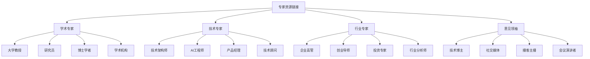

# 专家资源链接

## 🎯 核心定义

### 什么是专家资源链接？
专家资源链接是指收集和整理提示词工程领域的专家、学者、从业者和意见领袖的资源信息，包括他们的个人网站、社交媒体、博客、论文、演讲等，为学习者提供权威的学习资源和指导。

### 核心价值
- **权威指导**：获得专家的权威指导
- **前沿知识**：了解最新的技术发展
- **实践经验**：学习专家的实践经验
- **网络建立**：建立与专家的联系

## 📊 专家分类框架



## 🎓 学术专家

### 1. 大学教授
| 专家姓名 | 所属机构 | 研究领域 | 主要贡献 | 推荐指数 |
|----------|----------|----------|----------|----------|
| **Andrew Ng** | Stanford University | 机器学习、AI教育 | Coursera创始人、深度学习课程 | ⭐⭐⭐⭐⭐ |
| **Yann LeCun** | New York University | 深度学习、计算机视觉 | CNN之父、Facebook AI研究 | ⭐⭐⭐⭐⭐ |
| **Geoffrey Hinton** | University of Toronto | 深度学习、神经网络 | 深度学习先驱、反向传播算法 | ⭐⭐⭐⭐⭐ |
| **Fei-Fei Li** | Stanford University | 计算机视觉、AI伦理 | ImageNet项目、AI+医疗 | ⭐⭐⭐⭐⭐ |

#### Andrew Ng专家资源详解
```markdown
# Andrew Ng专家资源

## 专家概述
- 专家姓名：Andrew Ng（吴恩达）
- 所属机构：Stanford University
- 研究领域：机器学习、AI教育
- 主要贡献：Coursera创始人、深度学习课程
- 推荐指数：⭐⭐⭐⭐⭐

## 个人背景
### 1. 教育背景
- **本科**：Carnegie Mellon University（计算机科学）
- **硕士**：MIT（计算机科学）
- **博士**：UC Berkeley（计算机科学）
- **博士后**：Stanford University

### 2. 职业经历
- **Google**：Google Brain项目负责人
- **Baidu**：首席科学家
- **Stanford**：计算机科学教授
- **Coursera**：联合创始人
- **DeepLearning.AI**：创始人

### 3. 主要成就
- **学术贡献**：机器学习算法研究
- **教育贡献**：在线教育平台建设
- **产业贡献**：AI技术产业化
- **社会贡献**：AI教育普及

## 核心资源
### 1. 在线课程
- **Machine Learning Course**：
  - 平台：Coursera
  - 内容：机器学习基础课程
  - 特色：理论与实践结合
  - 链接：https://coursera.org/learn/machine-learning

- **Deep Learning Specialization**：
  - 平台：Coursera
  - 内容：深度学习专项课程
  - 特色：系统化深度学习学习
  - 链接：https://coursera.org/specializations/deep-learning

- **AI for Everyone**：
  - 平台：Coursera
  - 内容：AI普及课程
  - 特色：面向非技术人员的AI介绍
  - 链接：https://coursera.org/learn/ai-for-everyone

### 2. 学术论文
- **主要论文**：
  - "Learning Feature Representations with K-means"
  - "Sparse Autoencoder"
  - "Deep Learning for Computer Vision"
  - "Natural Language Processing with Deep Learning"

- **论文获取**：
  - Google Scholar：https://scholar.google.com/citations?user=4A_2F3sAAAAJ
  - Stanford Profile：https://profiles.stanford.edu/andrew-ng
  - ResearchGate：https://researchgate.net/profile/Andrew-Ng

### 3. 演讲和访谈
- **TED演讲**：
  - "How AI can save our humanity"
  - "The AI Revolution in Education"
  - "Machine Learning and AI"

- **会议演讲**：
  - NIPS/NeurIPS会议
  - ICML会议
  - ICLR会议
  - AAAI会议

- **媒体访谈**：
  - Bloomberg Technology
  - CNBC
  - Wired
  - MIT Technology Review

### 4. 社交媒体
- **Twitter**：@AndrewYNg
  - 内容：AI技术动态、教育观点
  - 更新频率：每日更新
  - 关注者：100万+

- **LinkedIn**：Andrew Ng
  - 内容：职业发展、行业观点
  - 更新频率：每周更新
  - 关注者：50万+

- **YouTube**：Andrew Ng
  - 内容：课程视频、演讲视频
  - 更新频率：定期更新
  - 订阅者：20万+

## 学习价值
### 1. 技术学习
- **理论基础**：扎实的机器学习理论基础
- **实践技能**：丰富的实践经验
- **前沿知识**：了解最新技术发展
- **学习方法**：科学的学习方法

### 2. 职业发展
- **职业规划**：AI职业发展指导
- **技能提升**：技术技能提升建议
- **行业洞察**：行业发展趋势分析
- **机会把握**：职业机会把握

### 3. 教育理念
- **在线教育**：在线教育理念和实践
- **学习方法**：有效的学习方法
- **知识传播**：知识传播和分享
- **教育创新**：教育模式创新

### 4. 社会影响
- **AI普及**：AI技术普及和推广
- **教育公平**：教育公平和普及
- **技术伦理**：AI技术伦理思考
- **社会责任**：技术社会责任

## 关注建议
### 1. 学习资源
- **课程学习**：系统学习其在线课程
- **论文阅读**：阅读其学术论文
- **演讲观看**：观看其演讲和访谈
- **社交媒体**：关注其社交媒体动态

### 2. 学习方法
- **系统学习**：系统学习机器学习知识
- **实践应用**：注重实践和应用
- **持续更新**：持续关注技术发展
- **知识分享**：分享学习心得

### 3. 职业发展
- **技能提升**：提升AI相关技能
- **项目实践**：参与实际项目
- **网络建立**：建立专业网络
- **持续学习**：持续学习和成长

### 4. 社会参与
- **技术普及**：参与AI技术普及
- **教育贡献**：贡献教育发展
- **伦理思考**：思考技术伦理
- **社会责任**：承担社会责任

## 相关链接
- 个人网站：https://andrewng.org
- Stanford Profile：https://profiles.stanford.edu/andrew-ng
- Coursera课程：https://coursera.org/instructor/andrewng
- Twitter：https://twitter.com/AndrewYNg
- LinkedIn：https://linkedin.com/in/andrewyng
- YouTube：https://youtube.com/user/andrewng
```

### 2. 研究员
| 专家姓名 | 所属机构 | 研究领域 | 主要贡献 | 推荐指数 |
|----------|----------|----------|----------|----------|
| **Ilya Sutskever** | OpenAI | 深度学习、大语言模型 | GPT系列模型、Transformer | ⭐⭐⭐⭐⭐ |
| **Dario Amodei** | Anthropic | AI安全、对齐研究 | Claude模型、AI安全 | ⭐⭐⭐⭐⭐ |
| **Oriol Vinyals** | Google DeepMind | 强化学习、游戏AI | AlphaGo、强化学习 | ⭐⭐⭐⭐⭐ |
| **Jeff Dean** | Google | 分布式系统、机器学习 | TensorFlow、Google Brain | ⭐⭐⭐⭐⭐ |

## 💻 技术专家

### 1. 技术架构师
| 专家姓名 | 所属机构 | 技术领域 | 主要贡献 | 推荐指数 |
|----------|----------|----------|----------|----------|
| **Martin Fowler** | ThoughtWorks | 软件架构、敏捷开发 | 重构、微服务架构 | ⭐⭐⭐⭐⭐ |
| **Robert C. Martin** | Clean Coders | 软件工程、设计模式 | 清洁代码、SOLID原则 | ⭐⭐⭐⭐⭐ |
| **Kent Beck** | Facebook | 软件开发、测试驱动 | 极限编程、TDD | ⭐⭐⭐⭐⭐ |
| **Eric Evans** | Domain Language | 领域驱动设计 | DDD、领域建模 | ⭐⭐⭐⭐⭐ |

### 2. AI工程师
| 专家姓名 | 所属机构 | 技术领域 | 主要贡献 | 推荐指数 |
|----------|----------|----------|----------|----------|
| **Jeremy Howard** | Fast.ai | 深度学习、AI教育 | Fast.ai课程、实用AI | ⭐⭐⭐⭐⭐ |
| **Sebastian Ruder** | DeepMind | 自然语言处理 | 迁移学习、NLP研究 | ⭐⭐⭐⭐⭐ |
| **Rachel Thomas** | Fast.ai | 深度学习、AI伦理 | 实用深度学习、AI伦理 | ⭐⭐⭐⭐⭐ |
| **Chris Olah** | Anthropic | 可解释AI、神经网络 | 神经网络可视化 | ⭐⭐⭐⭐⭐ |

## 🏢 行业专家

### 1. 企业高管
| 专家姓名 | 所属机构 | 专业领域 | 主要贡献 | 推荐指数 |
|----------|----------|----------|----------|----------|
| **Sam Altman** | OpenAI | AI产品、创业 | ChatGPT、AI产品化 | ⭐⭐⭐⭐⭐ |
| **Dario Amodei** | Anthropic | AI安全、产品 | Claude、AI安全研究 | ⭐⭐⭐⭐⭐ |
| **Demis Hassabis** | Google DeepMind | AI研究、游戏 | AlphaGo、AI研究 | ⭐⭐⭐⭐⭐ |
| **Yann LeCun** | Meta | 深度学习、AI研究 | CNN、AI研究 | ⭐⭐⭐⭐⭐ |

### 2. 创业导师
| 专家姓名 | 所属机构 | 专业领域 | 主要贡献 | 推荐指数 |
|----------|----------|----------|----------|----------|
| **Paul Graham** | Y Combinator | 创业、投资 | Y Combinator、创业指导 | ⭐⭐⭐⭐⭐ |
| **Marc Andreessen** | Andreessen Horowitz | 投资、技术 | 风险投资、技术趋势 | ⭐⭐⭐⭐⭐ |
| **Reid Hoffman** | LinkedIn | 创业、网络 | LinkedIn、创业网络 | ⭐⭐⭐⭐⭐ |
| **Peter Thiel** | Founders Fund | 投资、创业 | PayPal、创业哲学 | ⭐⭐⭐⭐⭐ |

## 📱 意见领袖

### 1. 技术博主
| 博主姓名 | 博客平台 | 专业领域 | 主要特色 | 推荐指数 |
|----------|----------|----------|----------|----------|
| **Andrej Karpathy** | karpathy.github.io | 深度学习、AI | 技术深度、实践指导 | ⭐⭐⭐⭐⭐ |
| **Christopher Olah** | distill.pub | 可解释AI | 可视化、深度分析 | ⭐⭐⭐⭐⭐ |
| **Jeremy Howard** | fast.ai | 深度学习 | 实用导向、教育价值 | ⭐⭐⭐⭐⭐ |
| **Sebastian Ruder** | ruder.io | 自然语言处理 | 研究前沿、技术趋势 | ⭐⭐⭐⭐⭐ |

### 2. 社交媒体
| 专家姓名 | 社交媒体 | 专业领域 | 主要特色 | 推荐指数 |
|----------|----------|----------|----------|----------|
| **Andrew Ng** | Twitter | AI教育 | 教育观点、技术动态 | ⭐⭐⭐⭐⭐ |
| **Yann LeCun** | Twitter | 深度学习 | 技术观点、研究动态 | ⭐⭐⭐⭐⭐ |
| **Geoffrey Hinton** | Twitter | 深度学习 | 学术观点、技术趋势 | ⭐⭐⭐⭐⭐ |
| **Fei-Fei Li** | Twitter | 计算机视觉 | 技术伦理、社会影响 | ⭐⭐⭐⭐⭐ |

## 🎓 学习要点

### 核心理解
- 专家资源是学习的重要指导
- 关注专家动态能了解前沿发展
- 学习专家经验能提升实践能力
- 建立专家联系能获得更多机会

### 实践建议
- 选择适合的专家关注
- 系统学习专家的资源
- 积极参与专家互动
- 建立和维护专家关系

## 🔗 相关链接
- [[08-1-学习社区推荐]] - 查看学习社区
- [[08-3-讨论话题集]] - 查看讨论话题
- [[08-4-学习伙伴匹配]] - 寻找学习伙伴
- [[00-学习导航]] - 返回学习导航
