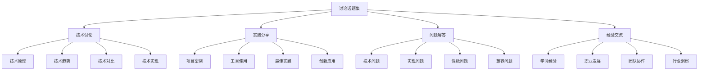

# 讨论话题集

## 🎯 核心定义

### 什么是讨论话题集？
讨论话题集是指收集和整理提示词工程领域的讨论话题，包括技术讨论、实践分享、问题解答、经验交流等，为学习者提供丰富的讨论素材和交流机会。

### 核心价值
- **知识交流**：促进知识交流和分享
- **问题解决**：帮助解决实际问题
- **经验分享**：分享实践经验
- **网络建立**：建立学习网络

## 📊 话题分类框架



## 🔧 技术讨论

### 1. 技术原理讨论

#### 话题1：提示词工程的核心原理
```markdown
# 提示词工程的核心原理讨论

## 讨论背景
提示词工程作为AI应用的重要技术，其核心原理的理解对于实际应用至关重要。

## 核心问题
1. **什么是提示词工程？**
   - 定义和范围
   - 与传统编程的区别
   - 在AI系统中的作用

2. **提示词工程的基本原理**
   - 语言模型的工作原理
   - 提示词如何影响模型输出
   - 上下文理解机制

3. **提示词设计的核心要素**
   - 角色设定（Role）
   - 任务描述（Task）
   - 上下文信息（Context）
   - 输出格式（Format）
   - 约束条件（Constraints）

## 讨论要点
### 1. 理论基础
- **认知科学角度**：人类语言理解机制
- **计算机科学角度**：自然语言处理技术
- **心理学角度**：认知负荷理论
- **教育学角度**：学习理论

### 2. 技术实现
- **模型架构**：Transformer架构
- **训练方法**：预训练和微调
- **推理机制**：生成和推理过程
- **优化技术**：提示词优化方法

### 3. 实践应用
- **文本生成**：创意写作、内容创作
- **问答系统**：智能客服、知识问答
- **代码生成**：编程辅助、代码优化
- **数据分析**：数据解读、报告生成

## 讨论方向
### 1. 深度探讨
- 提示词工程的本质是什么？
- 如何理解提示词与模型的关系？
- 提示词设计的原则和技巧？

### 2. 实践应用
- 如何设计有效的提示词？
- 如何评估提示词的效果？
- 如何优化提示词的性能？

### 3. 前沿发展
- 提示词工程的发展趋势？
- 新技术对提示词工程的影响？
- 未来的发展方向？

## 参与方式
- **论坛讨论**：在技术论坛参与讨论
- **群组交流**：加入技术交流群组
- **会议分享**：在技术会议分享观点
- **博客写作**：撰写技术博客文章

## 相关资源
- 技术论文和研究报告
- 开源项目和代码示例
- 在线课程和教程
- 专家演讲和访谈
```

#### 话题2：大语言模型的工作原理
```markdown
# 大语言模型的工作原理讨论

## 讨论背景
大语言模型是提示词工程的基础，理解其工作原理对于设计有效提示词至关重要。

## 核心问题
1. **模型架构**
   - Transformer架构
   - 注意力机制
   - 编码器-解码器结构

2. **训练过程**
   - 预训练阶段
   - 微调阶段
   - 强化学习阶段

3. **推理机制**
   - 生成过程
   - 概率计算
   - 输出选择

## 讨论要点
### 1. 技术细节
- **注意力机制**：自注意力和交叉注意力
- **位置编码**：绝对位置和相对位置
- **层归一化**：LayerNorm和BatchNorm
- **残差连接**：跳跃连接和梯度流

### 2. 训练策略
- **数据预处理**：文本清洗和格式化
- **损失函数**：交叉熵和KL散度
- **优化器**：Adam和AdamW
- **学习率调度**：线性衰减和余弦退火

### 3. 推理优化
- **采样策略**：贪心搜索和束搜索
- **温度控制**：创造性vs一致性
- **长度惩罚**：重复惩罚和长度奖励
- **停止条件**：结束标记和长度限制

## 讨论方向
### 1. 技术理解
- 如何理解注意力机制？
- 位置编码的作用是什么？
- 层归一化的原理？

### 2. 实践应用
- 如何选择合适的模型？
- 如何优化推理性能？
- 如何控制生成质量？

### 3. 前沿研究
- 新的模型架构？
- 训练方法的改进？
- 推理效率的提升？

## 参与方式
- **技术论坛**：参与技术讨论
- **学术会议**：分享研究成果
- **开源项目**：贡献代码和想法
- **技术博客**：撰写技术文章

## 相关资源
- 学术论文和技术报告
- 开源模型和代码
- 在线教程和课程
- 技术博客和文章
```

### 2. 技术趋势讨论

#### 话题3：AI技术发展趋势
```markdown
# AI技术发展趋势讨论

## 讨论背景
AI技术快速发展，了解技术趋势对于把握发展方向和机会至关重要。

## 核心问题
1. **技术发展方向**
   - 模型规模的增长
   - 多模态能力的发展
   - 推理能力的提升

2. **应用领域扩展**
   - 垂直领域的应用
   - 跨领域融合
   - 新兴应用场景

3. **技术挑战**
   - 计算资源需求
   - 数据隐私保护
   - 模型可解释性

## 讨论要点
### 1. 技术趋势
- **模型规模**：从GPT-3到GPT-4的规模增长
- **多模态**：文本、图像、音频的融合
- **推理能力**：逻辑推理和数学推理
- **效率优化**：模型压缩和加速

### 2. 应用趋势
- **垂直领域**：医疗、教育、金融等
- **跨领域融合**：AI+IoT、AI+区块链
- **新兴场景**：元宇宙、数字人、智能体
- **社会影响**：就业、教育、医疗

### 3. 挑战与机遇
- **技术挑战**：计算成本、数据质量
- **伦理挑战**：偏见、隐私、安全
- **商业机遇**：新产品、新服务
- **社会机遇**：效率提升、创新驱动

## 讨论方向
### 1. 技术预测
- 未来5年AI技术发展方向？
- 哪些技术将产生重大影响？
- 技术瓶颈如何突破？

### 2. 应用展望
- 哪些领域将率先应用？
- 新的商业模式是什么？
- 社会影响如何？

### 3. 策略思考
- 如何把握技术趋势？
- 如何应对技术挑战？
- 如何抓住发展机遇？

## 参与方式
- **行业会议**：参与行业讨论
- **研究报告**：发布趋势分析
- **媒体访谈**：分享专业观点
- **社交媒体**：讨论热点话题

## 相关资源
- 行业报告和研究
- 技术博客和文章
- 会议演讲和访谈
- 专家观点和分析
```

## 💼 实践分享

### 1. 项目案例分享

#### 话题4：提示词工程项目实践
```markdown
# 提示词工程项目实践分享

## 分享背景
通过实际项目案例分享，学习提示词工程的最佳实践和经验教训。

## 项目案例
### 案例1：智能客服系统
#### 项目概述
- **项目目标**：构建智能客服系统
- **技术栈**：GPT-3.5、Python、FastAPI
- **项目周期**：3个月
- **团队规模**：5人

#### 技术实现
- **提示词设计**：
  ```
  你是一个专业的客服代表，具有以下特点：
  1. 友好、耐心、专业
  2. 能够理解客户问题
  3. 提供准确、有用的回答
  4. 在无法解决时及时转接人工
  
  请根据客户问题提供帮助。
  ```

- **系统架构**：
  - 前端：React + TypeScript
  - 后端：FastAPI + Python
  - 数据库：PostgreSQL
  - 缓存：Redis
  - 消息队列：RabbitMQ

#### 关键挑战
1. **提示词优化**
   - 问题：回答不够准确
   - 解决：增加具体场景和示例
   - 效果：准确率提升30%

2. **响应速度**
   - 问题：响应时间过长
   - 解决：优化提示词长度和结构
   - 效果：响应时间减少50%

3. **错误处理**
   - 问题：异常情况处理不当
   - 解决：增加错误处理提示词
   - 效果：错误率降低80%

#### 经验教训
- **提示词设计**：简洁明了，包含具体示例
- **系统架构**：模块化设计，便于扩展
- **测试验证**：充分测试，确保质量
- **用户反馈**：持续收集，不断优化

### 案例2：内容创作助手
#### 项目概述
- **项目目标**：开发内容创作助手
- **技术栈**：GPT-4、Node.js、MongoDB
- **项目周期**：2个月
- **团队规模**：3人

#### 技术实现
- **提示词设计**：
  ```
  你是一个专业的内容创作助手，擅长：
  1. 分析目标受众
  2. 制定内容策略
  3. 创作高质量内容
  4. 优化内容结构
  
  请根据用户需求创作内容。
  ```

- **功能模块**：
  - 内容分析：分析目标受众和需求
  - 内容生成：生成不同类型的内容
  - 内容优化：优化内容质量和结构
  - 内容管理：管理内容版本和历史

#### 关键挑战
1. **内容质量**
   - 问题：生成内容质量不稳定
   - 解决：增加质量评估和优化步骤
   - 效果：质量评分提升40%

2. **创意多样性**
   - 问题：内容创意不够多样
   - 解决：使用不同的提示词模板
   - 效果：创意多样性提升60%

3. **用户个性化**
   - 问题：无法满足个性化需求
   - 解决：增加用户画像和偏好设置
   - 效果：用户满意度提升50%

#### 经验教训
- **内容质量**：建立质量评估体系
- **创意创新**：保持创意多样性
- **用户需求**：深入了解用户需求
- **持续优化**：基于反馈持续改进

## 分享要点
### 1. 技术实现
- 提示词设计技巧
- 系统架构设计
- 性能优化方法
- 错误处理策略

### 2. 项目管理
- 项目规划和管理
- 团队协作和沟通
- 风险识别和控制
- 质量保证和测试

### 3. 经验总结
- 成功因素分析
- 失败教训总结
- 最佳实践提炼
- 改进建议提出

## 参与方式
- **项目分享**：分享自己的项目经验
- **案例学习**：学习他人的项目案例
- **经验交流**：交流项目经验和教训
- **合作机会**：寻找项目合作机会

## 相关资源
- 项目代码和文档
- 技术博客和文章
- 会议演讲和分享
- 开源项目和工具
```

### 2. 工具使用分享

#### 话题5：提示词工程工具使用
```markdown
# 提示词工程工具使用分享

## 分享背景
工具是提高效率的重要手段，分享工具使用经验能帮助大家更好地应用提示词工程。

## 工具分类
### 1. 在线平台
#### OpenAI Playground
- **功能特点**：
  - 实时测试提示词
  - 参数调整和优化
  - 结果对比和分析
  - 历史记录管理

- **使用技巧**：
  - 合理设置温度和top_p
  - 使用系统消息设定角色
  - 利用few-shot示例
  - 注意token限制

- **最佳实践**：
  - 先在小规模测试
  - 记录有效的提示词
  - 定期更新和优化
  - 注意成本控制

#### Anthropic Claude
- **功能特点**：
  - 强大的推理能力
  - 长文本处理
  - 代码生成和解释
  - 多轮对话支持

- **使用技巧**：
  - 利用长上下文优势
  - 使用结构化输出
  - 注意安全限制
  - 优化提示词长度

- **最佳实践**：
  - 明确任务目标
  - 提供充分上下文
  - 使用合适的格式
  - 验证输出质量

### 2. 本地工具
#### LangChain
- **功能特点**：
  - 链式调用支持
  - 多种模型集成
  - 工具和代理支持
  - 内存管理功能

- **使用技巧**：
  - 合理设计链式结构
  - 使用合适的记忆类型
  - 集成外部工具
  - 处理异常情况

- **最佳实践**：
  - 模块化设计
  - 错误处理完善
  - 性能监控
  - 文档完善

#### AutoGPT
- **功能特点**：
  - 自主任务执行
  - 目标分解能力
  - 工具使用能力
  - 学习适应能力

- **使用技巧**：
  - 明确任务目标
  - 设置合理约束
  - 监控执行过程
  - 及时干预调整

- **最佳实践**：
  - 安全第一原则
  - 逐步增加复杂度
  - 记录执行日志
  - 定期评估效果

### 3. 开发工具
#### Prompt Engineering IDE
- **功能特点**：
  - 提示词编辑器
  - 版本控制
  - 测试和评估
  - 团队协作

- **使用技巧**：
  - 使用模板功能
  - 建立测试用例
  - 版本管理规范
  - 团队协作流程

- **最佳实践**：
  - 标准化命名
  - 文档化说明
  - 定期备份
  - 权限管理

## 使用经验
### 1. 工具选择
- **需求分析**：明确使用需求
- **功能对比**：对比不同工具功能
- **成本考虑**：考虑使用成本
- **学习成本**：评估学习难度

### 2. 使用技巧
- **参数调优**：合理调整参数
- **提示词优化**：持续优化提示词
- **错误处理**：完善错误处理
- **性能监控**：监控使用性能

### 3. 最佳实践
- **安全使用**：注意安全风险
- **成本控制**：合理控制成本
- **质量保证**：确保输出质量
- **持续改进**：持续优化改进

## 分享要点
### 1. 工具介绍
- 工具功能特点
- 适用场景分析
- 优缺点对比
- 使用建议

### 2. 使用经验
- 实际操作技巧
- 常见问题解决
- 性能优化方法
- 最佳实践总结

### 3. 案例分享
- 实际使用案例
- 效果评估分析
- 经验教训总结
- 改进建议提出

## 参与方式
- **工具分享**：分享工具使用经验
- **问题解答**：解答工具使用问题
- **技巧交流**：交流使用技巧
- **工具推荐**：推荐好用的工具

## 相关资源
- 工具官方文档
- 使用教程和指南
- 社区讨论和分享
- 开源项目和代码
```

## ❓ 问题解答

### 1. 技术问题

#### 话题6：提示词工程常见问题
```markdown
# 提示词工程常见问题解答

## 问题分类
### 1. 基础问题
#### Q1：什么是提示词工程？
**A：** 提示词工程是设计和优化输入提示词的技术，用于引导AI模型生成期望的输出。它涉及理解模型工作原理、设计有效提示词、优化输出质量等方面。

#### Q2：提示词工程与传统编程有什么区别？
**A：** 
- **传统编程**：通过代码指令控制程序执行
- **提示词工程**：通过自然语言引导AI模型行为
- **控制方式**：代码vs自然语言
- **调试方法**：代码调试vs提示词优化
- **学习曲线**：编程语言vs自然语言理解

#### Q3：如何开始学习提示词工程？
**A：** 
1. **基础知识**：了解AI和自然语言处理基础
2. **实践练习**：使用在线平台进行实践
3. **理论学习**：学习相关理论和原理
4. **项目实践**：参与实际项目
5. **持续学习**：关注技术发展和最佳实践

### 2. 技术问题
#### Q4：如何设计有效的提示词？
**A：** 
1. **明确目标**：清楚定义期望的输出
2. **设定角色**：为AI设定合适的角色
3. **提供上下文**：给出充分的背景信息
4. **指定格式**：明确输出格式要求
5. **添加约束**：设置必要的限制条件
6. **测试优化**：不断测试和优化

#### Q5：如何评估提示词的效果？
**A：** 
1. **质量评估**：评估输出内容的质量
2. **准确性评估**：检查输出是否准确
3. **一致性评估**：测试输出的一致性
4. **效率评估**：评估生成效率
5. **成本评估**：考虑使用成本
6. **用户反馈**：收集用户反馈

#### Q6：如何处理提示词过长的问题？
**A：** 
1. **精简内容**：删除不必要的信息
2. **结构化组织**：使用结构化格式
3. **分步处理**：将复杂任务分解
4. **使用引用**：引用外部信息
5. **压缩技术**：使用文本压缩技术
6. **模型选择**：选择支持长文本的模型

### 3. 实践问题
#### Q7：如何提高提示词的稳定性？
**A：** 
1. **明确约束**：设置明确的约束条件
2. **使用模板**：使用标准化的模板
3. **添加示例**：提供few-shot示例
4. **参数调优**：调整温度和top_p参数
5. **错误处理**：添加错误处理机制
6. **持续监控**：监控输出质量

#### Q8：如何降低提示词工程成本？
**A：** 
1. **优化提示词**：减少不必要的token
2. **缓存结果**：缓存重复的查询结果
3. **批量处理**：批量处理相似任务
4. **模型选择**：选择性价比高的模型
5. **本地部署**：使用本地模型
6. **成本监控**：监控使用成本

#### Q9：如何保护提示词的知识产权？
**A：** 
1. **文档化**：详细记录提示词设计
2. **版本控制**：使用版本控制系统
3. **访问控制**：限制访问权限
4. **法律保护**：了解相关法律保护
5. **技术保护**：使用技术手段保护
6. **合同约定**：在合同中明确约定

### 4. 高级问题
#### Q10：如何实现提示词的自动化优化？
**A：** 
1. **评估指标**：建立评估指标体系
2. **优化算法**：使用优化算法
3. **A/B测试**：进行A/B测试
4. **机器学习**：使用机器学习方法
5. **反馈循环**：建立反馈循环机制
6. **持续改进**：持续改进和优化

#### Q11：如何处理多模态提示词？
**A：** 
1. **模态融合**：有效融合不同模态
2. **格式统一**：统一不同模态的格式
3. **上下文管理**：管理多模态上下文
4. **模型选择**：选择支持多模态的模型
5. **预处理**：对输入进行预处理
6. **后处理**：对输出进行后处理

#### Q12：如何实现提示词的个性化？
**A：** 
1. **用户画像**：建立用户画像
2. **偏好学习**：学习用户偏好
3. **动态调整**：动态调整提示词
4. **反馈机制**：建立反馈机制
5. **个性化模板**：使用个性化模板
6. **持续优化**：持续优化个性化效果

## 解答策略
### 1. 问题分析
- **问题类型**：识别问题类型
- **问题根源**：分析问题根源
- **影响范围**：评估影响范围
- **解决优先级**：确定解决优先级

### 2. 解决方案
- **技术方案**：提供技术解决方案
- **实践建议**：给出实践建议
- **工具推荐**：推荐相关工具
- **资源链接**：提供相关资源

### 3. 预防措施
- **最佳实践**：分享最佳实践
- **常见陷阱**：指出常见陷阱
- **注意事项**：提醒注意事项
- **持续改进**：建议持续改进

## 参与方式
- **问题提问**：提出技术问题
- **问题解答**：解答他人问题
- **经验分享**：分享解决经验
- **讨论交流**：参与问题讨论

## 相关资源
- 技术文档和教程
- 问题解答和FAQ
- 社区讨论和分享
- 专家建议和指导
```

## 💡 经验交流

### 1. 学习经验

#### 话题7：提示词工程学习经验
```markdown
# 提示词工程学习经验分享

## 学习路径
### 阶段1：基础认知（1-2周）
#### 学习目标
- 了解提示词工程基本概念
- 理解AI模型工作原理
- 掌握基本术语和概念

#### 学习内容
- **理论基础**：
  - 自然语言处理基础
  - 机器学习基础
  - 深度学习基础
  - 大语言模型原理

- **实践练习**：
  - 使用在线平台
  - 基础提示词练习
  - 简单任务实现
  - 结果分析评估

#### 学习资源
- 在线课程和教程
- 技术博客和文章
- 实践平台和工具
- 社区讨论和分享

#### 学习成果
- 掌握基本概念
- 能够设计简单提示词
- 理解模型工作原理
- 具备基础实践能力

### 阶段2：核心理解（2-3周）
#### 学习目标
- 深入理解提示词设计原理
- 掌握各种提示词模式
- 学会评估和优化方法

#### 学习内容
- **设计原理**：
  - 清晰性原则
  - 具体性原则
  - 上下文原则
  - 角色设定原则

- **模式模板**：
  - 零样本提示
  - 少样本提示
  - 思维链提示
  - 角色扮演提示

- **优化方法**：
  - 提示词优化技巧
  - 参数调优方法
  - 效果评估指标
  - 持续改进策略

#### 学习资源
- 专业书籍和论文
- 高级教程和课程
- 实践项目和案例
- 专家分享和指导

#### 学习成果
- 深入理解设计原理
- 掌握各种模式模板
- 具备优化和评估能力
- 能够解决复杂问题

### 阶段3：应用实践（3-4周）
#### 学习目标
- 应用提示词工程解决实际问题
- 掌握不同领域的应用方法
- 积累实践经验

#### 学习内容
- **基础应用**：
  - 文本生成应用
  - 问答系统应用
  - 内容创作应用
  - 代码生成应用

- **高级技巧**：
  - 多轮对话设计
  - 复杂任务分解
  - 错误处理优化
  - 性能调优技巧

- **行业案例**：
  - 教育领域案例
  - 商业分析案例
  - 创意写作案例
  - 技术开发案例

#### 学习资源
- 实际项目案例
- 行业应用报告
- 实践工具和平台
- 专家经验分享

#### 学习成果
- 具备实际应用能力
- 掌握不同领域应用
- 积累丰富实践经验
- 能够独立解决问题

### 阶段4：进阶优化（4-5周）
#### 学习目标
- 掌握高级技术和优化方法
- 了解评估测试和质量保证
- 熟悉工具平台和最佳实践

#### 学习内容
- **高级技术**：
  - 提示词链式设计
  - 动态提示词生成
  - 多模态提示词
  - 提示词版本管理

- **评估测试**：
  - 效果评估指标
  - A/B测试方法
  - 质量保证流程
  - 持续优化策略

- **工具平台**：
  - 主流AI平台对比
  - 提示词管理工具
  - 自动化测试工具
  - 最佳实践分享

#### 学习资源
- 高级技术文档
- 专业工具和平台
- 行业标准和规范
- 专家经验和建议

#### 学习成果
- 掌握高级技术
- 具备评估测试能力
- 熟悉工具平台
- 能够指导他人

### 阶段5：系统整合（5-6周）
#### 学习目标
- 整合所学知识形成体系
- 了解工程化实践和前沿趋势
- 建立完整的知识体系

#### 学习内容
- **工程化实践**：
  - 提示词工程流程
  - 团队协作规范
  - 文档知识管理
  - 质量管控体系

- **前沿趋势**：
  - 技术发展趋势
  - 新兴应用领域
  - 挑战与机遇
  - 未来展望

- **系统整合**：
  - 知识体系构建
  - 技能整合应用
  - 持续学习规划
  - 职业发展路径

#### 学习资源
- 系统化课程
- 综合实践项目
- 行业趋势报告
- 职业发展指导

#### 学习成果
- 形成完整知识体系
- 具备系统整合能力
- 了解前沿趋势
- 明确发展方向

## 学习经验分享
### 1. 学习方法
#### 理论与实践结合
- **理论学习**：系统学习理论知识
- **实践练习**：大量实践练习
- **项目应用**：参与实际项目
- **经验总结**：总结学习经验

#### 循序渐进
- **基础扎实**：打好基础
- **逐步深入**：逐步深入
- **系统学习**：系统学习
- **持续改进**：持续改进

#### 多维度学习
- **技术维度**：技术知识和技能
- **应用维度**：实际应用能力
- **思维维度**：思维方式和逻辑
- **实践维度**：实践经验和技巧

### 2. 学习技巧
#### 有效学习
- **目标明确**：设定明确学习目标
- **计划合理**：制定合理学习计划
- **方法科学**：使用科学学习方法
- **评估及时**：及时评估学习效果

#### 实践导向
- **项目驱动**：以项目驱动学习
- **问题导向**：以问题导向学习
- **应用导向**：以应用导向学习
- **结果导向**：以结果导向学习

#### 持续改进
- **反思总结**：定期反思总结
- **调整优化**：调整优化方法
- **持续学习**：持续学习新知识
- **分享交流**：分享交流经验

### 3. 学习资源
#### 官方资源
- **官方文档**：模型和平台官方文档
- **官方教程**：官方提供的教程
- **官方示例**：官方提供的示例
- **官方支持**：官方技术支持

#### 社区资源
- **技术论坛**：技术讨论论坛
- **开源项目**：开源项目和代码
- **博客文章**：技术博客和文章
- **视频教程**：在线视频教程

#### 专家资源
- **专家博客**：专家技术博客
- **学术论文**：相关学术论文
- **会议演讲**：技术会议演讲
- **在线课程**：专业在线课程

### 4. 学习挑战
#### 技术挑战
- **技术更新快**：技术更新速度快
- **知识面广**：需要掌握知识面广
- **实践要求高**：实践要求高
- **工具复杂**：工具使用复杂

#### 学习挑战
- **时间管理**：时间管理困难
- **学习方法**：学习方法不当
- **资源获取**：资源获取困难
- **实践机会**：实践机会有限

#### 解决方案
- **制定计划**：制定详细学习计划
- **选择方法**：选择合适学习方法
- **获取资源**：积极获取学习资源
- **创造机会**：创造实践机会

## 学习建议
### 1. 初学者建议
- **打好基础**：重视基础知识学习
- **多实践**：多进行实践练习
- **找导师**：寻找学习导师
- **加社区**：加入学习社区

### 2. 进阶者建议
- **深入理解**：深入理解技术原理
- **项目实践**：参与实际项目
- **经验分享**：分享学习经验
- **持续学习**：持续学习新知识

### 3. 专家建议
- **知识整合**：整合所学知识
- **经验总结**：总结实践经验
- **指导他人**：指导他人学习
- **贡献社区**：贡献社区发展

## 参与方式
- **经验分享**：分享学习经验
- **问题讨论**：讨论学习问题
- **资源推荐**：推荐学习资源
- **互助学习**：互助学习进步

## 相关资源
- 学习路径和计划
- 学习资源和工具
- 实践项目和案例
- 社区和导师资源
```

## 🎓 学习要点

### 核心理解
- 讨论话题是学习交流的重要载体
- 参与讨论能促进知识理解和应用
- 分享经验能帮助他人学习成长
- 建立讨论网络能获得更多支持

### 实践建议
- 积极参与相关话题讨论
- 分享自己的实践经验和见解
- 提出有价值的问题和观点
- 建立和维护讨论关系

## 🔗 相关链接
- [[08-1-学习社区推荐]] - 查看学习社区
- [[08-2-专家资源链接]] - 查看专家资源
- [[08-4-学习伙伴匹配]] - 寻找学习伙伴
- [[00-学习导航]] - 返回学习导航
