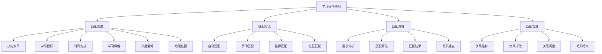

# 学习伙伴匹配

## 🎯 核心定义

### 什么是学习伙伴匹配？
学习伙伴匹配是指通过系统化的方法，帮助学习者找到合适的学习伙伴，建立学习合作关系，共同学习提示词工程知识，提高学习效果和效率。

### 核心价值
- **互助学习**：相互帮助，共同进步
- **知识互补**：知识互补，技能提升
- **动力激发**：相互激励，保持动力
- **网络建立**：建立学习网络

## 📊 匹配框架



## 🎯 匹配维度

### 1. 技能水平匹配

#### 技能水平分类
| 水平等级 | 技能描述 | 学习需求 | 匹配建议 |
|----------|----------|----------|----------|
| **初学者** | 基础概念理解，简单实践 | 基础学习，实践指导 | 与进阶者匹配 |
| **进阶者** | 深入理解，复杂应用 | 技能提升，项目实践 | 与专家或初学者匹配 |
| **专家** | 精通技术，创新应用 | 知识分享，指导他人 | 与进阶者匹配 |
| **导师** | 教学经验，行业专家 | 知识传播，人才培养 | 与所有水平匹配 |

#### 匹配策略
```markdown
# 技能水平匹配策略

## 匹配原则
### 1. 互补原则
- **初学者 + 进阶者**：初学者获得指导，进阶者巩固知识
- **进阶者 + 专家**：进阶者获得提升，专家分享经验
- **专家 + 导师**：专家获得认可，导师培养人才

### 2. 互助原则
- **同水平匹配**：相互学习，共同进步
- **跨水平匹配**：知识传递，技能提升
- **多水平匹配**：知识循环，技能传承

### 3. 成长原则
- **向上匹配**：挑战自我，快速成长
- **向下匹配**：巩固基础，提升能力
- **平行匹配**：相互激励，共同发展

## 匹配算法
### 1. 技能评估
- **自我评估**：学习者自我技能评估
- **测试评估**：通过测试评估技能水平
- **项目评估**：通过项目评估实际能力
- **同行评估**：同行相互评估

### 2. 匹配计算
- **相似度计算**：计算技能水平相似度
- **互补度计算**：计算技能互补程度
- **成长潜力**：评估成长潜力
- **匹配度评分**：综合评分匹配度

### 3. 匹配结果
- **最佳匹配**：匹配度最高的伙伴
- **备选匹配**：匹配度较高的备选
- **推荐匹配**：系统推荐的匹配
- **手动匹配**：手动选择的匹配

## 匹配案例
### 案例1：初学者 + 进阶者
- **初学者**：刚接触提示词工程，需要基础指导
- **进阶者**：有一定基础，愿意分享经验
- **匹配效果**：初学者快速入门，进阶者巩固知识
- **学习方式**：一对一指导，项目实践

### 案例2：进阶者 + 专家
- **进阶者**：想要深入学习，提升技能
- **专家**：技术专家，愿意指导他人
- **匹配效果**：进阶者技能提升，专家获得认可
- **学习方式**：技术讨论，项目合作

### 案例3：专家 + 导师
- **专家**：技术专家，想要分享经验
- **导师**：教学专家，培养人才
- **匹配效果**：专家获得教学能力，导师获得技术指导
- **学习方式**：教学合作，知识传播
```

### 2. 学习目标匹配

#### 学习目标分类
| 目标类型 | 目标描述 | 学习重点 | 匹配建议 |
|----------|----------|----------|----------|
| **基础学习** | 掌握基本概念和技能 | 理论学习，基础实践 | 与同目标者匹配 |
| **技能提升** | 提升专业技能水平 | 进阶学习，项目实践 | 与专家或导师匹配 |
| **项目应用** | 应用技术解决实际问题 | 项目实践，经验积累 | 与有经验者匹配 |
| **职业发展** | 为职业发展做准备 | 综合学习，能力建设 | 与行业专家匹配 |
| **知识分享** | 分享知识，帮助他人 | 教学能力，知识传播 | 与初学者或进阶者匹配 |

#### 目标匹配策略
```markdown
# 学习目标匹配策略

## 匹配原则
### 1. 目标一致性
- **相同目标**：共同目标，相互激励
- **相关目标**：相关目标，相互支持
- **互补目标**：互补目标，相互帮助

### 2. 目标层次性
- **短期目标**：近期目标，快速实现
- **中期目标**：中期目标，稳步推进
- **长期目标**：长期目标，持续发展

### 3. 目标可衡量性
- **具体目标**：具体明确的目标
- **可衡量目标**：可以衡量的目标
- **可实现目标**：可以实现的目标
- **相关性目标**：与学习相关的目标

## 匹配方法
### 1. 目标分析
- **目标识别**：识别学习目标
- **目标分类**：分类学习目标
- **目标优先级**：确定目标优先级
- **目标时间线**：制定目标时间线

### 2. 匹配计算
- **目标相似度**：计算目标相似度
- **目标互补度**：计算目标互补度
- **目标支持度**：计算目标支持度
- **匹配度评分**：综合评分匹配度

### 3. 匹配结果
- **最佳匹配**：目标最匹配的伙伴
- **备选匹配**：目标较匹配的备选
- **推荐匹配**：系统推荐的匹配
- **手动匹配**：手动选择的匹配

## 匹配案例
### 案例1：基础学习目标
- **目标**：掌握提示词工程基础
- **匹配**：与同目标者匹配
- **方式**：共同学习，相互讨论
- **效果**：快速掌握基础知识

### 案例2：技能提升目标
- **目标**：提升提示词设计技能
- **匹配**：与专家或导师匹配
- **方式**：一对一指导，项目实践
- **效果**：技能快速提升

### 案例3：项目应用目标
- **目标**：完成实际项目
- **匹配**：与有经验者匹配
- **方式**：项目合作，经验分享
- **效果**：项目成功完成
```

### 3. 时间安排匹配

#### 时间安排分类
| 时间类型 | 时间描述 | 学习特点 | 匹配建议 |
|----------|----------|----------|----------|
| **全职学习** | 全天候学习 | 时间充裕，学习集中 | 与全职学习者匹配 |
| **兼职学习** | 业余时间学习 | 时间有限，学习分散 | 与兼职学习者匹配 |
| **周末学习** | 周末时间学习 | 时间集中，学习深入 | 与周末学习者匹配 |
| **碎片学习** | 碎片时间学习 | 时间零散，学习灵活 | 与碎片学习者匹配 |

#### 时间匹配策略
```markdown
# 时间安排匹配策略

## 匹配原则
### 1. 时间一致性
- **相同时间段**：相同时间段学习
- **重叠时间段**：有重叠时间段
- **互补时间段**：互补时间段学习

### 2. 时间灵活性
- **固定时间**：固定时间学习
- **灵活时间**：灵活时间学习
- **混合时间**：混合时间学习

### 3. 时间效率
- **高效时间**：高效学习时间
- **低效时间**：低效学习时间
- **最佳时间**：最佳学习时间

## 匹配方法
### 1. 时间分析
- **时间可用性**：分析时间可用性
- **时间偏好**：分析时间偏好
- **时间效率**：分析时间效率
- **时间约束**：分析时间约束

### 2. 匹配计算
- **时间重叠度**：计算时间重叠度
- **时间互补度**：计算时间互补度
- **时间效率**：计算时间效率
- **匹配度评分**：综合评分匹配度

### 3. 匹配结果
- **最佳匹配**：时间最匹配的伙伴
- **备选匹配**：时间较匹配的备选
- **推荐匹配**：系统推荐的匹配
- **手动匹配**：手动选择的匹配

## 匹配案例
### 案例1：全职学习匹配
- **时间**：全天候学习
- **匹配**：与全职学习者匹配
- **方式**：集中学习，深度讨论
- **效果**：学习效率高

### 案例2：兼职学习匹配
- **时间**：业余时间学习
- **匹配**：与兼职学习者匹配
- **方式**：灵活学习，相互支持
- **效果**：学习持续性好

### 案例3：周末学习匹配
- **时间**：周末时间学习
- **匹配**：与周末学习者匹配
- **方式**：集中学习，项目实践
- **效果**：学习深度好
```

### 4. 学习风格匹配

#### 学习风格分类
| 风格类型 | 风格描述 | 学习特点 | 匹配建议 |
|----------|----------|----------|----------|
| **视觉型** | 通过视觉信息学习 | 图表、图像、视频 | 与视觉型者匹配 |
| **听觉型** | 通过听觉信息学习 | 音频、讨论、讲解 | 与听觉型者匹配 |
| **动觉型** | 通过实践操作学习 | 动手实践、项目 | 与动觉型者匹配 |
| **阅读型** | 通过阅读文字学习 | 文档、书籍、文章 | 与阅读型者匹配 |

#### 风格匹配策略
```markdown
# 学习风格匹配策略

## 匹配原则
### 1. 风格相似性
- **相同风格**：相同学习风格
- **相似风格**：相似学习风格
- **互补风格**：互补学习风格

### 2. 风格适应性
- **风格适应**：适应不同风格
- **风格转换**：转换学习风格
- **风格融合**：融合多种风格

### 3. 风格效果
- **学习效果**：提高学习效果
- **学习效率**：提高学习效率
- **学习体验**：改善学习体验

## 匹配方法
### 1. 风格评估
- **风格测试**：通过测试评估风格
- **行为观察**：观察学习行为
- **自我报告**：自我报告风格
- **他人评价**：他人评价风格

### 2. 匹配计算
- **风格相似度**：计算风格相似度
- **风格互补度**：计算风格互补度
- **风格适应度**：计算风格适应度
- **匹配度评分**：综合评分匹配度

### 3. 匹配结果
- **最佳匹配**：风格最匹配的伙伴
- **备选匹配**：风格较匹配的备选
- **推荐匹配**：系统推荐的匹配
- **手动匹配**：手动选择的匹配

## 匹配案例
### 案例1：视觉型匹配
- **风格**：视觉型学习
- **匹配**：与视觉型者匹配
- **方式**：图表讨论，视频学习
- **效果**：学习效果显著

### 案例2：听觉型匹配
- **风格**：听觉型学习
- **匹配**：与听觉型者匹配
- **方式**：音频学习，语音讨论
- **效果**：学习效率高

### 案例3：动觉型匹配
- **风格**：动觉型学习
- **匹配**：与动觉型者匹配
- **方式**：实践操作，项目合作
- **效果**：学习体验好
```

## 🔄 匹配方法

### 1. 自动匹配

#### 算法设计
```markdown
# 自动匹配算法设计

## 算法原理
### 1. 多维度评估
- **技能水平**：评估技能水平
- **学习目标**：评估学习目标
- **时间安排**：评估时间安排
- **学习风格**：评估学习风格
- **兴趣爱好**：评估兴趣爱好
- **地理位置**：评估地理位置

### 2. 权重分配
- **技能水平权重**：30%
- **学习目标权重**：25%
- **时间安排权重**：20%
- **学习风格权重**：15%
- **兴趣爱好权重**：5%
- **地理位置权重**：5%

### 3. 匹配计算
- **相似度计算**：计算各维度相似度
- **加权求和**：加权求和计算总分
- **排序筛选**：排序筛选最佳匹配
- **结果输出**：输出匹配结果

## 算法实现
### 1. 数据预处理
- **数据清洗**：清洗用户数据
- **数据标准化**：标准化数据格式
- **特征提取**：提取匹配特征
- **数据验证**：验证数据质量

### 2. 匹配计算
- **相似度计算**：计算用户相似度
- **互补度计算**：计算用户互补度
- **匹配度计算**：计算匹配度
- **排序筛选**：排序筛选结果

### 3. 结果输出
- **匹配列表**：输出匹配列表
- **匹配评分**：输出匹配评分
- **匹配理由**：输出匹配理由
- **匹配建议**：输出匹配建议

## 算法优化
### 1. 性能优化
- **算法复杂度**：优化算法复杂度
- **计算效率**：提高计算效率
- **内存使用**：优化内存使用
- **响应时间**：减少响应时间

### 2. 准确性优化
- **匹配精度**：提高匹配精度
- **匹配召回**：提高匹配召回
- **匹配效果**：改善匹配效果
- **用户满意度**：提高用户满意度

### 3. 适应性优化
- **动态调整**：动态调整算法
- **学习优化**：学习用户偏好
- **反馈优化**：基于反馈优化
- **持续改进**：持续改进算法
```

### 2. 手动匹配

#### 匹配流程
```markdown
# 手动匹配流程

## 匹配准备
### 1. 需求分析
- **学习需求**：分析学习需求
- **匹配偏好**：分析匹配偏好
- **约束条件**：分析约束条件
- **期望结果**：分析期望结果

### 2. 信息收集
- **个人信息**：收集个人信息
- **学习信息**：收集学习信息
- **技能信息**：收集技能信息
- **偏好信息**：收集偏好信息

### 3. 匹配准备
- **匹配标准**：制定匹配标准
- **匹配方法**：选择匹配方法
- **匹配工具**：准备匹配工具
- **匹配环境**：准备匹配环境

## 匹配过程
### 1. 候选筛选
- **初步筛选**：初步筛选候选
- **详细评估**：详细评估候选
- **比较分析**：比较分析候选
- **最终选择**：最终选择匹配

### 2. 匹配验证
- **匹配验证**：验证匹配结果
- **效果预测**：预测匹配效果
- **风险评估**：评估匹配风险
- **调整优化**：调整优化匹配

### 3. 匹配确认
- **匹配确认**：确认匹配结果
- **关系建立**：建立学习关系
- **计划制定**：制定学习计划
- **开始学习**：开始学习合作

## 匹配管理
### 1. 关系维护
- **定期沟通**：定期沟通交流
- **进度跟踪**：跟踪学习进度
- **问题解决**：解决学习问题
- **关系调整**：调整学习关系

### 2. 效果评估
- **学习效果**：评估学习效果
- **匹配效果**：评估匹配效果
- **满意度调查**：调查满意度
- **改进建议**：提出改进建议

### 3. 关系结束
- **关系结束**：结束学习关系
- **经验总结**：总结学习经验
- **反馈收集**：收集反馈信息
- **关系维护**：维护长期关系
```

### 3. 推荐匹配

#### 推荐算法
```markdown
# 推荐匹配算法

## 推荐原理
### 1. 协同过滤
- **用户协同过滤**：基于用户相似性
- **物品协同过滤**：基于物品相似性
- **混合协同过滤**：混合两种方法
- **矩阵分解**：矩阵分解技术

### 2. 内容推荐
- **内容分析**：分析内容特征
- **用户画像**：构建用户画像
- **匹配计算**：计算匹配度
- **推荐排序**：排序推荐结果

### 3. 深度学习
- **神经网络**：使用神经网络
- **特征学习**：学习特征表示
- **端到端学习**：端到端学习
- **迁移学习**：迁移学习技术

## 推荐实现
### 1. 数据收集
- **用户行为**：收集用户行为
- **用户偏好**：收集用户偏好
- **用户反馈**：收集用户反馈
- **用户画像**：构建用户画像

### 2. 模型训练
- **数据预处理**：预处理数据
- **特征工程**：特征工程
- **模型训练**：训练推荐模型
- **模型评估**：评估模型效果

### 3. 推荐生成
- **候选生成**：生成候选列表
- **排序筛选**：排序筛选结果
- **推荐输出**：输出推荐结果
- **效果监控**：监控推荐效果

## 推荐优化
### 1. 准确性优化
- **推荐精度**：提高推荐精度
- **推荐召回**：提高推荐召回
- **推荐多样性**：增加推荐多样性
- **推荐新颖性**：增加推荐新颖性

### 2. 用户体验优化
- **推荐解释**：提供推荐解释
- **推荐控制**：用户控制推荐
- **推荐反馈**：收集推荐反馈
- **推荐个性化**：个性化推荐

### 3. 系统性能优化
- **推荐速度**：提高推荐速度
- **推荐稳定性**：提高推荐稳定性
- **推荐可扩展性**：提高可扩展性
- **推荐可维护性**：提高可维护性
```

## 📋 匹配流程

### 1. 需求分析阶段

#### 需求收集
```markdown
# 需求分析阶段

## 需求收集
### 1. 基本信息收集
- **个人信息**：
  - 姓名、年龄、性别
  - 职业、学历、经验
  - 联系方式、地理位置
  - 兴趣爱好、性格特点

- **学习信息**：
  - 学习目标、学习计划
  - 学习时间、学习方式
  - 学习资源、学习工具
  - 学习经验、学习成果

- **技能信息**：
  - 技能水平、技能领域
  - 技能证书、技能项目
  - 技能经验、技能成果
  - 技能需求、技能目标

### 2. 匹配偏好收集
- **匹配偏好**：
  - 技能水平偏好
  - 学习目标偏好
  - 时间安排偏好
  - 学习风格偏好

- **匹配约束**：
  - 时间约束
  - 地理约束
  - 语言约束
  - 文化约束

- **匹配期望**：
  - 匹配效果期望
  - 学习成果期望
  - 关系发展期望
  - 长期合作期望

### 3. 需求分析
- **需求分类**：
  - 核心需求：必须满足的需求
  - 重要需求：重要但不必须的需求
  - 一般需求：一般性需求
  - 可选需求：可选性需求

- **需求优先级**：
  - 高优先级：最重要需求
  - 中优先级：重要需求
  - 低优先级：一般需求
  - 无优先级：可选需求

- **需求可行性**：
  - 可实现需求：可以实现的需求
  - 部分可实现需求：部分可以实现的需求
  - 不可实现需求：无法实现的需求
  - 待确认需求：需要确认的需求

## 需求验证
### 1. 需求完整性
- **需求覆盖**：检查需求覆盖范围
- **需求遗漏**：检查需求遗漏
- **需求重复**：检查需求重复
- **需求冲突**：检查需求冲突

### 2. 需求合理性
- **需求合理性**：检查需求合理性
- **需求可实现性**：检查需求可实现性
- **需求一致性**：检查需求一致性
- **需求完整性**：检查需求完整性

### 3. 需求确认
- **需求确认**：确认需求内容
- **需求调整**：调整需求内容
- **需求补充**：补充需求内容
- **需求删除**：删除不合理需求

## 需求文档
### 1. 需求规格说明
- **需求概述**：概述需求内容
- **需求详细描述**：详细描述需求
- **需求优先级**：说明需求优先级
- **需求约束**：说明需求约束

### 2. 需求跟踪矩阵
- **需求编号**：需求编号
- **需求描述**：需求描述
- **需求状态**：需求状态
- **需求负责人**：需求负责人

### 3. 需求变更管理
- **变更申请**：申请需求变更
- **变更评估**：评估变更影响
- **变更批准**：批准变更申请
- **变更实施**：实施变更内容
```

### 2. 匹配算法阶段

#### 算法实现
```markdown
# 匹配算法阶段

## 算法设计
### 1. 算法架构
- **输入层**：接收用户需求
- **处理层**：处理匹配逻辑
- **输出层**：输出匹配结果
- **反馈层**：收集反馈信息

### 2. 算法模块
- **用户画像模块**：构建用户画像
- **相似度计算模块**：计算用户相似度
- **匹配度计算模块**：计算匹配度
- **排序筛选模块**：排序筛选结果

### 3. 算法参数
- **权重参数**：各维度权重
- **阈值参数**：匹配阈值
- **优化参数**：优化参数
- **调整参数**：调整参数

## 算法实现
### 1. 数据预处理
- **数据清洗**：清洗用户数据
- **数据标准化**：标准化数据格式
- **特征提取**：提取匹配特征
- **数据验证**：验证数据质量

### 2. 匹配计算
- **相似度计算**：计算用户相似度
- **互补度计算**：计算用户互补度
- **匹配度计算**：计算匹配度
- **排序筛选**：排序筛选结果

### 3. 结果生成
- **匹配列表**：生成匹配列表
- **匹配评分**：生成匹配评分
- **匹配理由**：生成匹配理由
- **匹配建议**：生成匹配建议

## 算法优化
### 1. 性能优化
- **算法复杂度**：优化算法复杂度
- **计算效率**：提高计算效率
- **内存使用**：优化内存使用
- **响应时间**：减少响应时间

### 2. 准确性优化
- **匹配精度**：提高匹配精度
- **匹配召回**：提高匹配召回
- **匹配效果**：改善匹配效果
- **用户满意度**：提高用户满意度

### 3. 适应性优化
- **动态调整**：动态调整算法
- **学习优化**：学习用户偏好
- **反馈优化**：基于反馈优化
- **持续改进**：持续改进算法
```

### 3. 匹配结果阶段

#### 结果展示
```markdown
# 匹配结果阶段

## 结果生成
### 1. 匹配列表
- **最佳匹配**：匹配度最高的伙伴
- **备选匹配**：匹配度较高的备选
- **推荐匹配**：系统推荐的匹配
- **手动匹配**：手动选择的匹配

### 2. 匹配详情
- **基本信息**：姓名、年龄、职业等
- **技能信息**：技能水平、技能领域等
- **学习信息**：学习目标、学习计划等
- **匹配信息**：匹配度、匹配理由等

### 3. 匹配建议
- **学习建议**：学习方式建议
- **合作建议**：合作方式建议
- **沟通建议**：沟通方式建议
- **发展建议**：发展建议

## 结果展示
### 1. 展示方式
- **列表展示**：列表形式展示
- **卡片展示**：卡片形式展示
- **详情展示**：详情形式展示
- **对比展示**：对比形式展示

### 2. 展示内容
- **基本信息**：展示基本信息
- **技能信息**：展示技能信息
- **学习信息**：展示学习信息
- **匹配信息**：展示匹配信息

### 3. 交互功能
- **查看详情**：查看详细信息
- **发送消息**：发送消息联系
- **添加好友**：添加为好友
- **开始合作**：开始学习合作

## 结果反馈
### 1. 反馈收集
- **满意度调查**：调查用户满意度
- **效果评估**：评估匹配效果
- **问题反馈**：收集问题反馈
- **改进建议**：收集改进建议

### 2. 反馈分析
- **反馈分析**：分析反馈内容
- **问题识别**：识别问题
- **改进方向**：确定改进方向
- **优化策略**：制定优化策略

### 3. 反馈应用
- **算法优化**：优化匹配算法
- **流程改进**：改进匹配流程
- **服务提升**：提升服务质量
- **用户体验**：改善用户体验
```

### 4. 关系建立阶段

#### 关系建立
```markdown
# 关系建立阶段

## 关系建立
### 1. 初次接触
- **自我介绍**：相互自我介绍
- **兴趣了解**：了解彼此兴趣
- **目标确认**：确认学习目标
- **期望沟通**：沟通学习期望

### 2. 关系建立
- **信任建立**：建立相互信任
- **合作意愿**：表达合作意愿
- **责任分工**：明确责任分工
- **沟通方式**：确定沟通方式

### 3. 关系维护
- **定期沟通**：定期沟通交流
- **进度跟踪**：跟踪学习进度
- **问题解决**：解决学习问题
- **关系调整**：调整学习关系

## 合作计划
### 1. 学习计划
- **学习目标**：制定学习目标
- **学习内容**：确定学习内容
- **学习时间**：安排学习时间
- **学习方式**：选择学习方式

### 2. 合作计划
- **合作方式**：确定合作方式
- **分工安排**：安排分工
- **进度计划**：制定进度计划
- **评估计划**：制定评估计划

### 3. 沟通计划
- **沟通频率**：确定沟通频率
- **沟通方式**：选择沟通方式
- **沟通内容**：确定沟通内容
- **沟通记录**：记录沟通内容

## 关系管理
### 1. 关系监控
- **关系状态**：监控关系状态
- **合作效果**：监控合作效果
- **问题识别**：识别问题
- **风险预警**：预警风险

### 2. 关系调整
- **关系调整**：调整关系
- **计划调整**：调整计划
- **方式调整**：调整方式
- **目标调整**：调整目标

### 3. 关系结束
- **关系结束**：结束关系
- **经验总结**：总结经验
- **反馈收集**：收集反馈
- **关系维护**：维护长期关系
```

## 🎓 学习要点

### 核心理解
- 学习伙伴匹配是提高学习效果的重要手段
- 合适的匹配能促进知识互补和技能提升
- 良好的关系维护能确保长期合作效果
- 持续的反馈和优化能改善匹配质量

### 实践建议
- 明确自己的学习需求和匹配偏好
- 积极参与匹配过程，提供准确信息
- 建立良好的学习合作关系
- 持续反馈和优化匹配效果

## 🔗 相关链接
- [[08-1-学习社区推荐]] - 查看学习社区
- [[08-2-专家资源链接]] - 查看专家资源
- [[08-3-讨论话题集]] - 查看讨论话题
- [[00-学习导航]] - 返回学习导航
