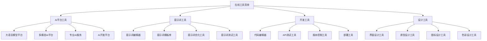

# 在线工具清单

## 🎯 核心定义

### 什么是在线工具清单？
在线工具清单是指收集和整理提示词工程相关的在线工具、平台和服务，为学习者提供便捷的工具资源，帮助提高学习效率和实践能力。

### 核心价值
- **工具发现**：发现和了解相关工具
- **效率提升**：提高学习和工作效率
- **成本节约**：节约工具寻找时间
- **质量保证**：确保工具质量和可靠性

## 📊 工具分类框架



## 🤖 AI平台工具

### 1. 大语言模型平台
| 工具名称 | 平台类型 | 主要功能 | 价格模式 | 推荐指数 |
|----------|----------|----------|----------|----------|
| **OpenAI GPT** | 大语言模型 | 文本生成、对话、代码生成 | 按量计费 | ⭐⭐⭐⭐⭐ |
| **Claude** | 大语言模型 | 文本分析、写作、编程 | 按量计费 | ⭐⭐⭐⭐⭐ |
| **Google Bard** | 大语言模型 | 搜索、问答、创意写作 | 免费 | ⭐⭐⭐⭐ |
| **文心一言** | 大语言模型 | 中文理解、创作、对话 | 按量计费 | ⭐⭐⭐⭐ |

#### OpenAI GPT平台详解
```markdown
# OpenAI GPT平台

## 平台概述
- 平台名称：OpenAI GPT
- 平台类型：大语言模型平台
- 主要功能：文本生成、对话、代码生成
- 价格模式：按量计费
- 推荐指数：⭐⭐⭐⭐⭐

## 核心功能
### 1. 文本生成
- **功能描述**：基于提示词生成高质量文本
- **应用场景**：文章写作、内容创作、邮件撰写
- **技术特点**：支持多种文本格式，生成质量高
- **使用限制**：有长度限制，需要合理设计提示词

### 2. 对话交互
- **功能描述**：支持多轮对话，理解上下文
- **应用场景**：客服系统、教育辅导、个人助手
- **技术特点**：上下文理解能力强，对话自然
- **使用限制**：对话长度有限制，需要管理上下文

### 3. 代码生成
- **功能描述**：根据描述生成代码
- **应用场景**：软件开发、代码补全、算法实现
- **技术特点**：支持多种编程语言，代码质量高
- **使用限制**：复杂逻辑可能需要多次迭代

### 4. 文本分析
- **功能描述**：分析文本内容，提取信息
- **应用场景**：文档分析、情感分析、信息提取
- **技术特点**：分析准确度高，支持多种分析类型
- **使用限制**：分析结果需要人工验证

## 使用指南
### 1. 注册和设置
- **注册流程**：
  1. 访问OpenAI官网
  2. 创建账户
  3. 验证邮箱
  4. 设置支付方式
  5. 获取API密钥

- **基本设置**：
  - 设置使用限制
  - 配置API密钥
  - 选择模型版本
  - 设置安全参数

### 2. API使用
- **API调用**：
```python
import openai

# 设置API密钥
openai.api_key = "your-api-key"

# 调用GPT模型
response = openai.ChatCompletion.create(
    model="gpt-3.5-turbo",
    messages=[
        {"role": "user", "content": "你好，请介绍一下自己"}
    ]
)

print(response.choices[0].message.content)
```

- **参数配置**：
  - model: 模型版本
  - messages: 对话消息
  - temperature: 创造性参数
  - max_tokens: 最大生成长度
  - top_p: 核采样参数

### 3. 提示词设计
- **设计原则**：
  - 清晰明确：提示词要清晰明确
  - 具体详细：提供具体的任务描述
  - 上下文充分：提供足够的上下文信息
  - 格式规范：使用规范的输出格式

- **设计模板**：
```
你是一位专业的[角色]，擅长[专业领域]。

任务：[具体任务描述]
上下文：[相关背景信息]
输出格式：[期望的输出格式]
约束条件：[限制和要求]

请根据以上要求完成任务。
```

### 4. 最佳实践
- **提示词优化**：
  - 使用具体的描述
  - 提供示例和模板
  - 设置明确的约束
  - 迭代优化提示词

- **错误处理**：
  - 检查API响应
  - 处理异常情况
  - 重试机制
  - 日志记录

- **性能优化**：
  - 合理设置参数
  - 缓存常用结果
  - 批量处理请求
  - 监控使用量

## 价格信息
### 1. 定价模式
- **按量计费**：根据使用量收费
- **模型差异**：不同模型价格不同
- **使用限制**：有使用量限制
- **免费额度**：新用户有免费额度

### 2. 价格详情
- **GPT-3.5-turbo**：$0.002/1K tokens
- **GPT-4**：$0.03/1K tokens
- **GPT-4-turbo**：$0.01/1K tokens
- **Embeddings**：$0.0001/1K tokens

### 3. 成本控制
- **使用监控**：监控API使用量
- **预算设置**：设置使用预算
- **优化策略**：优化提示词和参数
- **缓存机制**：缓存常用结果

## 优缺点分析
### 优点
- **功能强大**：支持多种文本生成任务
- **质量高**：生成内容质量优秀
- **易用性好**：API简单易用
- **生态完善**：有丰富的工具和库

### 缺点
- **成本较高**：使用成本相对较高
- **响应速度**：有时响应较慢
- **内容限制**：有内容安全限制
- **依赖网络**：需要稳定的网络连接

## 适用场景
### 1. 内容创作
- 博客文章写作
- 营销文案创作
- 技术文档编写
- 创意内容生成

### 2. 代码开发
- 代码生成和补全
- 算法实现
- 代码审查
- 技术问题解答

### 3. 教育辅导
- 学习内容生成
- 问题解答
- 作业辅导
- 知识总结

### 4. 商业应用
- 客服系统
- 内容审核
- 数据分析
- 决策支持

## 学习资源
### 1. 官方文档
- API文档：详细的API使用说明
- 示例代码：丰富的代码示例
- 最佳实践：使用建议和技巧
- 更新日志：版本更新信息

### 2. 社区资源
- GitHub仓库：开源项目和工具
- 论坛讨论：技术交流和问题解答
- 博客文章：使用经验和技巧分享
- 视频教程：视频学习资源

### 3. 工具推荐
- 开发工具：IDE插件和扩展
- 测试工具：API测试工具
- 监控工具：使用量监控工具
- 优化工具：提示词优化工具

## 注意事项
### 1. 安全使用
- 保护API密钥安全
- 遵守使用条款
- 注意内容安全
- 保护用户隐私

### 2. 合理使用
- 控制使用量
- 优化提示词
- 监控成本
- 遵守限制

### 3. 持续学习
- 关注更新
- 学习新功能
- 优化使用方式
- 分享经验

## 相关链接
- 官方网站：https://openai.com
- API文档：https://platform.openai.com/docs
- GitHub：https://github.com/openai
- 社区论坛：https://community.openai.com
```

### 2. 多模态AI平台
| 工具名称 | 平台类型 | 主要功能 | 价格模式 | 推荐指数 |
|----------|----------|----------|----------|----------|
| **GPT-4V** | 多模态AI | 图像理解、文本生成 | 按量计费 | ⭐⭐⭐⭐⭐ |
| **Claude 3** | 多模态AI | 图像分析、文档处理 | 按量计费 | ⭐⭐⭐⭐⭐ |
| **Gemini Pro** | 多模态AI | 图像、音频、视频处理 | 按量计费 | ⭐⭐⭐⭐ |
| **DALL-E 3** | 图像生成 | 图像生成、编辑 | 按量计费 | ⭐⭐⭐⭐ |

## 🎨 提示词工具

### 1. 提示词编辑器
| 工具名称 | 工具类型 | 主要功能 | 价格模式 | 推荐指数 |
|----------|----------|----------|----------|----------|
| **PromptBase** | 提示词编辑器 | 提示词创建、编辑、分享 | 免费/付费 | ⭐⭐⭐⭐ |
| **PromptPerfect** | 提示词优化 | 提示词优化、测试 | 免费/付费 | ⭐⭐⭐⭐ |
| **PromptLayer** | 提示词管理 | 提示词版本管理、分析 | 免费/付费 | ⭐⭐⭐⭐ |
| **LangChain** | 提示词框架 | 提示词链、模板管理 | 开源免费 | ⭐⭐⭐⭐⭐ |

#### LangChain框架详解
```markdown
# LangChain框架

## 框架概述
- 框架名称：LangChain
- 框架类型：提示词框架
- 主要功能：提示词链、模板管理
- 价格模式：开源免费
- 推荐指数：⭐⭐⭐⭐⭐

## 核心功能
### 1. 提示词模板
- **功能描述**：创建和管理提示词模板
- **应用场景**：标准化提示词、批量生成
- **技术特点**：支持变量替换、模板继承
- **使用限制**：需要Python编程知识

### 2. 提示词链
- **功能描述**：构建复杂的提示词处理链
- **应用场景**：多步骤处理、工作流自动化
- **技术特点**：支持条件分支、循环控制
- **使用限制**：链式设计需要规划

### 3. 模型集成
- **功能描述**：集成多种AI模型
- **应用场景**：模型对比、多模型协作
- **技术特点**：统一接口、模型切换
- **使用限制**：需要配置模型参数

### 4. 数据连接
- **功能描述**：连接各种数据源
- **应用场景**：RAG应用、知识库查询
- **技术特点**：支持多种数据格式、实时更新
- **使用限制**：数据源需要适配

## 使用指南
### 1. 安装和配置
- **安装方法**：
```bash
pip install langchain
pip install langchain-openai
pip install langchain-community
```

- **基本配置**：
```python
from langchain_openai import ChatOpenAI
from langchain.prompts import ChatPromptTemplate

# 配置模型
llm = ChatOpenAI(
    model="gpt-3.5-turbo",
    temperature=0.7,
    api_key="your-api-key"
)
```

### 2. 提示词模板
- **创建模板**：
```python
from langchain.prompts import ChatPromptTemplate

# 创建提示词模板
template = ChatPromptTemplate.from_messages([
    ("system", "你是一位专业的{role}"),
    ("user", "请帮我{task}")
])

# 使用模板
prompt = template.format_messages(
    role="数据分析师",
    task="分析销售数据"
)
```

- **模板变量**：
```python
# 支持变量替换
template = ChatPromptTemplate.from_template(
    "你是一位{role}，请帮我{task}。"
    "相关背景：{context}。"
    "输出格式：{format}。"
)
```

### 3. 提示词链
- **简单链**：
```python
from langchain.chains import LLMChain

# 创建链
chain = LLMChain(llm=llm, prompt=template)

# 执行链
result = chain.run(
    role="数据分析师",
    task="分析销售数据",
    context="2023年销售数据",
    format="JSON格式"
)
```

- **复杂链**：
```python
from langchain.chains import SequentialChain

# 创建多个链
chain1 = LLMChain(llm=llm, prompt=template1, output_key="analysis")
chain2 = LLMChain(llm=llm, prompt=template2, output_key="summary")

# 组合链
overall_chain = SequentialChain(
    chains=[chain1, chain2],
    input_variables=["data"],
    output_variables=["analysis", "summary"]
)
```

### 4. 模型集成
- **多模型支持**：
```python
from langchain_openai import ChatOpenAI
from langchain_anthropic import ChatAnthropic

# 配置多个模型
openai_llm = ChatOpenAI(model="gpt-3.5-turbo")
claude_llm = ChatAnthropic(model="claude-3-sonnet")

# 模型切换
def get_llm(provider):
    if provider == "openai":
        return openai_llm
    elif provider == "claude":
        return claude_llm
```

## 价格信息
### 1. 定价模式
- **开源免费**：核心框架免费使用
- **云服务**：部分云服务收费
- **企业版**：企业功能收费
- **技术支持**：技术支持服务收费

### 2. 成本说明
- **框架使用**：完全免费
- **模型调用**：按模型提供商定价
- **云服务**：按使用量计费
- **企业支持**：按服务级别收费

## 优缺点分析
### 优点
- **功能强大**：支持复杂的提示词处理
- **生态丰富**：有丰富的扩展和工具
- **社区活跃**：有活跃的开发者社区
- **文档完善**：有详细的文档和示例

### 缺点
- **学习曲线**：需要一定的编程基础
- **复杂性**：功能复杂，配置较多
- **性能开销**：有一定的性能开销
- **版本更新**：版本更新频繁

## 适用场景
### 1. 复杂应用开发
- 多步骤AI应用
- 工作流自动化
- 企业级应用
- 大规模部署

### 2. 研究和实验
- 提示词研究
- 模型对比
- 算法实验
- 原型开发

### 3. 教育和学习
- 教学演示
- 学习实验
- 技能培训
- 知识分享

## 学习资源
### 1. 官方资源
- 官方文档：https://python.langchain.com
- GitHub仓库：https://github.com/langchain-ai
- 示例代码：丰富的代码示例
- 教程视频：官方教程视频

### 2. 社区资源
- 社区论坛：技术交流和问题解答
- 博客文章：使用经验和技巧分享
- 开源项目：社区贡献的开源项目
- 工具推荐：相关工具和插件

### 3. 学习路径
- 基础入门：Python基础和AI概念
- 框架学习：LangChain核心功能
- 实践项目：实际项目开发
- 高级应用：复杂应用开发

## 注意事项
### 1. 技术准备
- 掌握Python编程
- 了解AI和机器学习基础
- 熟悉API使用
- 了解数据格式

### 2. 最佳实践
- 合理设计提示词
- 优化链式结构
- 监控性能指标
- 处理异常情况

### 3. 持续学习
- 关注框架更新
- 学习新功能
- 参与社区讨论
- 分享使用经验

## 相关链接
- 官方网站：https://python.langchain.com
- GitHub：https://github.com/langchain-ai
- 文档：https://python.langchain.com/docs
- 社区：https://github.com/langchain-ai/langchain/discussions
```

### 2. 提示词模板库
| 工具名称 | 工具类型 | 主要功能 | 价格模式 | 推荐指数 |
|----------|----------|----------|----------|----------|
| **PromptBase** | 模板库 | 提示词模板分享、购买 | 免费/付费 | ⭐⭐⭐⭐ |
| **PromptPerfect** | 模板库 | 提示词模板、优化工具 | 免费/付费 | ⭐⭐⭐⭐ |
| **FlowGPT** | 模板库 | 提示词模板、社区分享 | 免费 | ⭐⭐⭐⭐ |
| **PromptHero** | 模板库 | 提示词模板、搜索 | 免费 | ⭐⭐⭐ |

## 💻 开发工具

### 1. 代码编辑器
| 工具名称 | 工具类型 | 主要功能 | 价格模式 | 推荐指数 |
|----------|----------|----------|----------|----------|
| **VS Code** | 代码编辑器 | 代码编辑、调试、扩展 | 免费 | ⭐⭐⭐⭐⭐ |
| **Cursor** | AI代码编辑器 | AI辅助编程、代码生成 | 免费/付费 | ⭐⭐⭐⭐⭐ |
| **GitHub Copilot** | AI编程助手 | 代码补全、生成 | 付费 | ⭐⭐⭐⭐ |
| **Tabnine** | AI代码助手 | 代码补全、预测 | 免费/付费 | ⭐⭐⭐⭐ |

#### Cursor编辑器详解
```markdown
# Cursor编辑器

## 编辑器概述
- 编辑器名称：Cursor
- 编辑器类型：AI代码编辑器
- 主要功能：AI辅助编程、代码生成
- 价格模式：免费/付费
- 推荐指数：⭐⭐⭐⭐⭐

## 核心功能
### 1. AI代码生成
- **功能描述**：基于自然语言生成代码
- **应用场景**：快速原型开发、代码补全
- **技术特点**：支持多种编程语言，生成质量高
- **使用限制**：需要网络连接，生成结果需要验证

### 2. AI代码解释
- **功能描述**：解释代码功能和逻辑
- **应用场景**：代码理解、学习、文档生成
- **技术特点**：解释准确，支持多种语言
- **使用限制**：复杂代码可能需要多次解释

### 3. AI代码重构
- **功能描述**：自动重构和优化代码
- **应用场景**：代码优化、性能提升、可读性改善
- **技术特点**：保持功能不变，提升代码质量
- **使用限制**：重构结果需要测试验证

### 4. AI对话编程
- **功能描述**：通过对话方式编程
- **应用场景**：需求讨论、问题解决、学习交流
- **技术特点**：自然语言交互，支持上下文理解
- **使用限制**：对话长度有限制，需要清晰表达

## 使用指南
### 1. 安装和配置
- **安装方法**：
  1. 访问Cursor官网
  2. 下载安装包
  3. 安装编辑器
  4. 创建账户
  5. 配置AI模型

- **基本配置**：
  - 设置AI模型
  - 配置API密钥
  - 设置代码风格
  - 配置扩展

### 2. AI代码生成
- **使用方法**：
  1. 在编辑器中输入自然语言描述
  2. 使用Ctrl+K快捷键
  3. 选择生成选项
  4. 查看和编辑生成的代码

- **示例**：
```
// 输入：创建一个Python函数，计算两个数的和
// 生成：
def add_numbers(a, b):
    """
    计算两个数的和
    
    Args:
        a (int): 第一个数
        b (int): 第二个数
    
    Returns:
        int: 两个数的和
    """
    return a + b
```

### 3. AI代码解释
- **使用方法**：
  1. 选中要解释的代码
  2. 使用Ctrl+L快捷键
  3. 查看AI解释结果
  4. 根据需要调整解释

- **示例**：
```
// 选中代码：
def fibonacci(n):
    if n <= 1:
        return n
    return fibonacci(n-1) + fibonacci(n-2)

// AI解释：
这是一个递归实现的斐波那契数列函数。
- 如果n小于等于1，直接返回n
- 否则返回前两个数的和
- 时间复杂度为O(2^n)，效率较低
```

### 4. AI对话编程
- **使用方法**：
  1. 打开AI对话面板
  2. 输入问题或需求
  3. 与AI进行对话
  4. 获取代码建议

- **示例**：
```
用户：我需要创建一个简单的Web服务器
AI：我可以帮你创建一个使用Flask的简单Web服务器。你想要实现什么功能？
用户：只需要一个返回"Hello World"的接口
AI：好的，我来为你创建一个简单的Flask应用...
```

## 价格信息
### 1. 定价模式
- **免费版**：基础功能免费使用
- **专业版**：高级功能付费使用
- **企业版**：企业功能和服务
- **按量计费**：部分功能按使用量收费

### 2. 价格详情
- **免费版**：基础AI功能，有使用限制
- **专业版**：$20/月，无限制使用
- **企业版**：$40/月，团队协作功能
- **API调用**：按使用量计费

## 优缺点分析
### 优点
- **AI集成**：深度集成AI功能
- **开发效率**：显著提高开发效率
- **学习辅助**：帮助学习编程
- **代码质量**：提升代码质量

### 缺点
- **网络依赖**：需要稳定的网络连接
- **隐私问题**：代码可能被上传到云端
- **生成质量**：AI生成代码需要验证
- **学习成本**：需要学习新的使用方式

## 适用场景
### 1. 快速开发
- 原型开发
- 功能实现
- 代码补全
- 问题解决

### 2. 学习编程
- 代码理解
- 算法学习
- 最佳实践
- 技术探索

### 3. 代码维护
- 代码重构
- 性能优化
- 文档生成
- 测试编写

## 学习资源
### 1. 官方资源
- 官方文档：详细的使用说明
- 教程视频：视频学习资源
- 示例代码：代码示例和模板
- 社区论坛：技术交流和问题解答

### 2. 社区资源
- GitHub仓库：开源项目和工具
- 博客文章：使用经验和技巧分享
- 视频教程：社区制作的教学视频
- 工具推荐：相关工具和插件

## 注意事项
### 1. 安全使用
- 保护代码隐私
- 注意API密钥安全
- 遵守使用条款
- 定期备份代码

### 2. 合理使用
- 验证AI生成代码
- 理解代码逻辑
- 测试功能正确性
- 优化性能表现

### 3. 持续学习
- 关注功能更新
- 学习新特性
- 参与社区讨论
- 分享使用经验

## 相关链接
- 官方网站：https://cursor.sh
- 文档：https://cursor.sh/docs
- GitHub：https://github.com/getcursor
- 社区：https://cursor.sh/community
```

### 2. API测试工具
| 工具名称 | 工具类型 | 主要功能 | 价格模式 | 推荐指数 |
|----------|----------|----------|----------|----------|
| **Postman** | API测试 | API测试、文档、协作 | 免费/付费 | ⭐⭐⭐⭐⭐ |
| **Insomnia** | API测试 | API测试、设计、调试 | 免费/付费 | ⭐⭐⭐⭐ |
| **Thunder Client** | API测试 | VS Code扩展、轻量级 | 免费 | ⭐⭐⭐⭐ |
| **HTTPie** | API测试 | 命令行工具、简单易用 | 免费 | ⭐⭐⭐ |

## 🎨 设计工具

### 1. 界面设计工具
| 工具名称 | 工具类型 | 主要功能 | 价格模式 | 推荐指数 |
|----------|----------|----------|----------|----------|
| **Figma** | 界面设计 | 界面设计、原型、协作 | 免费/付费 | ⭐⭐⭐⭐⭐ |
| **Sketch** | 界面设计 | 界面设计、原型、插件 | 付费 | ⭐⭐⭐⭐ |
| **Adobe XD** | 界面设计 | 界面设计、原型、动画 | 免费/付费 | ⭐⭐⭐⭐ |
| **Framer** | 界面设计 | 界面设计、原型、动画 | 免费/付费 | ⭐⭐⭐⭐ |

#### Figma设计工具详解
```markdown
# Figma设计工具

## 工具概述
- 工具名称：Figma
- 工具类型：界面设计
- 主要功能：界面设计、原型、协作
- 价格模式：免费/付费
- 推荐指数：⭐⭐⭐⭐⭐

## 核心功能
### 1. 界面设计
- **功能描述**：创建和编辑用户界面
- **应用场景**：Web设计、移动应用设计、桌面应用设计
- **技术特点**：矢量图形、响应式设计、组件系统
- **使用限制**：需要网络连接，文件大小有限制

### 2. 原型设计
- **功能描述**：创建交互式原型
- **应用场景**：用户体验测试、产品演示、开发指导
- **技术特点**：交互设计、动画效果、用户流程
- **使用限制**：原型功能相对简单，复杂交互需要其他工具

### 3. 协作功能
- **功能描述**：团队协作和版本控制
- **应用场景**：团队设计、设计评审、设计交付
- **技术特点**：实时协作、评论系统、版本历史
- **使用限制**：免费版协作人数有限制

### 4. 组件系统
- **功能描述**：创建和管理设计组件
- **应用场景**：设计系统、组件库、设计规范
- **技术特点**：组件复用、样式管理、自动布局
- **使用限制**：复杂组件需要高级功能

## 使用指南
### 1. 注册和设置
- **注册流程**：
  1. 访问Figma官网
  2. 创建账户
  3. 选择计划
  4. 设置工作区
  5. 邀请团队成员

- **基本设置**：
  - 设置个人资料
  - 配置工作区
  - 设置设计偏好
  - 安装插件

### 2. 界面设计
- **创建文件**：
  1. 点击"New file"
  2. 选择模板或空白文件
  3. 设置画布尺寸
  4. 开始设计

- **设计工具**：
  - 选择工具：选择和移动对象
  - 矩形工具：创建矩形和正方形
  - 椭圆工具：创建圆形和椭圆
  - 文本工具：添加和编辑文本
  - 钢笔工具：创建自定义形状

### 3. 组件系统
- **创建组件**：
  1. 设计基础组件
  2. 选中组件
  3. 点击"Create component"
  4. 设置组件属性

- **使用组件**：
  1. 从组件库选择组件
  2. 拖拽到画布
  3. 调整组件属性
  4. 覆盖组件样式

### 4. 原型设计
- **创建原型**：
  1. 切换到原型模式
  2. 选择起始帧
  3. 添加交互
  4. 设置动画效果

- **交互设置**：
  - 触发条件：点击、悬停、拖拽
  - 目标帧：跳转到指定帧
  - 动画效果：过渡动画、缓动效果
  - 延迟时间：设置动画延迟

## 价格信息
### 1. 定价模式
- **免费版**：基础功能免费使用
- **专业版**：高级功能付费使用
- **团队版**：团队协作功能
- **企业版**：企业级功能和服务

### 2. 价格详情
- **免费版**：个人使用，有功能限制
- **专业版**：$12/月，无限制使用
- **团队版**：$45/月，团队协作功能
- **企业版**：$75/月，企业级功能

## 优缺点分析
### 优点
- **云端协作**：实时协作，无需安装
- **功能强大**：设计功能全面
- **生态丰富**：有丰富的插件和资源
- **跨平台**：支持多种操作系统

### 缺点
- **网络依赖**：需要稳定的网络连接
- **性能限制**：大文件可能影响性能
- **学习曲线**：功能复杂，需要学习
- **存储限制**：免费版存储空间有限

## 适用场景
### 1. 界面设计
- Web界面设计
- 移动应用设计
- 桌面应用设计
- 图标设计

### 2. 原型设计
- 用户体验测试
- 产品演示
- 开发指导
- 用户反馈

### 3. 团队协作
- 设计评审
- 设计交付
- 版本控制
- 设计规范

## 学习资源
### 1. 官方资源
- 官方文档：详细的使用说明
- 教程视频：视频学习资源
- 示例文件：设计示例和模板
- 社区论坛：技术交流和问题解答

### 2. 社区资源
- 设计资源：免费的设计资源
- 插件推荐：有用的插件和工具
- 教程文章：使用经验和技巧分享
- 设计灵感：设计灵感和参考

## 注意事项
### 1. 文件管理
- 定期备份文件
- 合理组织文件结构
- 使用版本控制
- 清理无用文件

### 2. 协作规范
- 建立协作流程
- 设置权限管理
- 规范命名规则
- 及时沟通反馈

### 3. 性能优化
- 优化文件大小
- 合理使用组件
- 避免过度设计
- 定期清理资源

## 相关链接
- 官方网站：https://figma.com
- 文档：https://help.figma.com
- 社区：https://figma.com/community
- 插件：https://figma.com/plugins
```

### 2. 原型设计工具
| 工具名称 | 工具类型 | 主要功能 | 价格模式 | 推荐指数 |
|----------|----------|----------|----------|----------|
| **Principle** | 原型设计 | 交互动画、原型制作 | 付费 | ⭐⭐⭐⭐ |
| **ProtoPie** | 原型设计 | 高保真原型、传感器交互 | 免费/付费 | ⭐⭐⭐⭐ |
| **InVision** | 原型设计 | 原型制作、协作、测试 | 免费/付费 | ⭐⭐⭐⭐ |
| **Marvel** | 原型设计 | 简单原型、用户测试 | 免费/付费 | ⭐⭐⭐ |

## 🎓 学习要点

### 核心理解
- 在线工具是提示词工程学习的重要资源
- 选择合适的工具能显著提高学习效率
- 工具使用需要结合具体应用场景
- 持续关注工具更新和新工具出现

### 实践建议
- 根据需求选择合适的工具
- 熟练掌握工具的基本功能
- 关注工具的最佳实践
- 参与工具社区交流

## 🔗 相关链接
- [[本地工具推荐]] - 查看本地工具
- [[工具使用指南]] - 学习工具使用
- [[资源库/模板库/基础模板集合]] - 查看基础模板
- [[00-学习导航]] - 返回学习导航
