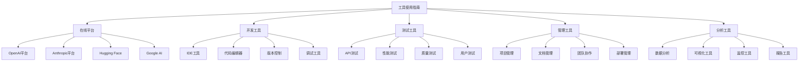

# 工具使用指南

## 🎯 核心定义

### 什么是工具使用指南？
工具使用指南是收集和整理提示词工程相关工具的使用方法、技巧和最佳实践的文档，帮助用户快速掌握工具使用，提高工作效率。

### 核心价值
- **快速上手**：快速掌握工具使用方法
- **提高效率**：提高工具使用效率
- **避免错误**：避免常见使用错误
- **最佳实践**：学习最佳使用实践

## 📊 工具分类



## 🌐 在线平台

### 1. OpenAI平台
#### 平台概述
OpenAI平台是OpenAI提供的AI服务平台，包括GPT系列模型、DALL-E图像生成、Whisper语音识别等服务。

#### 核心功能
- **GPT模型**：文本生成、对话、问答
- **DALL-E**：图像生成和编辑
- **Whisper**：语音识别和转录
- **Embeddings**：文本向量化
- **Moderation**：内容审核

#### 使用指南
##### 1. 注册和设置
```markdown
# OpenAI平台注册指南

## 注册步骤
1. 访问 https://platform.openai.com
2. 点击"Sign up"注册账户
3. 验证邮箱地址
4. 完成身份验证
5. 设置支付方式

## API密钥获取
1. 登录平台
2. 进入"API Keys"页面
3. 点击"Create new secret key"
4. 复制并保存API密钥
5. 设置使用限制

## 账户设置
- 设置使用限额
- 配置监控告警
- 设置安全选项
- 管理团队成员
```

##### 2. GPT模型使用
```python
# GPT模型使用示例

import openai

# 设置API密钥
openai.api_key = "your-api-key"

# 基础文本生成
def generate_text(prompt, model="gpt-3.5-turbo", max_tokens=1000):
    response = openai.ChatCompletion.create(
        model=model,
        messages=[
            {"role": "system", "content": "你是一个有用的助手。"},
            {"role": "user", "content": prompt}
        ],
        max_tokens=max_tokens,
        temperature=0.7
    )
    return response.choices[0].message.content

# 使用示例
prompt = "请解释什么是人工智能"
result = generate_text(prompt)
print(result)
```

##### 3. 高级功能
```python
# 高级功能使用

# 1. 流式响应
def stream_generate(prompt):
    response = openai.ChatCompletion.create(
        model="gpt-3.5-turbo",
        messages=[{"role": "user", "content": prompt}],
        stream=True
    )
    
    for chunk in response:
        if chunk.choices[0].delta.content:
            print(chunk.choices[0].delta.content, end="")

# 2. 函数调用
def function_calling():
    functions = [
        {
            "name": "get_weather",
            "description": "获取天气信息",
            "parameters": {
                "type": "object",
                "properties": {
                    "location": {
                        "type": "string",
                        "description": "城市名称"
                    }
                },
                "required": ["location"]
            }
        }
    ]
    
    response = openai.ChatCompletion.create(
        model="gpt-3.5-turbo",
        messages=[{"role": "user", "content": "北京今天天气怎么样？"}],
        functions=functions,
        function_call="auto"
    )
    
    return response

# 3. 图像生成
def generate_image(prompt, size="1024x1024", quality="standard"):
    response = openai.Image.create(
        prompt=prompt,
        n=1,
        size=size,
        quality=quality
    )
    return response.data[0].url
```

#### 最佳实践
```markdown
# OpenAI平台最佳实践

## 提示词设计
1. **明确角色**：为AI设定明确的角色
2. **具体任务**：描述具体的任务要求
3. **输出格式**：指定期望的输出格式
4. **示例引导**：提供few-shot示例

## 参数调优
1. **温度设置**：0.7适合创意任务，0.1适合事实性任务
2. **最大长度**：根据任务需求设置合适的长度
3. **频率惩罚**：减少重复内容
4. **存在惩罚**：控制话题多样性

## 成本控制
1. **模型选择**：根据任务复杂度选择模型
2. **长度控制**：控制输入和输出长度
3. **缓存使用**：缓存重复的请求
4. **批量处理**：批量处理相似任务

## 安全考虑
1. **内容审核**：使用Moderation API
2. **输入验证**：验证用户输入
3. **输出过滤**：过滤敏感内容
4. **访问控制**：控制API访问权限
```

### 2. Anthropic平台
#### 平台概述
Anthropic平台提供Claude系列模型，具有强大的推理能力和长文本处理能力。

#### 核心功能
- **Claude模型**：对话、分析、创作
- **长文本处理**：支持超长文本
- **代码生成**：编程辅助
- **文档分析**：文档理解和分析

#### 使用指南
##### 1. 注册和设置
```markdown
# Anthropic平台注册指南

## 注册步骤
1. 访问 https://console.anthropic.com
2. 点击"Sign up"注册账户
3. 验证邮箱地址
4. 完成身份验证
5. 获取API密钥

## API密钥管理
1. 进入"API Keys"页面
2. 创建新的API密钥
3. 设置使用限制
4. 配置监控告警
```

##### 2. Claude模型使用
```python
# Claude模型使用示例

import anthropic

# 设置API密钥
client = anthropic.Anthropic(api_key="your-api-key")

# 基础对话
def chat_with_claude(message, model="claude-3-sonnet-20240229"):
    response = client.messages.create(
        model=model,
        max_tokens=1000,
        messages=[{"role": "user", "content": message}]
    )
    return response.content[0].text

# 使用示例
message = "请解释量子计算的基本原理"
result = chat_with_claude(message)
print(result)
```

##### 3. 高级功能
```python
# 高级功能使用

# 1. 长文本处理
def process_long_text(text, max_tokens=4000):
    response = client.messages.create(
        model="claude-3-sonnet-20240229",
        max_tokens=max_tokens,
        messages=[{"role": "user", "content": f"请分析以下文本：\n{text}"}]
    )
    return response.content[0].text

# 2. 代码生成
def generate_code(description, language="python"):
    prompt = f"请用{language}编写代码：{description}"
    response = client.messages.create(
        model="claude-3-sonnet-20240229",
        max_tokens=2000,
        messages=[{"role": "user", "content": prompt}]
    )
    return response.content[0].text

# 3. 文档分析
def analyze_document(document_text):
    prompt = f"请分析以下文档的结构、要点和关键信息：\n{document_text}"
    response = client.messages.create(
        model="claude-3-sonnet-20240229",
        max_tokens=3000,
        messages=[{"role": "user", "content": prompt}]
    )
    return response.content[0].text
```

### 3. Hugging Face平台
#### 平台概述
Hugging Face是开源AI社区，提供模型库、数据集、工具和资源。

#### 核心功能
- **模型库**：预训练模型
- **数据集**：训练数据集
- **Spaces**：应用部署
- **Transformers**：模型库

#### 使用指南
##### 1. 平台注册
```markdown
# Hugging Face平台注册指南

## 注册步骤
1. 访问 https://huggingface.co
2. 点击"Sign up"注册账户
3. 验证邮箱地址
4. 完成个人资料设置
5. 获取访问令牌

## 访问令牌
1. 进入"Settings" > "Access Tokens"
2. 创建新的访问令牌
3. 设置权限范围
4. 保存令牌信息
```

##### 2. 模型使用
```python
# Hugging Face模型使用示例

from transformers import pipeline, AutoTokenizer, AutoModel

# 1. 使用pipeline
def use_pipeline():
    # 文本分类
    classifier = pipeline("text-classification")
    result = classifier("I love this movie!")
    print(result)
    
    # 文本生成
    generator = pipeline("text-generation")
    result = generator("The future of AI is")
    print(result)
    
    # 问答
    qa = pipeline("question-answering")
    result = qa(question="What is AI?", context="AI is artificial intelligence.")
    print(result)

# 2. 使用模型和分词器
def use_model_tokenizer():
    model_name = "bert-base-uncased"
    tokenizer = AutoTokenizer.from_pretrained(model_name)
    model = AutoModel.from_pretrained(model_name)
    
    text = "Hello, world!"
    inputs = tokenizer(text, return_tensors="pt")
    outputs = model(**inputs)
    print(outputs)

# 3. 自定义模型
def custom_model():
    from transformers import AutoModelForCausalLM, AutoTokenizer
    
    model_name = "gpt2"
    tokenizer = AutoTokenizer.from_pretrained(model_name)
    model = AutoModelForCausalLM.from_pretrained(model_name)
    
    prompt = "The future of artificial intelligence"
    inputs = tokenizer(prompt, return_tensors="pt")
    outputs = model.generate(**inputs, max_length=100)
    result = tokenizer.decode(outputs[0], skip_special_tokens=True)
    print(result)
```

## 💻 开发工具

### 1. IDE工具
#### VS Code
##### 安装和配置
```markdown
# VS Code安装配置指南

## 安装步骤
1. 访问 https://code.visualstudio.com
2. 下载适合操作系统的版本
3. 运行安装程序
4. 完成基本设置

## 推荐插件
- Python：Python开发支持
- Jupyter：Jupyter Notebook支持
- GitLens：Git增强功能
- Prettier：代码格式化
- ESLint：JavaScript代码检查
- Thunder Client：API测试
- REST Client：REST API测试
```

##### 使用技巧
```markdown
# VS Code使用技巧

## 快捷键
- Ctrl+Shift+P：命令面板
- Ctrl+`：打开终端
- Ctrl+Shift+`：新建终端
- Ctrl+D：选择下一个相同单词
- Alt+Click：多光标编辑
- Ctrl+Shift+L：选择所有相同单词

## 调试功能
1. 设置断点
2. 启动调试
3. 查看变量
4. 单步执行
5. 查看调用栈

## 代码片段
- 创建自定义代码片段
- 使用内置代码片段
- 导入代码片段
- 分享代码片段
```

#### PyCharm
##### 安装和配置
```markdown
# PyCharm安装配置指南

## 安装步骤
1. 访问 https://www.jetbrains.com/pycharm
2. 选择Community或Professional版本
3. 下载安装程序
4. 完成安装和配置

## 项目设置
1. 创建新项目
2. 配置Python解释器
3. 安装依赖包
4. 设置代码风格
```

##### 使用技巧
```markdown
# PyCharm使用技巧

## 代码编辑
- Ctrl+Space：代码补全
- Ctrl+Shift+Space：智能补全
- Ctrl+Q：快速文档
- Ctrl+B：跳转到定义
- Ctrl+Alt+B：跳转到实现
- Ctrl+U：跳转到父类

## 调试功能
1. 设置断点
2. 启动调试
3. 查看变量
4. 评估表达式
5. 条件断点

## 版本控制
- Git集成
- 分支管理
- 合并冲突解决
- 代码审查
```

### 2. 代码编辑器
#### Sublime Text
##### 安装和配置
```markdown
# Sublime Text安装配置指南

## 安装步骤
1. 访问 https://www.sublimetext.com
2. 下载适合操作系统的版本
3. 运行安装程序
4. 完成基本设置

## 插件管理
1. 安装Package Control
2. 搜索和安装插件
3. 配置插件设置
4. 更新插件
```

#### Atom
##### 安装和配置
```markdown
# Atom安装配置指南

## 安装步骤
1. 访问 https://atom.io
2. 下载适合操作系统的版本
3. 运行安装程序
4. 完成基本设置

## 插件管理
1. 使用内置包管理器
2. 搜索和安装插件
3. 配置插件设置
4. 更新插件
```

### 3. 版本控制
#### Git
##### 安装和配置
```markdown
# Git安装配置指南

## 安装步骤
1. 访问 https://git-scm.com
2. 下载适合操作系统的版本
3. 运行安装程序
4. 完成基本配置

## 基本配置
```bash
# 设置用户信息
git config --global user.name "Your Name"
git config --global user.email "your.email@example.com"

# 设置默认编辑器
git config --global core.editor "code --wait"

# 设置换行符处理
git config --global core.autocrlf true
```

##### 常用命令
```bash
# 基本操作
git init                    # 初始化仓库
git clone <url>            # 克隆仓库
git add <file>             # 添加文件到暂存区
git commit -m "message"    # 提交更改
git push                   # 推送到远程仓库
git pull                   # 拉取远程更改

# 分支操作
git branch                 # 查看分支
git branch <name>          # 创建分支
git checkout <name>        # 切换分支
git merge <name>           # 合并分支
git branch -d <name>       # 删除分支

# 查看状态
git status                 # 查看状态
git log                    # 查看提交历史
git diff                   # 查看差异
git show                   # 查看提交详情
```

#### GitHub
##### 使用指南
```markdown
# GitHub使用指南

## 创建仓库
1. 登录GitHub
2. 点击"New repository"
3. 填写仓库信息
4. 选择公开或私有
5. 创建仓库

## 协作功能
- Issues：问题跟踪
- Pull Requests：代码审查
- Projects：项目管理
- Wiki：文档管理
- Actions：自动化工作流
```

## 🧪 测试工具

### 1. API测试
#### Postman
##### 安装和配置
```markdown
# Postman安装配置指南

## 安装步骤
1. 访问 https://www.postman.com
2. 下载适合操作系统的版本
3. 运行安装程序
4. 完成基本设置

## 基本使用
1. 创建新请求
2. 设置请求方法
3. 输入URL
4. 添加请求头
5. 设置请求体
6. 发送请求
7. 查看响应
```

##### 高级功能
```markdown
# Postman高级功能

## 环境变量
1. 创建环境
2. 设置变量
3. 使用变量
4. 切换环境

## 测试脚本
```javascript
// 测试响应状态码
pm.test("Status code is 200", function () {
    pm.response.to.have.status(200);
});

// 测试响应时间
pm.test("Response time is less than 2000ms", function () {
    pm.expect(pm.response.responseTime).to.be.below(2000);
});

// 测试响应内容
pm.test("Response contains expected data", function () {
    const jsonData = pm.response.json();
    pm.expect(jsonData).to.have.property('data');
});
```

## 集合和文件夹
1. 创建集合
2. 组织请求
3. 设置集合变量
4. 运行集合测试

## 自动化测试
1. 创建测试脚本
2. 设置断言
3. 运行自动化测试
4. 生成测试报告
```

#### Insomnia
##### 安装和配置
```markdown
# Insomnia安装配置指南

## 安装步骤
1. 访问 https://insomnia.rest
2. 下载适合操作系统的版本
3. 运行安装程序
4. 完成基本设置

## 基本使用
1. 创建新请求
2. 设置请求方法
3. 输入URL
4. 添加请求头
5. 设置请求体
6. 发送请求
7. 查看响应
```

### 2. 性能测试
#### JMeter
##### 安装和配置
```markdown
# JMeter安装配置指南

## 安装步骤
1. 访问 https://jmeter.apache.org
2. 下载适合操作系统的版本
3. 解压到目标目录
4. 配置环境变量

## 基本使用
1. 创建测试计划
2. 添加线程组
3. 添加HTTP请求
4. 添加监听器
5. 运行测试
6. 查看结果
```

##### 测试配置
```markdown
# JMeter测试配置

## 线程组设置
- 线程数：并发用户数
- 循环次数：每个用户执行次数
- 启动时间：用户启动间隔

## HTTP请求设置
- 服务器名称：目标服务器
- 端口号：目标端口
- 路径：请求路径
- 方法：HTTP方法

## 监听器设置
- 查看结果树：查看请求详情
- 聚合报告：查看统计信息
- 图形结果：查看性能图表
```

#### LoadRunner
##### 安装和配置
```markdown
# LoadRunner安装配置指南

## 安装步骤
1. 访问 https://www.microfocus.com
2. 下载适合操作系统的版本
3. 运行安装程序
4. 完成许可证配置

## 基本使用
1. 创建虚拟用户脚本
2. 设置场景
3. 运行负载测试
4. 分析结果
```

### 3. 质量测试
#### SonarQube
##### 安装和配置
```markdown
# SonarQube安装配置指南

## 安装步骤
1. 访问 https://www.sonarqube.org
2. 下载适合操作系统的版本
3. 解压到目标目录
4. 启动服务

## 基本使用
1. 创建项目
2. 配置分析参数
3. 运行代码分析
4. 查看质量报告
```

#### ESLint
##### 安装和配置
```markdown
# ESLint安装配置指南

## 安装步骤
```bash
# 全局安装
npm install -g eslint

# 项目安装
npm install --save-dev eslint
```

## 配置文件
```json
{
  "env": {
    "browser": true,
    "es2021": true,
    "node": true
  },
  "extends": [
    "eslint:recommended"
  ],
  "parserOptions": {
    "ecmaVersion": 12,
    "sourceType": "module"
  },
  "rules": {
    "indent": ["error", 2],
    "linebreak-style": ["error", "unix"],
    "quotes": ["error", "single"],
    "semi": ["error", "always"]
  }
}
```

## 使用命令
```bash
# 检查文件
eslint file.js

# 修复问题
eslint --fix file.js

# 检查目录
eslint src/
```

## 📊 管理工具

### 1. 项目管理
#### Jira
##### 安装和配置
```markdown
# Jira安装配置指南

## 安装步骤
1. 访问 https://www.atlassian.com
2. 选择Jira版本
3. 下载安装程序
4. 完成安装配置

## 基本使用
1. 创建项目
2. 设置工作流
3. 创建问题
4. 分配任务
5. 跟踪进度
```

#### Trello
##### 使用指南
```markdown
# Trello使用指南

## 基本概念
- 看板：项目容器
- 列表：任务分类
- 卡片：具体任务
- 标签：任务标记

## 基本使用
1. 创建看板
2. 添加列表
3. 创建卡片
4. 设置截止日期
5. 添加成员
6. 跟踪进度
```

### 2. 文档管理
#### Confluence
##### 安装和配置
```markdown
# Confluence安装配置指南

## 安装步骤
1. 访问 https://www.atlassian.com
2. 选择Confluence版本
3. 下载安装程序
4. 完成安装配置

## 基本使用
1. 创建空间
2. 创建页面
3. 添加内容
4. 设置权限
5. 协作编辑
```

#### Notion
##### 使用指南
```markdown
# Notion使用指南

## 基本概念
- 页面：内容容器
- 块：内容单元
- 数据库：结构化数据
- 模板：页面模板

## 基本使用
1. 创建页面
2. 添加内容块
3. 创建数据库
4. 使用模板
5. 协作编辑
```

### 3. 团队协作
#### Slack
##### 使用指南
```markdown
# Slack使用指南

## 基本功能
- 频道：主题讨论
- 私信：个人沟通
- 文件共享：文档分享
- 集成：第三方工具

## 基本使用
1. 创建工作区
2. 创建频道
3. 邀请成员
4. 发送消息
5. 分享文件
```

#### Microsoft Teams
##### 使用指南
```markdown
# Microsoft Teams使用指南

## 基本功能
- 团队：项目组织
- 频道：主题讨论
- 会议：视频会议
- 文件：文档共享

## 基本使用
1. 创建团队
2. 添加频道
3. 邀请成员
4. 安排会议
5. 分享文件
```

## 📈 分析工具

### 1. 数据分析
#### Python数据分析
##### 常用库
```python
# 数据分析常用库

import pandas as pd          # 数据处理
import numpy as np           # 数值计算
import matplotlib.pyplot as plt  # 数据可视化
import seaborn as sns        # 统计可视化
import plotly.express as px  # 交互式可视化
import jupyter               # 交互式开发

# 数据处理示例
def analyze_data():
    # 读取数据
    df = pd.read_csv('data.csv')
    
    # 数据清洗
    df = df.dropna()
    df = df.drop_duplicates()
    
    # 数据统计
    print(df.describe())
    
    # 数据可视化
    plt.figure(figsize=(10, 6))
    sns.histplot(df['column'])
    plt.show()
    
    return df
```

#### R语言分析
##### 常用包
```r
# R语言数据分析常用包

library(dplyr)      # 数据处理
library(ggplot2)    # 数据可视化
library(corrplot)   # 相关性分析
library(caret)      # 机器学习
library(shiny)      # 交互式应用

# 数据处理示例
analyze_data <- function() {
  # 读取数据
  data <- read.csv('data.csv')
  
  # 数据清洗
  data <- data %>%
    filter(!is.na(column)) %>%
    distinct()
  
  # 数据统计
  summary(data)
  
  # 数据可视化
  ggplot(data, aes(x = column1, y = column2)) +
    geom_point() +
    theme_minimal()
  
  return(data)
}
```

### 2. 可视化工具
#### Tableau
##### 使用指南
```markdown
# Tableau使用指南

## 基本概念
- 工作表：单个图表
- 仪表板：多个图表组合
- 故事：数据故事
- 数据源：数据连接

## 基本使用
1. 连接数据源
2. 创建工作表
3. 设计仪表板
4. 发布分享
```

#### Power BI
##### 使用指南
```markdown
# Power BI使用指南

## 基本概念
- 报表：数据可视化
- 仪表板：关键指标
- 数据集：数据模型
- 工作区：协作空间

## 基本使用
1. 导入数据
2. 创建报表
3. 设计仪表板
4. 发布分享
```

### 3. 监控工具
#### Prometheus
##### 安装和配置
```markdown
# Prometheus安装配置指南

## 安装步骤
1. 访问 https://prometheus.io
2. 下载适合操作系统的版本
3. 解压到目标目录
4. 配置启动文件

## 配置文件
```yaml
global:
  scrape_interval: 15s

scrape_configs:
  - job_name: 'prometheus'
    static_configs:
      - targets: ['localhost:9090']
```

## 基本使用
1. 启动服务
2. 配置监控目标
3. 查看指标
4. 设置告警
```

#### Grafana
##### 安装和配置
```markdown
# Grafana安装配置指南

## 安装步骤
1. 访问 https://grafana.com
2. 下载适合操作系统的版本
3. 运行安装程序
4. 完成基本配置

## 基本使用
1. 创建数据源
2. 设计仪表板
3. 设置告警
4. 分享仪表板
```

## 🎓 学习要点

### 核心理解
- 工具是提高工作效率的重要手段
- 选择合适的工具能事半功倍
- 掌握工具使用技巧能显著提升效率
- 持续学习新工具能保持竞争力

### 实践建议
- 从基础工具开始，逐步掌握高级功能
- 注重实践应用，不断积累经验
- 关注工具更新，及时学习新功能
- 分享使用经验，与他人交流学习

## 🔗 相关链接
- [[00-学习导航]] - 返回学习导航
- [[00-知识地图]] - 查看知识地图
- [[00-快速入门]] - 快速入门指南
- [[在线工具清单]] - 查看在线工具
- [[本地工具推荐]] - 查看本地工具
