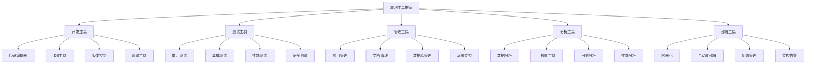

# 本地工具推荐

## 🎯 核心定义

### 什么是本地工具推荐？
本地工具推荐是指推荐和介绍在本地环境中安装和使用的提示词工程相关工具，包括开发工具、测试工具、管理工具等，帮助用户提高本地开发效率。

### 核心价值
- **离线使用**：支持离线环境使用
- **数据安全**：数据存储在本地
- **性能优势**：本地运行性能更好
- **定制化**：支持深度定制

## 📊 工具分类



## 💻 开发工具

### 1. 代码编辑器
#### VS Code
**工具描述**：微软开发的免费代码编辑器，支持多种编程语言，具有丰富的插件生态。

**核心特性**：
- 多语言支持
- 智能代码补全
- 内置调试器
- Git集成
- 插件系统

**安装方法**：
```bash
# Windows (使用Chocolatey)
choco install vscode

# macOS (使用Homebrew)
brew install --cask visual-studio-code

# Linux (Ubuntu/Debian)
wget -qO- https://packages.microsoft.com/keys/microsoft.asc | gpg --dearmor > packages.microsoft.gpg
sudo install -o root -g root -m 644 packages.microsoft.gpg /etc/apt/trusted.gpg.d/
sudo sh -c 'echo "deb [arch=amd64,arm64,armhf signed-by=/etc/apt/trusted.gpg.d/packages.microsoft.gpg] https://packages.microsoft.com/repos/code stable main" > /etc/apt/sources.list.d/vscode.list'
sudo apt update
sudo apt install code
```

**推荐插件**：
- Python：Python开发支持
- Jupyter：Jupyter Notebook支持
- GitLens：Git增强功能
- Prettier：代码格式化
- ESLint：JavaScript代码检查
- Thunder Client：API测试
- REST Client：REST API测试
- Markdown All in One：Markdown支持
- Bracket Pair Colorizer：括号配对着色
- Auto Rename Tag：自动重命名标签

**使用技巧**：
```markdown
# VS Code使用技巧

## 快捷键
- Ctrl+Shift+P：命令面板
- Ctrl+`：打开终端
- Ctrl+D：选择下一个相同单词
- Alt+Click：多光标编辑
- Ctrl+Shift+L：选择所有相同单词
- F12：跳转到定义
- Shift+F12：查找所有引用

## 调试功能
1. 设置断点：点击行号左侧
2. 启动调试：F5
3. 查看变量：鼠标悬停或查看变量面板
4. 单步执行：F10/F11
5. 继续执行：F5

## 代码片段
创建自定义代码片段：
1. 打开命令面板
2. 输入"Configure User Snippets"
3. 选择语言
4. 添加代码片段
```

#### Sublime Text
**工具描述**：轻量级代码编辑器，启动速度快，支持多种编程语言。

**核心特性**：
- 快速启动
- 多光标编辑
- 强大的搜索功能
- 插件系统
- 跨平台支持

**安装方法**：
```bash
# Windows
# 从官网下载安装包：https://www.sublimetext.com

# macOS (使用Homebrew)
brew install --cask sublime-text

# Linux (Ubuntu/Debian)
wget -qO - https://download.sublimetext.com/sublimehq-pub.gpg | sudo apt-key add -
echo "deb https://download.sublimetext.com/ apt/stable/" | sudo tee /etc/apt/sources.list.d/sublime-text.list
sudo apt update
sudo apt install sublime-text
```

**推荐插件**：
- Package Control：插件管理器
- Anaconda：Python开发
- Git：Git集成
- MarkdownEditing：Markdown编辑
- BracketHighlighter：括号高亮
- SideBarEnhancements：侧边栏增强
- SublimeLinter：代码检查
- ColorPicker：颜色选择器

#### Atom
**工具描述**：GitHub开发的免费代码编辑器，基于Web技术，支持实时协作。

**核心特性**：
- 实时协作
- 内置包管理器
- 主题系统
- 多平台支持
- 开源免费

**安装方法**：
```bash
# Windows
# 从官网下载安装包：https://atom.io

# macOS (使用Homebrew)
brew install --cask atom

# Linux (Ubuntu/Debian)
wget https://atom.io/download/deb
sudo dpkg -i atom-amd64.deb
sudo apt-get install -f
```

### 2. IDE工具
#### PyCharm
**工具描述**：JetBrains开发的Python IDE，提供强大的Python开发支持。

**核心特性**：
- 智能代码补全
- 内置调试器
- 版本控制集成
- 数据库工具
- 科学计算支持

**安装方法**：
```bash
# Windows
# 从官网下载安装包：https://www.jetbrains.com/pycharm

# macOS (使用Homebrew)
brew install --cask pycharm

# Linux (Ubuntu/Debian)
sudo snap install pycharm-community --classic
```

**版本选择**：
- **Community Edition**：免费版，适合基础开发
- **Professional Edition**：付费版，功能更全面

**推荐插件**：
- IdeaVim：Vim模拟器
- Rainbow Brackets：彩虹括号
- Key Promoter X：快捷键提示
- String Manipulation：字符串操作
- .ignore：忽略文件管理

#### IntelliJ IDEA
**工具描述**：JetBrains开发的Java IDE，也支持其他语言开发。

**核心特性**：
- 智能代码补全
- 重构工具
- 版本控制集成
- 数据库工具
- 插件系统

**安装方法**：
```bash
# Windows
# 从官网下载安装包：https://www.jetbrains.com/idea

# macOS (使用Homebrew)
brew install --cask intellij-idea

# Linux (Ubuntu/Debian)
sudo snap install intellij-idea-community --classic
```

#### Visual Studio
**工具描述**：微软开发的集成开发环境，支持多种编程语言。

**核心特性**：
- 多语言支持
- 强大的调试器
- 集成测试工具
- 版本控制集成
- 扩展系统

**安装方法**：
```bash
# Windows
# 从官网下载安装包：https://visualstudio.microsoft.com

# 使用Chocolatey
choco install visualstudio2019community
```

### 3. 版本控制
#### Git
**工具描述**：分布式版本控制系统，广泛用于软件开发。

**核心特性**：
- 分布式架构
- 分支管理
- 合并功能
- 历史记录
- 协作支持

**安装方法**：
```bash
# Windows
# 从官网下载安装包：https://git-scm.com
# 或使用Chocolatey
choco install git

# macOS (使用Homebrew)
brew install git

# Linux (Ubuntu/Debian)
sudo apt update
sudo apt install git

# CentOS/RHEL
sudo yum install git
```

**配置设置**：
```bash
# 设置用户信息
git config --global user.name "Your Name"
git config --global user.email "your.email@example.com"

# 设置默认编辑器
git config --global core.editor "code --wait"

# 设置换行符处理
git config --global core.autocrlf true

# 设置别名
git config --global alias.st status
git config --global alias.co checkout
git config --global alias.br branch
git config --global alias.ci commit
```

**常用命令**：
```bash
# 基本操作
git init                    # 初始化仓库
git clone <url>            # 克隆仓库
git add <file>             # 添加文件到暂存区
git commit -m "message"    # 提交更改
git push                   # 推送到远程仓库
git pull                   # 拉取远程更改

# 分支操作
git branch                 # 查看分支
git branch <name>          # 创建分支
git checkout <name>        # 切换分支
git merge <name>           # 合并分支
git branch -d <name>       # 删除分支

# 查看状态
git status                 # 查看状态
git log                    # 查看提交历史
git diff                   # 查看差异
git show                   # 查看提交详情
```

#### GitHub Desktop
**工具描述**：GitHub开发的Git图形界面工具，简化Git操作。

**核心特性**：
- 图形界面
- 简化操作
- 分支可视化
- 提交历史
- 冲突解决

**安装方法**：
```bash
# Windows
# 从官网下载安装包：https://desktop.github.com

# macOS (使用Homebrew)
brew install --cask github

# Linux
# 从官网下载AppImage文件
```

#### SourceTree
**工具描述**：Atlassian开发的Git图形界面工具，功能强大。

**核心特性**：
- 可视化界面
- 分支管理
- 合并工具
- 历史查看
- 冲突解决

**安装方法**：
```bash
# Windows
# 从官网下载安装包：https://www.sourcetreeapp.com

# macOS (使用Homebrew)
brew install --cask sourcetree
```

## 🧪 测试工具

### 1. 单元测试
#### pytest
**工具描述**：Python的测试框架，简单易用，功能强大。

**核心特性**：
- 简单易用
- 丰富的断言
- 参数化测试
- 插件系统
- 覆盖率支持

**安装方法**：
```bash
# 使用pip安装
pip install pytest

# 安装额外插件
pip install pytest-cov pytest-mock pytest-xdist
```

**使用示例**：
```python
# test_example.py
import pytest

def add(a, b):
    return a + b

def test_add():
    assert add(2, 3) == 5
    assert add(-1, 1) == 0
    assert add(0, 0) == 0

def test_add_with_strings():
    with pytest.raises(TypeError):
        add("2", "3")

# 运行测试
# pytest test_example.py
```

#### JUnit
**工具描述**：Java的单元测试框架，广泛用于Java开发。

**核心特性**：
- 注解支持
- 断言方法
- 测试套件
- 参数化测试
- 生命周期管理

**安装方法**：
```xml
<!-- Maven依赖 -->
<dependency>
    <groupId>junit</groupId>
    <artifactId>junit</artifactId>
    <version>4.13.2</version>
    <scope>test</scope>
</dependency>
```

**使用示例**：
```java
// ExampleTest.java
import org.junit.Test;
import static org.junit.Assert.*;

public class ExampleTest {
    
    @Test
    public void testAdd() {
        assertEquals(5, add(2, 3));
        assertEquals(0, add(-1, 1));
        assertEquals(0, add(0, 0));
    }
    
    @Test(expected = IllegalArgumentException.class)
    public void testAddWithNull() {
        add(null, 3);
    }
    
    private int add(int a, int b) {
        if (a == null || b == null) {
            throw new IllegalArgumentException("Arguments cannot be null");
        }
        return a + b;
    }
}
```

#### Jest
**工具描述**：JavaScript的测试框架，特别适合React应用。

**核心特性**：
- 零配置
- 快照测试
- 模拟功能
- 覆盖率报告
- 并行执行

**安装方法**：
```bash
# 使用npm安装
npm install --save-dev jest

# 使用yarn安装
yarn add --dev jest
```

**使用示例**：
```javascript
// example.test.js
function add(a, b) {
    return a + b;
}

describe('add function', () => {
    test('adds 2 + 3 to equal 5', () => {
        expect(add(2, 3)).toBe(5);
    });
    
    test('adds -1 + 1 to equal 0', () => {
        expect(add(-1, 1)).toBe(0);
    });
    
    test('adds 0 + 0 to equal 0', () => {
        expect(add(0, 0)).toBe(0);
    });
});

// 运行测试
// npm test
```

### 2. 集成测试
#### Postman
**工具描述**：API测试工具，支持REST API测试和自动化。

**核心特性**：
- API测试
- 自动化测试
- 环境变量
- 集合管理
- 团队协作

**安装方法**：
```bash
# Windows (使用Chocolatey)
choco install postman

# macOS (使用Homebrew)
brew install --cask postman

# Linux
# 从官网下载AppImage文件
```

**使用示例**：
```javascript
// Postman测试脚本
pm.test("Status code is 200", function () {
    pm.response.to.have.status(200);
});

pm.test("Response time is less than 2000ms", function () {
    pm.expect(pm.response.responseTime).to.be.below(2000);
});

pm.test("Response contains expected data", function () {
    const jsonData = pm.response.json();
    pm.expect(jsonData).to.have.property('data');
});
```

#### Insomnia
**工具描述**：API测试工具，界面简洁，功能强大。

**核心特性**：
- 简洁界面
- API测试
- 环境管理
- 插件支持
- 团队协作

**安装方法**：
```bash
# Windows
# 从官网下载安装包：https://insomnia.rest

# macOS (使用Homebrew)
brew install --cask insomnia

# Linux
# 从官网下载AppImage文件
```

### 3. 性能测试
#### JMeter
**工具描述**：Apache开发的性能测试工具，支持多种协议。

**核心特性**：
- 多协议支持
- 图形界面
- 分布式测试
- 报告生成
- 插件扩展

**安装方法**：
```bash
# Windows
# 从官网下载安装包：https://jmeter.apache.org

# macOS (使用Homebrew)
brew install jmeter

# Linux (Ubuntu/Debian)
sudo apt install jmeter
```

**使用示例**：
```xml
<!-- JMeter测试计划示例 -->
<?xml version="1.0" encoding="UTF-8"?>
<jmeterTestPlan version="1.2">
  <hashTree>
    <TestPlan testname="API Performance Test">
      <elementProp name="TestPlan.arguments" elementType="Arguments" guiclass="ArgumentsPanel">
        <collectionProp name="Arguments.arguments"/>
      </elementProp>
      <stringProp name="TestPlan.user_define_classpath"></stringProp>
      <boolProp name="TestPlan.functional_mode">false</boolProp>
      <boolProp name="TestPlan.serialize_threadgroups">false</boolProp>
    </TestPlan>
    <hashTree>
      <ThreadGroup testname="Thread Group">
        <stringProp name="ThreadGroup.num_threads">10</stringProp>
        <stringProp name="ThreadGroup.ramp_time">10</stringProp>
        <boolProp name="ThreadGroup.scheduler">false</boolProp>
        <stringProp name="ThreadGroup.duration"></stringProp>
        <stringProp name="ThreadGroup.delay"></stringProp>
      </ThreadGroup>
    </hashTree>
  </hashTree>
</jmeterTestPlan>
```

#### LoadRunner
**工具描述**：Micro Focus开发的性能测试工具，功能全面。

**核心特性**：
- 企业级测试
- 多协议支持
- 详细报告
- 云测试
- 集成支持

**安装方法**：
```bash
# Windows
# 从官网下载安装包：https://www.microfocus.com

# 需要许可证
```

## 📊 管理工具

### 1. 项目管理
#### Jira
**工具描述**：Atlassian开发的项目管理工具，支持敏捷开发。

**核心特性**：
- 问题跟踪
- 敏捷管理
- 工作流
- 报告分析
- 集成支持

**安装方法**：
```bash
# Windows
# 从官网下载安装包：https://www.atlassian.com

# 需要许可证
```

#### Trello
**工具描述**：看板式项目管理工具，简单易用。

**核心特性**：
- 看板管理
- 卡片系统
- 团队协作
- 移动支持
- 集成支持

**安装方法**：
```bash
# Windows (使用Chocolatey)
choco install trello

# macOS (使用Homebrew)
brew install --cask trello

# 或使用Web版本
```

### 2. 文档管理
#### Confluence
**工具描述**：Atlassian开发的团队协作和文档管理工具。

**核心特性**：
- 文档协作
- 知识管理
- 模板系统
- 版本控制
- 集成支持

**安装方法**：
```bash
# Windows
# 从官网下载安装包：https://www.atlassian.com

# 需要许可证
```

#### Notion
**工具描述**：全功能的工作空间，支持文档、数据库、项目管理。

**核心特性**：
- 文档编辑
- 数据库
- 项目管理
- 团队协作
- 模板系统

**安装方法**：
```bash
# Windows (使用Chocolatey)
choco install notion

# macOS (使用Homebrew)
brew install --cask notion

# 或使用Web版本
```

### 3. 数据库管理
#### pgAdmin
**工具描述**：PostgreSQL的图形管理工具，功能全面。

**核心特性**：
- 图形界面
- 查询编辑器
- 数据管理
- 用户管理
- 监控功能

**安装方法**：
```bash
# Windows
# 从官网下载安装包：https://www.pgadmin.org

# macOS (使用Homebrew)
brew install --cask pgadmin4

# Linux (Ubuntu/Debian)
sudo apt install pgadmin4
```

#### DBeaver
**工具描述**：通用的数据库管理工具，支持多种数据库。

**核心特性**：
- 多数据库支持
- 图形界面
- SQL编辑器
- 数据导入导出
- 插件系统

**安装方法**：
```bash
# Windows
# 从官网下载安装包：https://dbeaver.io

# macOS (使用Homebrew)
brew install --cask dbeaver-community

# Linux (Ubuntu/Debian)
sudo snap install dbeaver-ce
```

#### MySQL Workbench
**工具描述**：MySQL的官方管理工具，功能强大。

**核心特性**：
- 数据库设计
- SQL开发
- 数据管理
- 性能监控
- 备份恢复

**安装方法**：
```bash
# Windows
# 从官网下载安装包：https://dev.mysql.com

# macOS (使用Homebrew)
brew install --cask mysqlworkbench

# Linux (Ubuntu/Debian)
sudo apt install mysql-workbench
```

## 📈 分析工具

### 1. 数据分析
#### Jupyter Notebook
**工具描述**：交互式开发环境，适合数据分析和机器学习。

**核心特性**：
- 交互式开发
- 多语言支持
- 可视化支持
- 文档生成
- 协作功能

**安装方法**：
```bash
# 使用pip安装
pip install jupyter

# 使用conda安装
conda install jupyter

# 安装JupyterLab
pip install jupyterlab
```

**使用示例**：
```python
# 在Jupyter Notebook中
import pandas as pd
import matplotlib.pyplot as plt
import numpy as np

# 创建数据
data = pd.DataFrame({
    'x': np.random.randn(100),
    'y': np.random.randn(100)
})

# 可视化
plt.scatter(data['x'], data['y'])
plt.xlabel('X')
plt.ylabel('Y')
plt.title('Scatter Plot')
plt.show()
```

#### RStudio
**工具描述**：R语言的集成开发环境，适合统计分析。

**核心特性**：
- R语言支持
- 数据可视化
- 包管理
- 版本控制
- 文档生成

**安装方法**：
```bash
# Windows
# 从官网下载安装包：https://www.rstudio.com

# macOS (使用Homebrew)
brew install --cask rstudio

# Linux (Ubuntu/Debian)
sudo apt install rstudio
```

### 2. 可视化工具
#### Tableau Desktop
**工具描述**：专业的数据可视化工具，功能强大。

**核心特性**：
- 数据可视化
- 交互式仪表板
- 数据连接
- 分享功能
- 移动支持

**安装方法**：
```bash
# Windows
# 从官网下载安装包：https://www.tableau.com

# macOS (使用Homebrew)
brew install --cask tableau

# 需要许可证
```

#### Power BI Desktop
**工具描述**：微软的数据可视化工具，免费使用。

**核心特性**：
- 数据可视化
- 报表设计
- 数据建模
- 分享功能
- 集成支持

**安装方法**：
```bash
# Windows
# 从官网下载安装包：https://powerbi.microsoft.com

# 免费使用
```

### 3. 日志分析
#### ELK Stack
**工具描述**：Elasticsearch、Logstash、Kibana的组合，用于日志分析。

**核心特性**：
- 日志收集
- 数据搜索
- 可视化分析
- 实时监控
- 扩展性

**安装方法**：
```bash
# Elasticsearch
# 从官网下载安装包：https://www.elastic.co

# Logstash
# 从官网下载安装包：https://www.elastic.co

# Kibana
# 从官网下载安装包：https://www.elastic.co
```

#### Splunk
**工具描述**：企业级日志分析平台，功能全面。

**核心特性**：
- 日志分析
- 实时监控
- 安全分析
- 机器学习
- 云支持

**安装方法**：
```bash
# Windows
# 从官网下载安装包：https://www.splunk.com

# 需要许可证
```

## 🚀 部署工具

### 1. 容器化
#### Docker
**工具描述**：容器化平台，简化应用部署。

**核心特性**：
- 容器化
- 镜像管理
- 网络管理
- 存储管理
- 编排支持

**安装方法**：
```bash
# Windows
# 从官网下载安装包：https://www.docker.com

# macOS (使用Homebrew)
brew install --cask docker

# Linux (Ubuntu/Debian)
sudo apt update
sudo apt install docker.io
sudo systemctl start docker
sudo systemctl enable docker
```

**使用示例**：
```dockerfile
# Dockerfile
FROM python:3.9-slim

WORKDIR /app

COPY requirements.txt .
RUN pip install --no-cache-dir -r requirements.txt

COPY . .

EXPOSE 8000

CMD ["python", "app.py"]
```

```bash
# 构建镜像
docker build -t myapp .

# 运行容器
docker run -p 8000:8000 myapp

# 查看容器
docker ps

# 停止容器
docker stop <container_id>
```

#### Docker Compose
**工具描述**：Docker的多容器编排工具。

**核心特性**：
- 多容器管理
- 服务定义
- 网络管理
- 存储管理
- 环境配置

**安装方法**：
```bash
# 通常与Docker一起安装
# 或单独安装
sudo curl -L "https://github.com/docker/compose/releases/download/v2.20.0/docker-compose-$(uname -s)-$(uname -m)" -o /usr/local/bin/docker-compose
sudo chmod +x /usr/local/bin/docker-compose
```

**使用示例**：
```yaml
# docker-compose.yml
version: '3.8'

services:
  web:
    build: .
    ports:
      - "8000:8000"
    environment:
      - DATABASE_URL=postgresql://user:password@db:5432/app
    depends_on:
      - db

  db:
    image: postgres:13
    environment:
      - POSTGRES_DB=app
      - POSTGRES_USER=user
      - POSTGRES_PASSWORD=password
    volumes:
      - postgres_data:/var/lib/postgresql/data

volumes:
  postgres_data:
```

```bash
# 启动服务
docker-compose up -d

# 查看服务状态
docker-compose ps

# 停止服务
docker-compose down
```

### 2. 自动化部署
#### Ansible
**工具描述**：自动化配置管理和部署工具。

**核心特性**：
- 配置管理
- 自动化部署
- 任务编排
- 云支持
- 无代理架构

**安装方法**：
```bash
# Windows (使用Chocolatey)
choco install ansible

# macOS (使用Homebrew)
brew install ansible

# Linux (Ubuntu/Debian)
sudo apt update
sudo apt install ansible
```

**使用示例**：
```yaml
# playbook.yml
---
- name: Deploy application
  hosts: web_servers
  become: yes
  tasks:
    - name: Update system
      apt:
        update_cache: yes
        upgrade: yes

    - name: Install Python
      apt:
        name: python3
        state: present

    - name: Install pip
      apt:
        name: python3-pip
        state: present

    - name: Install application dependencies
      pip:
        requirements: /app/requirements.txt
        virtualenv: /app/venv

    - name: Start application
      systemd:
        name: myapp
        state: started
        enabled: yes
```

```bash
# 运行playbook
ansible-playbook -i inventory playbook.yml

# 检查语法
ansible-playbook --syntax-check playbook.yml

# 干运行
ansible-playbook --check playbook.yml
```

#### Terraform
**工具描述**：基础设施即代码工具，支持多云平台。

**核心特性**：
- 基础设施管理
- 多云支持
- 状态管理
- 模块化
- 计划执行

**安装方法**：
```bash
# Windows (使用Chocolatey)
choco install terraform

# macOS (使用Homebrew)
brew install terraform

# Linux (Ubuntu/Debian)
wget -O- https://apt.releases.hashicorp.com/gpg | gpg --dearmor | sudo tee /usr/share/keyrings/hashicorp-archive-keyring.gpg
echo "deb [signed-by=/usr/share/keyrings/hashicorp-archive-keyring.gpg] https://apt.releases.hashicorp.com $(lsb_release -cs) main" | sudo tee /etc/apt/sources.list.d/hashicorp.list
sudo apt update
sudo apt install terraform
```

**使用示例**：
```hcl
# main.tf
provider "aws" {
  region = "us-west-2"
}

resource "aws_instance" "web" {
  ami           = "ami-0c55b159cbfafe1d0"
  instance_type = "t2.micro"

  tags = {
    Name = "WebServer"
  }
}

resource "aws_security_group" "web" {
  name_prefix = "web-"
  
  ingress {
    from_port   = 80
    to_port     = 80
    protocol    = "tcp"
    cidr_blocks = ["0.0.0.0/0"]
  }
}
```

```bash
# 初始化
terraform init

# 计划
terraform plan

# 应用
terraform apply

# 销毁
terraform destroy
```

### 3. 监控告警
#### Prometheus
**工具描述**：开源监控和告警系统。

**核心特性**：
- 指标收集
- 数据存储
- 查询语言
- 告警管理
- 可视化支持

**安装方法**：
```bash
# Windows
# 从官网下载安装包：https://prometheus.io

# macOS (使用Homebrew)
brew install prometheus

# Linux (Ubuntu/Debian)
sudo apt install prometheus
```

**配置示例**：
```yaml
# prometheus.yml
global:
  scrape_interval: 15s

scrape_configs:
  - job_name: 'prometheus'
    static_configs:
      - targets: ['localhost:9090']

  - job_name: 'node'
    static_configs:
      - targets: ['localhost:9100']
```

#### Grafana
**工具描述**：开源监控和可视化平台。

**核心特性**：
- 数据可视化
- 仪表板
- 告警管理
- 数据源支持
- 插件系统

**安装方法**：
```bash
# Windows
# 从官网下载安装包：https://grafana.com

# macOS (使用Homebrew)
brew install grafana

# Linux (Ubuntu/Debian)
sudo apt install grafana
```

## 🎓 学习要点

### 核心理解
- 本地工具提供更好的控制和安全性
- 选择合适的工具能显著提高效率
- 工具组合使用能发挥更大价值
- 持续学习新工具能保持竞争力

### 实践建议
- 从基础工具开始，逐步掌握高级功能
- 注重工具配置和优化
- 建立工具使用规范
- 定期更新和维护工具

## 🔗 相关链接
- [[00-学习导航]] - 返回学习导航
- [[00-知识地图]] - 查看知识地图
- [[00-快速入门]] - 快速入门指南
- [[在线工具清单]] - 查看在线工具
- [[工具使用指南]] - 查看工具使用指南
