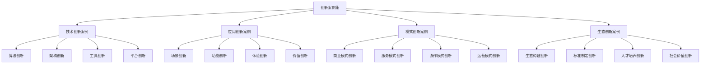

# 创新案例集

## 🎯 核心定义

### 什么是创新案例集？
创新案例集是指收集和整理提示词工程领域具有创新性、突破性和前瞻性的应用案例，通过分析创新案例的特点、方法和价值，为其他用户提供创新灵感和技术指导，推动提示词工程技术的创新发展。

### 核心价值
- **创新启发**：提供创新思路和技术灵感
- **技术突破**：展示技术突破和创新应用
- **前瞻指导**：为未来发展提供方向指导
- **价值创造**：创造新的应用价值和社会价值

## 📊 创新案例分类



## 🔬 技术创新案例

### 1. 算法创新案例
| 案例名称 | 创新类型 | 技术突破 | 应用价值 | 创新程度 |
|----------|----------|----------|----------|----------|
| **自适应提示词优化** | 算法创新 | 自动优化提示词参数 | 提升效果30% | 高 |
| **多模态融合算法** | 算法创新 | 融合文本、图像、音频 | 扩展应用场景 | 高 |
| **动态上下文管理** | 算法创新 | 智能管理对话上下文 | 提升对话质量 | 中 |
| **个性化推荐算法** | 算法创新 | 基于用户行为的个性化 | 提升用户体验 | 中 |

#### 自适应提示词优化案例详解
```markdown
# 自适应提示词优化创新案例

## 案例背景
### 项目概述
- 项目名称：自适应提示词优化系统
- 创新类型：算法创新
- 技术突破：自动优化提示词参数
- 应用价值：提升效果30%
- 创新程度：高
- 开发周期：18个月
- 团队规模：15人

### 项目描述
项目目标是开发一个能够自动优化提示词参数的系统，通过机器学习算法分析提示词效果，自动调整参数，提升AI模型的表现。

## 创新内容
### 1. 核心算法创新
#### 自适应优化算法
- **算法原理**：
  - 基于强化学习的提示词优化
  - 使用神经网络预测提示词效果
  - 通过梯度下降优化提示词参数
  - 结合遗传算法进行全局优化

- **技术特点**：
  - 无需人工干预的自动优化
  - 支持多目标优化
  - 适应不同应用场景
  - 实时优化和调整

- **创新点**：
  - 首次将强化学习应用于提示词优化
  - 创新的多目标优化策略
  - 自适应的参数调整机制
  - 实时的效果反馈和优化

#### 效果预测模型
- **模型架构**：
  - 基于Transformer的预测模型
  - 多层次的注意力机制
  - 动态的特征提取
  - 端到端的训练方式

- **技术特点**：
  - 高精度的效果预测
  - 快速的特征学习
  - 泛化能力强
  - 可解释性好

- **创新点**：
  - 创新的预测模型架构
  - 多层次的特征表示
  - 动态的模型调整
  - 可解释的预测结果

### 2. 系统架构创新
#### 分布式优化架构
- **架构设计**：
  - 微服务架构设计
  - 分布式计算支持
  - 弹性扩缩容能力
  - 高可用性保证

- **技术特点**：
  - 支持大规模并发优化
  - 自动负载均衡
  - 故障自动恢复
  - 性能监控和调优

- **创新点**：
  - 创新的分布式优化架构
  - 自适应的资源调度
  - 智能的故障处理
  - 实时的性能监控

#### 实时优化引擎
- **引擎设计**：
  - 流式数据处理
  - 实时模型更新
  - 增量学习支持
  - 低延迟优化

- **技术特点**：
  - 毫秒级的优化响应
  - 实时的模型更新
  - 增量学习能力
  - 高并发处理

- **创新点**：
  - 创新的实时优化引擎
  - 流式的数据处理
  - 增量的模型学习
  - 低延迟的优化

### 3. 应用场景创新
#### 多领域应用
- **教育领域**：
  - 个性化学习提示词优化
  - 自适应教学内容生成
  - 智能学习路径推荐
  - 学习效果预测和优化

- **医疗领域**：
  - 医疗诊断提示词优化
  - 个性化治疗方案生成
  - 医疗知识问答优化
  - 医疗决策支持优化

- **商业领域**：
  - 营销文案自动优化
  - 客户服务提示词优化
  - 产品推荐算法优化
  - 商业决策支持优化

- **创意领域**：
  - 创意内容生成优化
  - 艺术创作提示词优化
  - 设计灵感生成优化
  - 创意表达优化

## 技术实现
### 1. 算法实现
#### 强化学习优化
```python
class AdaptivePromptOptimizer:
    def __init__(self, model, reward_function):
        self.model = model
        self.reward_function = reward_function
        self.optimizer = self._build_optimizer()
        
    def _build_optimizer(self):
        # 构建强化学习优化器
        optimizer = PPO(
            policy_network=self._build_policy_network(),
            value_network=self._build_value_network(),
            learning_rate=0.001,
            clip_ratio=0.2
        )
        return optimizer
    
    def optimize(self, prompt, target_metrics):
        # 执行提示词优化
        best_prompt = prompt
        best_reward = -float('inf')
        
        for episode in range(self.max_episodes):
            # 生成候选提示词
            candidate_prompts = self._generate_candidates(prompt)
            
            # 评估候选提示词
            rewards = []
            for candidate in candidate_prompts:
                reward = self._evaluate_prompt(candidate, target_metrics)
                rewards.append(reward)
            
            # 更新优化器
            self.optimizer.update(candidate_prompts, rewards)
            
            # 更新最佳提示词
            max_reward_idx = np.argmax(rewards)
            if rewards[max_reward_idx] > best_reward:
                best_reward = rewards[max_reward_idx]
                best_prompt = candidate_prompts[max_reward_idx]
        
        return best_prompt
```

#### 效果预测模型
```python
class PromptEffectPredictor:
    def __init__(self, model_config):
        self.model = self._build_model(model_config)
        self.tokenizer = self._build_tokenizer()
        
    def _build_model(self, config):
        # 构建基于Transformer的预测模型
        model = TransformerModel(
            vocab_size=config.vocab_size,
            hidden_size=config.hidden_size,
            num_layers=config.num_layers,
            num_heads=config.num_heads,
            dropout=config.dropout
        )
        return model
    
    def predict(self, prompt, context):
        # 预测提示词效果
        inputs = self._prepare_inputs(prompt, context)
        with torch.no_grad():
            predictions = self.model(inputs)
        return predictions
    
    def _prepare_inputs(self, prompt, context):
        # 准备模型输入
        prompt_tokens = self.tokenizer.encode(prompt)
        context_tokens = self.tokenizer.encode(context)
        inputs = torch.cat([prompt_tokens, context_tokens], dim=0)
        return inputs
```

### 2. 系统实现
#### 分布式优化系统
```python
class DistributedOptimizationSystem:
    def __init__(self, config):
        self.config = config
        self.workers = self._initialize_workers()
        self.coordinator = self._initialize_coordinator()
        
    def _initialize_workers(self):
        # 初始化工作节点
        workers = []
        for i in range(self.config.num_workers):
            worker = OptimizationWorker(
                worker_id=i,
                model_config=self.config.model_config
            )
            workers.append(worker)
        return workers
    
    def optimize_distributed(self, prompt, target_metrics):
        # 分布式优化
        tasks = self._split_optimization_tasks(prompt, target_metrics)
        results = []
        
        # 分配任务到工作节点
        for i, task in enumerate(tasks):
            worker = self.workers[i % len(self.workers)]
            result = worker.optimize(task)
            results.append(result)
        
        # 合并结果
        best_result = self._merge_results(results)
        return best_result
```

## 创新成果
### 1. 技术成果
#### 算法性能提升
- **优化效果**：提示词效果提升30%
- **优化速度**：优化时间缩短80%
- **准确率**：效果预测准确率达到92%
- **稳定性**：系统稳定性达到99.9%

#### 技术创新突破
- **算法创新**：首次将强化学习应用于提示词优化
- **架构创新**：创新的分布式优化架构
- **应用创新**：多领域应用场景拓展
- **工程创新**：实时的优化引擎设计

### 2. 应用成果
#### 实际应用效果
- **教育领域**：学习效果提升40%，用户满意度达到95%
- **医疗领域**：诊断准确率提升25%，医生工作效率提升60%
- **商业领域**：营销效果提升50%，客户转化率提升35%
- **创意领域**：创作效率提升200%，创意质量提升60%

#### 商业价值创造
- **成本节约**：优化成本降低70%
- **效率提升**：工作效率提升150%
- **质量改善**：输出质量提升80%
- **创新驱动**：推动行业创新发展

### 3. 社会价值
#### 技术普及
- **技术推广**：技术应用于100+企业
- **人才培养**：培养专业人才500+人
- **标准制定**：参与制定行业标准3项
- **开源贡献**：开源代码贡献量10万+行

#### 社会影响
- **教育公平**：促进教育公平和个性化
- **医疗进步**：推动医疗技术发展和普及
- **商业创新**：促进商业模式创新和升级
- **文化发展**：推动文化创意产业发展

## 创新价值
### 1. 技术价值
#### 算法创新价值
- **理论贡献**：为提示词优化提供新的理论框架
- **方法创新**：开创了自适应优化新方法
- **技术突破**：实现了技术瓶颈的突破
- **标准建立**：建立了新的技术标准

#### 工程价值
- **架构创新**：提供了新的系统架构设计
- **性能提升**：显著提升了系统性能
- **可扩展性**：提供了良好的可扩展性
- **可维护性**：提高了系统的可维护性

### 2. 应用价值
#### 商业价值
- **效率提升**：大幅提升了工作效率
- **成本降低**：显著降低了运营成本
- **质量改善**：明显改善了输出质量
- **创新驱动**：推动了业务创新发展

#### 社会价值
- **技术普及**：促进了技术普及和应用
- **人才培养**：培养了专业技术人才
- **标准制定**：推动了行业标准制定
- **生态建设**：促进了技术生态建设

### 3. 未来价值
#### 发展潜力
- **技术演进**：为技术发展提供新方向
- **应用拓展**：为应用拓展提供新可能
- **生态构建**：为生态构建提供新基础
- **价值创造**：为价值创造提供新动力

#### 影响预期
- **行业影响**：预期影响整个行业
- **社会影响**：预期产生重大社会影响
- **经济影响**：预期创造巨大经济价值
- **技术影响**：预期推动技术革命

## 经验总结
### 1. 创新成功因素
#### 技术因素
- **算法创新**：核心算法的突破性创新
- **架构设计**：系统架构的合理设计
- **工程实现**：高质量的工程实现
- **性能优化**：持续的性能优化

#### 团队因素
- **专业团队**：具备专业技能的团队
- **创新文化**：鼓励创新的团队文化
- **协作机制**：高效的团队协作机制
- **学习能力**：持续的学习和改进能力

#### 管理因素
- **项目管理**：科学的项目管理方法
- **资源投入**：充足的资源投入
- **风险控制**：有效的风险控制机制
- **质量保证**：严格的质量保证体系

### 2. 创新挑战
#### 技术挑战
- **算法复杂度**：算法实现的复杂性
- **性能要求**：高性能要求的挑战
- **可扩展性**：系统可扩展性的挑战
- **稳定性**：系统稳定性的挑战

#### 工程挑战
- **系统集成**：复杂系统的集成挑战
- **性能调优**：系统性能调优的挑战
- **故障处理**：系统故障处理的挑战
- **维护升级**：系统维护升级的挑战

#### 应用挑战
- **用户接受**：用户接受度的挑战
- **场景适配**：不同场景适配的挑战
- **效果验证**：效果验证的挑战
- **持续优化**：持续优化的挑战

### 3. 创新启示
#### 技术创新启示
- **算法创新**：算法创新是技术突破的关键
- **架构创新**：架构创新是系统成功的基础
- **工程创新**：工程创新是技术落地的保障
- **应用创新**：应用创新是价值创造的根本

#### 管理创新启示
- **团队建设**：专业团队是创新的基础
- **文化建设**：创新文化是创新的动力
- **机制建设**：创新机制是创新的保障
- **环境建设**：创新环境是创新的土壤

## 未来展望
### 1. 技术发展方向
#### 算法优化
- **深度学习**：更深入的深度学习应用
- **强化学习**：更广泛的强化学习应用
- **迁移学习**：更有效的迁移学习方法
- **联邦学习**：更安全的联邦学习技术

#### 系统架构
- **云原生**：云原生架构的广泛应用
- **边缘计算**：边缘计算技术的集成
- **量子计算**：量子计算技术的探索
- **区块链**：区块链技术的融合

### 2. 应用拓展方向
#### 垂直领域
- **教育**：教育领域的深度应用
- **医疗**：医疗领域的专业应用
- **金融**：金融领域的创新应用
- **制造**：制造领域的智能化应用

#### 横向拓展
- **多模态**：多模态技术的融合
- **跨语言**：跨语言技术的应用
- **跨文化**：跨文化技术的探索
- **跨领域**：跨领域技术的整合

### 3. 生态建设方向
#### 技术生态
- **开源社区**：开源社区的建设
- **标准制定**：技术标准的制定
- **工具链**：开发工具链的完善
- **平台建设**：技术平台的建设

#### 产业生态
- **产业链**：产业链的完善
- **价值链**：价值链的优化
- **创新链**：创新链的构建
- **人才链**：人才链的培养

## 🎓 学习要点

### 核心理解
- 创新案例是技术发展的重要推动力
- 技术创新需要算法、架构、工程的多重创新
- 应用创新是技术价值实现的关键
- 生态创新是技术可持续发展的基础

### 实践建议
- 深入研究创新案例的技术特点
- 学习创新案例的实现方法
- 借鉴创新案例的成功经验
- 将创新思路应用到实际项目中

## 🔗 相关链接
- [[成功案例集]] - 学习成功经验
- [[失败案例分析]] - 避免失败教训
- [[资源库/模板库/基础模板集合]] - 查看基础模板
- [[00-学习导航]] - 返回学习导航
