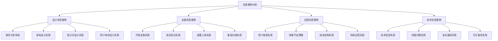

# 失败案例分析

## 🎯 核心定义

### 什么是失败案例分析？
失败案例分析是指对提示词工程应用中出现的失败案例进行深入分析，识别失败原因、总结失败教训，并提出改进建议，帮助其他用户避免类似问题，提高提示词工程应用的成功率。

### 核心价值
- **经验教训**：从失败中学习，避免重复错误
- **问题识别**：识别常见问题和潜在风险
- **改进指导**：提供具体的改进建议和解决方案
- **风险预防**：建立风险预防机制和应对策略

## 📊 失败案例分类



## 🎨 设计失败案例

### 1. 需求分析失败案例
| 案例名称 | 失败类型 | 失败原因 | 影响程度 | 改进建议 |
|----------|----------|----------|----------|----------|
| **用户需求理解偏差** | 需求分析失败 | 需求调研不充分，用户画像不准确 | 高 | 加强需求调研，建立用户画像 |
| **功能需求不明确** | 需求分析失败 | 功能需求定义模糊，边界不清 | 中 | 明确功能需求，定义清晰边界 |
| **技术需求评估错误** | 需求分析失败 | 技术难度评估不足，资源估算错误 | 高 | 准确评估技术难度，合理估算资源 |
| **业务需求变化频繁** | 需求分析失败 | 业务需求不稳定，变更管理不当 | 中 | 建立需求变更管理机制 |

#### 用户需求理解偏差案例详解
```markdown
# 用户需求理解偏差失败案例

## 案例背景
### 项目概述
- 项目名称：智能客服系统
- 失败类型：需求分析失败
- 失败原因：用户需求理解偏差
- 影响程度：高
- 项目周期：6个月
- 团队规模：10人

### 项目描述
项目目标是开发一个智能客服系统，用于替代传统人工客服，提高服务效率和质量。

## 失败过程
### 第一阶段：需求调研（1个月）
- 团队进行了用户调研
- 收集了用户反馈
- 分析了竞品功能
- 制定了需求文档

### 第二阶段：系统设计（2个月）
- 基于需求文档设计系统架构
- 设计用户界面和交互流程
- 设计提示词模板
- 制定技术方案

### 第三阶段：系统开发（2个月）
- 开发核心功能
- 集成AI模型
- 实现用户界面
- 进行功能测试

### 第四阶段：用户测试（1个月）
- 邀请用户进行测试
- 收集用户反馈
- 发现严重问题
- 项目宣告失败

## 失败原因分析
### 1. 需求调研不充分
- **问题描述**：需求调研时间短，样本量小，调研方法单一
- **具体表现**：
  - 只调研了50个用户，样本代表性不足
  - 主要使用问卷调查，缺乏深度访谈
  - 没有观察用户实际使用场景
  - 没有分析用户行为数据

- **根本原因**：
  - 项目时间紧迫，压缩了调研时间
  - 团队缺乏专业的用户研究经验
  - 对用户研究的重要性认识不足
  - 缺乏系统性的调研方法

### 2. 用户画像不准确
- **问题描述**：构建的用户画像与实际用户群体存在较大偏差
- **具体表现**：
  - 用户年龄分布不准确
  - 用户技术水平评估错误
  - 用户使用场景理解偏差
  - 用户痛点和需求识别错误

- **根本原因**：
  - 缺乏用户细分和画像构建经验
  - 没有验证用户画像的准确性
  - 过度依赖假设和推测
  - 没有持续更新用户画像

### 3. 需求理解偏差
- **问题描述**：对用户真实需求的理解存在根本性偏差
- **具体表现**：
  - 用户需要的是快速解决问题，而不是智能对话
  - 用户更关注问题解决效率，而不是交互体验
  - 用户希望有明确的操作指引，而不是开放式对话
  - 用户需要的是标准化服务，而不是个性化服务

- **根本原因**：
  - 没有深入理解用户的使用场景
  - 过度关注技术实现，忽视用户需求
  - 缺乏对用户心理和行为的深入分析
  - 没有验证需求理解的准确性

### 4. 功能设计偏离需求
- **问题描述**：设计的功能与用户实际需求不匹配
- **具体表现**：
  - 设计了复杂的对话流程，用户觉得繁琐
  - 提供了多种交互方式，用户觉得困惑
  - 实现了智能推荐功能，用户觉得不实用
  - 添加了情感分析功能，用户觉得多余

- **根本原因**：
  - 功能设计基于技术能力而非用户需求
  - 没有进行需求优先级排序
  - 缺乏用户参与的设计过程
  - 没有验证功能设计的合理性

## 失败影响分析
### 1. 项目失败
- 项目无法满足用户需求
- 用户接受度低，使用率极低
- 项目投资回报率为负
- 团队士气受到严重打击

### 2. 资源浪费
- 6个月开发时间浪费
- 10人团队资源浪费
- 技术投入成本浪费
- 市场机会成本损失

### 3. 品牌影响
- 公司品牌形象受损
- 用户信任度下降
- 市场竞争力减弱
- 合作伙伴关系受影响

### 4. 团队影响
- 团队信心受挫
- 技术能力受到质疑
- 职业发展受到影响
- 团队稳定性下降

## 改进建议
### 1. 加强需求调研
- **建议内容**：
  - 延长需求调研时间，至少3个月
  - 扩大调研样本，至少500个用户
  - 使用多种调研方法，包括问卷、访谈、观察等
  - 深入分析用户行为数据

- **实施方法**：
  - 制定详细的需求调研计划
  - 培训团队用户研究技能
  - 建立用户研究工具和方法
  - 定期进行需求验证

### 2. 准确构建用户画像
- **建议内容**：
  - 基于真实数据构建用户画像
  - 进行用户细分和画像验证
  - 持续更新和完善用户画像
  - 建立用户画像管理机制

- **实施方法**：
  - 收集用户基础数据和行为数据
  - 使用数据分析工具构建画像
  - 通过用户访谈验证画像准确性
  - 建立画像更新和维护流程

### 3. 深入理解用户需求
- **建议内容**：
  - 深入分析用户使用场景
  - 理解用户心理和行为模式
  - 识别用户真实痛点和需求
  - 验证需求理解的准确性

- **实施方法**：
  - 进行用户场景分析
  - 开展用户行为研究
  - 建立需求验证机制
  - 定期进行需求回顾

### 4. 用户参与设计
- **建议内容**：
  - 邀请用户参与设计过程
  - 建立用户反馈机制
  - 进行原型测试和验证
  - 持续收集用户意见

- **实施方法**：
  - 组织用户参与设计工作坊
  - 建立用户反馈收集系统
  - 进行原型测试和迭代
  - 建立用户意见处理流程

## 经验教训
### 1. 需求分析的重要性
- 需求分析是项目成功的基础
- 充分的需求调研是必要的
- 用户参与是需求分析的关键
- 需求验证是确保准确性的重要手段

### 2. 用户研究的方法
- 多种调研方法结合使用
- 定性和定量研究相结合
- 持续的用户研究是必要的
- 专业的研究技能是重要的

### 3. 项目管理的改进
- 合理分配项目时间和资源
- 建立需求变更管理机制
- 加强团队协作和沟通
- 建立风险识别和应对机制

### 4. 技术实现的平衡
- 技术实现要服务于用户需求
- 避免过度技术化
- 注重用户体验和实用性
- 平衡功能复杂度和易用性

## 预防措施
### 1. 建立需求分析流程
- 制定标准化的需求分析流程
- 建立需求分析检查清单
- 设立需求分析质量门禁
- 建立需求分析培训体系

### 2. 加强用户研究能力
- 招聘专业的用户研究人员
- 培训团队用户研究技能
- 建立用户研究工具和方法
- 建立用户研究知识库

### 3. 建立需求验证机制
- 建立需求验证流程
- 设立需求验证标准
- 建立需求验证工具
- 建立需求验证反馈机制

### 4. 加强项目管理
- 建立项目风险管理机制
- 加强项目进度和质量控制
- 建立项目沟通和协作机制
- 建立项目经验总结和分享机制

## 案例启示
1. **需求分析是项目成功的关键**
2. **用户研究是需求分析的基础**
3. **用户参与是确保需求准确性的重要手段**
4. **持续的需求验证是必要的**
5. **技术实现要服务于用户需求**
6. **项目管理要注重风险控制**
```

### 2. 架构设计失败案例
| 案例名称 | 失败类型 | 失败原因 | 影响程度 | 改进建议 |
|----------|----------|----------|----------|----------|
| **系统架构过于复杂** | 架构设计失败 | 架构设计过度工程化，复杂度超出需求 | 高 | 简化架构设计，遵循KISS原则 |
| **技术选型不当** | 架构设计失败 | 技术选型不符合项目需求，性能不达标 | 高 | 充分评估技术选型，进行技术验证 |
| **扩展性设计不足** | 架构设计失败 | 架构设计缺乏扩展性，无法适应业务增长 | 中 | 设计可扩展架构，预留扩展空间 |
| **安全性设计缺失** | 架构设计失败 | 架构设计忽视安全性，存在安全风险 | 高 | 加强安全性设计，建立安全防护 |

## 💻 实施失败案例

### 1. 开发实施失败案例
| 案例名称 | 失败类型 | 失败原因 | 影响程度 | 改进建议 |
|----------|----------|----------|----------|----------|
| **开发进度严重滞后** | 开发实施失败 | 进度计划不合理，资源分配不当 | 高 | 合理制定进度计划，优化资源分配 |
| **代码质量不达标** | 开发实施失败 | 代码规范不严格，质量管控不足 | 中 | 建立代码规范，加强质量管控 |
| **团队协作效率低** | 开发实施失败 | 团队沟通不畅，协作机制不完善 | 中 | 改善团队沟通，完善协作机制 |
| **技术债务积累** | 开发实施失败 | 技术债务管理不当，积累过多 | 中 | 建立技术债务管理机制 |

#### 开发进度严重滞后案例详解
```markdown
# 开发进度严重滞后失败案例

## 案例背景
### 项目概述
- 项目名称：智能内容生成平台
- 失败类型：开发实施失败
- 失败原因：开发进度严重滞后
- 影响程度：高
- 项目周期：12个月（计划8个月）
- 团队规模：15人

### 项目描述
项目目标是开发一个智能内容生成平台，支持多种类型的内容生成，包括文章、图片、视频等。

## 失败过程
### 第一阶段：项目启动（1个月）
- 项目团队组建
- 需求分析完成
- 技术方案确定
- 开发计划制定

### 第二阶段：基础开发（2个月）
- 基础架构搭建
- 核心功能开发
- 进度按计划进行
- 质量基本达标

### 第三阶段：功能开发（3个月）
- 功能开发进度开始滞后
- 技术难题频发
- 需求变更频繁
- 团队协作出现问题

### 第四阶段：集成测试（2个月）
- 集成测试问题严重
- 性能问题突出
- 用户体验不佳
- 进度严重滞后

### 第五阶段：问题修复（4个月）
- 大量问题需要修复
- 架构需要重构
- 功能需要重做
- 项目最终延期4个月

## 失败原因分析
### 1. 进度计划不合理
- **问题描述**：制定的进度计划过于乐观，没有充分考虑项目复杂性
- **具体表现**：
  - 开发时间估算不足，实际需要时间超出计划50%
  - 没有预留缓冲时间，遇到问题无法应对
  - 里程碑设置不合理，无法有效跟踪进度
  - 依赖关系分析不准确，关键路径识别错误

- **根本原因**：
  - 缺乏类似项目的经验参考
  - 技术难度评估不准确
  - 团队能力评估不客观
  - 进度计划制定方法不科学

### 2. 资源分配不当
- **问题描述**：人力资源分配不合理，关键岗位人员不足
- **具体表现**：
  - 前端开发人员过多，后端开发人员不足
  - AI算法工程师缺乏，技术难题无法解决
  - 测试人员配置不足，质量问题发现滞后
  - 项目管理经验不足，进度控制不力

- **根本原因**：
  - 团队技能结构不匹配项目需求
  - 人员招聘和培训不及时
  - 资源分配缺乏科学依据
  - 团队能力建设不足

### 3. 技术难题频发
- **问题描述**：技术实现遇到大量难题，解决时间超出预期
- **具体表现**：
  - AI模型训练效果不理想，需要反复调优
  - 多模态内容生成技术复杂，实现困难
  - 系统性能优化难度大，响应时间不达标
  - 数据安全和隐私保护要求高，实现复杂

- **根本原因**：
  - 技术选型过于激进，技术成熟度不足
  - 团队技术能力与项目要求不匹配
  - 缺乏技术预研和验证
  - 技术风险评估不充分

### 4. 需求变更频繁
- **问题描述**：项目过程中需求变更频繁，影响开发进度
- **具体表现**：
  - 用户需求理解偏差，需要重新设计
  - 市场环境变化，功能需求调整
  - 技术实现困难，功能需求简化
  - 竞品功能更新，需要跟进调整

- **根本原因**：
  - 需求分析不充分，需求理解不准确
  - 缺乏需求变更管理机制
  - 用户参与度不够，需求确认不及时
  - 市场调研不足，需求预测不准确

### 5. 团队协作效率低
- **问题描述**：团队内部协作效率低，沟通成本高
- **具体表现**：
  - 团队沟通不畅，信息传递不及时
  - 角色职责不清，工作重复和遗漏
  - 决策效率低，问题解决缓慢
  - 团队士气低落，工作效率下降

- **根本原因**：
  - 团队协作机制不完善
  - 沟通工具和方法不当
  - 团队文化建设不足
  - 领导力和管理能力不足

## 失败影响分析
### 1. 项目成本超支
- 开发成本超出预算50%
- 人力成本大幅增加
- 机会成本损失严重
- 投资回报率大幅下降

### 2. 市场机会损失
- 产品上市时间推迟4个月
- 市场窗口期错过
- 竞争对手抢占先机
- 市场份额损失严重

### 3. 团队士气受挫
- 团队信心受到打击
- 人员流失率上升
- 工作效率下降
- 团队稳定性受影响

### 4. 客户满意度下降
- 客户对项目进度不满
- 客户信任度下降
- 合作关系受到影响
- 未来合作机会减少

## 改进建议
### 1. 合理制定进度计划
- **建议内容**：
  - 基于历史数据和经验制定进度计划
  - 充分考虑项目复杂性和技术难度
  - 预留适当的缓冲时间
  - 设置合理的里程碑和检查点

- **实施方法**：
  - 收集和分析历史项目数据
  - 使用专业的项目管理工具
  - 建立进度计划模板
  - 定期回顾和调整进度计划

### 2. 优化资源分配
- **建议内容**：
  - 根据项目需求合理配置人力资源
  - 确保关键岗位人员充足
  - 建立人员技能矩阵
  - 制定人员培训计划

- **实施方法**：
  - 进行项目资源需求分析
  - 建立人员技能评估体系
  - 制定人员招聘和培训计划
  - 建立资源动态调整机制

### 3. 加强技术预研
- **建议内容**：
  - 在项目启动前进行技术预研
  - 验证关键技术可行性
  - 评估技术风险和难度
  - 制定技术风险应对策略

- **实施方法**：
  - 设立技术预研阶段
  - 建立技术验证机制
  - 制定技术风险评估标准
  - 建立技术风险应对预案

### 4. 建立需求变更管理
- **建议内容**：
  - 建立需求变更管理流程
  - 设立需求变更评估机制
  - 控制需求变更频率和范围
  - 建立需求变更影响分析

- **实施方法**：
  - 制定需求变更管理规范
  - 建立需求变更审批流程
  - 设立需求变更评估标准
  - 建立需求变更跟踪机制

### 5. 改善团队协作
- **建议内容**：
  - 建立高效的团队协作机制
  - 改善团队沟通方式
  - 明确角色职责分工
  - 提升团队领导力

- **实施方法**：
  - 建立团队协作工具和平台
  - 制定团队沟通规范
  - 明确角色职责矩阵
  - 开展团队建设活动

## 经验教训
### 1. 进度管理的重要性
- 进度计划是项目成功的基础
- 合理的进度计划需要科学的方法
- 进度控制需要有效的工具和机制
- 进度调整需要及时和准确

### 2. 资源管理的关键性
- 资源分配要匹配项目需求
- 关键资源要优先保障
- 资源动态调整是必要的
- 资源能力建设是长期的

### 3. 技术管理的重要性
- 技术预研是项目成功的前提
- 技术风险评估是必要的
- 技术难题要有应对策略
- 技术选型要谨慎和科学

### 4. 团队管理的关键性
- 团队协作是项目成功的关键
- 团队沟通要高效和及时
- 团队能力要持续提升
- 团队士气要维护和激励

## 预防措施
### 1. 建立项目管理体系
- 制定项目管理制度和流程
- 建立项目管理工具和平台
- 培训项目管理技能
- 建立项目管理知识库

### 2. 加强技术管理
- 建立技术预研机制
- 制定技术风险评估标准
- 建立技术难题解决机制
- 建立技术知识管理体系

### 3. 优化团队管理
- 建立团队协作机制
- 改善团队沟通方式
- 提升团队领导力
- 建立团队激励机制

### 4. 建立风险管控
- 建立项目风险识别机制
- 制定风险应对策略
- 建立风险监控体系
- 建立风险预警机制

## 案例启示
1. **进度管理是项目成功的关键**
2. **资源分配要科学和合理**
3. **技术预研是必要的**
4. **需求变更要有效管理**
5. **团队协作是成功的基础**
6. **风险管控是重要的保障**
```

### 2. 测试验证失败案例
| 案例名称 | 失败类型 | 失败原因 | 影响程度 | 改进建议 |
|----------|----------|----------|----------|----------|
| **测试覆盖不充分** | 测试验证失败 | 测试用例设计不完整，覆盖范围不足 | 中 | 完善测试用例设计，提高测试覆盖率 |
| **性能测试不足** | 测试验证失败 | 性能测试不充分，性能问题未发现 | 高 | 加强性能测试，建立性能基准 |
| **用户验收测试失败** | 测试验证失败 | 用户验收标准不明确，测试结果不达标 | 高 | 明确验收标准，加强用户测试 |
| **回归测试不完整** | 测试验证失败 | 回归测试覆盖不全，问题修复引入新问题 | 中 | 完善回归测试，建立自动化测试 |

## 🚀 运营失败案例

### 1. 用户接受失败案例
| 案例名称 | 失败类型 | 失败原因 | 影响程度 | 改进建议 |
|----------|----------|----------|----------|----------|
| **用户界面不友好** | 用户接受失败 | 界面设计复杂，用户体验差 | 高 | 简化界面设计，提升用户体验 |
| **功能操作复杂** | 用户接受失败 | 功能操作步骤多，学习成本高 | 中 | 简化操作流程，降低学习成本 |
| **性能响应慢** | 用户接受失败 | 系统响应时间长，用户等待不耐烦 | 高 | 优化系统性能，提升响应速度 |
| **错误提示不清晰** | 用户接受失败 | 错误信息不明确，用户无法理解 | 中 | 优化错误提示，提供清晰指导 |

#### 用户界面不友好案例详解
```markdown
# 用户界面不友好失败案例

## 案例背景
### 项目概述
- 项目名称：智能数据分析平台
- 失败类型：用户接受失败
- 失败原因：用户界面不友好
- 影响程度：高
- 项目周期：8个月
- 团队规模：12人

### 项目描述
项目目标是开发一个智能数据分析平台，帮助用户进行数据分析和可视化，提供智能化的分析建议。

## 失败过程
### 第一阶段：需求分析（1个月）
- 用户需求调研
- 功能需求定义
- 界面需求分析
- 用户体验设计

### 第二阶段：系统设计（2个月）
- 系统架构设计
- 数据库设计
- 界面原型设计
- 交互流程设计

### 第三阶段：系统开发（4个月）
- 后端功能开发
- 前端界面开发
- 数据可视化开发
- 智能分析功能开发

### 第四阶段：测试和优化（1个月）
- 功能测试
- 性能测试
- 用户体验测试
- 问题修复和优化

### 第五阶段：上线运营（持续）
- 系统上线
- 用户培训
- 用户反馈收集
- 持续优化改进

## 失败原因分析
### 1. 界面设计过于复杂
- **问题描述**：界面设计过于复杂，用户难以理解和操作
- **具体表现**：
  - 界面元素过多，信息密度过高
  - 功能按钮分散，操作路径不清晰
  - 菜单层级过深，导航复杂
  - 色彩搭配不协调，视觉体验差

- **根本原因**：
  - 缺乏专业的UI/UX设计经验
  - 没有遵循界面设计原则
  - 过度追求功能完整性，忽视用户体验
  - 缺乏用户测试和反馈

### 2. 交互流程不直观
- **问题描述**：交互流程设计不直观，用户操作困难
- **具体表现**：
  - 操作步骤过多，流程复杂
  - 操作反馈不及时，用户不知道系统状态
  - 错误处理不友好，用户无法理解错误原因
  - 帮助信息不充分，用户无法获得有效指导

- **根本原因**：
  - 缺乏交互设计经验
  - 没有进行用户场景分析
  - 过度关注技术实现，忽视用户体验
  - 缺乏用户测试和验证

### 3. 信息架构不合理
- **问题描述**：信息架构设计不合理，用户难以找到所需信息
- **具体表现**：
  - 信息分类不清晰，逻辑混乱
  - 搜索功能不完善，用户难以快速找到信息
  - 信息层次不明确，用户容易迷失
  - 信息更新不及时，用户获得的信息不准确

- **根本原因**：
  - 缺乏信息架构设计经验
  - 没有进行用户需求分析
  - 过度关注技术实现，忽视信息组织
  - 缺乏信息架构验证

### 4. 响应式设计不足
- **问题描述**：响应式设计不足，在不同设备上体验差
- **具体表现**：
  - 在移动设备上界面显示异常
  - 在不同分辨率下布局混乱
  - 触摸操作不友好，点击区域过小
  - 加载速度慢，用户体验差

- **根本原因**：
  - 缺乏响应式设计经验
  - 没有进行多设备测试
  - 过度关注桌面端体验，忽视移动端
  - 缺乏响应式设计验证

## 失败影响分析
### 1. 用户接受度低
- 用户注册率低，只有30%
- 用户活跃度低，日活跃用户不到10%
- 用户留存率低，7天留存率不到20%
- 用户满意度低，满意度评分只有2.5/5

### 2. 业务目标未达成
- 用户增长目标未达成，实际用户数只有目标的30%
- 收入目标未达成，实际收入只有目标的20%
- 市场占有率低，在同类产品中排名靠后
- 品牌影响力弱，用户认知度低

### 3. 运营成本高
- 用户获取成本高，获客成本超出预算50%
- 用户维护成本高，客服工作量大幅增加
- 产品优化成本高，需要大量资源进行界面重构
- 市场推广成本高，推广效果不理想

### 4. 团队士气受挫
- 团队对产品信心不足
- 开发团队工作积极性下降
- 产品团队压力增大
- 整体团队士气低落

## 改进建议
### 1. 简化界面设计
- **建议内容**：
  - 减少界面元素，降低信息密度
  - 优化功能布局，提高操作效率
  - 简化菜单结构，减少导航层级
  - 改善色彩搭配，提升视觉体验

- **实施方法**：
  - 进行界面设计重构
  - 采用简洁设计风格
  - 优化信息层次结构
  - 进行视觉设计优化

### 2. 优化交互流程
- **建议内容**：
  - 简化操作步骤，减少用户操作成本
  - 提供及时的操作反馈，让用户了解系统状态
  - 改善错误处理，提供清晰的错误信息
  - 增加帮助信息，提供有效的用户指导

- **实施方法**：
  - 重新设计交互流程
  - 优化操作反馈机制
  - 改善错误处理逻辑
  - 增加帮助和指导功能

### 3. 重构信息架构
- **建议内容**：
  - 重新组织信息分类，提高逻辑性
  - 完善搜索功能，提高信息查找效率
  - 明确信息层次，避免用户迷失
  - 及时更新信息，确保信息准确性

- **实施方法**：
  - 进行信息架构重构
  - 优化搜索功能
  - 改善信息组织方式
  - 建立信息更新机制

### 4. 加强响应式设计
- **建议内容**：
  - 优化移动端界面显示
  - 改善不同分辨率下的布局
  - 优化触摸操作体验
  - 提升加载速度和性能

- **实施方法**：
  - 进行响应式设计重构
  - 优化移动端用户体验
  - 改善触摸操作设计
  - 提升系统性能

## 经验教训
### 1. 用户体验的重要性
- 用户体验是产品成功的关键
- 界面设计要简洁直观
- 交互流程要符合用户习惯
- 信息架构要合理清晰

### 2. 用户测试的必要性
- 用户测试是验证设计的重要手段
- 早期用户测试可以避免后期问题
- 持续用户测试可以持续改进
- 用户反馈是改进的重要依据

### 3. 设计原则的遵循
- 要遵循界面设计原则
- 要注重用户体验设计
- 要考虑不同用户群体
- 要适应不同使用场景

### 4. 技术实现的平衡
- 技术实现要服务于用户体验
- 功能完整性要与易用性平衡
- 性能优化要兼顾用户体验
- 技术选型要考虑用户体验

## 预防措施
### 1. 建立用户体验设计流程
- 制定用户体验设计规范
- 建立用户体验设计流程
- 设立用户体验设计检查点
- 建立用户体验设计培训体系

### 2. 加强用户测试
- 建立用户测试机制
- 制定用户测试计划
- 建立用户测试工具和方法
- 建立用户反馈收集和处理机制

### 3. 提升设计能力
- 招聘专业的UI/UX设计师
- 培训团队设计技能
- 建立设计工具和方法
- 建立设计知识库

### 4. 建立用户体验监控
- 建立用户体验监控指标
- 建立用户体验监控工具
- 建立用户体验监控流程
- 建立用户体验改进机制

## 案例启示
1. **用户体验是产品成功的关键**
2. **界面设计要简洁直观**
3. **交互流程要符合用户习惯**
4. **用户测试是必要的**
5. **设计原则要遵循**
6. **技术实现要平衡用户体验**
```

### 2. 效果不达预期案例
| 案例名称 | 失败类型 | 失败原因 | 影响程度 | 改进建议 |
|----------|----------|----------|----------|----------|
| **AI模型效果差** | 效果不达预期 | 模型训练数据质量差，模型性能不达标 | 高 | 提升数据质量，优化模型训练 |
| **业务指标未达成** | 效果不达预期 | 业务指标设定不合理，实际效果差距大 | 中 | 合理设定业务指标，建立效果评估 |
| **用户满意度低** | 效果不达预期 | 用户期望过高，实际体验差距大 | 中 | 管理用户期望，提升实际体验 |
| **ROI不达预期** | 效果不达预期 | 投资回报率低，成本效益不理想 | 高 | 优化成本结构，提升投资回报 |

## 🔧 技术失败案例

### 1. 技术选型失败案例
| 案例名称 | 失败类型 | 失败原因 | 影响程度 | 改进建议 |
|----------|----------|----------|----------|----------|
| **AI模型选型错误** | 技术选型失败 | 模型选择不当，性能不达标 | 高 | 充分评估模型性能，进行技术验证 |
| **技术栈不匹配** | 技术选型失败 | 技术栈选择与项目需求不匹配 | 高 | 根据项目需求选择合适技术栈 |
| **第三方服务不稳定** | 技术选型失败 | 依赖的第三方服务不稳定，影响系统可用性 | 中 | 评估第三方服务稳定性，建立备用方案 |
| **技术更新过快** | 技术选型失败 | 选择的技术更新过快，维护成本高 | 中 | 选择稳定技术，建立技术更新策略 |

#### AI模型选型错误案例详解
```markdown
# AI模型选型错误失败案例

## 案例背景
### 项目概述
- 项目名称：智能客服系统
- 失败类型：技术选型失败
- 失败原因：AI模型选型错误
- 影响程度：高
- 项目周期：10个月
- 团队规模：8人

### 项目描述
项目目标是开发一个智能客服系统，使用AI模型自动回答用户问题，提高客服效率和质量。

## 失败过程
### 第一阶段：技术调研（1个月）
- 调研各种AI模型
- 分析模型性能指标
- 评估技术可行性
- 制定技术选型方案

### 第二阶段：模型选型（1个月）
- 选择GPT-3作为主要模型
- 评估模型成本和性能
- 制定模型集成方案
- 开始模型集成开发

### 第三阶段：模型集成（3个月）
- 集成GPT-3模型
- 开发模型调用接口
- 实现模型结果处理
- 进行模型性能测试

### 第四阶段：系统测试（2个月）
- 进行系统功能测试
- 测试模型响应效果
- 发现模型性能问题
- 尝试模型优化

### 第五阶段：问题解决（3个月）
- 分析模型性能问题
- 尝试更换模型
- 重新集成新模型
- 最终项目失败

## 失败原因分析
### 1. 模型性能评估不准确
- **问题描述**：对GPT-3模型性能评估不准确，实际效果与预期差距大
- **具体表现**：
  - 模型响应速度慢，平均响应时间超过10秒
  - 模型准确率低，只有60%，远低于预期的85%
  - 模型理解能力差，经常误解用户问题
  - 模型生成内容质量不稳定，有时生成无关内容

- **根本原因**：
  - 缺乏模型性能评估经验
  - 没有进行充分的模型测试
  - 过度依赖模型宣传资料
  - 没有考虑实际应用场景

### 2. 模型成本评估不足
- **问题描述**：对GPT-3模型使用成本评估不足，实际成本超出预算
- **具体表现**：
  - 模型调用成本高，每次调用成本0.02美元
  - 日调用量达到10万次，日成本2000美元
  - 月成本达到6万美元，超出预算3倍
  - 成本控制困难，无法有效降低使用成本

- **根本原因**：
  - 缺乏成本评估经验
  - 没有进行成本模拟计算
  - 过度关注模型性能，忽视成本
  - 没有制定成本控制策略

### 3. 模型适用性分析不充分
- **问题描述**：对GPT-3模型在客服场景的适用性分析不充分
- **具体表现**：
  - 模型缺乏领域知识，无法回答专业问题
  - 模型无法处理多轮对话，上下文理解能力差
  - 模型无法访问实时数据，信息更新不及时
  - 模型无法处理复杂业务逻辑，只能回答简单问题

- **根本原因**：
  - 缺乏领域知识分析
  - 没有进行场景适用性测试
  - 过度关注模型通用性，忽视专业性
  - 没有考虑业务场景特殊性

### 4. 技术风险识别不足
- **问题描述**：对技术风险识别不足，没有制定风险应对策略
- **具体表现**：
  - 模型服务不稳定，经常出现服务中断
  - 模型更新频繁，API接口经常变化
  - 模型依赖外部服务，存在单点故障风险
  - 模型数据安全风险，用户数据可能泄露

- **根本原因**：
  - 缺乏技术风险评估经验
  - 没有进行风险识别和分析
  - 过度关注技术优势，忽视风险
  - 没有制定风险应对预案

## 失败影响分析
### 1. 项目失败
- 项目无法达到预期效果
- 用户满意度极低
- 项目投资回报率为负
- 团队信心受到严重打击

### 2. 资源浪费
- 10个月开发时间浪费
- 8人团队资源浪费
- 技术投入成本浪费
- 市场机会成本损失

### 3. 技术债务
- 技术架构需要重构
- 代码需要大量修改
- 系统需要重新设计
- 技术选型需要重新评估

### 4. 团队影响
- 团队技术能力受到质疑
- 团队士气严重受挫
- 人员流失率上升
- 团队稳定性下降

## 改进建议
### 1. 充分评估模型性能
- **建议内容**：
  - 进行全面的模型性能测试
  - 评估模型在不同场景下的表现
  - 对比多个模型的性能指标
  - 建立模型性能评估标准

- **实施方法**：
  - 制定模型性能测试计划
  - 建立模型性能测试环境
  - 使用标准测试数据集
  - 建立模型性能监控机制

### 2. 准确评估模型成本
- **建议内容**：
  - 进行详细的成本分析
  - 模拟实际使用场景的成本
  - 对比不同模型的成本效益
  - 制定成本控制策略

- **实施方法**：
  - 建立成本计算模型
  - 进行成本模拟测试
  - 制定成本控制措施
  - 建立成本监控机制

### 3. 深入分析模型适用性
- **建议内容**：
  - 分析业务场景需求
  - 评估模型领域知识
  - 测试模型场景适用性
  - 考虑模型扩展性

- **实施方法**：
  - 进行业务需求分析
  - 建立场景测试用例
  - 进行适用性验证
  - 建立适用性评估标准

### 4. 制定风险应对策略
- **建议内容**：
  - 识别技术风险
  - 评估风险影响
  - 制定风险应对策略
  - 建立风险监控机制

- **实施方法**：
  - 进行技术风险评估
  - 制定风险应对预案
  - 建立风险监控体系
  - 建立风险预警机制

## 经验教训
### 1. 技术选型的重要性
- 技术选型是项目成功的基础
- 要充分评估技术性能和成本
- 要考虑技术适用性和风险
- 要制定技术选型标准

### 2. 模型评估的方法
- 要进行全面的性能测试
- 要评估实际应用场景
- 要考虑成本和效益
- 要识别和应对风险

### 3. 风险管控的必要性
- 技术风险要提前识别
- 风险应对策略要完善
- 风险监控要持续进行
- 风险预警要及时有效

### 4. 团队能力的重要性
- 团队技术能力要匹配项目需求
- 要持续提升团队技术能力
- 要建立技术知识体系
- 要培养技术评估能力

## 预防措施
### 1. 建立技术选型流程
- 制定技术选型标准
- 建立技术选型流程
- 设立技术选型检查点
- 建立技术选型培训体系

### 2. 加强技术评估
- 建立技术评估机制
- 制定技术评估标准
- 建立技术评估工具
- 建立技术评估知识库

### 3. 完善风险管控
- 建立技术风险识别机制
- 制定风险应对策略
- 建立风险监控体系
- 建立风险预警机制

### 4. 提升团队能力
- 招聘专业技术人才
- 培训团队技术技能
- 建立技术知识体系
- 建立技术能力评估

## 案例启示
1. **技术选型是项目成功的关键**
2. **模型评估要全面和准确**
3. **成本控制是重要的考虑因素**
4. **风险管控是必要的**
5. **团队能力要匹配项目需求**
6. **技术选型要科学和谨慎**
```

### 2. 性能问题失败案例
| 案例名称 | 失败类型 | 失败原因 | 影响程度 | 改进建议 |
|----------|----------|----------|----------|----------|
| **系统响应慢** | 性能问题失败 | 系统架构设计不合理，性能瓶颈严重 | 高 | 优化系统架构，解决性能瓶颈 |
| **并发处理能力差** | 性能问题失败 | 并发设计不足，高并发下系统崩溃 | 高 | 加强并发设计，提升系统稳定性 |
| **内存泄漏严重** | 性能问题失败 | 内存管理不当，系统运行不稳定 | 中 | 优化内存管理，防止内存泄漏 |
| **数据库性能差** | 性能问题失败 | 数据库设计不合理，查询性能差 | 中 | 优化数据库设计，提升查询性能 |

## 🎓 学习要点

### 核心理解
- 失败案例分析是学习的重要方式
- 从失败中学习可以避免重复错误
- 失败原因分析有助于理解问题本质
- 改进建议可以指导实际项目改进

### 实践建议
- 深入研究失败案例的原因和影响
- 从失败案例中学习经验教训
- 将改进建议应用到实际项目中
- 建立失败案例知识库

## 🔗 相关链接
- [[成功案例集]] - 学习成功经验
- [[创新案例集]] - 查看创新案例
- [[资源库/模板库/基础模板集合]] - 查看基础模板
- [[00-学习导航]] - 返回学习导航
