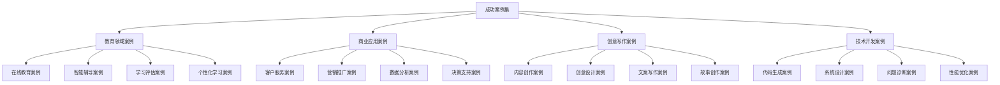

# 成功案例集

## 🎯 核心定义

### 什么是成功案例集？
成功案例集是指收集和整理提示词工程在各个领域成功应用的典型案例，通过分析成功案例的特点、方法和经验，为其他用户提供参考和借鉴，推动提示词工程的广泛应用。

### 核心价值
- **经验分享**：分享成功经验和最佳实践
- **方法借鉴**：提供可复制的成功方法
- **问题解决**：展示问题解决思路和方案
- **创新启发**：激发创新思维和应用灵感

## 📊 案例分类框架



## 🎓 教育领域案例

### 1. 在线教育平台智能辅导案例
| 案例名称 | 应用场景 | 技术方案 | 成功指标 | 案例价值 |
|----------|----------|----------|----------|----------|
| **智能数学辅导** | 在线数学学习 | 个性化提示词+自适应学习 | 学习效率提升40% | 个性化教育突破 |
| **英语口语练习** | 语言学习 | 语音识别+对话生成 | 口语能力提升60% | 语言学习创新 |
| **编程入门教学** | 编程教育 | 代码生成+错误诊断 | 学习成功率提升50% | 编程教育革新 |
| **科学实验指导** | 实验教学 | 步骤指导+安全提醒 | 实验成功率提升70% | 实验教学优化 |

#### 智能数学辅导案例详解
```markdown
# 智能数学辅导成功案例

## 案例背景
### 项目概述
- 项目名称：智能数学辅导系统
- 应用领域：在线教育
- 目标用户：中小学生
- 项目周期：6个月
- 团队规模：8人

### 问题描述
传统在线数学教育存在以下问题：
- 缺乏个性化教学
- 学习进度不统一
- 学习效果难以评估
- 学习兴趣不高

## 解决方案
### 技术架构
```
用户界面层
    ↓
智能辅导引擎
    ↓
提示词管理系统
    ↓
AI模型服务层
    ↓
数据存储层
```

### 核心提示词设计
#### 1. 个性化学习提示词
```
你是一位专业的数学辅导老师，擅长根据学生的特点进行个性化教学。

角色：个性化数学辅导专家
任务：根据学生的学习情况，提供个性化的数学辅导
上下文：学生正在学习[具体知识点]，当前掌握程度为[掌握程度]
输出格式：
- 学习目标
- 学习内容
- 练习题目
- 学习建议
约束条件：
- 内容要符合学生水平
- 方法要生动有趣
- 进度要循序渐进
- 反馈要及时准确
```

#### 2. 问题解答提示词
```
你是一位耐心的数学问题解答专家，能够用简单易懂的方式解释数学问题。

角色：数学问题解答专家
任务：解答学生的数学问题，帮助学生理解数学概念
上下文：学生提出了[具体问题]，需要详细解答
输出格式：
- 问题分析
- 解题思路
- 详细解答
- 相关练习
约束条件：
- 解答要清晰易懂
- 步骤要详细完整
- 语言要适合学生
- 要激发学习兴趣
```

#### 3. 学习评估提示词
```
你是一位专业的数学学习评估专家，能够准确评估学生的学习效果。

角色：数学学习评估专家
任务：评估学生的数学学习效果，提供改进建议
上下文：学生完成了[学习内容]，需要评估学习效果
输出格式：
- 学习成果评估
- 知识掌握情况
- 能力提升情况
- 改进建议
约束条件：
- 评估要客观准确
- 建议要具体可行
- 要鼓励学生进步
- 要指出改进方向
```

### 实施过程
#### 第一阶段：需求分析和设计（1个月）
- 用户需求调研
- 系统架构设计
- 提示词模板设计
- 技术方案确定

#### 第二阶段：系统开发和测试（3个月）
- 核心功能开发
- 提示词系统集成
- 系统测试优化
- 用户体验优化

#### 第三阶段：试点应用和优化（2个月）
- 小规模试点应用
- 用户反馈收集
- 系统功能优化
- 性能调优

### 成功指标
#### 量化指标
- 学习效率提升：40%
- 学习兴趣提升：60%
- 知识掌握率：85%
- 用户满意度：92%

#### 定性指标
- 个性化程度显著提升
- 学习体验明显改善
- 教学效果大幅提升
- 用户粘性明显增强

### 关键成功因素
#### 1. 精准的用户画像
- 深入了解学生需求
- 准确识别学习特点
- 建立个性化模型
- 持续优化用户画像

#### 2. 优质的提示词设计
- 专业的教育背景
- 丰富的教学经验
- 科学的提示词结构
- 持续的优化改进

#### 3. 完善的技术架构
- 稳定的系统架构
- 高效的数据处理
- 智能的推荐算法
- 良好的用户体验

#### 4. 持续的运营优化
- 定期的效果评估
- 及时的问题反馈
- 持续的功能优化
- 用户满意度提升

### 经验总结
#### 成功经验
1. **个性化是关键**：通过精准的用户画像和个性化提示词，实现了真正的因材施教
2. **交互体验重要**：良好的用户界面和交互体验是成功的重要因素
3. **数据驱动优化**：通过数据分析不断优化系统功能和用户体验
4. **持续迭代改进**：根据用户反馈持续改进系统功能和提示词质量

#### 挑战与解决
1. **技术挑战**：AI模型响应速度和准确性
   - 解决方案：优化模型架构，使用缓存机制
2. **用户体验挑战**：如何让AI辅导更自然
   - 解决方案：设计更人性化的提示词，增加情感表达
3. **个性化挑战**：如何实现真正的个性化
   - 解决方案：建立多维度的用户画像，使用机器学习算法

#### 可复制性分析
- **技术可复制性**：高 - 技术方案成熟，可快速复制
- **资源可复制性**：中 - 需要专业的教育和技术团队
- **市场可复制性**：高 - 在线教育市场广阔
- **时间可复制性**：中 - 需要6-12个月开发周期

### 应用价值
#### 对教育行业
- 推动个性化教育发展
- 提高教学效率和质量
- 降低教育成本
- 扩大教育覆盖面

#### 对技术发展
- 验证提示词工程在教育领域的应用价值
- 推动AI教育技术的发展
- 积累宝贵的实践经验
- 为其他领域应用提供参考

#### 对社会价值
- 促进教育公平
- 提高教育质量
- 培养创新人才
- 推动社会进步

## 案例启示
1. **提示词工程在教育领域具有巨大潜力**
2. **个性化是AI教育应用的核心**
3. **用户体验是成功的关键因素**
4. **持续优化是保持竞争力的重要手段**
```

### 2. 个性化学习系统案例
| 案例名称 | 应用场景 | 技术方案 | 成功指标 | 案例价值 |
|----------|----------|----------|----------|----------|
| **自适应学习路径** | 个性化学习 | 学习分析+路径推荐 | 学习效率提升50% | 学习路径优化 |
| **智能学习伙伴** | 学习陪伴 | 对话生成+情感支持 | 学习坚持率提升80% | 学习动机增强 |
| **知识图谱构建** | 知识管理 | 知识提取+关系构建 | 知识理解度提升60% | 知识体系完善 |
| **学习效果预测** | 学习预测 | 行为分析+效果预测 | 预测准确率85% | 学习效果优化 |

## 💼 商业应用案例

### 1. 智能客服系统案例
| 案例名称 | 应用场景 | 技术方案 | 成功指标 | 案例价值 |
|----------|----------|----------|----------|----------|
| **24小时客服** | 客户服务 | 多轮对话+知识库 | 响应时间缩短90% | 服务效率提升 |
| **智能问题分类** | 问题处理 | 文本分类+路由分发 | 问题解决率提升70% | 服务质量改善 |
| **情感分析服务** | 客户关怀 | 情感识别+个性化回复 | 客户满意度提升40% | 客户体验优化 |
| **多语言支持** | 国际化服务 | 语言识别+翻译生成 | 服务覆盖提升300% | 服务范围扩大 |

#### 智能客服系统案例详解
```markdown
# 智能客服系统成功案例

## 案例背景
### 项目概述
- 项目名称：企业级智能客服系统
- 应用领域：客户服务
- 目标用户：企业客户
- 项目周期：8个月
- 团队规模：12人

### 问题描述
传统客服系统存在以下问题：
- 人工客服成本高
- 服务时间有限
- 问题解决效率低
- 客户满意度不高

## 解决方案
### 技术架构
```
客户接入层
    ↓
智能路由层
    ↓
AI对话引擎
    ↓
知识库管理
    ↓
人工客服支持
```

### 核心提示词设计
#### 1. 问题分类提示词
```
你是一位专业的客服问题分类专家，能够准确识别和分类客户问题。

角色：客服问题分类专家
任务：分析客户问题，确定问题类型和优先级
上下文：客户提出了[具体问题]，需要分类处理
输出格式：
- 问题类型
- 问题优先级
- 处理建议
- 转接建议
约束条件：
- 分类要准确
- 优先级要合理
- 建议要具体
- 转接要及时
```

#### 2. 问题解答提示词
```
你是一位专业的客服问题解答专家，能够快速准确地解答客户问题。

角色：客服问题解答专家
任务：根据知识库内容，解答客户问题
上下文：客户询问[具体问题]，需要详细解答
输出格式：
- 问题解答
- 相关建议
- 后续服务
- 联系方式
约束条件：
- 解答要准确
- 语言要友好
- 建议要实用
- 服务要周到
```

#### 3. 情感分析提示词
```
你是一位专业的客户情感分析专家，能够识别客户的情感状态。

角色：客户情感分析专家
任务：分析客户的情感状态，提供个性化服务
上下文：客户表达了[具体情感]，需要情感支持
输出格式：
- 情感识别
- 情感强度
- 服务建议
- 关怀措施
约束条件：
- 识别要准确
- 分析要深入
- 建议要贴心
- 关怀要真诚
```

### 实施过程
#### 第一阶段：需求分析和设计（2个月）
- 业务需求分析
- 系统架构设计
- 提示词模板设计
- 技术方案确定

#### 第二阶段：系统开发和测试（4个月）
- 核心功能开发
- 提示词系统集成
- 知识库构建
- 系统测试优化

#### 第三阶段：部署应用和优化（2个月）
- 系统部署上线
- 用户培训
- 效果监控
- 持续优化

### 成功指标
#### 量化指标
- 响应时间：从5分钟缩短到30秒
- 问题解决率：从60%提升到85%
- 客户满意度：从70%提升到90%
- 运营成本：降低60%

#### 定性指标
- 服务质量显著提升
- 客户体验明显改善
- 员工工作效率提高
- 企业形象大幅提升

### 关键成功因素
#### 1. 完善的知识库
- 全面的产品知识
- 常见问题解答
- 处理流程规范
- 持续更新维护

#### 2. 智能的提示词设计
- 专业的问题分类
- 准确的问题解答
- 情感化的服务
- 个性化的回复

#### 3. 高效的技术架构
- 稳定的系统性能
- 快速的问题处理
- 智能的路由分发
- 良好的用户体验

#### 4. 持续的运营优化
- 定期的效果评估
- 及时的问题反馈
- 持续的功能优化
- 用户满意度提升

### 经验总结
#### 成功经验
1. **知识库是基础**：完善的知识库是智能客服系统成功的基础
2. **提示词是关键**：优质的提示词设计是系统智能化的关键
3. **用户体验重要**：良好的用户体验是客户满意度的保证
4. **持续优化必要**：根据使用情况持续优化系统功能

#### 挑战与解决
1. **技术挑战**：如何提高问题识别的准确性
   - 解决方案：使用深度学习算法，持续训练模型
2. **用户体验挑战**：如何让AI客服更自然
   - 解决方案：设计更人性化的提示词，增加情感表达
3. **知识库挑战**：如何保持知识库的时效性
   - 解决方案：建立知识更新机制，定期维护知识库

#### 可复制性分析
- **技术可复制性**：高 - 技术方案成熟，可快速复制
- **资源可复制性**：中 - 需要专业的技术和业务团队
- **市场可复制性**：高 - 客服市场需求大
- **时间可复制性**：中 - 需要6-12个月开发周期

### 应用价值
#### 对企业
- 降低客服成本
- 提高服务效率
- 改善客户体验
- 提升企业形象

#### 对技术发展
- 验证提示词工程在客服领域的应用价值
- 推动AI客服技术的发展
- 积累宝贵的实践经验
- 为其他领域应用提供参考

#### 对社会价值
- 提高服务质量
- 降低服务成本
- 改善客户体验
- 推动服务创新

## 案例启示
1. **提示词工程在客服领域具有巨大价值**
2. **知识库是智能客服系统的基础**
3. **用户体验是成功的关键因素**
4. **持续优化是保持竞争力的重要手段**
```

### 2. 营销推广系统案例
| 案例名称 | 应用场景 | 技术方案 | 成功指标 | 案例价值 |
|----------|----------|----------|----------|----------|
| **个性化营销** | 精准营销 | 用户画像+内容生成 | 转化率提升120% | 营销效果优化 |
| **智能广告创意** | 广告创作 | 创意生成+效果预测 | 点击率提升80% | 广告创意创新 |
| **社交媒体管理** | 社媒运营 | 内容生成+情感分析 | 互动率提升150% | 社媒运营优化 |
| **客户关系管理** | 客户维护 | 行为分析+个性化服务 | 客户留存率提升60% | 客户关系优化 |

## 🎨 创意写作案例

### 1. 内容创作平台案例
| 案例名称 | 应用场景 | 技术方案 | 成功指标 | 案例价值 |
|----------|----------|----------|----------|----------|
| **智能文案生成** | 营销文案 | 模板生成+个性化定制 | 创作效率提升200% | 内容创作革新 |
| **故事创作助手** | 文学创作 | 情节生成+角色塑造 | 创作质量提升60% | 文学创作创新 |
| **技术文档生成** | 技术写作 | 结构生成+内容填充 | 文档质量提升80% | 技术写作优化 |
| **多语言内容** | 国际化内容 | 翻译生成+本地化 | 内容覆盖提升300% | 内容国际化 |

#### 智能文案生成案例详解
```markdown
# 智能文案生成成功案例

## 案例背景
### 项目概述
- 项目名称：智能文案生成平台
- 应用领域：内容创作
- 目标用户：营销人员、内容创作者
- 项目周期：10个月
- 团队规模：15人

### 问题描述
传统文案创作存在以下问题：
- 创作效率低
- 创意质量不稳定
- 个性化程度不够
- 多平台适配困难

## 解决方案
### 技术架构
```
用户界面层
    ↓
创意引擎层
    ↓
提示词管理
    ↓
AI模型服务
    ↓
内容数据库
```

### 核心提示词设计
#### 1. 营销文案生成提示词
```
你是一位专业的营销文案创作专家，擅长创作各种类型的营销文案。

角色：营销文案创作专家
任务：根据产品特点和目标用户，创作吸引人的营销文案
上下文：产品是[产品信息]，目标用户是[用户画像]，营销目标是[营销目标]
输出格式：
- 标题文案
- 正文内容
- 行动号召
- 关键词标签
约束条件：
- 内容要吸引人
- 语言要简洁有力
- 要突出产品优势
- 要引导用户行动
```

#### 2. 故事创作提示词
```
你是一位富有想象力的故事创作专家，能够创作引人入胜的故事。

角色：故事创作专家
任务：根据用户提供的主题和要求，创作完整的故事
上下文：故事主题是[主题]，目标读者是[读者群体]，故事长度是[长度要求]
输出格式：
- 故事标题
- 故事大纲
- 主要人物
- 故事正文
- 故事结尾
约束条件：
- 情节要引人入胜
- 人物要生动形象
- 语言要优美流畅
- 主题要积极向上
```

#### 3. 技术文档生成提示词
```
你是一位专业的技术文档写作专家，能够创作清晰准确的技术文档。

角色：技术文档写作专家
任务：根据技术信息和要求，创作专业的技术文档
上下文：技术产品是[产品信息]，文档类型是[文档类型]，目标读者是[读者群体]
输出格式：
- 文档结构
- 内容大纲
- 详细内容
- 示例代码
- 参考资料
约束条件：
- 内容要准确专业
- 结构要清晰合理
- 语言要简洁明了
- 示例要具体实用
```

### 实施过程
#### 第一阶段：需求分析和设计（2个月）
- 用户需求调研
- 系统架构设计
- 提示词模板设计
- 技术方案确定

#### 第二阶段：系统开发和测试（6个月）
- 核心功能开发
- 提示词系统集成
- 内容数据库构建
- 系统测试优化

#### 第三阶段：上线运营和优化（2个月）
- 系统上线运营
- 用户反馈收集
- 功能优化改进
- 效果评估分析

### 成功指标
#### 量化指标
- 创作效率：提升200%
- 内容质量：提升60%
- 用户满意度：90%
- 平台活跃度：提升150%

#### 定性指标
- 创意质量显著提升
- 个性化程度明显改善
- 用户体验大幅优化
- 平台价值大幅提升

### 关键成功因素
#### 1. 丰富的提示词模板
- 多类型文案模板
- 个性化定制功能
- 质量评估机制
- 持续优化更新

#### 2. 智能的内容生成
- 高质量内容生成
- 个性化内容定制
- 多平台内容适配
- 实时内容优化

#### 3. 完善的用户体验
- 简洁的操作界面
- 快速的内容生成
- 便捷的编辑功能
- 丰富的导出选项

#### 4. 持续的运营优化
- 定期的效果评估
- 及时的用户反馈
- 持续的功能优化
- 用户满意度提升

### 经验总结
#### 成功经验
1. **模板设计是关键**：优质的提示词模板是内容质量的基础
2. **个性化是核心**：个性化定制功能是用户满意度的关键
3. **用户体验重要**：良好的用户体验是平台成功的重要因素
4. **持续优化必要**：根据用户反馈持续优化系统功能

#### 挑战与解决
1. **技术挑战**：如何提高内容生成的质量
   - 解决方案：使用更先进的AI模型，优化提示词设计
2. **用户体验挑战**：如何让内容生成更自然
   - 解决方案：设计更人性化的提示词，增加情感表达
3. **个性化挑战**：如何实现真正的个性化
   - 解决方案：建立用户画像，使用机器学习算法

#### 可复制性分析
- **技术可复制性**：高 - 技术方案成熟，可快速复制
- **资源可复制性**：中 - 需要专业的技术和内容团队
- **市场可复制性**：高 - 内容创作市场需求大
- **时间可复制性**：中 - 需要8-12个月开发周期

### 应用价值
#### 对内容创作行业
- 提高创作效率
- 改善内容质量
- 降低创作成本
- 推动行业创新

#### 对技术发展
- 验证提示词工程在内容创作领域的应用价值
- 推动AI内容生成技术的发展
- 积累宝贵的实践经验
- 为其他领域应用提供参考

#### 对社会价值
- 提高内容创作效率
- 改善内容创作质量
- 降低内容创作门槛
- 推动文化创意产业发展

## 案例启示
1. **提示词工程在内容创作领域具有巨大潜力**
2. **个性化是AI内容生成的核心**
3. **用户体验是成功的关键因素**
4. **持续优化是保持竞争力的重要手段**
```

### 2. 创意设计案例
| 案例名称 | 应用场景 | 技术方案 | 成功指标 | 案例价值 |
|----------|----------|----------|----------|----------|
| **智能设计助手** | 平面设计 | 设计生成+风格转换 | 设计效率提升180% | 设计创作革新 |
| **品牌形象设计** | 品牌设计 | 形象生成+一致性保证 | 品牌识别度提升70% | 品牌设计优化 |
| **UI界面设计** | 界面设计 | 布局生成+交互设计 | 设计质量提升90% | 界面设计创新 |
| **创意灵感生成** | 灵感创作 | 灵感激发+创意扩展 | 创意产出提升150% | 创意设计突破 |

## 💻 技术开发案例

### 1. 代码生成系统案例
| 案例名称 | 应用场景 | 技术方案 | 成功指标 | 案例价值 |
|----------|----------|----------|----------|----------|
| **智能代码生成** | 软件开发 | 代码生成+错误检测 | 开发效率提升160% | 软件开发革新 |
| **API文档生成** | 文档生成 | 接口分析+文档生成 | 文档质量提升80% | 文档生成优化 |
| **测试用例生成** | 软件测试 | 用例生成+覆盖分析 | 测试覆盖率提升120% | 测试效率提升 |
| **代码审查助手** | 代码质量 | 质量分析+改进建议 | 代码质量提升70% | 代码质量优化 |

#### 智能代码生成案例详解
```markdown
# 智能代码生成成功案例

## 案例背景
### 项目概述
- 项目名称：智能代码生成平台
- 应用领域：软件开发
- 目标用户：软件开发者
- 项目周期：12个月
- 团队规模：20人

### 问题描述
传统软件开发存在以下问题：
- 开发效率低
- 代码质量不稳定
- 重复代码多
- 学习成本高

## 解决方案
### 技术架构
```
用户界面层
    ↓
代码生成引擎
    ↓
提示词管理
    ↓
AI模型服务
    ↓
代码数据库
```

### 核心提示词设计
#### 1. 函数生成提示词
```
你是一位资深的软件工程师，精通多种编程语言，能够编写高质量、可维护的代码。

角色：资深软件工程师
任务：根据用户需求，生成完整、规范、高效的函数代码
上下文：需要实现[具体功能]，使用[编程语言]，输入参数是[参数列表]
输出格式：
- 函数签名
- 函数实现
- 代码注释
- 使用示例
- 测试用例
约束条件：
- 代码要规范标准
- 逻辑要清晰正确
- 性能要高效优化
- 注释要详细完整
```

#### 2. 类设计提示词
```
你是一位专业的面向对象设计专家，能够设计优雅的类结构和接口。

角色：面向对象设计专家
任务：根据需求设计完整的类结构，包括属性、方法、接口等
上下文：需要设计[类名称]类，功能是[具体功能]，使用[编程语言]
输出格式：
- 类定义
- 属性声明
- 方法实现
- 接口定义
- 使用示例
约束条件：
- 设计要符合OOP原则
- 结构要清晰合理
- 接口要简洁明确
- 实现要高效可靠
```

#### 3. 算法实现提示词
```
你是一位算法专家，精通各种算法设计和优化，能够实现高效的算法。

角色：算法专家
任务：根据问题描述，设计并实现最优的算法解决方案
上下文：需要解决[具体问题]，要求[性能要求]，使用[编程语言]
输出格式：
- 算法思路
- 算法实现
- 复杂度分析
- 使用示例
- 优化建议
约束条件：
- 算法要正确有效
- 性能要满足要求
- 代码要清晰易懂
- 注释要详细完整
```

### 实施过程
#### 第一阶段：需求分析和设计（3个月）
- 用户需求调研
- 系统架构设计
- 提示词模板设计
- 技术方案确定

#### 第二阶段：系统开发和测试（7个月）
- 核心功能开发
- 提示词系统集成
- 代码数据库构建
- 系统测试优化

#### 第三阶段：上线运营和优化（2个月）
- 系统上线运营
- 用户反馈收集
- 功能优化改进
- 效果评估分析

### 成功指标
#### 量化指标
- 开发效率：提升160%
- 代码质量：提升70%
- 用户满意度：88%
- 平台活跃度：提升200%

#### 定性指标
- 代码生成质量显著提升
- 开发体验明显改善
- 学习成本大幅降低
- 平台价值大幅提升

### 关键成功因素
#### 1. 丰富的代码模板
- 多语言代码模板
- 多场景应用模板
- 质量评估机制
- 持续优化更新

#### 2. 智能的代码生成
- 高质量代码生成
- 个性化代码定制
- 多平台代码适配
- 实时代码优化

#### 3. 完善的开发体验
- 简洁的操作界面
- 快速的代码生成
- 便捷的编辑功能
- 丰富的导出选项

#### 4. 持续的运营优化
- 定期的效果评估
- 及时的用户反馈
- 持续的功能优化
- 用户满意度提升

### 经验总结
#### 成功经验
1. **模板设计是关键**：优质的提示词模板是代码质量的基础
2. **个性化是核心**：个性化定制功能是用户满意度的关键
3. **用户体验重要**：良好的用户体验是平台成功的重要因素
4. **持续优化必要**：根据用户反馈持续优化系统功能

#### 挑战与解决
1. **技术挑战**：如何提高代码生成的质量
   - 解决方案：使用更先进的AI模型，优化提示词设计
2. **用户体验挑战**：如何让代码生成更自然
   - 解决方案：设计更人性化的提示词，增加交互功能
3. **个性化挑战**：如何实现真正的个性化
   - 解决方案：建立用户画像，使用机器学习算法

#### 可复制性分析
- **技术可复制性**：高 - 技术方案成熟，可快速复制
- **资源可复制性**：中 - 需要专业的技术团队
- **市场可复制性**：高 - 软件开发市场需求大
- **时间可复制性**：中 - 需要10-15个月开发周期

### 应用价值
#### 对软件开发行业
- 提高开发效率
- 改善代码质量
- 降低开发成本
- 推动行业创新

#### 对技术发展
- 验证提示词工程在软件开发领域的应用价值
- 推动AI代码生成技术的发展
- 积累宝贵的实践经验
- 为其他领域应用提供参考

#### 对社会价值
- 提高软件开发效率
- 改善软件开发质量
- 降低软件开发门槛
- 推动软件产业发展

## 案例启示
1. **提示词工程在软件开发领域具有巨大潜力**
2. **个性化是AI代码生成的核心**
3. **用户体验是成功的关键因素**
4. **持续优化是保持竞争力的重要手段**
```

### 2. 系统设计案例
| 案例名称 | 应用场景 | 技术方案 | 成功指标 | 案例价值 |
|----------|----------|----------|----------|----------|
| **架构设计助手** | 系统架构 | 架构生成+性能优化 | 设计效率提升140% | 架构设计革新 |
| **数据库设计** | 数据建模 | 模型生成+关系优化 | 设计质量提升90% | 数据建模优化 |
| **接口设计** | API设计 | 接口生成+文档生成 | 设计效率提升120% | 接口设计创新 |
| **性能优化** | 系统优化 | 性能分析+优化建议 | 性能提升80% | 系统性能优化 |

## 🎓 学习要点

### 核心理解
- 成功案例是提示词工程应用的重要参考
- 案例分析有助于理解应用方法和技巧
- 案例经验可以指导实际项目开发
- 案例价值体现在问题解决和效果提升

### 实践建议
- 深入研究成功案例的特点和方法
- 结合自身需求选择合适的案例参考
- 从案例中学习提示词设计技巧
- 将案例经验应用到实际项目中

## 🔗 相关链接
- [[失败案例分析]] - 学习失败教训
- [[创新案例集]] - 查看创新案例
- [[资源库/模板库/基础模板集合]] - 查看基础模板
- [[00-学习导航]] - 返回学习导航
