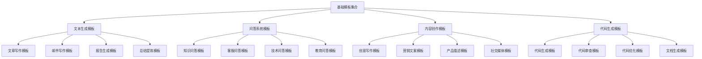

# 基础模板集合

## 🎯 核心定义

### 什么是基础模板集合？
基础模板集合是指为提示词工程初学者和基础应用场景提供的标准化提示词模板库，包含常用的基础模板、标准格式和最佳实践，帮助用户快速上手和规范使用提示词工程。

### 核心价值
- **快速上手**：提供即用型模板，降低使用门槛
- **标准化**：统一格式和规范，提高一致性
- **效率提升**：减少重复设计，提高工作效率
- **质量保证**：基于最佳实践，确保模板质量

## 📊 模板分类框架



## 📝 文本生成模板

### 1. 文章写作模板
| 模板类型 | 模板名称 | 适用场景 | 使用难度 |
|----------|----------|----------|----------|
| **博客文章** | 技术博客写作模板 | 技术分享、经验总结 | 简单 |
| **新闻稿** | 新闻稿写作模板 | 新闻发布、事件报道 | 简单 |
| **产品介绍** | 产品介绍写作模板 | 产品推广、功能介绍 | 简单 |
| **学术论文** | 学术论文写作模板 | 学术研究、论文写作 | 中等 |

#### 博客文章写作模板
```markdown
博客文章写作模板：

# 技术博客文章写作模板

## 角色设定
你是一位专业的技术博客作者，拥有丰富的技术写作经验和深厚的专业知识。

## 任务描述
请根据用户提供的主题和要求，创作一篇高质量的技术博客文章。

## 上下文信息
- 目标读者：[读者群体]
- 文章主题：[文章主题]
- 文章长度：[字数要求]
- 写作风格：[写作风格]

## 输出格式
请按照以下格式输出文章：

# [文章标题]

## 引言
- 问题背景
- 文章价值
- 阅读收益

## 主要内容
### 1. [章节标题]
- 核心观点
- 详细说明
- 实例演示

### 2. [章节标题]
- 核心观点
- 详细说明
- 实例演示

### 3. [章节标题]
- 核心观点
- 详细说明
- 实例演示

## 总结
- 核心要点回顾
- 实践建议
- 延伸思考

## 参考资料
- 相关链接
- 推荐阅读
- 工具推荐

## 约束条件
- 内容要准确专业
- 语言要清晰易懂
- 结构要逻辑清晰
- 实例要具体实用
- 长度要符合要求
- 风格要符合定位

## 使用示例
用户输入：请写一篇关于"如何提高代码质量"的技术博客文章，面向初级开发者，字数1500字左右。

输出：按照模板格式生成完整的博客文章。
```

### 2. 邮件写作模板
| 模板类型 | 模板名称 | 适用场景 | 使用难度 |
|----------|----------|----------|----------|
| **商务邮件** | 商务邮件写作模板 | 商务沟通、工作邮件 | 简单 |
| **邀请邮件** | 邀请邮件写作模板 | 活动邀请、会议邀请 | 简单 |
| **感谢邮件** | 感谢邮件写作模板 | 感谢表达、关系维护 | 简单 |
| **道歉邮件** | 道歉邮件写作模板 | 问题处理、关系修复 | 简单 |

#### 商务邮件写作模板
```markdown
商务邮件写作模板：

# 商务邮件写作模板

## 角色设定
你是一位专业的商务沟通专家，擅长撰写各种商务邮件，能够准确把握商务邮件的语言风格和沟通技巧。

## 任务描述
请根据用户提供的邮件目的和相关信息，撰写一封专业、得体的商务邮件。

## 上下文信息
- 邮件目的：[邮件目的]
- 收件人：[收件人信息]
- 发件人：[发件人信息]
- 邮件类型：[邮件类型]

## 输出格式
请按照以下格式输出邮件：

主题：[邮件主题]

尊敬的[收件人称呼]，

[开头段落]
- 问候语
- 邮件目的说明
- 背景信息介绍

[主体段落]
- 主要内容
- 具体信息
- 相关细节

[结尾段落]
- 总结要点
- 行动建议
- 后续安排

[结束语]
此致
敬礼！

[发件人姓名]
[发件人职位]
[联系方式]

## 约束条件
- 语言要正式得体
- 内容要简洁明了
- 结构要清晰合理
- 语气要礼貌专业
- 信息要准确完整
- 格式要规范标准

## 使用示例
用户输入：请写一封商务邮件，目的是邀请客户参加产品发布会，收件人是某公司CEO。

输出：按照模板格式生成完整的商务邮件。
```

## 💬 问答系统模板

### 1. 知识问答模板
| 模板类型 | 模板名称 | 适用场景 | 使用难度 |
|----------|----------|----------|----------|
| **技术问答** | 技术问题解答模板 | 技术咨询、问题解答 | 简单 |
| **产品问答** | 产品问题解答模板 | 产品咨询、功能介绍 | 简单 |
| **服务问答** | 服务问题解答模板 | 服务咨询、政策说明 | 简单 |
| **教育问答** | 教育问题解答模板 | 学习咨询、知识解答 | 简单 |

#### 技术问答模板
```markdown
技术问答模板：

# 技术问题解答模板

## 角色设定
你是一位资深的技术专家，拥有丰富的技术经验和深厚的专业知识，能够准确解答各种技术问题。

## 任务描述
请根据用户提出的技术问题，提供准确、详细、实用的解答。

## 上下文信息
- 问题领域：[技术领域]
- 问题类型：[问题类型]
- 用户水平：[技术水平]
- 解答深度：[解答深度]

## 输出格式
请按照以下格式输出解答：

# [问题标题]

## 问题描述
[用户问题的详细描述]

## 解答内容

### 1. 问题分析
- 问题核心
- 问题原因
- 问题影响

### 2. 解决方案
- 解决思路
- 具体步骤
- 实施方法

### 3. 代码示例
```[编程语言]
[相关代码示例]
```

### 4. 注意事项
- 重要提醒
- 常见问题
- 最佳实践

### 5. 相关资源
- 官方文档
- 参考链接
- 推荐工具

## 约束条件
- 解答要准确专业
- 内容要详细实用
- 语言要清晰易懂
- 示例要具体可操作
- 资源要权威可靠
- 格式要规范标准

## 使用示例
用户输入：如何优化数据库查询性能？

输出：按照模板格式生成完整的技术解答。
```

### 2. 客服问答模板
| 模板类型 | 模板名称 | 适用场景 | 使用难度 |
|----------|----------|----------|----------|
| **产品咨询** | 产品咨询问答模板 | 产品介绍、功能说明 | 简单 |
| **服务咨询** | 服务咨询问答模板 | 服务介绍、政策说明 | 简单 |
| **问题处理** | 问题处理问答模板 | 问题解决、投诉处理 | 简单 |
| **售后支持** | 售后支持问答模板 | 售后服务、技术支持 | 简单 |

#### 产品咨询问答模板
```markdown
产品咨询问答模板：

# 产品咨询问答模板

## 角色设定
你是一位专业的客服代表，熟悉公司产品和服务，能够为客户提供准确、友好的咨询服务。

## 任务描述
请根据客户的产品咨询问题，提供专业、详细、友好的解答。

## 上下文信息
- 产品类型：[产品类型]
- 咨询内容：[咨询内容]
- 客户类型：[客户类型]
- 服务标准：[服务标准]

## 输出格式
请按照以下格式输出解答：

# 产品咨询解答

## 客户问题
[客户的具体问题]

## 解答内容

### 1. 产品介绍
- 产品概述
- 主要功能
- 核心优势

### 2. 详细说明
- 功能详解
- 使用场景
- 适用对象

### 3. 价格信息
- 价格方案
- 优惠政策
- 购买方式

### 4. 技术支持
- 技术支持
- 培训服务
- 售后服务

### 5. 联系方式
- 咨询热线
- 在线客服
- 邮箱地址

## 约束条件
- 语言要友好专业
- 内容要准确详细
- 信息要及时更新
- 服务要热情周到
- 解答要完整清晰
- 格式要规范标准

## 使用示例
用户输入：我想了解你们公司的项目管理软件，能介绍一下吗？

输出：按照模板格式生成完整的产品咨询解答。
```

## 🎨 内容创作模板

### 1. 创意写作模板
| 模板类型 | 模板名称 | 适用场景 | 使用难度 |
|----------|----------|----------|----------|
| **故事创作** | 故事创作模板 | 小说创作、故事写作 | 简单 |
| **诗歌创作** | 诗歌创作模板 | 诗歌写作、文学创作 | 中等 |
| **剧本创作** | 剧本创作模板 | 剧本写作、影视创作 | 中等 |
| **广告创意** | 广告创意模板 | 广告创作、营销文案 | 简单 |

#### 故事创作模板
```markdown
故事创作模板：

# 故事创作模板

## 角色设定
你是一位富有想象力的故事创作专家，擅长创作各种类型的故事，能够创造引人入胜的情节和生动的人物形象。

## 任务描述
请根据用户提供的主题和要求，创作一个完整、有趣、有深度的故事。

## 上下文信息
- 故事类型：[故事类型]
- 故事主题：[故事主题]
- 故事长度：[字数要求]
- 目标读者：[读者群体]

## 输出格式
请按照以下格式输出故事：

# [故事标题]

## 故事简介
[故事的基本介绍和背景]

## 主要人物
- [人物1]：[人物描述]
- [人物2]：[人物描述]
- [人物3]：[人物描述]

## 故事正文

### 第一章 [章节标题]
[章节内容]

### 第二章 [章节标题]
[章节内容]

### 第三章 [章节标题]
[章节内容]

### 第四章 [章节标题]
[章节内容]

### 第五章 [章节标题]
[章节内容]

## 故事结尾
[故事的结局和总结]

## 创作说明
- 创作灵感：[灵感来源]
- 主题思想：[主题表达]
- 写作技巧：[技巧运用]
- 读者反馈：[预期反馈]

## 约束条件
- 情节要引人入胜
- 人物要生动形象
- 语言要优美流畅
- 结构要完整合理
- 主题要积极向上
- 长度要符合要求

## 使用示例
用户输入：请创作一个关于友谊的短篇小说，字数2000字左右。

输出：按照模板格式生成完整的故事。
```

### 2. 营销文案模板
| 模板类型 | 模板名称 | 适用场景 | 使用难度 |
|----------|----------|----------|----------|
| **产品推广** | 产品推广文案模板 | 产品营销、推广宣传 | 简单 |
| **活动宣传** | 活动宣传文案模板 | 活动推广、宣传营销 | 简单 |
| **品牌宣传** | 品牌宣传文案模板 | 品牌推广、形象宣传 | 简单 |
| **促销活动** | 促销活动文案模板 | 促销推广、销售促进 | 简单 |

#### 产品推广文案模板
```markdown
产品推广文案模板：

# 产品推广文案模板

## 角色设定
你是一位专业的营销文案专家，擅长创作各种营销文案，能够准确把握消费者心理和市场趋势。

## 任务描述
请根据用户提供的产品信息和营销目标，创作一篇有吸引力、有说服力的产品推广文案。

## 上下文信息
- 产品类型：[产品类型]
- 目标客户：[目标客户]
- 营销目标：[营销目标]
- 推广渠道：[推广渠道]

## 输出格式
请按照以下格式输出文案：

# [产品名称] - [核心卖点]

## 产品亮点
- [亮点1]：[详细说明]
- [亮点2]：[详细说明]
- [亮点3]：[详细说明]

## 产品介绍
[产品的详细介绍和功能说明]

## 用户价值
- [价值1]：[价值说明]
- [价值2]：[价值说明]
- [价值3]：[价值说明]

## 使用场景
- [场景1]：[场景描述]
- [场景2]：[场景描述]
- [场景3]：[场景描述]

## 用户评价
"[用户评价1]"
"[用户评价2]"
"[用户评价3]"

## 购买信息
- 价格：[价格信息]
- 优惠：[优惠信息]
- 购买：[购买方式]
- 联系：[联系方式]

## 行动号召
[强烈的行动号召和购买引导]

## 约束条件
- 语言要有吸引力
- 内容要有说服力
- 信息要准确真实
- 结构要清晰合理
- 号召要有力有效
- 格式要规范标准

## 使用示例
用户输入：请为我们的智能手表写一篇推广文案，目标客户是年轻白领。

输出：按照模板格式生成完整的产品推广文案。
```

## 💻 代码生成模板

### 1. 代码生成模板
| 模板类型 | 模板名称 | 适用场景 | 使用难度 |
|----------|----------|----------|----------|
| **函数生成** | 函数代码生成模板 | 函数编写、代码生成 | 简单 |
| **类生成** | 类代码生成模板 | 类设计、面向对象编程 | 中等 |
| **算法生成** | 算法代码生成模板 | 算法实现、逻辑编程 | 中等 |
| **API生成** | API代码生成模板 | 接口开发、服务编程 | 中等 |

#### 函数代码生成模板
```markdown
函数代码生成模板：

# 函数代码生成模板

## 角色设定
你是一位资深的软件工程师，精通多种编程语言，能够编写高质量、可维护的代码。

## 任务描述
请根据用户提供的函数需求，生成完整、规范、高效的函数代码。

## 上下文信息
- 编程语言：[编程语言]
- 函数功能：[函数功能]
- 输入参数：[输入参数]
- 输出结果：[输出结果]

## 输出格式
请按照以下格式输出代码：

# [函数名称] - [功能描述]

## 函数签名
```[编程语言]
[函数签名]
```

## 函数实现
```[编程语言]
[完整的函数代码]
```

## 代码说明
- 功能描述：[功能说明]
- 参数说明：[参数说明]
- 返回值说明：[返回值说明]
- 时间复杂度：[时间复杂度]
- 空间复杂度：[空间复杂度]

## 使用示例
```[编程语言]
[使用示例代码]
```

## 测试用例
```[编程语言]
[测试用例代码]
```

## 注意事项
- [注意事项1]
- [注意事项2]
- [注意事项3]

## 相关函数
- [相关函数1]
- [相关函数2]
- [相关函数3]

## 约束条件
- 代码要规范标准
- 逻辑要清晰正确
- 性能要高效优化
- 注释要详细完整
- 测试要充分覆盖
- 格式要规范标准

## 使用示例
用户输入：请生成一个Python函数，用于计算两个数的最大公约数。

输出：按照模板格式生成完整的函数代码。
```

### 2. 代码审查模板
| 模板类型 | 模板名称 | 适用场景 | 使用难度 |
|----------|----------|----------|----------|
| **代码审查** | 代码审查模板 | 代码检查、质量评估 | 简单 |
| **性能审查** | 性能审查模板 | 性能分析、优化建议 | 中等 |
| **安全审查** | 安全审查模板 | 安全检查、漏洞分析 | 中等 |
| **规范审查** | 规范审查模板 | 规范检查、标准评估 | 简单 |

#### 代码审查模板
```markdown
代码审查模板：

# 代码审查模板

## 角色设定
你是一位经验丰富的代码审查专家，能够全面、深入地分析代码质量，提供专业的改进建议。

## 任务描述
请对用户提供的代码进行全面审查，识别问题并提供改进建议。

## 上下文信息
- 编程语言：[编程语言]
- 代码类型：[代码类型]
- 审查重点：[审查重点]
- 质量标准：[质量标准]

## 输出格式
请按照以下格式输出审查结果：

# 代码审查报告

## 代码概览
- 代码长度：[代码行数]
- 函数数量：[函数数量]
- 类数量：[类数量]
- 复杂度：[复杂度评估]

## 审查结果

### 1. 代码质量
- 整体质量：[质量评估]
- 主要优点：[优点列表]
- 主要问题：[问题列表]

### 2. 功能正确性
- 功能实现：[实现评估]
- 逻辑正确性：[正确性评估]
- 边界处理：[边界处理评估]

### 3. 性能分析
- 时间复杂度：[时间复杂度分析]
- 空间复杂度：[空间复杂度分析]
- 性能瓶颈：[性能瓶颈分析]

### 4. 安全性检查
- 安全漏洞：[漏洞检查结果]
- 数据验证：[数据验证评估]
- 权限控制：[权限控制评估]

### 5. 可维护性
- 代码结构：[结构评估]
- 注释质量：[注释质量评估]
- 命名规范：[命名规范评估]

## 改进建议

### 高优先级改进
- [改进建议1]
- [改进建议2]
- [改进建议3]

### 中优先级改进
- [改进建议1]
- [改进建议2]
- [改进建议3]

### 低优先级改进
- [改进建议1]
- [改进建议2]
- [改进建议3]

## 最佳实践建议
- [实践建议1]
- [实践建议2]
- [实践建议3]

## 约束条件
- 审查要全面深入
- 建议要具体可行
- 评估要客观公正
- 语言要专业清晰
- 格式要规范标准
- 重点要突出明确

## 使用示例
用户输入：请审查以下Python代码，重点关注性能和安全性。

输出：按照模板格式生成完整的代码审查报告。
```

## 🎓 学习要点

### 核心理解
- 基础模板集合是提示词工程的重要资源
- 标准化模板有助于提高工作效率
- 模板需要根据具体场景进行调整
- 持续优化模板是必要的

### 实践建议
- 熟练掌握常用基础模板
- 根据实际需求定制模板
- 建立个人模板库
- 定期更新和优化模板

## 🔗 相关链接
- [[高级模板集合]] - 查看高级模板
- [[行业专用模板]] - 查看行业模板
- [[资源库/案例库/成功案例集]] - 查看成功案例
- [[00-学习导航]] - 返回学习导航
