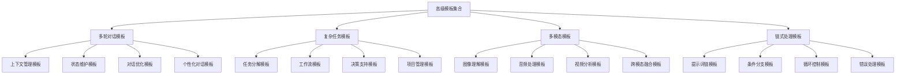

# 高级模板集合

## 🎯 核心定义

### 什么是高级模板集合？
高级模板集合是指为提示词工程高级用户和复杂应用场景提供的专业化、定制化提示词模板库，包含高级技巧、复杂逻辑和专业化应用模板，帮助用户实现更复杂、更专业的提示词工程应用。

### 核心价值
- **专业化**：提供专业领域的深度模板
- **复杂化**：支持复杂逻辑和高级技巧
- **定制化**：支持个性化定制和扩展
- **创新性**：包含前沿技术和创新应用

## 📊 高级模板分类



## 💬 多轮对话模板

### 1. 上下文管理模板
| 模板类型 | 模板名称 | 适用场景 | 技术难度 |
|----------|----------|----------|----------|
| **上下文维护** | 对话上下文维护模板 | 长对话、复杂对话 | 高级 |
| **记忆管理** | 对话记忆管理模板 | 个性化对话、用户画像 | 高级 |
| **话题切换** | 话题切换管理模板 | 多话题对话、主题转换 | 高级 |
| **情感分析** | 对话情感分析模板 | 情感对话、情绪识别 | 高级 |

#### 上下文维护模板
```markdown
上下文维护模板：

# 对话上下文维护模板

## 角色设定
你是一位专业的对话管理专家，擅长维护复杂的多轮对话上下文，能够准确理解对话历史和当前状态。

## 任务描述
请维护当前对话的上下文信息，确保对话的连贯性和一致性。

## 上下文信息
- 对话历史：[对话历史记录]
- 当前话题：[当前话题]
- 用户状态：[用户状态信息]
- 对话目标：[对话目标]

## 输出格式
请按照以下格式输出：

# 对话上下文维护

## 上下文摘要
- 对话主题：[主题摘要]
- 关键信息：[关键信息提取]
- 用户意图：[用户意图分析]
- 对话进展：[对话进展状态]

## 当前状态
- 话题状态：[话题状态]
- 用户状态：[用户状态]
- 系统状态：[系统状态]
- 对话质量：[对话质量评估]

## 上下文维护
- 历史信息：[历史信息维护]
- 当前信息：[当前信息处理]
- 未来预测：[未来对话预测]
- 状态更新：[状态更新建议]

## 对话建议
- 回复建议：[回复内容建议]
- 话题引导：[话题引导建议]
- 情感处理：[情感处理建议]
- 个性化：[个性化建议]

## 约束条件
- 上下文要准确完整
- 状态要实时更新
- 建议要合理可行
- 维护要高效稳定
- 分析要深入准确
- 格式要规范标准

## 使用示例
用户输入：请维护当前对话的上下文，用户正在咨询产品信息。

输出：按照模板格式生成完整的上下文维护结果。
```

### 2. 状态维护模板
| 模板类型 | 模板名称 | 适用场景 | 技术难度 |
|----------|----------|----------|----------|
| **用户状态** | 用户状态维护模板 | 用户画像、个性化服务 | 高级 |
| **会话状态** | 会话状态维护模板 | 会话管理、状态跟踪 | 高级 |
| **任务状态** | 任务状态维护模板 | 任务管理、进度跟踪 | 高级 |
| **系统状态** | 系统状态维护模板 | 系统监控、状态管理 | 高级 |

#### 用户状态维护模板
```markdown
用户状态维护模板：

# 用户状态维护模板

## 角色设定
你是一位专业的用户状态管理专家，能够准确跟踪和维护用户的状态信息，提供个性化的服务体验。

## 任务描述
请维护和更新用户的状态信息，包括基本信息、行为特征、偏好设置等。

## 上下文信息
- 用户ID：[用户标识]
- 当前状态：[当前状态信息]
- 历史行为：[历史行为记录]
- 偏好设置：[偏好设置信息]

## 输出格式
请按照以下格式输出：

# 用户状态维护

## 用户基本信息
- 用户ID：[用户标识]
- 注册时间：[注册时间]
- 最后活跃：[最后活跃时间]
- 使用频率：[使用频率统计]

## 用户行为分析
- 行为模式：[行为模式分析]
- 使用习惯：[使用习惯分析]
- 兴趣偏好：[兴趣偏好分析]
- 活跃时段：[活跃时段分析]

## 用户状态更新
- 状态变化：[状态变化记录]
- 更新原因：[更新原因分析]
- 影响评估：[影响评估结果]
- 调整建议：[调整建议]

## 个性化设置
- 推荐偏好：[推荐偏好设置]
- 界面偏好：[界面偏好设置]
- 功能偏好：[功能偏好设置]
- 服务偏好：[服务偏好设置]

## 状态预测
- 行为预测：[行为预测结果]
- 需求预测：[需求预测结果]
- 风险预测：[风险预测结果]
- 机会预测：[机会预测结果]

## 约束条件
- 状态要准确实时
- 分析要深入全面
- 预测要合理可靠
- 设置要个性化
- 更新要及时有效
- 格式要规范标准

## 使用示例
用户输入：请维护用户状态，用户刚刚完成了一次产品购买。

输出：按照模板格式生成完整的用户状态维护结果。
```

## 🔧 复杂任务模板

### 1. 任务分解模板
| 模板类型 | 模板名称 | 适用场景 | 技术难度 |
|----------|----------|----------|----------|
| **项目分解** | 项目任务分解模板 | 项目管理、任务规划 | 高级 |
| **工作流分解** | 工作流任务分解模板 | 业务流程、工作流设计 | 高级 |
| **决策分解** | 决策任务分解模板 | 决策支持、问题解决 | 高级 |
| **学习分解** | 学习任务分解模板 | 学习规划、知识管理 | 高级 |

#### 项目任务分解模板
```markdown
项目任务分解模板：

# 项目任务分解模板

## 角色设定
你是一位专业的项目管理专家，擅长将复杂项目分解为可管理的子任务，制定详细的执行计划。

## 任务描述
请将用户提供的复杂项目分解为具体的子任务，制定详细的执行计划和时间安排。

## 上下文信息
- 项目类型：[项目类型]
- 项目规模：[项目规模]
- 项目目标：[项目目标]
- 项目约束：[项目约束]

## 输出格式
请按照以下格式输出：

# 项目任务分解

## 项目概览
- 项目名称：[项目名称]
- 项目目标：[项目目标]
- 项目范围：[项目范围]
- 项目周期：[项目周期]

## 任务分解结构
```
项目
├── 阶段1：[阶段名称]
│   ├── 任务1.1：[任务名称]
│   ├── 任务1.2：[任务名称]
│   └── 任务1.3：[任务名称]
├── 阶段2：[阶段名称]
│   ├── 任务2.1：[任务名称]
│   ├── 任务2.2：[任务名称]
│   └── 任务2.3：[任务名称]
└── 阶段3：[阶段名称]
    ├── 任务3.1：[任务名称]
    ├── 任务3.2：[任务名称]
    └── 任务3.3：[任务名称]
```

## 任务详细信息
### 阶段1：[阶段名称]
- 阶段目标：[阶段目标]
- 阶段周期：[阶段周期]
- 阶段资源：[阶段资源]

#### 任务1.1：[任务名称]
- 任务描述：[任务描述]
- 任务目标：[任务目标]
- 任务周期：[任务周期]
- 任务资源：[任务资源]
- 任务依赖：[任务依赖]
- 任务风险：[任务风险]
- 任务成果：[任务成果]

#### 任务1.2：[任务名称]
- 任务描述：[任务描述]
- 任务目标：[任务目标]
- 任务周期：[任务周期]
- 任务资源：[任务资源]
- 任务依赖：[任务依赖]
- 任务风险：[任务风险]
- 任务成果：[任务成果]

## 依赖关系图
- 前置任务：[前置任务列表]
- 后续任务：[后续任务列表]
- 并行任务：[并行任务列表]
- 关键路径：[关键路径分析]

## 资源分配
- 人力资源：[人力资源分配]
- 时间资源：[时间资源分配]
- 物质资源：[物质资源分配]
- 技术资源：[技术资源分配]

## 风险管控
- 风险识别：[风险识别结果]
- 风险评估：[风险评估结果]
- 风险应对：[风险应对策略]
- 风险监控：[风险监控机制]

## 约束条件
- 分解要合理可行
- 任务要具体明确
- 依赖要准确清晰
- 资源要合理分配
- 风险要有效管控
- 格式要规范标准

## 使用示例
用户输入：请分解一个软件开发项目，包括需求分析、设计、开发、测试、部署等阶段。

输出：按照模板格式生成完整的项目任务分解结果。
```

### 2. 工作流模板
| 模板类型 | 模板名称 | 适用场景 | 技术难度 |
|----------|----------|----------|----------|
| **业务流程** | 业务流程工作流模板 | 业务流程、工作流设计 | 高级 |
| **审批流程** | 审批流程工作流模板 | 审批管理、流程控制 | 高级 |
| **数据处理** | 数据处理工作流模板 | 数据处理、ETL流程 | 高级 |
| **决策流程** | 决策流程工作流模板 | 决策支持、流程管理 | 高级 |

#### 业务流程工作流模板
```markdown
业务流程工作流模板：

# 业务流程工作流模板

## 角色设定
你是一位专业的业务流程设计专家，擅长设计复杂的工作流程，优化业务流程效率。

## 任务描述
请根据用户提供的业务需求，设计一个完整、高效的工作流程。

## 上下文信息
- 业务类型：[业务类型]
- 业务目标：[业务目标]
- 业务约束：[业务约束]
- 业务环境：[业务环境]

## 输出格式
请按照以下格式输出：

# 业务流程工作流

## 流程概览
- 流程名称：[流程名称]
- 流程目标：[流程目标]
- 流程范围：[流程范围]
- 流程周期：[流程周期]

## 流程架构
```
开始
├── 步骤1：[步骤名称]
│   ├── 子步骤1.1：[子步骤名称]
│   ├── 子步骤1.2：[子步骤名称]
│   └── 子步骤1.3：[子步骤名称]
├── 步骤2：[步骤名称]
│   ├── 子步骤2.1：[子步骤名称]
│   ├── 子步骤2.2：[子步骤名称]
│   └── 子步骤2.3：[子步骤名称]
├── 步骤3：[步骤名称]
│   ├── 子步骤3.1：[子步骤名称]
│   ├── 子步骤3.2：[子步骤名称]
│   └── 子步骤3.3：[子步骤名称]
└── 结束
```

## 流程步骤详情
### 步骤1：[步骤名称]
- 步骤描述：[步骤描述]
- 步骤目标：[步骤目标]
- 执行人员：[执行人员]
- 执行时间：[执行时间]
- 输入信息：[输入信息]
- 输出结果：[输出结果]
- 质量要求：[质量要求]
- 风险控制：[风险控制]

### 步骤2：[步骤名称]
- 步骤描述：[步骤描述]
- 步骤目标：[步骤目标]
- 执行人员：[执行人员]
- 执行时间：[执行时间]
- 输入信息：[输入信息]
- 输出结果：[输出结果]
- 质量要求：[质量要求]
- 风险控制：[风险控制]

## 流程控制
- 条件判断：[条件判断逻辑]
- 分支处理：[分支处理逻辑]
- 循环控制：[循环控制逻辑]
- 异常处理：[异常处理逻辑]

## 流程优化
- 瓶颈分析：[瓶颈分析结果]
- 优化建议：[优化建议]
- 效率提升：[效率提升方案]
- 质量改善：[质量改善方案]

## 流程监控
- 监控指标：[监控指标]
- 监控方法：[监控方法]
- 告警机制：[告警机制]
- 报告机制：[报告机制]

## 约束条件
- 流程要完整清晰
- 步骤要具体明确
- 控制要有效可靠
- 优化要持续改进
- 监控要实时准确
- 格式要规范标准

## 使用示例
用户输入：请设计一个客户服务流程，包括问题接收、分析、解决、反馈等步骤。

输出：按照模板格式生成完整的业务流程工作流结果。
```

## 🎨 多模态模板

### 1. 图像理解模板
| 模板类型 | 模板名称 | 适用场景 | 技术难度 |
|----------|----------|----------|----------|
| **图像分析** | 图像内容分析模板 | 图像识别、内容分析 | 高级 |
| **图像描述** | 图像描述生成模板 | 图像描述、内容总结 | 高级 |
| **图像问答** | 图像问答系统模板 | 图像问答、内容查询 | 高级 |
| **图像创作** | 图像创作指导模板 | 图像创作、设计指导 | 高级 |

#### 图像内容分析模板
```markdown
图像内容分析模板：

# 图像内容分析模板

## 角色设定
你是一位专业的图像分析专家，能够深入分析图像内容，提取关键信息，提供专业的分析报告。

## 任务描述
请对用户提供的图像进行全面的内容分析，包括视觉元素、主题内容、情感表达等方面。

## 上下文信息
- 图像类型：[图像类型]
- 分析目标：[分析目标]
- 分析深度：[分析深度]
- 应用场景：[应用场景]

## 输出格式
请按照以下格式输出：

# 图像内容分析报告

## 图像基本信息
- 图像尺寸：[图像尺寸]
- 图像格式：[图像格式]
- 图像质量：[图像质量]
- 图像来源：[图像来源]

## 视觉元素分析
### 1. 色彩分析
- 主色调：[主色调分析]
- 色彩搭配：[色彩搭配分析]
- 色彩情感：[色彩情感分析]
- 色彩对比：[色彩对比分析]

### 2. 构图分析
- 构图类型：[构图类型分析]
- 视觉焦点：[视觉焦点分析]
- 视觉平衡：[视觉平衡分析]
- 视觉层次：[视觉层次分析]

### 3. 光影分析
- 光线方向：[光线方向分析]
- 光影效果：[光影效果分析]
- 明暗对比：[明暗对比分析]
- 氛围营造：[氛围营造分析]

## 内容主题分析
### 1. 主题识别
- 主要主题：[主要主题]
- 次要主题：[次要主题]
- 主题表达：[主题表达方式]
- 主题深度：[主题深度分析]

### 2. 内容描述
- 场景描述：[场景描述]
- 人物描述：[人物描述]
- 物体描述：[物体描述]
- 动作描述：[动作描述]

### 3. 情感分析
- 情感倾向：[情感倾向分析]
- 情感强度：[情感强度分析]
- 情感层次：[情感层次分析]
- 情感表达：[情感表达方式]

## 技术质量分析
### 1. 拍摄技术
- 拍摄角度：[拍摄角度分析]
- 拍摄距离：[拍摄距离分析]
- 拍摄技巧：[拍摄技巧分析]
- 技术水准：[技术水准评估]

### 2. 后期处理
- 后期效果：[后期效果分析]
- 处理技巧：[处理技巧分析]
- 处理质量：[处理质量评估]
- 处理风格：[处理风格分析]

## 应用价值分析
### 1. 商业价值
- 营销价值：[营销价值分析]
- 品牌价值：[品牌价值分析]
- 传播价值：[传播价值分析]
- 商业潜力：[商业潜力评估]

### 2. 艺术价值
- 艺术水准：[艺术水准评估]
- 创意表达：[创意表达分析]
- 美学价值：[美学价值分析]
- 文化内涵：[文化内涵分析]

## 改进建议
- 技术改进：[技术改进建议]
- 内容改进：[内容改进建议]
- 表达改进：[表达改进建议]
- 应用改进：[应用改进建议]

## 约束条件
- 分析要全面深入
- 描述要准确详细
- 评估要客观公正
- 建议要实用可行
- 语言要专业清晰
- 格式要规范标准

## 使用示例
用户输入：请分析这张产品宣传图片，重点关注营销效果和视觉吸引力。

输出：按照模板格式生成完整的图像内容分析报告。
```

### 2. 音频处理模板
| 模板类型 | 模板名称 | 适用场景 | 技术难度 |
|----------|----------|----------|----------|
| **语音识别** | 语音识别处理模板 | 语音转文字、语音分析 | 高级 |
| **音频分析** | 音频内容分析模板 | 音频分析、内容提取 | 高级 |
| **音频生成** | 音频生成指导模板 | 音频创作、声音设计 | 高级 |
| **音频问答** | 音频问答系统模板 | 音频问答、语音交互 | 高级 |

#### 语音识别处理模板
```markdown
语音识别处理模板：

# 语音识别处理模板

## 角色设定
你是一位专业的语音识别专家，能够准确识别语音内容，处理各种语音识别任务。

## 任务描述
请对用户提供的语音进行识别和处理，包括语音转文字、内容分析、情感识别等。

## 上下文信息
- 语音类型：[语音类型]
- 识别目标：[识别目标]
- 处理要求：[处理要求]
- 应用场景：[应用场景]

## 输出格式
请按照以下格式输出：

# 语音识别处理报告

## 语音基本信息
- 音频格式：[音频格式]
- 音频时长：[音频时长]
- 音频质量：[音频质量]
- 采样率：[采样率]

## 语音识别结果
### 1. 文字转录
- 识别文本：[识别文本内容]
- 识别准确率：[识别准确率]
- 识别置信度：[识别置信度]
- 识别时间：[识别时间]

### 2. 语音特征
- 语速：[语速分析]
- 音调：[音调分析]
- 音量：[音量分析]
- 停顿：[停顿分析]

### 3. 语言分析
- 语言类型：[语言类型]
- 方言特征：[方言特征]
- 语言水平：[语言水平]
- 语言风格：[语言风格]

## 内容分析
### 1. 主题分析
- 主要话题：[主要话题]
- 话题转换：[话题转换]
- 话题深度：[话题深度]
- 话题关联：[话题关联]

### 2. 情感分析
- 情感倾向：[情感倾向]
- 情感强度：[情感强度]
- 情感变化：[情感变化]
- 情感表达：[情感表达]

### 3. 意图分析
- 用户意图：[用户意图]
- 意图类型：[意图类型]
- 意图强度：[意图强度]
- 意图实现：[意图实现]

## 技术质量分析
### 1. 识别质量
- 识别准确率：[识别准确率]
- 识别完整性：[识别完整性]
- 识别一致性：[识别一致性]
- 识别稳定性：[识别稳定性]

### 2. 处理质量
- 处理速度：[处理速度]
- 处理效率：[处理效率]
- 处理准确性：[处理准确性]
- 处理稳定性：[处理稳定性]

## 应用建议
### 1. 优化建议
- 识别优化：[识别优化建议]
- 处理优化：[处理优化建议]
- 质量优化：[质量优化建议]
- 效率优化：[效率优化建议]

### 2. 应用建议
- 应用场景：[应用场景建议]
- 应用方式：[应用方式建议]
- 应用效果：[应用效果预测]
- 应用价值：[应用价值评估]

## 约束条件
- 识别要准确完整
- 分析要深入全面
- 处理要高效稳定
- 建议要实用可行
- 语言要专业清晰
- 格式要规范标准

## 使用示例
用户输入：请识别这段语音内容，并分析说话人的情感状态。

输出：按照模板格式生成完整的语音识别处理报告。
```

## 🔗 链式处理模板

### 1. 提示词链模板
| 模板类型 | 模板名称 | 适用场景 | 技术难度 |
|----------|----------|----------|----------|
| **线性链** | 线性提示词链模板 | 顺序处理、流水线操作 | 高级 |
| **分支链** | 分支提示词链模板 | 条件处理、分支逻辑 | 高级 |
| **循环链** | 循环提示词链模板 | 重复处理、迭代优化 | 高级 |
| **并行链** | 并行提示词链模板 | 并行处理、多任务执行 | 高级 |

#### 线性提示词链模板
```markdown
线性提示词链模板：

# 线性提示词链模板

## 角色设定
你是一位专业的提示词链设计专家，能够设计复杂的线性处理链，实现多步骤的连续处理。

## 任务描述
请设计一个线性提示词链，将复杂任务分解为多个连续的步骤，实现逐步处理。

## 上下文信息
- 任务类型：[任务类型]
- 处理步骤：[处理步骤]
- 数据流向：[数据流向]
- 质量要求：[质量要求]

## 输出格式
请按照以下格式输出：

# 线性提示词链设计

## 链式概览
- 链名称：[链名称]
- 链目标：[链目标]
- 链长度：[链长度]
- 链复杂度：[链复杂度]

## 链式结构
```
输入数据
    ↓
步骤1：[步骤名称]
    ↓
步骤2：[步骤名称]
    ↓
步骤3：[步骤名称]
    ↓
步骤4：[步骤名称]
    ↓
输出结果
```

## 步骤详情
### 步骤1：[步骤名称]
- 步骤描述：[步骤描述]
- 输入要求：[输入要求]
- 处理逻辑：[处理逻辑]
- 输出结果：[输出结果]
- 质量检查：[质量检查]
- 错误处理：[错误处理]

### 步骤2：[步骤名称]
- 步骤描述：[步骤描述]
- 输入要求：[输入要求]
- 处理逻辑：[处理逻辑]
- 输出结果：[输出结果]
- 质量检查：[质量检查]
- 错误处理：[错误处理]

### 步骤3：[步骤名称]
- 步骤描述：[步骤描述]
- 输入要求：[输入要求]
- 处理逻辑：[处理逻辑]
- 输出结果：[输出结果]
- 质量检查：[质量检查]
- 错误处理：[错误处理]

## 数据流向
- 数据输入：[数据输入格式]
- 数据转换：[数据转换过程]
- 数据传递：[数据传递机制]
- 数据输出：[数据输出格式]

## 质量控制
- 质量检查点：[质量检查点]
- 质量指标：[质量指标]
- 质量阈值：[质量阈值]
- 质量反馈：[质量反馈机制]

## 错误处理
- 错误类型：[错误类型]
- 错误检测：[错误检测机制]
- 错误恢复：[错误恢复策略]
- 错误报告：[错误报告机制]

## 性能优化
- 性能指标：[性能指标]
- 性能瓶颈：[性能瓶颈分析]
- 优化策略：[优化策略]
- 优化效果：[优化效果评估]

## 约束条件
- 链式要完整清晰
- 步骤要具体明确
- 逻辑要正确可靠
- 质量要有效控制
- 错误要妥善处理
- 格式要规范标准

## 使用示例
用户输入：请设计一个文档处理链，包括文档解析、内容分析、格式转换、质量检查等步骤。

输出：按照模板格式生成完整的线性提示词链设计结果。
```

### 2. 条件分支模板
| 模板类型 | 模板名称 | 适用场景 | 技术难度 |
|----------|----------|----------|----------|
| **条件判断** | 条件判断分支模板 | 条件处理、分支逻辑 | 高级 |
| **规则引擎** | 规则引擎分支模板 | 规则处理、决策支持 | 高级 |
| **分类处理** | 分类处理分支模板 | 分类处理、路由选择 | 高级 |
| **异常处理** | 异常处理分支模板 | 异常处理、错误恢复 | 高级 |

#### 条件判断分支模板
```markdown
条件判断分支模板：

# 条件判断分支模板

## 角色设定
你是一位专业的条件分支设计专家，能够设计复杂的条件判断逻辑，实现智能的分支处理。

## 任务描述
请设计一个条件判断分支系统，根据不同的条件执行不同的处理逻辑。

## 上下文信息
- 判断类型：[判断类型]
- 分支数量：[分支数量]
- 判断条件：[判断条件]
- 处理逻辑：[处理逻辑]

## 输出格式
请按照以下格式输出：

# 条件判断分支设计

## 分支概览
- 分支名称：[分支名称]
- 分支目标：[分支目标]
- 分支数量：[分支数量]
- 分支复杂度：[分支复杂度]

## 分支结构
```
输入数据
    ↓
条件判断
    ├── 条件1 → 分支1 → 处理1 → 输出1
    ├── 条件2 → 分支2 → 处理2 → 输出2
    ├── 条件3 → 分支3 → 处理3 → 输出3
    └── 默认 → 默认分支 → 默认处理 → 默认输出
```

## 条件定义
### 条件1：[条件名称]
- 条件描述：[条件描述]
- 判断逻辑：[判断逻辑]
- 判断标准：[判断标准]
- 判断优先级：[判断优先级]

### 条件2：[条件名称]
- 条件描述：[条件描述]
- 判断逻辑：[判断逻辑]
- 判断标准：[判断标准]
- 判断优先级：[判断优先级]

### 条件3：[条件名称]
- 条件描述：[条件描述]
- 判断逻辑：[判断逻辑]
- 判断标准：[判断标准]
- 判断优先级：[判断优先级]

## 分支处理
### 分支1：[分支名称]
- 分支描述：[分支描述]
- 处理逻辑：[处理逻辑]
- 处理步骤：[处理步骤]
- 输出格式：[输出格式]
- 质量要求：[质量要求]

### 分支2：[分支名称]
- 分支描述：[分支描述]
- 处理逻辑：[处理逻辑]
- 处理步骤：[处理步骤]
- 输出格式：[输出格式]
- 质量要求：[质量要求]

### 分支3：[分支名称]
- 分支描述：[分支描述]
- 处理逻辑：[处理逻辑]
- 处理步骤：[处理步骤]
- 输出格式：[输出格式]
- 质量要求：[质量要求]

## 默认处理
- 默认条件：[默认条件]
- 默认逻辑：[默认逻辑]
- 默认步骤：[默认步骤]
- 默认输出：[默认输出]

## 条件优化
- 条件排序：[条件排序策略]
- 条件合并：[条件合并策略]
- 条件简化：[条件简化策略]
- 条件缓存：[条件缓存策略]

## 性能监控
- 性能指标：[性能指标]
- 监控方法：[监控方法]
- 告警机制：[告警机制]
- 优化建议：[优化建议]

## 约束条件
- 条件要准确清晰
- 分支要完整覆盖
- 逻辑要正确可靠
- 处理要高效稳定
- 监控要实时准确
- 格式要规范标准

## 使用示例
用户输入：请设计一个用户类型判断分支，根据用户类型提供不同的服务。

输出：按照模板格式生成完整的条件判断分支设计结果。
```

## 🎓 学习要点

### 核心理解
- 高级模板集合是提示词工程的高级应用
- 复杂模板需要深入理解业务逻辑
- 多模态模板需要跨领域知识
- 链式处理模板需要系统化思维

### 实践建议
- 深入理解高级模板的设计原理
- 结合实际需求定制高级模板
- 掌握多模态和链式处理技术
- 持续优化和升级高级模板

## 🔗 相关链接
- [[基础模板集合]] - 查看基础模板
- [[行业专用模板]] - 查看行业模板
- [[资源库/案例库/成功案例集]] - 查看成功案例
- [[00-学习导航]] - 返回学习导航
