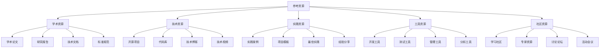

# 参考资源

## 🎯 核心定义

### 什么是参考资源？
参考资源是指收集和整理提示词工程学习过程中需要的各种参考资料，包括书籍、论文、网站、工具、课程等，为学习者提供全面的学习支持。

### 核心价值
- **学习支持**：提供全面的学习支持
- **知识补充**：补充和扩展知识
- **实践指导**：提供实践指导
- **持续更新**：持续更新资源

## 📊 资源分类框架



## 📚 学术资源

### 1. 重要论文

#### 提示词工程相关论文
| 论文标题 | 作者 | 发表年份 | 期刊/会议 | 推荐指数 | 核心贡献 |
|----------|------|----------|-----------|----------|----------|
| **Attention Is All You Need** | Vaswani et al. | 2017 | NeurIPS | ⭐⭐⭐⭐⭐ | Transformer架构 |
| **Language Models are Few-Shot Learners** | Brown et al. | 2020 | NeurIPS | ⭐⭐⭐⭐⭐ | GPT-3模型 |
| **Chain-of-Thought Prompting Elicits Reasoning** | Wei et al. | 2022 | NeurIPS | ⭐⭐⭐⭐⭐ | 思维链提示 |
| **Training language models to follow instructions** | Ouyang et al. | 2022 | NeurIPS | ⭐⭐⭐⭐⭐ | 指令微调 |
| **Constitutional AI: Harmlessness from AI Feedback** | Bai et al. | 2022 | NeurIPS | ⭐⭐⭐⭐⭐ | 宪法AI |
| **In-Context Learning and Induction Heads** | Olsson et al. | 2022 | Transformer Circuits | ⭐⭐⭐⭐ | 上下文学习 |
| **Emergent Abilities of Large Language Models** | Wei et al. | 2022 | TMLR | ⭐⭐⭐⭐ | 涌现能力 |
| **PaLM: Scaling Language Modeling with Pathways** | Chowdhery et al. | 2022 | arXiv | ⭐⭐⭐⭐ | PaLM模型 |
| **LaMDA: Language Models for Dialog Applications** | Thoppilan et al. | 2022 | arXiv | ⭐⭐⭐⭐ | 对话模型 |
| **Codex: Evaluating Large Language Models Trained on Code** | Chen et al. | 2021 | NeurIPS | ⭐⭐⭐⭐ | 代码生成 |

#### 详细论文解析
```markdown
# 重要论文详细解析

## 1. Attention Is All You Need (2017)
### 论文概述
- **作者**：Ashish Vaswani, Noam Shazeer, Niki Parmar, et al.
- **发表**：NeurIPS 2017
- **核心贡献**：提出Transformer架构，成为现代大语言模型的基础

### 技术要点
- **自注意力机制**：允许模型关注输入序列的不同位置
- **多头注意力**：并行处理多个注意力子空间
- **位置编码**：为序列提供位置信息
- **编码器-解码器结构**：适用于序列到序列任务

### 影响意义
- **技术革命**：彻底改变了自然语言处理领域
- **模型基础**：成为GPT、BERT等模型的基础架构
- **性能提升**：在多个任务上取得突破性进展
- **计算效率**：相比RNN具有更好的并行性

### 学习价值
- **架构理解**：深入理解Transformer架构
- **注意力机制**：掌握注意力机制原理
- **技术发展**：了解技术发展历程
- **实践应用**：指导实际应用开发

### 相关资源
- **论文链接**：https://arxiv.org/abs/1706.03762
- **代码实现**：https://github.com/tensorflow/tensor2tensor
- **教程资源**：The Annotated Transformer
- **视频讲解**：3Blue1Brown Transformer系列

## 2. Language Models are Few-Shot Learners (2020)
### 论文概述
- **作者**：Tom B. Brown, Benjamin Mann, Nick Ryder, et al.
- **发表**：NeurIPS 2020
- **核心贡献**：提出GPT-3模型，展示了大语言模型的强大能力

### 技术要点
- **模型规模**：1750亿参数，当时最大的语言模型
- **Few-shot学习**：通过少量示例快速适应新任务
- **In-context学习**：在上下文中学习任务模式
- **多任务能力**：一个模型处理多种任务

### 影响意义
- **技术突破**：展示了大规模语言模型的潜力
- **应用革命**：开启了AI应用的新时代
- **商业价值**：推动了AI商业化进程
- **社会影响**：引发了广泛的社会讨论

### 学习价值
- **模型理解**：理解大语言模型的工作原理
- **Few-shot学习**：掌握Few-shot学习技术
- **应用开发**：指导AI应用开发
- **技术趋势**：了解技术发展趋势

### 相关资源
- **论文链接**：https://arxiv.org/abs/2005.14165
- **模型访问**：OpenAI API
- **应用案例**：GPT-3应用案例集
- **技术分析**：GPT-3技术分析报告

## 3. Chain-of-Thought Prompting Elicits Reasoning (2022)
### 论文概述
- **作者**：Jason Wei, Xuezhi Wang, Dale Schuurmans, et al.
- **发表**：NeurIPS 2022
- **核心贡献**：提出思维链提示技术，显著提升复杂推理任务性能

### 技术要点
- **思维链提示**：通过展示推理过程引导模型思考
- **Few-shot示例**：提供推理步骤的示例
- **复杂推理**：在数学、逻辑推理任务上取得突破
- **可解释性**：提供可解释的推理过程

### 影响意义
- **推理能力**：显著提升模型的推理能力
- **可解释性**：增强模型输出的可解释性
- **应用扩展**：扩展了模型的应用范围
- **技术发展**：推动了提示词工程的发展

### 学习价值
- **提示词技术**：掌握思维链提示技术
- **推理能力**：理解模型推理机制
- **应用开发**：指导复杂任务应用开发
- **技术优化**：优化提示词设计

### 相关资源
- **论文链接**：https://arxiv.org/abs/2201.11903
- **代码实现**：Chain-of-Thought相关代码
- **应用案例**：思维链提示应用案例
- **技术教程**：思维链提示教程

## 4. Training language models to follow instructions (2022)
### 论文概述
- **作者**：Long Ouyang, Jeff Wu, Xu Jiang, et al.
- **发表**：NeurIPS 2022
- **核心贡献**：提出指令微调技术，提高模型遵循指令的能力

### 技术要点
- **指令微调**：使用指令-响应对数据微调模型
- **人类反馈**：结合人类反馈优化模型
- **RLHF**：强化学习人类反馈技术
- **安全性**：提高模型的安全性和有用性

### 影响意义
- **指令遵循**：显著提高模型遵循指令的能力
- **安全性**：增强模型的安全性和可靠性
- **用户体验**：改善用户使用体验
- **技术标准**：建立了指令微调的技术标准

### 学习价值
- **指令微调**：掌握指令微调技术
- **人类反馈**：理解人类反馈机制
- **安全设计**：学习AI安全设计
- **用户体验**：改善用户体验设计

### 相关资源
- **论文链接**：https://arxiv.org/abs/2203.02155
- **技术实现**：InstructGPT相关代码
- **应用案例**：指令微调应用案例
- **技术分析**：指令微调技术分析
```

### 2. 研究报告

#### 行业研究报告
| 报告标题 | 发布机构 | 发布年份 | 报告类型 | 推荐指数 | 核心内容 |
|----------|----------|----------|----------|----------|----------|
| **AI Index Report 2023** | Stanford HAI | 2023 | 年度报告 | ⭐⭐⭐⭐⭐ | AI发展指数 |
| **The State of AI Report 2023** | Air Street Capital | 2023 | 年度报告 | ⭐⭐⭐⭐⭐ | AI发展状态 |
| **GPT-4 Technical Report** | OpenAI | 2023 | 技术报告 | ⭐⭐⭐⭐⭐ | GPT-4技术细节 |
| **Claude 3 Technical Report** | Anthropic | 2024 | 技术报告 | ⭐⭐⭐⭐⭐ | Claude 3技术 |
| **AI Safety Report** | OpenAI | 2023 | 安全报告 | ⭐⭐⭐⭐ | AI安全研究 |
| **Prompt Engineering Guide** | OpenAI | 2023 | 技术指南 | ⭐⭐⭐⭐ | 提示词工程指南 |
| **Large Language Models Survey** | Google Research | 2023 | 综述报告 | ⭐⭐⭐⭐ | 大语言模型综述 |
| **AI Ethics Report** | Partnership on AI | 2023 | 伦理报告 | ⭐⭐⭐⭐ | AI伦理研究 |

#### 详细报告解析
```markdown
# 重要研究报告详细解析

## 1. AI Index Report 2023
### 报告概述
- **发布机构**：Stanford Human-Centered AI Institute
- **发布年份**：2023年
- **报告类型**：年度AI发展指数报告
- **核心内容**：AI技术发展、投资、政策、社会影响

### 关键发现
- **技术发展**：AI技术持续快速发展
- **投资增长**：AI投资大幅增长
- **应用扩展**：AI应用领域不断扩展
- **社会影响**：AI对社会的影响日益显著

### 学习价值
- **趋势了解**：了解AI发展趋势
- **数据支撑**：获得数据支撑的分析
- **政策理解**：理解AI相关政策
- **社会影响**：了解AI社会影响

### 相关资源
- **报告链接**：https://aiindex.stanford.edu/
- **数据下载**：AI Index数据集
- **可视化工具**：AI Index可视化
- **分析工具**：AI Index分析工具

## 2. The State of AI Report 2023
### 报告概述
- **发布机构**：Air Street Capital
- **发布年份**：2023年
- **报告类型**：年度AI发展状态报告
- **核心内容**：AI技术、投资、创业、政策分析

### 关键发现
- **技术突破**：大语言模型技术突破
- **投资热点**：AI投资热点分析
- **创业趋势**：AI创业趋势分析
- **政策环境**：AI政策环境分析

### 学习价值
- **行业洞察**：获得行业深度洞察
- **投资趋势**：了解投资趋势
- **创业机会**：发现创业机会
- **政策影响**：理解政策影响

### 相关资源
- **报告链接**：https://www.stateof.ai/
- **数据资源**：State of AI数据
- **分析工具**：State of AI分析工具
- **社区讨论**：State of AI社区

## 3. GPT-4 Technical Report
### 报告概述
- **发布机构**：OpenAI
- **发布年份**：2023年
- **报告类型**：技术报告
- **核心内容**：GPT-4模型技术细节

### 技术要点
- **模型架构**：GPT-4模型架构
- **训练方法**：训练方法和数据
- **性能评估**：性能评估结果
- **安全措施**：安全措施和限制

### 学习价值
- **技术理解**：深入理解GPT-4技术
- **架构设计**：学习模型架构设计
- **训练方法**：掌握训练方法
- **安全设计**：学习安全设计

### 相关资源
- **报告链接**：https://openai.com/research/gpt-4
- **技术文档**：GPT-4技术文档
- **API文档**：GPT-4 API文档
- **应用案例**：GPT-4应用案例

## 4. Claude 3 Technical Report
### 报告概述
- **发布机构**：Anthropic
- **发布年份**：2024年
- **报告类型**：技术报告
- **核心内容**：Claude 3模型技术细节

### 技术要点
- **模型架构**：Claude 3模型架构
- **训练方法**：训练方法和数据
- **性能评估**：性能评估结果
- **安全措施**：安全措施和限制

### 学习价值
- **技术理解**：深入理解Claude 3技术
- **架构设计**：学习模型架构设计
- **训练方法**：掌握训练方法
- **安全设计**：学习安全设计

### 相关资源
- **报告链接**：https://www.anthropic.com/research
- **技术文档**：Claude 3技术文档
- **API文档**：Claude 3 API文档
- **应用案例**：Claude 3应用案例
```

### 3. 技术文档

#### 官方技术文档
| 文档标题 | 发布机构 | 文档类型 | 推荐指数 | 核心内容 |
|----------|----------|----------|----------|----------|
| **OpenAI API Documentation** | OpenAI | API文档 | ⭐⭐⭐⭐⭐ | OpenAI API使用 |
| **Anthropic API Documentation** | Anthropic | API文档 | ⭐⭐⭐⭐⭐ | Claude API使用 |
| **Google AI Documentation** | Google | 技术文档 | ⭐⭐⭐⭐ | Google AI技术 |
| **Microsoft Azure AI** | Microsoft | 技术文档 | ⭐⭐⭐⭐ | Azure AI服务 |
| **Hugging Face Documentation** | Hugging Face | 技术文档 | ⭐⭐⭐⭐ | 模型库使用 |
| **LangChain Documentation** | LangChain | 技术文档 | ⭐⭐⭐⭐ | LangChain框架 |
| **TensorFlow Documentation** | Google | 技术文档 | ⭐⭐⭐⭐ | TensorFlow框架 |
| **PyTorch Documentation** | Meta | 技术文档 | ⭐⭐⭐⭐ | PyTorch框架 |

## 💻 技术资源

### 1. 开源项目

#### 重要开源项目
| 项目名称 | 开发机构 | 项目类型 | 推荐指数 | 核心功能 |
|----------|----------|----------|----------|----------|
| **Transformers** | Hugging Face | 模型库 | ⭐⭐⭐⭐⭐ | 预训练模型 |
| **LangChain** | LangChain | 框架库 | ⭐⭐⭐⭐⭐ | 应用开发框架 |
| **OpenAI Python** | OpenAI | SDK库 | ⭐⭐⭐⭐⭐ | OpenAI API |
| **Anthropic Python** | Anthropic | SDK库 | ⭐⭐⭐⭐ | Claude API |
| **AutoGPT** | AutoGPT | 应用工具 | ⭐⭐⭐⭐ | 自主AI代理 |
| **ChatGPT Desktop** | ChatGPT | 桌面应用 | ⭐⭐⭐⭐ | 桌面客户端 |
| **Prompt Engineering Guide** | Prompt Engineering | 指南文档 | ⭐⭐⭐⭐ | 提示词指南 |
| **Awesome ChatGPT** | Awesome | 资源集合 | ⭐⭐⭐⭐ | 资源汇总 |

#### 详细项目解析
```markdown
# 重要开源项目详细解析

## 1. Transformers (Hugging Face)
### 项目概述
- **开发机构**：Hugging Face
- **项目类型**：预训练模型库
- **核心功能**：提供各种预训练模型和工具
- **推荐指数**：⭐⭐⭐⭐⭐

### 技术特点
- **模型丰富**：支持多种预训练模型
- **易于使用**：提供简单易用的API
- **社区活跃**：活跃的开源社区
- **持续更新**：持续更新和维护

### 主要功能
- **模型加载**：加载预训练模型
- **文本处理**：文本预处理和后处理
- **模型训练**：模型训练和微调
- **模型部署**：模型部署和推理

### 学习价值
- **模型使用**：学习如何使用预训练模型
- **技术实践**：实践自然语言处理技术
- **开源贡献**：参与开源项目贡献
- **技术发展**：了解技术发展趋势

### 相关资源
- **项目链接**：https://github.com/huggingface/transformers
- **文档链接**：https://huggingface.co/docs/transformers
- **模型库**：https://huggingface.co/models
- **教程资源**：Hugging Face教程

## 2. LangChain
### 项目概述
- **开发机构**：LangChain
- **项目类型**：应用开发框架
- **核心功能**：构建基于大语言模型的应用
- **推荐指数**：⭐⭐⭐⭐⭐

### 技术特点
- **模块化设计**：模块化的组件设计
- **链式调用**：支持链式调用
- **工具集成**：集成各种工具和服务
- **易于扩展**：易于扩展和定制

### 主要功能
- **链式调用**：构建复杂的调用链
- **工具集成**：集成外部工具和服务
- **记忆管理**：管理对话记忆
- **代理系统**：构建智能代理

### 学习价值
- **应用开发**：学习AI应用开发
- **框架使用**：掌握框架使用方法
- **最佳实践**：学习最佳实践
- **技术架构**：理解技术架构

### 相关资源
- **项目链接**：https://github.com/langchain-ai/langchain
- **文档链接**：https://python.langchain.com/
- **教程资源**：LangChain教程
- **示例代码**：LangChain示例

## 3. OpenAI Python
### 项目概述
- **开发机构**：OpenAI
- **项目类型**：SDK库
- **核心功能**：OpenAI API的Python客户端
- **推荐指数**：⭐⭐⭐⭐⭐

### 技术特点
- **官方支持**：OpenAI官方支持
- **功能完整**：支持所有API功能
- **易于使用**：简单易用的接口
- **持续更新**：持续更新和维护

### 主要功能
- **文本生成**：文本生成功能
- **图像生成**：图像生成功能
- **音频处理**：音频处理功能
- **模型管理**：模型管理功能

### 学习价值
- **API使用**：学习OpenAI API使用
- **应用开发**：开发AI应用
- **技术实践**：实践AI技术
- **商业应用**：了解商业应用

### 相关资源
- **项目链接**：https://github.com/openai/openai-python
- **文档链接**：https://platform.openai.com/docs
- **API文档**：https://platform.openai.com/docs/api-reference
- **示例代码**：OpenAI示例代码

## 4. AutoGPT
### 项目概述
- **开发机构**：AutoGPT
- **项目类型**：应用工具
- **核心功能**：自主AI代理
- **推荐指数**：⭐⭐⭐⭐

### 技术特点
- **自主执行**：自主执行任务
- **目标分解**：自动分解复杂目标
- **工具使用**：使用各种工具
- **学习适应**：学习和适应能力

### 主要功能
- **任务执行**：自主执行任务
- **目标分解**：分解复杂目标
- **工具集成**：集成各种工具
- **学习适应**：学习和适应

### 学习价值
- **代理技术**：学习AI代理技术
- **自主系统**：理解自主系统
- **工具集成**：掌握工具集成
- **技术前沿**：了解技术前沿

### 相关资源
- **项目链接**：https://github.com/Significant-Gravitas/Auto-GPT
- **文档链接**：https://docs.agpt.co/
- **教程资源**：AutoGPT教程
- **示例代码**：AutoGPT示例
```

### 2. 代码库

#### 重要代码库
| 代码库名称 | 开发机构 | 代码类型 | 推荐指数 | 核心功能 |
|------------|----------|----------|----------|----------|
| **OpenAI Cookbook** | OpenAI | 示例代码 | ⭐⭐⭐⭐⭐ | API使用示例 |
| **Anthropic Examples** | Anthropic | 示例代码 | ⭐⭐⭐⭐ | Claude使用示例 |
| **Hugging Face Examples** | Hugging Face | 示例代码 | ⭐⭐⭐⭐ | 模型使用示例 |
| **LangChain Examples** | LangChain | 示例代码 | ⭐⭐⭐⭐ | 框架使用示例 |
| **Prompt Engineering Examples** | Community | 示例代码 | ⭐⭐⭐⭐ | 提示词示例 |
| **AI Safety Examples** | AI Safety | 示例代码 | ⭐⭐⭐⭐ | 安全示例 |
| **Fine-tuning Examples** | Community | 示例代码 | ⭐⭐⭐⭐ | 微调示例 |
| **Deployment Examples** | Community | 示例代码 | ⭐⭐⭐⭐ | 部署示例 |

### 3. 技术博客

#### 重要技术博客
| 博客名称 | 作者/机构 | 博客类型 | 推荐指数 | 核心内容 |
|----------|-----------|----------|----------|----------|
| **OpenAI Blog** | OpenAI | 官方博客 | ⭐⭐⭐⭐⭐ | 技术更新 |
| **Anthropic Blog** | Anthropic | 官方博客 | ⭐⭐⭐⭐⭐ | 技术分享 |
| **Google AI Blog** | Google | 官方博客 | ⭐⭐⭐⭐ | 技术研究 |
| **Microsoft AI Blog** | Microsoft | 官方博客 | ⭐⭐⭐⭐ | 技术应用 |
| **Hugging Face Blog** | Hugging Face | 官方博客 | ⭐⭐⭐⭐ | 技术教程 |
| **Towards Data Science** | Medium | 技术博客 | ⭐⭐⭐⭐ | 技术文章 |
| **AI Research** | Various | 研究博客 | ⭐⭐⭐⭐ | 研究分享 |
| **AI News** | Various | 新闻博客 | ⭐⭐⭐⭐ | 行业新闻 |

### 4. 技术视频

#### 重要技术视频
| 视频标题 | 发布机构 | 视频类型 | 推荐指数 | 核心内容 |
|----------|----------|----------|----------|----------|
| **OpenAI GPT-4 Demo** | OpenAI | 产品演示 | ⭐⭐⭐⭐⭐ | GPT-4演示 |
| **Anthropic Claude Demo** | Anthropic | 产品演示 | ⭐⭐⭐⭐⭐ | Claude演示 |
| **Google AI Research** | Google | 技术分享 | ⭐⭐⭐⭐ | 技术研究 |
| **Microsoft AI Research** | Microsoft | 技术分享 | ⭐⭐⭐⭐ | 技术应用 |
| **Hugging Face Tutorials** | Hugging Face | 技术教程 | ⭐⭐⭐⭐ | 技术教程 |
| **3Blue1Brown AI** | 3Blue1Brown | 教育视频 | ⭐⭐⭐⭐ | AI教育 |
| **Two Minute Papers** | Two Minute Papers | 技术解读 | ⭐⭐⭐⭐ | 论文解读 |
| **AI Explained** | AI Explained | 技术解释 | ⭐⭐⭐⭐ | 技术解释 |

## 🛠️ 实践资源

### 1. 实践案例

#### 重要实践案例
| 案例名称 | 案例类型 | 推荐指数 | 核心内容 |
|----------|----------|----------|----------|
| **ChatGPT应用案例** | 应用案例 | ⭐⭐⭐⭐⭐ | ChatGPT应用 |
| **Claude应用案例** | 应用案例 | ⭐⭐⭐⭐⭐ | Claude应用 |
| **GPT-4应用案例** | 应用案例 | ⭐⭐⭐⭐ | GPT-4应用 |
| **提示词工程案例** | 技术案例 | ⭐⭐⭐⭐ | 提示词工程 |
| **AI安全案例** | 安全案例 | ⭐⭐⭐⭐ | AI安全 |
| **AI伦理案例** | 伦理案例 | ⭐⭐⭐⭐ | AI伦理 |
| **AI商业案例** | 商业案例 | ⭐⭐⭐⭐ | AI商业 |
| **AI教育案例** | 教育案例 | ⭐⭐⭐⭐ | AI教育 |

### 2. 项目模板

#### 重要项目模板
| 模板名称 | 模板类型 | 推荐指数 | 核心功能 |
|----------|----------|----------|----------|
| **ChatGPT应用模板** | 应用模板 | ⭐⭐⭐⭐⭐ | 快速开发 |
| **Claude应用模板** | 应用模板 | ⭐⭐⭐⭐ | 快速开发 |
| **提示词工程模板** | 技术模板 | ⭐⭐⭐⭐ | 提示词设计 |
| **AI安全模板** | 安全模板 | ⭐⭐⭐⭐ | 安全设计 |
| **AI测试模板** | 测试模板 | ⭐⭐⭐⭐ | 测试设计 |
| **AI部署模板** | 部署模板 | ⭐⭐⭐⭐ | 部署设计 |
| **AI监控模板** | 监控模板 | ⭐⭐⭐⭐ | 监控设计 |
| **AI优化模板** | 优化模板 | ⭐⭐⭐⭐ | 优化设计 |

### 3. 最佳实践

#### 重要最佳实践
| 实践名称 | 实践类型 | 推荐指数 | 核心内容 |
|----------|----------|----------|----------|
| **提示词设计最佳实践** | 设计实践 | ⭐⭐⭐⭐⭐ | 提示词设计 |
| **AI安全最佳实践** | 安全实践 | ⭐⭐⭐⭐ | AI安全 |
| **AI测试最佳实践** | 测试实践 | ⭐⭐⭐⭐ | AI测试 |
| **AI部署最佳实践** | 部署实践 | ⭐⭐⭐⭐ | AI部署 |
| **AI监控最佳实践** | 监控实践 | ⭐⭐⭐⭐ | AI监控 |
| **AI优化最佳实践** | 优化实践 | ⭐⭐⭐⭐ | AI优化 |
| **AI团队协作最佳实践** | 协作实践 | ⭐⭐⭐⭐ | 团队协作 |
| **AI项目管理最佳实践** | 管理实践 | ⭐⭐⭐⭐ | 项目管理 |

### 4. 经验分享

#### 重要经验分享
| 分享主题 | 分享类型 | 推荐指数 | 核心内容 |
|----------|----------|----------|----------|
| **提示词工程经验** | 技术经验 | ⭐⭐⭐⭐⭐ | 技术经验 |
| **AI应用开发经验** | 开发经验 | ⭐⭐⭐⭐ | 开发经验 |
| **AI团队管理经验** | 管理经验 | ⭐⭐⭐⭐ | 管理经验 |
| **AI项目管理经验** | 管理经验 | ⭐⭐⭐⭐ | 管理经验 |
| **AI安全经验** | 安全经验 | ⭐⭐⭐⭐ | 安全经验 |
| **AI测试经验** | 测试经验 | ⭐⭐⭐⭐ | 测试经验 |
| **AI部署经验** | 部署经验 | ⭐⭐⭐⭐ | 部署经验 |
| **AI优化经验** | 优化经验 | ⭐⭐⭐⭐ | 优化经验 |

## 🔧 工具资源

### 1. 开发工具

#### 重要开发工具
| 工具名称 | 工具类型 | 推荐指数 | 核心功能 |
|----------|----------|----------|----------|
| **OpenAI Playground** | 在线工具 | ⭐⭐⭐⭐⭐ | 提示词测试 |
| **Anthropic Console** | 在线工具 | ⭐⭐⭐⭐⭐ | Claude测试 |
| **Hugging Face Spaces** | 在线工具 | ⭐⭐⭐⭐ | 模型部署 |
| **Google Colab** | 在线工具 | ⭐⭐⭐⭐ | 代码开发 |
| **Jupyter Notebook** | 本地工具 | ⭐⭐⭐⭐ | 代码开发 |
| **VS Code** | 本地工具 | ⭐⭐⭐⭐ | 代码编辑 |
| **PyCharm** | 本地工具 | ⭐⭐⭐⭐ | 代码开发 |
| **GitHub Copilot** | 本地工具 | ⭐⭐⭐⭐ | 代码辅助 |

### 2. 测试工具

#### 重要测试工具
| 工具名称 | 工具类型 | 推荐指数 | 核心功能 |
|----------|----------|----------|----------|
| **OpenAI Evals** | 测试工具 | ⭐⭐⭐⭐⭐ | 模型评估 |
| **Anthropic Red Team** | 测试工具 | ⭐⭐⭐⭐ | 安全测试 |
| **Hugging Face Evaluate** | 测试工具 | ⭐⭐⭐⭐ | 模型评估 |
| **LangChain Testing** | 测试工具 | ⭐⭐⭐⭐ | 应用测试 |
| **Prompt Testing** | 测试工具 | ⭐⭐⭐⭐ | 提示词测试 |
| **AI Safety Testing** | 测试工具 | ⭐⭐⭐⭐ | 安全测试 |
| **Performance Testing** | 测试工具 | ⭐⭐⭐⭐ | 性能测试 |
| **User Testing** | 测试工具 | ⭐⭐⭐⭐ | 用户测试 |

### 3. 管理工具

#### 重要管理工具
| 工具名称 | 工具类型 | 推荐指数 | 核心功能 |
|----------|----------|----------|----------|
| **GitHub** | 版本控制 | ⭐⭐⭐⭐⭐ | 代码管理 |
| **GitLab** | 版本控制 | ⭐⭐⭐⭐ | 代码管理 |
| **Bitbucket** | 版本控制 | ⭐⭐⭐⭐ | 代码管理 |
| **Docker** | 容器化 | ⭐⭐⭐⭐ | 应用部署 |
| **Kubernetes** | 容器编排 | ⭐⭐⭐⭐ | 应用部署 |
| **Terraform** | 基础设施 | ⭐⭐⭐⭐ | 基础设施 |
| **Ansible** | 自动化 | ⭐⭐⭐⭐ | 自动化 |
| **Jenkins** | CI/CD | ⭐⭐⭐⭐ | 持续集成 |

### 4. 分析工具

#### 重要分析工具
| 工具名称 | 工具类型 | 推荐指数 | 核心功能 |
|----------|----------|----------|----------|
| **TensorBoard** | 可视化 | ⭐⭐⭐⭐ | 训练可视化 |
| **Weights & Biases** | 实验管理 | ⭐⭐⭐⭐ | 实验跟踪 |
| **MLflow** | 实验管理 | ⭐⭐⭐⭐ | 实验管理 |
| **Neptune** | 实验管理 | ⭐⭐⭐⭐ | 实验跟踪 |
| **Prometheus** | 监控 | ⭐⭐⭐⭐ | 系统监控 |
| **Grafana** | 可视化 | ⭐⭐⭐⭐ | 数据可视化 |
| **Elasticsearch** | 搜索 | ⭐⭐⭐⭐ | 日志搜索 |
| **Kibana** | 可视化 | ⭐⭐⭐⭐ | 日志可视化 |

## 🌐 社区资源

### 1. 学习社区

#### 重要学习社区
| 社区名称 | 社区类型 | 推荐指数 | 核心内容 |
|----------|----------|----------|----------|
| **OpenAI Community** | 官方社区 | ⭐⭐⭐⭐⭐ | 技术交流 |
| **Anthropic Community** | 官方社区 | ⭐⭐⭐⭐⭐ | 技术交流 |
| **Hugging Face Community** | 官方社区 | ⭐⭐⭐⭐ | 技术交流 |
| **LangChain Community** | 官方社区 | ⭐⭐⭐⭐ | 技术交流 |
| **Reddit r/MachineLearning** | 论坛社区 | ⭐⭐⭐⭐ | 技术讨论 |
| **Stack Overflow** | 问答社区 | ⭐⭐⭐⭐ | 技术问答 |
| **GitHub Discussions** | 讨论社区 | ⭐⭐⭐⭐ | 项目讨论 |
| **Discord AI Communities** | 聊天社区 | ⭐⭐⭐⭐ | 实时交流 |

### 2. 专家资源

#### 重要专家资源
| 专家姓名 | 专业领域 | 推荐指数 | 核心贡献 |
|----------|----------|----------|----------|
| **Andrew Ng** | AI教育 | ⭐⭐⭐⭐⭐ | 在线教育 |
| **Yann LeCun** | 深度学习 | ⭐⭐⭐⭐⭐ | CNN之父 |
| **Geoffrey Hinton** | 深度学习 | ⭐⭐⭐⭐⭐ | 深度学习先驱 |
| **Fei-Fei Li** | 计算机视觉 | ⭐⭐⭐⭐⭐ | ImageNet |
| **Ilya Sutskever** | 大语言模型 | ⭐⭐⭐⭐⭐ | GPT系列 |
| **Dario Amodei** | AI安全 | ⭐⭐⭐⭐⭐ | AI安全研究 |
| **Oriol Vinyals** | 强化学习 | ⭐⭐⭐⭐ | AlphaGo |
| **Jeff Dean** | 分布式系统 | ⭐⭐⭐⭐ | TensorFlow |

### 3. 讨论论坛

#### 重要讨论论坛
| 论坛名称 | 论坛类型 | 推荐指数 | 核心内容 |
|----------|----------|----------|----------|
| **OpenAI Forum** | 官方论坛 | ⭐⭐⭐⭐⭐ | 技术讨论 |
| **Anthropic Forum** | 官方论坛 | ⭐⭐⭐⭐ | 技术讨论 |
| **Hugging Face Forum** | 官方论坛 | ⭐⭐⭐⭐ | 技术讨论 |
| **LangChain Forum** | 官方论坛 | ⭐⭐⭐⭐ | 技术讨论 |
| **Reddit r/OpenAI** | 社区论坛 | ⭐⭐⭐⭐ | 技术讨论 |
| **Reddit r/Anthropic** | 社区论坛 | ⭐⭐⭐⭐ | 技术讨论 |
| **Reddit r/LangChain** | 社区论坛 | ⭐⭐⭐⭐ | 技术讨论 |
| **Reddit r/PromptEngineering** | 社区论坛 | ⭐⭐⭐⭐ | 技术讨论 |

### 4. 活动会议

#### 重要活动会议
| 会议名称 | 会议类型 | 推荐指数 | 核心内容 |
|----------|----------|----------|----------|
| **NeurIPS** | 学术会议 | ⭐⭐⭐⭐⭐ | 机器学习 |
| **ICML** | 学术会议 | ⭐⭐⭐⭐⭐ | 机器学习 |
| **ICLR** | 学术会议 | ⭐⭐⭐⭐⭐ | 学习表示 |
| **AAAI** | 学术会议 | ⭐⭐⭐⭐ | 人工智能 |
| **OpenAI DevDay** | 技术会议 | ⭐⭐⭐⭐⭐ | 技术发布 |
| **Anthropic Conference** | 技术会议 | ⭐⭐⭐⭐ | 技术分享 |
| **Hugging Face Summit** | 技术会议 | ⭐⭐⭐⭐ | 技术分享 |
| **LangChain Conference** | 技术会议 | ⭐⭐⭐⭐ | 技术分享 |

## 🎓 学习要点

### 核心理解
- 参考资源是学习的重要支撑
- 选择合适的资源能提高学习效率
- 持续更新资源以适应技术发展
- 合理利用资源能加速学习进程

### 实践建议
- 系统收集和整理学习资源
- 选择权威和高质量的资源
- 定期更新和补充资源
- 积极参与资源分享和交流

## 🔗 相关链接
- [[00-学习导航]] - 返回学习导航
- [[00-知识地图]] - 查看知识地图
- [[00-快速入门]] - 快速入门指南
- [[术语表]] - 查看术语表
