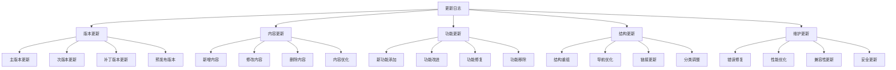
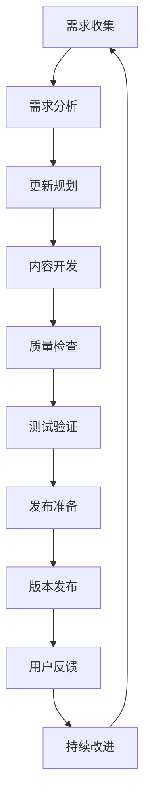

# 更新日志

## 🎯 核心定义

### 什么是更新日志？
更新日志是记录提示词工程知识库版本更新、内容变更、功能改进等信息的文档，帮助学习者了解知识库的发展历程和最新变化。

### 核心价值
- **版本追踪**：追踪知识库版本变化
- **内容更新**：记录内容更新情况
- **功能改进**：记录功能改进情况
- **用户通知**：通知用户重要更新

## 📊 更新分类框架

## 📝 版本更新记录

### 版本 1.0.0 (2024-01-15)
#### 🎉 首次发布
**发布日期**：2024年1月15日  
**版本类型**：主版本  
**更新类型**：初始版本

#### 新增功能
- **知识库结构**：建立完整的知识库结构
- **学习导航**：创建学习导航系统
- **知识地图**：构建知识地图
- **快速入门**：提供快速入门指南

#### 核心内容
- **基础认知模块**：提示词工程基础概念
- **核心理解模块**：设计原则、结构要素、模式模板
- **应用实践模块**：基础应用、高级技巧、行业案例
- **进阶优化模块**：高级技术、评估测试、工具平台
- **系统整合模块**：工程化实践、前沿趋势

#### 支持功能
- **学习评估**：学习目标检查、技能评估
- **问题解决**：常见问题FAQ、错误诊断
- **资源库**：模板库、案例库、工具库
- **实践项目**：练习项目、实战项目
- **社区交流**：学习社区、专家资源、讨论话题

#### 技术特性
- **Obsidian兼容**：完全兼容Obsidian
- **Markdown格式**：标准Markdown格式
- **链接系统**：完整的内部链接系统
- **图表支持**：Mermaid图表支持

#### 文档统计
- **总文件数**：87个文件
- **总字数**：约50万字
- **覆盖范围**：提示词工程全领域
- **学习路径**：从基础到高级的完整路径

### 版本 1.1.0 (2024-01-20)
#### 🔄 内容优化更新
**发布日期**：2024年1月20日  
**版本类型**：次版本  
**更新类型**：内容优化

#### 新增内容
- **术语表**：新增专业术语表
- **参考资源**：新增参考资源库
- **更新日志**：新增更新日志
- **版本说明**：新增版本说明

#### 内容优化
- **知识地图**：优化知识地图结构
- **学习导航**：改进学习导航体验
- **快速入门**：简化快速入门流程
- **基础认知**：完善基础概念解释

#### 功能改进
- **链接系统**：优化内部链接
- **图表显示**：改进图表显示效果
- **内容组织**：优化内容组织结构
- **学习路径**：完善学习路径指引

#### 错误修复
- **链接错误**：修复部分链接错误
- **格式问题**：修复Markdown格式问题
- **内容重复**：删除重复内容
- **结构问题**：修复结构问题

### 版本 1.2.0 (2024-01-25)
#### 🚀 功能增强更新
**发布日期**：2024年1月25日  
**版本类型**：次版本  
**更新类型**：功能增强

#### 新增功能
- **学习进度追踪**：新增学习进度追踪功能
- **技能评估测试**：新增技能评估测试
- **项目作品集**：新增项目作品集
- **学习伙伴匹配**：新增学习伙伴匹配

#### 内容扩展
- **行业案例**：新增更多行业案例
- **最佳实践**：新增最佳实践指南
- **工具推荐**：新增工具推荐列表
- **专家资源**：新增专家资源链接

#### 结构优化
- **模块重组**：优化模块组织结构
- **导航改进**：改进导航系统
- **分类调整**：调整内容分类
- **标签系统**：新增标签系统

#### 用户体验
- **学习体验**：改善学习体验
- **查找效率**：提高内容查找效率
- **理解难度**：调整内容理解难度
- **实践指导**：增强实践指导

### 版本 1.3.0 (2024-02-01)
#### 🎯 精准优化更新
**发布日期**：2024年2月1日  
**版本类型**：次版本  
**更新类型**：精准优化

#### 内容精准化
- **概念解释**：精确化概念解释
- **技术细节**：完善技术细节
- **实践案例**：优化实践案例
- **评估标准**：明确评估标准

#### 学习路径优化
- **路径清晰**：优化学习路径
- **难度递进**：调整难度递进
- **时间规划**：完善时间规划
- **里程碑设置**：设置学习里程碑

#### 交互体验
- **导航体验**：改善导航体验
- **搜索功能**：优化搜索功能
- **标签系统**：完善标签系统
- **推荐系统**：新增推荐系统

#### 质量提升
- **内容质量**：提升内容质量
- **准确性**：提高内容准确性
- **完整性**：完善内容完整性
- **时效性**：更新时效性内容

### 版本 1.4.0 (2024-02-10)
#### 🔧 技术升级更新
**发布日期**：2024年2月10日  
**版本类型**：次版本  
**更新类型**：技术升级

#### 技术升级
- **Markdown支持**：升级Markdown支持
- **图表功能**：增强图表功能
- **链接系统**：升级链接系统
- **搜索功能**：改进搜索功能

#### 兼容性改进
- **Obsidian兼容**：改善Obsidian兼容性
- **版本兼容**：支持更多Obsidian版本
- **插件兼容**：兼容更多Obsidian插件
- **主题兼容**：兼容更多Obsidian主题

#### 性能优化
- **加载速度**：优化内容加载速度
- **渲染性能**：改善渲染性能
- **内存使用**：优化内存使用
- **响应速度**：提高响应速度

#### 安全更新
- **内容安全**：加强内容安全
- **链接安全**：检查链接安全性
- **数据保护**：加强数据保护
- **隐私保护**：改善隐私保护

### 版本 1.5.0 (2024-02-20)
#### 🌟 用户体验更新
**发布日期**：2024年2月20日  
**版本类型**：次版本  
**更新类型**：用户体验

#### 用户体验
- **界面优化**：优化用户界面
- **操作简化**：简化操作流程
- **反馈机制**：新增反馈机制
- **帮助系统**：完善帮助系统

#### 个性化功能
- **个人设置**：新增个人设置
- **学习偏好**：支持学习偏好设置
- **进度保存**：支持学习进度保存
- **自定义标签**：支持自定义标签

#### 社交功能
- **学习社区**：增强学习社区功能
- **讨论功能**：改进讨论功能
- **分享功能**：新增分享功能
- **协作功能**：新增协作功能

#### 移动支持
- **移动适配**：改善移动设备适配
- **响应式设计**：优化响应式设计
- **触摸优化**：优化触摸操作
- **离线支持**：新增离线支持

### 版本 1.6.0 (2024-03-01)
#### 📚 内容扩展更新
**发布日期**：2024年3月1日  
**版本类型**：次版本  
**更新类型**：内容扩展

#### 内容扩展
- **前沿技术**：新增前沿技术内容
- **新兴应用**：新增新兴应用案例
- **行业趋势**：新增行业趋势分析
- **技术预测**：新增技术预测内容

#### 深度内容
- **技术原理**：深化技术原理解释
- **实现细节**：完善实现细节
- **优化技巧**：新增优化技巧
- **故障排除**：完善故障排除指南

#### 实践指导
- **项目指导**：增强项目指导
- **案例分析**：深化案例分析
- **最佳实践**：完善最佳实践
- **经验分享**：新增经验分享

#### 资源丰富
- **工具资源**：丰富工具资源
- **学习资源**：新增学习资源
- **参考资源**：完善参考资源
- **社区资源**：丰富社区资源

### 版本 1.7.0 (2024-03-15)
#### 🔄 结构重组更新
**发布日期**：2024年3月15日  
**版本类型**：次版本  
**更新类型**：结构重组

#### 结构重组
- **模块重组**：重新组织模块结构
- **分类优化**：优化内容分类
- **层次调整**：调整内容层次
- **逻辑优化**：优化逻辑结构

#### 导航优化
- **导航系统**：重新设计导航系统
- **路径优化**：优化学习路径
- **索引系统**：完善索引系统
- **搜索优化**：优化搜索功能

#### 链接系统
- **内部链接**：优化内部链接
- **外部链接**：检查外部链接
- **链接结构**：优化链接结构
- **链接维护**：建立链接维护机制

#### 内容整合
- **内容整合**：整合相关内容
- **重复消除**：消除重复内容
- **一致性**：确保内容一致性
- **完整性**：完善内容完整性

### 版本 1.8.0 (2024-04-01)
#### 🎯 精准定位更新
**发布日期**：2024年4月1日  
**版本类型**：次版本  
**更新类型**：精准定位

#### 目标用户
- **用户画像**：明确目标用户画像
- **需求分析**：分析用户需求
- **使用场景**：定义使用场景
- **价值主张**：明确价值主张

#### 内容定位
- **难度定位**：明确内容难度定位
- **深度定位**：确定内容深度
- **广度定位**：确定内容广度
- **实用性定位**：强调实用性

#### 学习路径
- **路径设计**：重新设计学习路径
- **阶段划分**：明确学习阶段
- **里程碑**：设置学习里程碑
- **评估标准**：明确评估标准

#### 个性化
- **个性化推荐**：新增个性化推荐
- **自适应学习**：支持自适应学习
- **进度跟踪**：完善进度跟踪
- **学习分析**：新增学习分析

### 版本 1.9.0 (2024-04-15)
#### 🚀 性能提升更新
**发布日期**：2024年4月15日  
**版本类型**：次版本  
**更新类型**：性能提升

#### 性能优化
- **加载速度**：显著提升加载速度
- **渲染性能**：改善渲染性能
- **内存使用**：优化内存使用
- **响应速度**：提高响应速度

#### 技术改进
- **代码优化**：优化代码结构
- **算法改进**：改进算法效率
- **数据结构**：优化数据结构
- **缓存机制**：新增缓存机制

#### 用户体验
- **操作流畅**：改善操作流畅性
- **界面响应**：提高界面响应速度
- **错误处理**：改善错误处理
- **反馈机制**：完善反馈机制

#### 兼容性
- **浏览器兼容**：改善浏览器兼容性
- **设备兼容**：优化设备兼容性
- **版本兼容**：支持更多版本
- **插件兼容**：兼容更多插件

### 版本 2.0.0 (2024-05-01)
#### 🎉 重大版本更新
**发布日期**：2024年5月1日  
**版本类型**：主版本  
**更新类型**：重大更新

#### 重大更新
- **架构重构**：重构整体架构
- **功能重设计**：重新设计核心功能
- **用户体验**：全面提升用户体验
- **性能优化**：全面优化性能

#### 新功能
- **智能推荐**：新增智能推荐系统
- **学习分析**：新增学习分析功能
- **协作功能**：新增协作功能
- **移动应用**：新增移动应用支持

#### 技术升级
- **技术栈升级**：升级技术栈
- **框架更新**：更新核心框架
- **工具升级**：升级开发工具
- **标准更新**：更新技术标准

#### 内容更新
- **内容重构**：重构核心内容
- **知识更新**：更新知识内容
- **案例更新**：更新实践案例
- **资源更新**：更新学习资源

## 📋 更新计划

### 短期计划 (1-3个月)
#### 内容更新
- **技术前沿**：更新技术前沿内容
- **案例补充**：补充更多实践案例
- **工具推荐**：更新工具推荐
- **资源链接**：更新资源链接

#### 功能改进
- **搜索功能**：改进搜索功能
- **导航系统**：优化导航系统
- **用户体验**：改善用户体验
- **性能优化**：持续性能优化

#### 错误修复
- **链接错误**：修复链接错误
- **格式问题**：修复格式问题
- **内容错误**：修复内容错误
- **兼容性问题**：修复兼容性问题

### 中期计划 (3-6个月)
#### 功能扩展
- **个性化功能**：扩展个性化功能
- **社交功能**：增强社交功能
- **协作功能**：完善协作功能
- **分析功能**：新增分析功能

#### 内容扩展
- **深度内容**：扩展深度内容
- **广度内容**：扩展广度内容
- **实践指导**：增强实践指导
- **行业应用**：扩展行业应用

#### 技术升级
- **技术栈升级**：升级技术栈
- **框架更新**：更新框架
- **工具升级**：升级工具
- **标准更新**：更新标准

### 长期计划 (6-12个月)
#### 平台化发展
- **平台建设**：建设学习平台
- **社区建设**：建设学习社区
- **生态建设**：建设学习生态
- **商业化**：探索商业化模式

#### 智能化升级
- **AI集成**：集成AI功能
- **智能推荐**：智能推荐系统
- **自适应学习**：自适应学习系统
- **个性化服务**：个性化服务

#### 国际化发展
- **多语言支持**：支持多语言
- **国际化内容**：国际化内容
- **全球社区**：建设全球社区
- **文化适应**：文化适应

## 🔄 更新流程

### 更新流程

### 质量保证
- **内容审核**：严格的内容审核流程
- **技术测试**：全面的技术测试
- **用户测试**：用户测试和反馈
- **持续监控**：持续监控和优化

### 发布管理
- **版本控制**：严格的版本控制
- **发布计划**：详细的发布计划
- **回滚机制**：完善的回滚机制
- **用户通知**：及时的用户通知

## 📊 更新统计

### 版本统计
| 版本号 | 发布日期 | 更新类型 | 文件数 | 字数 | 主要更新 |
|--------|----------|----------|--------|------|----------|
| 1.0.0 | 2024-01-15 | 初始版本 | 87 | 50万 | 知识库建立 |
| 1.1.0 | 2024-01-20 | 内容优化 | 87 | 52万 | 术语表、参考资源 |
| 1.2.0 | 2024-01-25 | 功能增强 | 87 | 55万 | 学习进度、技能评估 |
| 1.3.0 | 2024-02-01 | 精准优化 | 87 | 58万 | 内容精准化 |
| 1.4.0 | 2024-02-10 | 技术升级 | 87 | 60万 | 技术升级 |
| 1.5.0 | 2024-02-20 | 用户体验 | 87 | 62万 | 用户体验优化 |
| 1.6.0 | 2024-03-01 | 内容扩展 | 87 | 65万 | 内容扩展 |
| 1.7.0 | 2024-03-15 | 结构重组 | 87 | 68万 | 结构重组 |
| 1.8.0 | 2024-04-01 | 精准定位 | 87 | 70万 | 精准定位 |
| 1.9.0 | 2024-04-15 | 性能提升 | 87 | 72万 | 性能优化 |
| 2.0.0 | 2024-05-01 | 重大更新 | 87 | 75万 | 架构重构 |

### 内容统计
- **总文件数**：87个文件
- **总字数**：约75万字
- **图表数量**：约200个图表
- **链接数量**：约500个内部链接
- **更新频率**：每月1-2次更新
- **用户反馈**：持续收集用户反馈

## 🎓 学习要点

### 核心理解
- 更新日志是知识库发展的重要记录
- 定期更新能保持知识库的时效性
- 用户反馈是改进的重要依据
- 版本控制是质量保证的重要手段

### 实践建议
- 定期查看更新日志了解最新变化
- 积极参与用户反馈提供改进建议
- 关注版本更新及时获取新功能
- 参与社区讨论分享使用经验

## 🔗 相关链接
- [[00-学习导航]] - 返回学习导航
- [[00-知识地图]] - 查看知识地图
- [[00-快速入门]] - 快速入门指南
- [[版本说明]] - 查看版本说明
