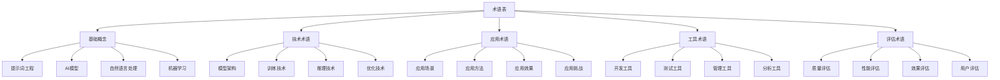

# 术语表

## 🎯 核心定义

### 什么是术语表？
术语表是收集和整理提示词工程领域专业术语的参考文档，为学习者提供准确的术语定义、解释和使用示例，帮助理解专业概念和技术内容。

### 核心价值
- **概念澄清**：澄清专业概念和术语
- **知识理解**：帮助理解专业知识
- **交流沟通**：促进专业交流沟通
- **学习参考**：提供学习参考

## 📊 术语分类框架



## 🔤 基础概念

### A

#### AI (Artificial Intelligence) - 人工智能
**定义**：模拟人类智能的计算机系统，能够执行通常需要人类智能的任务。

**详细解释**：
- **核心特征**：学习、推理、感知、决策
- **技术分支**：机器学习、深度学习、自然语言处理
- **应用领域**：医疗、教育、金融、交通
- **发展历程**：从规则系统到机器学习

**使用示例**：
```
AI系统能够理解自然语言，生成文本，回答问题，执行复杂任务。
```

**相关术语**：机器学习、深度学习、自然语言处理

#### Attention Mechanism - 注意力机制
**定义**：神经网络中的一种机制，允许模型在处理序列数据时关注输入的不同部分。

**详细解释**：
- **工作原理**：计算输入序列中不同位置的权重
- **类型分类**：自注意力、交叉注意力、多头注意力
- **应用场景**：机器翻译、文本摘要、问答系统
- **技术优势**：处理长序列、捕捉长距离依赖

**使用示例**：
```
Transformer模型使用注意力机制来理解句子中词语之间的关系。
```

**相关术语**：Transformer、自注意力、多头注意力

### B

#### BERT (Bidirectional Encoder Representations from Transformers) - 双向编码器表示
**定义**：Google开发的双向Transformer编码器模型，用于自然语言理解任务。

**详细解释**：
- **技术特点**：双向编码、预训练+微调
- **训练方法**：掩码语言模型、下一句预测
- **应用任务**：文本分类、命名实体识别、问答
- **技术优势**：上下文理解能力强

**使用示例**：
```
BERT模型在文本分类任务中表现出色，能够理解句子的深层语义。
```

**相关术语**：Transformer、预训练、微调

#### Big Data - 大数据
**定义**：规模庞大、复杂多样、处理速度快的数据集合。

**详细解释**：
- **特征描述**：Volume（体量）、Velocity（速度）、Variety（多样性）
- **处理技术**：分布式计算、云计算、机器学习
- **应用领域**：商业分析、科学研究、社会治理
- **技术挑战**：存储、处理、分析、隐私保护

**使用示例**：
```
大数据技术帮助分析用户行为，优化产品推荐系统。
```

**相关术语**：机器学习、云计算、数据分析

### C

#### Chain of Thought (CoT) - 思维链
**定义**：一种提示词技术，通过展示推理过程来引导模型进行逐步思考。

**详细解释**：
- **工作原理**：提供推理步骤示例，引导模型模仿
- **技术优势**：提高复杂推理任务的准确性
- **应用场景**：数学问题、逻辑推理、复杂分析
- **实现方法**：Few-shot示例、Zero-shot提示

**使用示例**：
```
使用思维链技术，模型能够逐步解决复杂的数学问题。
```

**相关术语**：Few-shot、Zero-shot、推理

#### ChatGPT - 聊天生成预训练变换器
**定义**：OpenAI开发的大型语言模型，专门用于对话生成任务。

**详细解释**：
- **技术基础**：GPT-3.5/GPT-4架构
- **训练方法**：监督学习+强化学习
- **功能特点**：对话生成、代码编写、创意写作
- **应用场景**：客服、教育、创作、编程

**使用示例**：
```
ChatGPT能够进行自然对话，回答各种问题，协助完成各种任务。
```

**相关术语**：GPT、大语言模型、对话系统

### D

#### Deep Learning - 深度学习
**定义**：机器学习的一个分支，使用多层神经网络来学习数据的复杂模式。

**详细解释**：
- **网络结构**：多层感知机、卷积神经网络、循环神经网络
- **学习过程**：前向传播、反向传播、梯度下降
- **应用领域**：图像识别、语音识别、自然语言处理
- **技术优势**：自动特征提取、端到端学习

**使用示例**：
```
深度学习在图像识别任务中取得了突破性进展。
```

**相关术语**：神经网络、机器学习、特征提取

#### Domain Adaptation - 领域适应
**定义**：将在一个领域训练的模型适应到另一个相关领域的技术。

**详细解释**：
- **适应方法**：微调、对抗训练、领域不变特征
- **应用场景**：跨领域文本分类、机器翻译
- **技术挑战**：领域差异、数据稀缺、分布偏移
- **评估指标**：准确率、F1分数、领域适应度

**使用示例**：
```
通过领域适应技术，将通用模型适应到特定领域。
```

**相关术语**：迁移学习、微调、对抗训练

### E

#### Embedding - 嵌入
**定义**：将离散的符号（如词语、句子）映射到连续向量空间的技术。

**详细解释**：
- **技术原理**：将高维离散数据映射到低维连续空间
- **类型分类**：词嵌入、句嵌入、图嵌入
- **训练方法**：Word2Vec、GloVe、BERT
- **应用场景**：文本相似度、推荐系统、聚类分析

**使用示例**：
```
词嵌入技术将词语转换为向量，便于计算语义相似度。
```

**相关术语**：Word2Vec、向量化、语义表示

#### Evaluation - 评估
**定义**：对模型性能、提示词效果或系统质量进行量化和分析的过程。

**详细解释**：
- **评估类型**：自动评估、人工评估、混合评估
- **评估指标**：准确率、召回率、F1分数、BLEU分数
- **评估方法**：交叉验证、A/B测试、用户研究
- **评估维度**：质量、效率、成本、用户体验

**使用示例**：
```
通过评估指标来衡量提示词工程的效果。
```

**相关术语**：指标、测试、验证

### F

#### Few-shot Learning - 少样本学习
**定义**：使用少量示例来学习新任务或适应新领域的技术。

**详细解释**：
- **学习方式**：提供少量示例，模型快速适应
- **技术优势**：减少数据需求、提高适应性
- **应用场景**：新任务适应、领域迁移、个性化
- **实现方法**：元学习、原型网络、关系网络

**使用示例**：
```
少样本学习技术使模型能够快速适应新的任务。
```

**相关术语**：元学习、迁移学习、适应

#### Fine-tuning - 微调
**定义**：在预训练模型基础上，使用特定任务数据进一步训练的过程。

**详细解释**：
- **训练过程**：冻结部分层、调整学习率、任务特定训练
- **技术优势**：利用预训练知识、减少训练时间
- **应用场景**：文本分类、问答系统、代码生成
- **技术挑战**：过拟合、灾难性遗忘、数据需求

**使用示例**：
```
通过微调技术，将通用模型适应到特定任务。
```

**相关术语**：预训练、迁移学习、适应

### G

#### GPT (Generative Pre-trained Transformer) - 生成式预训练变换器
**定义**：OpenAI开发的基于Transformer架构的大型语言模型。

**详细解释**：
- **模型架构**：Transformer解码器、自注意力机制
- **训练方法**：自回归语言建模、无监督预训练
- **模型版本**：GPT-1、GPT-2、GPT-3、GPT-4
- **应用场景**：文本生成、对话系统、代码生成

**使用示例**：
```
GPT模型在自然语言生成任务中表现出色。
```

**相关术语**：Transformer、大语言模型、生成模型

#### Gradient Descent - 梯度下降
**定义**：一种优化算法，通过计算梯度来最小化损失函数。

**详细解释**：
- **算法原理**：沿着梯度反方向更新参数
- **类型分类**：批量梯度下降、随机梯度下降、小批量梯度下降
- **优化技术**：动量、自适应学习率、正则化
- **应用场景**：神经网络训练、参数优化

**使用示例**：
```
梯度下降算法用于训练神经网络模型。
```

**相关术语**：优化、损失函数、参数更新

### H

#### Human-in-the-Loop - 人在回路
**定义**：将人类专家纳入AI系统决策过程的技术方法。

**详细解释**：
- **工作模式**：人类参与训练、验证、决策过程
- **应用场景**：数据标注、模型验证、决策支持
- **技术优势**：提高准确性、增强可解释性、降低风险
- **实现方法**：主动学习、强化学习、协作学习

**使用示例**：
```
人在回路技术确保AI系统的决策质量和安全性。
```

**相关术语**：主动学习、协作学习、可解释性

#### Hyperparameter - 超参数
**定义**：在机器学习模型训练前需要设置的参数，不能通过训练自动学习。

**详细解释**：
- **参数类型**：学习率、批次大小、网络层数、正则化参数
- **调优方法**：网格搜索、随机搜索、贝叶斯优化
- **调优策略**：交叉验证、早停、学习率调度
- **调优工具**：Optuna、Hyperopt、Ray Tune

**使用示例**：
```
超参数调优是提高模型性能的重要步骤。
```

**相关术语**：参数调优、网格搜索、交叉验证

### I

#### Inference - 推理
**定义**：使用训练好的模型对新数据进行预测或生成的过程。

**详细解释**：
- **推理过程**：输入处理、前向传播、输出生成
- **推理模式**：批量推理、实时推理、流式推理
- **优化技术**：模型压缩、量化、剪枝
- **应用场景**：预测、分类、生成、推荐

**使用示例**：
```
模型推理是AI系统提供服务的核心过程。
```

**相关术语**：预测、生成、模型部署

#### Instruction Tuning - 指令微调
**定义**：使用指令-响应对数据对模型进行微调的技术。

**详细解释**：
- **训练数据**：指令-响应对、任务描述-输出对
- **训练目标**：提高模型遵循指令的能力
- **技术优势**：提高可控性、增强任务适应性
- **应用场景**：对话系统、任务执行、代码生成

**使用示例**：
```
指令微调技术使模型能够更好地遵循用户指令。
```

**相关术语**：微调、指令、任务适应

### J

#### JSON (JavaScript Object Notation) - JavaScript对象表示法
**定义**：一种轻量级的数据交换格式，常用于API通信和数据存储。

**详细解释**：
- **格式特点**：人类可读、机器可解析、跨平台
- **数据结构**：对象、数组、字符串、数字、布尔值
- **应用场景**：API响应、配置文件、数据交换
- **技术优势**：简洁、高效、易用

**使用示例**：
```
JSON格式常用于AI模型的输入输出数据交换。
```

**相关术语**：数据格式、API、数据交换

### K

#### Knowledge Graph - 知识图谱
**定义**：以图结构表示实体及其关系的知识库。

**详细解释**：
- **图结构**：节点（实体）、边（关系）、属性
- **构建方法**：信息抽取、知识融合、知识推理
- **应用场景**：问答系统、推荐系统、搜索引擎
- **技术优势**：结构化表示、关系推理、知识发现

**使用示例**：
```
知识图谱为AI系统提供结构化的背景知识。
```

**相关术语**：实体、关系、知识库

### L

#### Large Language Model (LLM) - 大语言模型
**定义**：参数量巨大的语言模型，能够理解和生成自然语言。

**详细解释**：
- **模型规模**：数十亿到数千亿参数
- **技术特点**：预训练、微调、指令遵循
- **应用场景**：文本生成、问答、翻译、代码生成
- **技术优势**：通用性强、理解能力强、生成质量高

**使用示例**：
```
大语言模型在自然语言处理任务中表现出色。
```

**相关术语**：语言模型、预训练、生成模型

#### Learning Rate - 学习率
**定义**：控制模型参数更新步长的超参数。

**详细解释**：
- **作用机制**：控制梯度下降的步长
- **设置策略**：固定学习率、自适应学习率、学习率调度
- **调优方法**：网格搜索、经验法则、自适应算法
- **影响效果：收敛速度、最终性能、训练稳定性

**使用示例**：
```
学习率是影响模型训练效果的关键超参数。
```

**相关术语**：梯度下降、超参数、优化

### M

#### Machine Learning - 机器学习
**定义**：让计算机通过数据学习模式，无需明确编程的技术。

**详细解释**：
- **学习类型**：监督学习、无监督学习、强化学习
- **算法分类**：线性模型、树模型、神经网络
- **应用场景**：预测、分类、聚类、推荐
- **技术优势**：自动化、适应性、可扩展性

**使用示例**：
```
机器学习技术使计算机能够从数据中学习模式。
```

**相关术语**：深度学习、算法、数据挖掘

#### Model - 模型
**定义**：对现实世界现象的数学表示，用于预测或决策。

**详细解释**：
- **模型类型**：统计模型、机器学习模型、深度学习模型
- **模型组件**：参数、超参数、架构、损失函数
- **模型生命周期**：设计、训练、验证、部署、维护
- **模型评估**：准确率、泛化能力、鲁棒性

**使用示例**：
```
模型是AI系统的核心组件，用于处理数据和生成结果。
```

**相关术语**：算法、参数、训练

### N

#### Natural Language Processing (NLP) - 自然语言处理
**定义**：计算机科学和人工智能的交叉领域，研究计算机与人类语言交互。

**详细解释**：
- **核心任务**：文本理解、文本生成、语言翻译
- **技术方法**：统计方法、机器学习、深度学习
- **应用场景**：搜索引擎、机器翻译、聊天机器人
- **技术挑战**：语义理解、上下文处理、多语言支持

**使用示例**：
```
自然语言处理技术使计算机能够理解和生成人类语言。
```

**相关术语**：语言模型、文本分析、语义理解

#### Neural Network - 神经网络
**定义**：受生物神经网络启发的计算模型，由相互连接的节点组成。

**详细解释**：
- **网络结构**：输入层、隐藏层、输出层
- **节点类型**：感知机、激活函数、权重
- **学习过程**：前向传播、反向传播、梯度下降
- **网络类型**：前馈网络、循环网络、卷积网络

**使用示例**：
```
神经网络是深度学习的基础架构。
```

**相关术语**：深度学习、节点、权重

### O

#### Overfitting - 过拟合
**定义**：模型在训练数据上表现良好，但在新数据上表现不佳的现象。

**详细解释**：
- **产生原因**：模型复杂度过高、训练数据不足、训练时间过长
- **识别方法**：训练集和验证集性能差异、学习曲线分析
- **解决方法**：正则化、数据增强、早停、模型简化
- **预防策略**：交叉验证、模型选择、超参数调优

**使用示例**：
```
过拟合是机器学习中的常见问题，需要通过正则化等方法解决。
```

**相关术语**：正则化、交叉验证、泛化

#### Optimization - 优化
**定义**：调整模型参数以最小化损失函数的过程。

**详细解释**：
- **优化目标**：最小化损失函数、最大化性能指标
- **优化方法**：梯度下降、牛顿法、拟牛顿法
- **优化技术**：动量、自适应学习率、正则化
- **优化工具**：TensorFlow、PyTorch、Scikit-learn

**使用示例**：
```
优化是机器学习模型训练的核心过程。
```

**相关术语**：梯度下降、损失函数、参数更新

### P

#### Prompt - 提示词
**定义**：输入给AI模型的指令或问题，用于引导模型生成期望的输出。

**详细解释**：
- **组成要素**：角色设定、任务描述、上下文、格式要求
- **设计原则**：清晰性、具体性、上下文性、角色性
- **类型分类**：零样本、少样本、思维链、角色扮演
- **优化方法**：A/B测试、迭代优化、用户反馈

**使用示例**：
```
提示词是提示词工程的核心，直接影响模型输出质量。
```

**相关术语**：提示词工程、指令、上下文

#### Prompt Engineering - 提示词工程
**定义**：设计和优化提示词的技术，用于提高AI模型输出质量。

**详细解释**：
- **核心目标**：提高模型输出质量、增强可控性、降低使用成本
- **技术方法**：提示词设计、参数调优、效果评估
- **应用场景**：文本生成、问答系统、代码生成、创意写作
- **技术挑战**：提示词长度限制、输出一致性、成本控制

**使用示例**：
```
提示词工程是提高AI模型使用效果的重要技术。
```

**相关术语**：提示词、模型优化、效果评估

### Q

#### Quality Assurance (QA) - 质量保证
**定义**：确保AI系统输出质量和可靠性的过程和方法。

**详细解释**：
- **质量维度**：准确性、一致性、完整性、及时性
- **保证方法**：测试验证、监控告警、人工审核
- **质量指标**：准确率、召回率、F1分数、用户满意度
- **实施流程**：质量规划、质量控制、质量改进

**使用示例**：
```
质量保证是确保AI系统可靠性的重要环节。
```

**相关术语**：测试、验证、监控

### R

#### Reinforcement Learning - 强化学习
**定义**：通过与环境交互，学习最优行为策略的机器学习方法。

**详细解释**：
- **学习机制**：状态、动作、奖励、策略
- **算法类型**：Q学习、策略梯度、Actor-Critic
- **应用场景**：游戏AI、机器人控制、推荐系统
- **技术优势**：自主学习、适应性强、长期优化

**使用示例**：
```
强化学习技术使AI系统能够通过试错学习最优策略。
```

**相关术语**：策略、奖励、环境

#### Role - 角色
**定义**：在提示词中为AI模型设定的身份或角色。

**详细解释**：
- **角色类型**：专家角色、助手角色、创意角色、分析角色
- **设定方法**：直接描述、背景介绍、能力说明
- **作用机制：影响模型行为、输出风格、专业程度
- **优化技巧**：角色一致性、能力匹配、风格统一

**使用示例**：
```
角色设定是提示词设计的重要元素，影响模型输出风格。
```

**相关术语**：提示词、身份、行为

### S

#### Supervised Learning - 监督学习
**定义**：使用带标签数据训练模型的机器学习方法。

**详细解释**：
- **训练数据**：输入-输出对、特征-标签对
- **学习目标**：学习输入到输出的映射关系
- **算法类型**：线性回归、决策树、神经网络
- **应用场景**：分类、回归、预测

**使用示例**：
```
监督学习使用带标签的数据训练模型进行预测。
```

**相关术语**：标签、训练数据、预测

#### System Message - 系统消息
**定义**：在对话系统中设置AI模型行为规则和约束的消息。

**详细解释**：
- **功能作用**：设定模型角色、行为规则、输出格式
- **设计原则**：清晰明确、具体可操作、一致性
- **应用场景**：聊天机器人、助手系统、专业工具
- **优化方法**：迭代测试、用户反馈、A/B测试

**使用示例**：
```
系统消息用于设定AI模型的行为规则和输出风格。
```

**相关术语**：角色设定、行为规则、约束

### T

#### Token - 标记
**定义**：文本处理中的基本单位，可以是词语、字符或子词。

**详细解释**：
- **标记类型**：词标记、字符标记、子词标记
- **标记化方法**：空格分割、规则分割、BPE算法
- **标记作用**：文本表示、模型输入、长度计算
- **标记限制**：模型输入长度限制、成本计算

**使用示例**：
```
Token是AI模型处理文本的基本单位。
```

**相关术语**：文本处理、标记化、长度限制

#### Transformer - 变换器
**定义**：基于注意力机制的神经网络架构，用于序列到序列任务。

**详细解释**：
- **核心组件**：自注意力机制、前馈网络、位置编码
- **架构类型**：编码器、解码器、编码器-解码器
- **技术优势**：并行计算、长距离依赖、可扩展性
- **应用场景**：机器翻译、文本生成、语言理解

**使用示例**：
```
Transformer架构是现代大语言模型的基础。
```

**相关术语**：注意力机制、编码器、解码器

### U

#### Unsupervised Learning - 无监督学习
**定义**：使用无标签数据发现数据中隐藏模式的机器学习方法。

**详细解释**：
- **学习目标**：发现数据中的隐藏结构、模式、关系
- **算法类型**：聚类、降维、异常检测、生成模型
- **应用场景**：数据探索、特征学习、异常检测
- **技术优势**：无需标签、发现隐藏模式、数据驱动

**使用示例**：
```
无监督学习用于发现数据中的隐藏模式和结构。
```

**相关术语**：聚类、降维、模式发现

### V

#### Validation - 验证
**定义**：使用独立数据集评估模型性能的过程。

**详细解释**：
- **验证目的**：评估模型泛化能力、选择最佳模型
- **验证方法**：留出法、交叉验证、时间序列验证
- **验证指标**：准确率、精确率、召回率、F1分数
- **验证策略**：早停、模型选择、超参数调优

**使用示例**：
```
验证是确保模型泛化能力的重要步骤。
```

**相关术语**：测试、评估、泛化

### W

#### Word Embedding - 词嵌入
**定义**：将词语映射到连续向量空间的技术。

**详细解释**：
- **技术原理**：将离散词语转换为连续向量
- **训练方法**：Word2Vec、GloVe、FastText
- **应用场景**：文本相似度、推荐系统、语言模型
- **技术优势**：语义表示、计算效率、可扩展性

**使用示例**：
```
词嵌入技术将词语转换为向量，便于计算语义相似度。
```

**相关术语**：向量化、语义表示、Word2Vec

### X

#### XML (eXtensible Markup Language) - 可扩展标记语言
**定义**：一种用于存储和传输数据的标记语言。

**详细解释**：
- **格式特点**：结构化、可扩展、人类可读
- **应用场景**：数据交换、配置文件、文档存储
- **技术优势**：标准化、跨平台、可验证
- **使用方式**：标签、属性、嵌套结构

**使用示例**：
```
XML格式常用于AI系统的数据交换和配置。
```

**相关术语**：数据格式、标记语言、结构化

### Y

#### Yield - 产出
**定义**：AI系统生成的结果或输出。

**详细解释**：
- **产出类型**：文本、图像、音频、代码
- **质量评估**：准确性、相关性、完整性、及时性
- **优化方法**：提示词优化、参数调优、后处理
- **应用价值：解决问题、提供信息、辅助决策

**使用示例**：
```
AI系统的产出质量直接影响用户体验。
```

**相关术语**：输出、结果、生成

### Z

#### Zero-shot Learning - 零样本学习
**定义**：模型在没有特定任务训练数据的情况下执行新任务的能力。

**详细解释**：
- **学习机制**：利用预训练知识、任务描述、示例推理
- **技术优势**：无需训练数据、快速适应、通用性强
- **应用场景**：新任务适应、领域迁移、创意生成
- **实现方法**：任务描述、Few-shot示例、思维链

**使用示例**：
```
零样本学习使模型能够处理未见过的任务。
```

**相关术语**：Few-shot、任务适应、预训练

## 🎓 学习要点

### 核心理解
- 术语表是理解专业概念的重要工具
- 准确理解术语有助于深入掌握技术
- 术语使用要准确和一致
- 持续更新术语表以适应技术发展

### 实践建议
- 系统学习基础术语
- 理解术语的准确含义
- 在交流中正确使用术语
- 关注新术语的发展

## 🔗 相关链接
- [[00-学习导航]] - 返回学习导航
- [[00-知识地图]] - 查看知识地图
- [[00-快速入门]] - 快速入门指南
- [[参考资源]] - 查看参考资源
