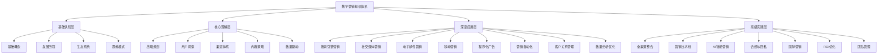

# 知识体系总览

## 体系架构图



## 学习层次说明

### 第一层：基础认知层
**目标**：建立数字营销基础认知框架

| 模块 | 核心内容 | 学习重点 | 预期成果 |
|------|----------|----------|----------|
| [[01-基础认知层/01-数字营销基础概念/数字营销定义与本质|基础概念]] | 定义、本质、价值 | 理解数字营销核心 | 掌握基础术语 |
| [[01-基础认知层/02-发展历程与趋势/数字营销发展历程|发展历程]] | 历史、趋势、未来 | 了解发展脉络 | 预测未来方向 |
| [[01-基础认知层/03-生态系统分析/数字营销生态系统|生态系统]] | 参与者、关系、价值 | 理解生态构成 | 识别关键角色 |
| [[01-基础认知层/04-核心思维模式/用户中心思维|思维模式]] | 用户、数据、全渠道 | 建立营销思维 | 形成思维框架 |

### 第二层：核心理解层
**目标**：掌握数字营销核心策略与方法

| 模块 | 核心内容 | 学习重点 | 预期成果 |
|------|----------|----------|----------|
| [[02-核心理解层/01-战略规划/数字营销战略框架|战略规划]] | 框架、目标、预算 | 制定营销战略 | 形成战略思维 |
| [[02-核心理解层/02-用户洞察/目标受众分析|用户洞察]] | 画像、旅程、行为 | 深度理解用户 | 精准定位受众 |
| [[02-核心理解层/03-渠道体系/数字营销渠道全景|渠道体系]] | 选择、整合、评估 | 优化渠道组合 | 提升渠道效率 |
| [[02-核心理解层/04-内容策略/内容营销战略|内容策略]] | 创作、分发、测量 | 打造内容体系 | 提升内容效果 |
| [[02-核心理解层/05-数据驱动/数据驱动营销基础|数据驱动]] | 指标、分析、可视化 | 建立数据思维 | 实现数据驱动 |

### 第三层：深度应用层
**目标**：熟练运用各类数字营销工具与渠道

| 模块 | 核心内容 | 学习重点 | 预期成果 |
|------|----------|----------|----------|
| [[03-深度应用层/01-搜索引擎营销/SEO基础与策略|搜索引擎营销]] | SEO、SEM、关键词 | 提升搜索排名 | 获得精准流量 |
| [[03-深度应用层/02-社交媒体营销/社交媒体策略|社交媒体营销]] | 策略、内容、运营 | 建立社交影响力 | 提升品牌曝光 |
| [[03-深度应用层/03-电子邮件营销/邮件营销策略|电子邮件营销]] | 策略、设计、自动化 | 提升邮件效果 | 建立客户关系 |
| [[03-深度应用层/04-移动营销/移动营销策略|移动营销]] | 策略、APP、广告 | 抓住移动机遇 | 提升移动体验 |
| [[03-深度应用层/05-程序化广告/程序化广告基础|程序化广告]] | 基础、DSP、优化 | 提升广告效率 | 降低获客成本 |
| [[03-深度应用层/06-营销自动化/营销自动化平台|营销自动化]] | 平台、流程、效果 | 实现营销自动化 | 提升运营效率 |
| [[03-深度应用层/07-客户关系管理/CRM系统应用|客户关系管理]] | 系统、数据、细分 | 提升客户价值 | 建立长期关系 |
| [[03-深度应用层/08-数据分析优化/营销数据分析|数据分析优化]] | 分析、测试、优化 | 持续优化效果 | 提升营销ROI |

### 第四层：高级实践层
**目标**：整合应用，实现营销效果最大化

| 模块 | 核心内容 | 学习重点 | 预期成果 |
|------|----------|----------|----------|
| [[04-高级实践层/01-全渠道整合/全渠道营销策略|全渠道整合]] | 策略、数据、体验 | 实现全渠道协同 | 提升整体效果 |
| [[04-高级实践层/02-营销技术栈/MarTech技术栈|营销技术栈]] | 技术、工具、集成 | 构建技术体系 | 提升技术能力 |
| [[04-高级实践层/03-AI智能营销/AI在营销中的应用|AI智能营销]] | AI、算法、预测 | 应用AI技术 | 提升营销智能化 |
| [[04-高级实践层/04-合规与隐私/数据隐私保护|合规与隐私]] | 隐私、合规、伦理 | 确保合规运营 | 建立信任关系 |
| [[04-高级实践层/05-国际营销/全球化营销策略|国际营销]] | 全球化、本地化、文化 | 拓展国际市场 | 适应多元文化 |
| [[04-高级实践层/06-ROI优化/营销ROI计算|ROI优化]] | 计算、分析、优化 | 提升投资回报 | 实现效益最大化 |
| [[04-高级实践层/07-团队管理/数字营销团队建设|团队管理]] | 建设、技能、绩效 | 打造高效团队 | 提升团队能力 |

## 学习路径建议

### 新手路径（0-6个月）
```
基础认知层 → 核心理解层 → 重点应用领域
     ↓           ↓           ↓
   2-3周       4-6周       8-12周
```

**重点领域**：
- [[03-深度应用层/01-搜索引擎营销/SEO基础与策略|搜索引擎营销]]
- [[03-深度应用层/02-社交媒体营销/社交媒体策略|社交媒体营销]]

### 进阶路径（6-18个月）
```
核心理解层 → 全面应用层 → 高级实践层
     ↓           ↓           ↓
   3-4周       12-16周     6-8周
```

**重点领域**：
- [[03-深度应用层/06-营销自动化/营销自动化平台|营销自动化]]
- [[04-高级实践层/01-全渠道整合/全渠道营销策略|全渠道整合]]

### 专家路径（18个月+）
```
全面掌握 → 深度专精 → 创新实践
    ↓        ↓        ↓
  12-16周   8-12周   持续学习
```

**重点领域**：
- [[04-高级实践层/03-AI智能营销/AI在营销中的应用|AI智能营销]]
- [[04-高级实践层/06-ROI优化/营销ROI计算|ROI优化]]

## 新西兰特色重点

### 市场特点
- **人口规模**：500万，但消费能力强
- **数字化程度**：高度数字化，移动优先
- **文化多样性**：多元文化背景
- **环保意识**：强烈的可持续发展理念

### 重点渠道
- **Google Ads**：搜索广告主导地位
- **Facebook/Instagram**：社交媒体主要平台
- **LinkedIn**：B2B营销重要渠道
- **本地平台**：Trade Me、本地媒体

### 合规要求
- **Privacy Act 2020**：数据隐私保护
- **Fair Trading Act**：消费者保护
- **Advertising Standards**：广告标准
- **Spam Act**：反垃圾邮件

## 学习成果评估

### 基础认知评估
- [ ] 能解释数字营销定义和本质
- [ ] 理解数字营销与传统营销区别
- [ ] 掌握核心概念和术语
- [ ] 了解数字营销生态系统

### 核心理解评估
- [ ] 能制定数字营销战略
- [ ] 掌握用户洞察方法
- [ ] 理解渠道选择逻辑
- [ ] 具备数据驱动思维

### 应用技能评估
- [ ] 熟练使用主要营销工具
- [ ] 能独立执行营销活动
- [ ] 具备数据分析能力
- [ ] 能优化营销效果

### 高级实践评估
- [ ] 能整合多渠道营销
- [ ] 具备团队管理能力
- [ ] 形成个人营销方法论
- [ ] 能指导他人学习

## 学习资源支持

### 理论资源
- [[06-资源工具库/01-学习资源/推荐书籍清单|推荐书籍]]
- [[06-资源工具库/01-学习资源/在线课程推荐|在线课程]]
- [[06-资源工具库/01-学习资源/专业网站推荐|专业网站]]

### 实践资源
- [[05-实战案例库/01-行业案例/电商行业案例|行业案例]]
- [[05-实战案例库/02-工具使用/Google Analytics使用指南|工具使用]]
- [[05-实战案例库/03-最佳实践/成功案例解析|最佳实践]]

### 工具资源
- [[06-资源工具库/02-工具推荐/免费工具推荐|免费工具]]
- [[06-资源工具库/03-模板库/营销计划模板|营销模板]]
- [[06-资源工具库/04-检查清单/营销计划检查清单|检查清单]]

---

**下一步**：[[学习路径规划|制定学习计划]] | [[快速索引|快速查找]] | [[数字营销/00-总览导航/学习进度追踪|开始学习]]
