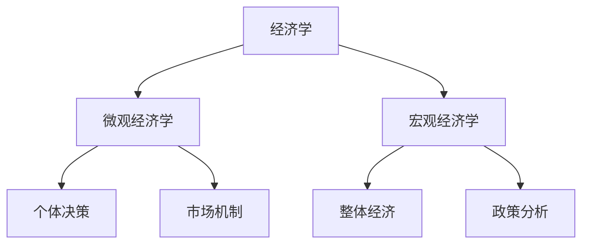
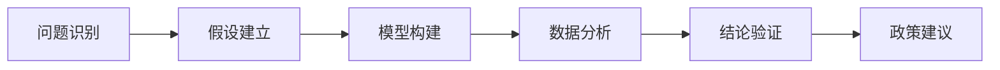

# 经济学概述

## 核心概念

### 经济学定义
经济学是研究**稀缺资源配置**和**人类选择行为**的社会科学。

> **费曼技巧**：用一句话解释经济学 → "在资源有限的情况下，人们如何做出最优选择"

### 经济学研究对象

| 研究对象 | 核心问题 | 具体内容 |
|---------|---------|---------|
| **生产什么** | What | 商品和服务的种类与数量 |
| **如何生产** | How | 生产方式、技术选择 |
| **为谁生产** | For Whom | 收入分配、消费群体 |

### 经济学基本假设

#### 1. 理性人假设
- **定义**：经济主体追求自身利益最大化
- **表现**：消费者追求效用最大化，生产者追求利润最大化
- **局限**：现实中存在非理性行为

#### 2. 完全信息假设
- **定义**：经济主体拥有决策所需的全部信息
- **现实**：信息不对称普遍存在

#### 3. 市场出清假设
- **定义**：市场能够自动达到供需平衡
- **条件**：完全竞争、无外部性、无公共品

## 经济学分支

### 按研究范围分类

### 按研究方法分类

| 分类 | 特点 | 应用 |
|------|------|------|
| **实证经济学** | 描述"是什么" | 经济现象分析 |
| **规范经济学** | 判断"应该是什么" | 政策建议 |

## 经济学发展脉络

### 主要发展阶段

1. **古典经济学**（1776-1870）
   - 代表人物：亚当·斯密、大卫·李嘉图
   - 核心思想：自由市场、比较优势

2. **新古典经济学**（1870-1930）
   - 代表人物：马歇尔、瓦尔拉斯
   - 核心思想：边际分析、一般均衡

3. **现代经济学**（1930-至今）
   - 代表人物：凯恩斯、萨缪尔森
   - 核心思想：政府干预、混合经济

## 经济学思维模式

### 成本-收益分析
- **机会成本**：选择A而放弃B的最大价值
- **边际分析**：增量变化对总体的影响
- **沉没成本**：已发生且无法收回的成本

### 经济思维框架

## 学习路径

### 基础阶段
1. [[01-稀缺性与选择]] - 理解经济学基本问题
2. [[02-经济学方法论]] - 掌握分析方法
3. [[03-经济学发展史]] - 了解理论演进

### 进阶阶段
4. [[04-经济学分支]] - 明确研究方向
5. [[05-经济思维模式]] - 培养经济直觉
6. [[06-经济学与其他学科]] - 拓展跨学科视野

## 刻意练习要点

### 概念理解
- [ ] 能够用自己的话解释经济学定义
- [ ] 理解三个基本经济问题
- [ ] 掌握经济学基本假设

### 应用分析
- [ ] 运用成本-收益分析日常决策
- [ ] 识别现实中的经济问题
- [ ] 建立简单的经济模型

### 批判思维
- [ ] 质疑经济学假设的合理性
- [ ] 分析理论的适用条件
- [ ] 思考理论的局限性

---

**下一步学习**：[[01-稀缺性与选择]] - 深入理解经济学核心问题
