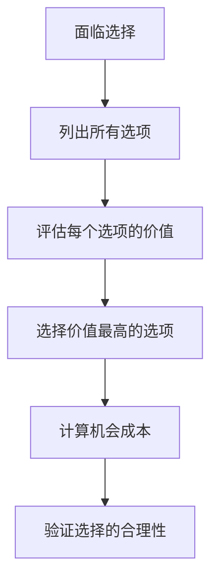
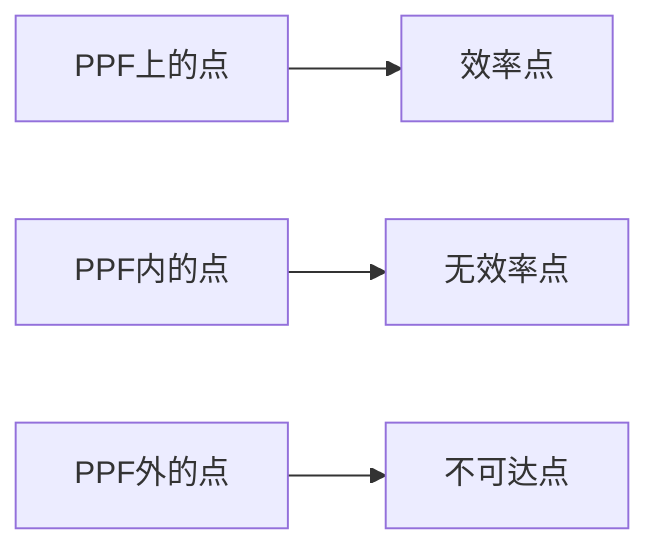
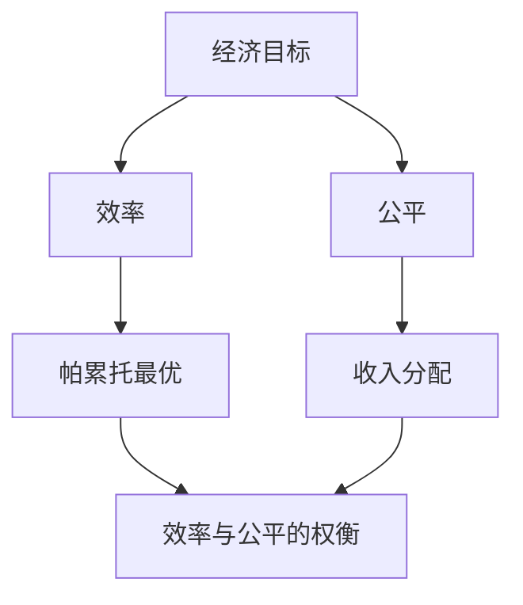

# 稀缺性与选择

## 核心概念

### 稀缺性（Scarcity）
**定义**：相对于人类无限欲望，资源总是有限的。

> **费曼技巧**：稀缺性 = 想要的多 + 拥有的少

#### 稀缺性的特征
- **普遍性**：所有资源都具有稀缺性
- **相对性**：相对于需求而言的稀缺
- **绝对性**：资源总量有限

### 选择（Choice）
**定义**：在稀缺条件下，人们必须在不同方案间做出取舍。

## 机会成本

### 概念理解
**机会成本**：选择某种方案而放弃的其他方案中价值最高的那个。

#### 机会成本公式
```
机会成本 = 放弃的最佳选择的价值
```

### 机会成本类型

| 类型 | 定义 | 例子 |
|------|------|------|
| **显性成本** | 直接支付的货币成本 | 学费、房租 |
| **隐性成本** | 放弃的潜在收益 | 放弃工作的收入 |
| **总机会成本** | 显性成本 + 隐性成本 | 上大学的总成本 |

### 机会成本分析框架



## 生产可能性边界

### 概念定义
**生产可能性边界（PPF）**：在给定资源和技术条件下，一个经济体能够生产的两种商品的最大组合。

### PPF特征

#### 1. 形状特征
- **向下倾斜**：增加一种商品必须减少另一种商品
- **凹向原点**：机会成本递增

#### 2. 关键点



| 位置 | 含义 | 特征 |
|------|------|------|
| **PPF上** | 有效率生产 | 资源充分利用 |
| **PPF内** | 无效率生产 | 资源未充分利用 |
| **PPF外** | 不可达生产 | 超出生产能力 |

### PPF移动

#### 外移（经济增长）
- **原因**：技术进步、资源增加
- **结果**：生产能力提高

#### 内移（经济衰退）
- **原因**：资源减少、技术退步
- **结果**：生产能力下降

## 经济效率

### 效率类型

#### 1. 生产效率
- **定义**：以最低成本生产
- **条件**：边际成本 = 边际收益

#### 2. 配置效率
- **定义**：资源分配到最有价值的用途
- **条件**：边际效用相等

#### 3. 动态效率
- **定义**：长期经济增长
- **条件**：技术进步、创新

### 效率与公平



## 经济制度

### 制度类型

| 制度类型 | 资源配置方式 | 特点 | 代表国家 |
|----------|-------------|------|----------|
| **市场经济** | 市场机制 | 自由竞争、价格调节 | 美国 |
| **计划经济** | 政府指令 | 中央计划、行政命令 | 前苏联 |
| **混合经济** | 市场+政府 | 市场主导、政府干预 | 中国 |

### 制度选择标准

#### 效率标准
- **信息效率**：价格信号传递信息
- **激励效率**：利益驱动行为
- **创新效率**：竞争促进创新

#### 公平标准
- **机会公平**：起点平等
- **过程公平**：规则公正
- **结果公平**：收入分配

## 实际应用

### 个人决策
- **教育选择**：专业、学校、时间
- **职业选择**：行业、公司、职位
- **消费选择**：商品、服务、时间

### 企业决策
- **生产决策**：产品、技术、规模
- **投资决策**：项目、时机、方式
- **营销决策**：渠道、价格、推广

### 政府决策
- **政策选择**：财政、货币、产业
- **资源配置**：教育、医疗、基础设施
- **收入分配**：税收、转移支付

## 刻意练习

### 概念掌握
- [ ] 理解稀缺性的本质
- [ ] 掌握机会成本的计算
- [ ] 分析PPF的形状和移动

### 应用分析
- [ ] 分析个人决策的机会成本
- [ ] 绘制简单的PPF图
- [ ] 评估不同制度的优劣

### 批判思维
- [ ] 质疑效率与公平的权衡
- [ ] 分析制度选择的复杂性
- [ ] 思考稀缺性的解决途径

---

**相关链接**：
- [[00-经济学概述]] - 经济学基础概念
- [[02-经济学方法论]] - 分析方法论
- [[01-微观经济学/01-市场机制/01-需求理论]] - 市场需求分析
