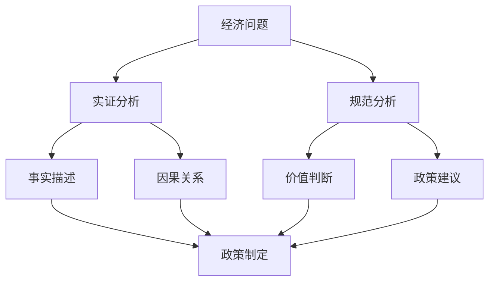
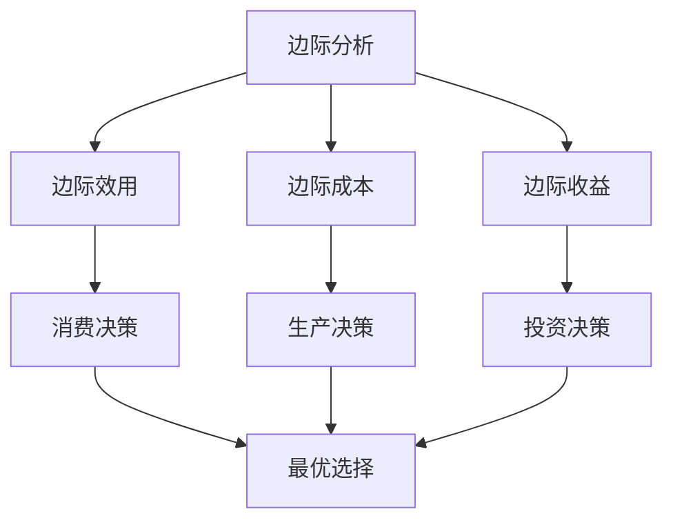
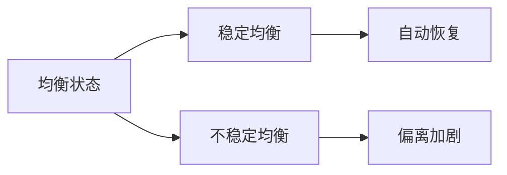
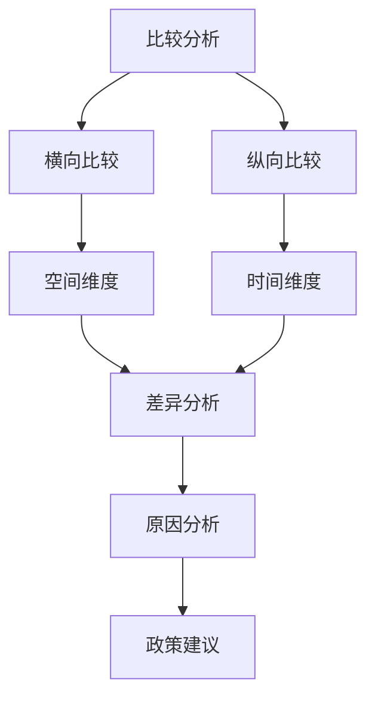

# 经济学方法论

## 核心概念

### 经济学方法论
**定义**：经济学研究的基本方法和原则，指导如何认识和分析经济现象。

> **费曼技巧**：经济学方法论 = 如何像经济学家一样思考

## 实证经济学 vs 规范经济学

### 对比分析

| 维度 | 实证经济学 | 规范经济学 |
|------|------------|------------|
| **研究对象** | 客观事实 | 价值判断 |
| **问题类型** | "是什么" | "应该是什么" |
| **研究方法** | 观察、测量、验证 | 价值分析、政策建议 |
| **结论性质** | 可验证的 | 主观的 |
| **例子** | "失业率上升" | "应该降低失业率" |

### 相互关系



## 经济模型

### 模型特征

#### 1. 简化性
- **目的**：突出主要因素
- **方法**：抽象、假设
- **结果**：抓住本质

#### 2. 假设性
- **ceteris paribus**：其他条件不变
- **理性人假设**：追求利益最大化
- **完全信息假设**：信息充分

#### 3. 预测性
- **短期预测**：政策效果
- **长期预测**：发展趋势
- **条件预测**：假设条件下的结果

### 模型构建步骤


### 模型类型

#### 按复杂程度分类
- **简单模型**：供需模型
- **复杂模型**：DSGE模型
- **超复杂模型**：多国模型

#### 按用途分类
- **描述性模型**：描述经济现象
- **预测性模型**：预测未来趋势
- **政策模型**：分析政策效果

## 边际分析

### 边际概念

#### 定义
**边际**：增加一单位投入或产出所带来的变化。

#### 边际量计算
```
边际量 = ΔY / ΔX
```

### 边际分析原理

#### 1. 边际效用递减
- **定义**：随着消费增加，边际效用递减
- **应用**：消费决策、需求分析

#### 2. 边际成本递增
- **定义**：随着产量增加，边际成本递增
- **应用**：生产决策、供给分析

#### 3. 边际收益递减
- **定义**：随着投入增加，边际收益递减
- **应用**：资源配置、效率分析

### 边际分析框架



## 均衡分析

### 均衡概念

#### 定义
**均衡**：各种力量相互抵消，系统处于稳定状态。

#### 均衡类型
- **局部均衡**：单个市场均衡
- **一般均衡**：所有市场同时均衡
- **动态均衡**：时间序列均衡

### 均衡分析方法

#### 1. 静态分析
- **比较静态**：比较不同均衡状态
- **静态均衡**：某一时点的均衡

#### 2. 动态分析
- **时间序列**：分析时间变化
- **动态均衡**：长期稳定状态

### 均衡稳定性



## 成本-收益分析

### 分析框架

#### 1. 识别成本
- **直接成本**：货币支出
- **间接成本**：机会成本
- **外部成本**：社会成本

#### 2. 识别收益
- **直接收益**：货币收入
- **间接收益**：非货币收益
- **外部收益**：社会收益

#### 3. 量化分析
- **净收益** = 总收益 - 总成本
- **收益率** = 净收益 / 总成本
- **回收期** = 总成本 / 年净收益

### 决策标准

| 标准 | 条件 | 应用 |
|------|------|------|
| **净收益最大化** | 净收益 > 0 | 项目选择 |
| **收益率最大化** | 收益率 > 基准 | 投资决策 |
| **成本最小化** | 成本最低 | 方案选择 |

## 比较分析

### 比较方法

#### 1. 横向比较
- **国际比较**：不同国家对比
- **地区比较**：不同地区对比
- **行业比较**：不同行业对比

#### 2. 纵向比较
- **历史比较**：不同时期对比
- **趋势分析**：时间序列分析
- **周期分析**：经济周期分析

### 比较分析框架



## 实际应用

### 政策分析
- **政策评估**：成本-收益分析
- **政策比较**：不同政策对比
- **政策预测**：模型预测

### 投资决策
- **项目评估**：净现值分析
- **风险评估**：敏感性分析
- **组合优化**：投资组合理论

### 企业管理
- **生产决策**：边际分析
- **定价策略**：均衡分析
- **战略选择**：比较分析

## 刻意练习

### 方法掌握
- [ ] 区分实证与规范分析
- [ ] 构建简单经济模型
- [ ] 运用边际分析

### 应用技能
- [ ] 进行成本-收益分析
- [ ] 比较不同方案
- [ ] 预测政策效果

### 批判思维
- [ ] 质疑模型假设
- [ ] 分析方法的局限性
- [ ] 评估分析结果

---

**相关链接**：
- [[01-稀缺性与选择]] - 经济学基本问题
- [[03-经济学发展史]] - 方法论演进
- [[06-工具与方法/04-研究方法]] - 具体研究方法
