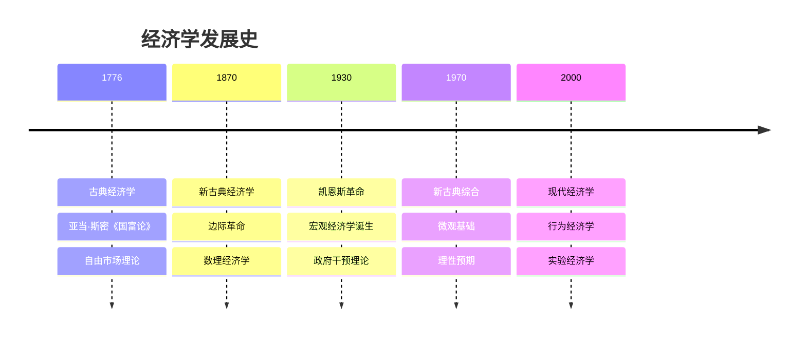
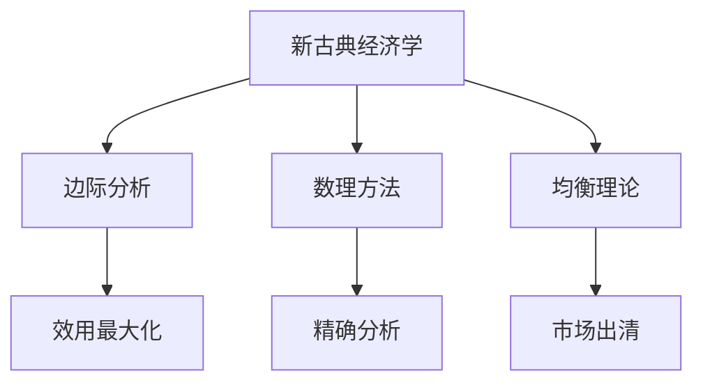
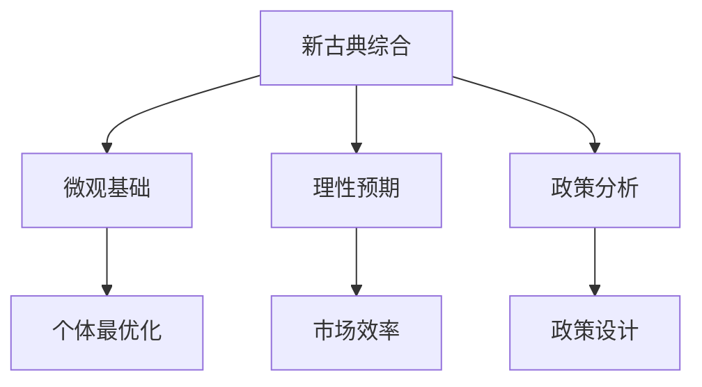

# 经济学发展史

## 发展脉络

### 时间轴概览

## 古典经济学（1776-1870）

### 时代背景
- **工业革命**：生产方式变革
- **资本主义兴起**：市场经济建立
- **启蒙运动**：理性主义思潮

### 核心思想

#### 1. 亚当·斯密（1723-1790）
**代表作**：《国富论》（1776）

**核心理论**：
- **"看不见的手"**：市场自动调节
- **分工理论**：提高生产效率
- **绝对优势理论**：国际贸易基础

**名言**：
> "我们期望的晚餐不是来自屠夫、酿酒师或面包师的恩惠，而是来自他们对自身利益的关心。"

#### 2. 大卫·李嘉图（1772-1823）
**代表作**：《政治经济学及赋税原理》（1817）

**核心理论**：
- **比较优势理论**：国际贸易理论
- **地租理论**：收入分配理论
- **劳动价值论**：价值决定理论

### 古典经济学特征

| 特征 | 内容 | 影响 |
|------|------|------|
| **自由放任** | 政府不干预市场 | 市场经济理论 |
| **劳动价值论** | 劳动决定价值 | 马克思主义基础 |
| **比较优势** | 国际贸易理论 | 全球化理论 |

## 新古典经济学（1870-1930）

### 边际革命

#### 代表人物
- **杰文斯**（英国）：边际效用理论
- **门格尔**（奥地利）：主观价值论
- **瓦尔拉斯**（法国）：一般均衡理论

#### 核心概念
- **边际效用**：最后一单位商品的效用
- **边际分析**：增量分析方法
- **主观价值**：个人偏好决定价值

### 马歇尔综合

#### 阿尔弗雷德·马歇尔（1842-1924）
**代表作**：《经济学原理》（1890）

**理论贡献**：
- **供需均衡**：价格决定机制
- **弹性理论**：价格敏感性分析
- **时间分析**：短期与长期

### 新古典经济学特征

## 凯恩斯革命（1930-1970）

### 时代背景
- **大萧条**：1929-1933年经济危机
- **古典理论失效**：市场无法自动恢复
- **政府干预需求**：政策工具创新

### 约翰·梅纳德·凯恩斯（1883-1946）

#### 代表作
《就业、利息和货币通论》（1936）

#### 核心理论

**1. 有效需求理论**
- **总需求决定产出**：需求不足导致失业
- **消费函数**：C = C₀ + cY
- **投资函数**：I = I₀ - bi

**2. 流动性偏好理论**
- **货币需求动机**：交易、预防、投机
- **利率决定**：货币供需均衡
- **货币政策**：影响投资决策

**3. 乘数效应**
- **投资乘数**：ΔY = (1/1-c) × ΔI
- **政府支出乘数**：财政政策效果
- **税收乘数**：税收政策效果

### 凯恩斯主义特征

| 特征 | 内容 | 政策含义 |
|------|------|----------|
| **需求管理** | 调节总需求 | 财政货币政策 |
| **政府干预** | 市场失灵 | 宏观调控 |
| **短期分析** | 价格刚性 | 政策有效性 |

## 新古典综合（1970-2000）

### 理论整合

#### 保罗·萨缪尔森（1915-2009）
**代表作**：《经济学》（1948）

**理论贡献**：
- **IS-LM模型**：宏观经济分析框架
- **新古典综合**：微观与宏观结合
- **公共品理论**：政府职能理论

### 理性预期革命

#### 罗伯特·卢卡斯（1937-）
**核心思想**：
- **理性预期**：基于所有信息的预期
- **政策无效性**：预期到的政策无效
- **微观基础**：宏观理论的微观基础

### 新古典综合特征

## 现代经济学（2000-至今）

### 行为经济学

#### 丹尼尔·卡尼曼（1934-）
**代表作**：《思考，快与慢》（2011）

**核心理论**：
- **有限理性**：认知能力限制
- **启发式偏差**：决策偏差
- **前景理论**：风险决策理论

### 实验经济学

#### 弗农·史密斯（1927-）
**理论贡献**：
- **实验方法**：控制实验验证理论
- **市场机制**：实验市场设计
- **行为验证**：理论假设检验

### 现代经济学特征

| 特征 | 内容 | 影响 |
|------|------|------|
| **跨学科** | 心理学、社会学 | 理论创新 |
| **实验方法** | 控制实验 | 实证验证 |
| **行为分析** | 非理性行为 | 政策设计 |

## 理论演进规律

### 演进动力

### 演进特征

#### 1. 继承与发展
- **继承**：保留有效理论
- **发展**：修正错误假设
- **创新**：提出新理论

#### 2. 分化与综合
- **分化**：专业领域细分
- **综合**：跨领域整合
- **融合**：学科交叉

#### 3. 实证与规范
- **实证**：客观分析
- **规范**：价值判断
- **结合**：政策建议

## 学习启示

### 理论发展规律
- **问题导向**：现实问题推动理论发展
- **方法创新**：新方法带来新发现
- **实证验证**：理论需要实践检验

### 学习策略
- **历史视角**：理解理论背景
- **比较分析**：不同理论对比
- **批判思维**：质疑理论假设

## 刻意练习

### 历史理解
- [ ] 掌握各阶段核心理论
- [ ] 理解理论演进逻辑
- [ ] 分析时代背景影响

### 理论比较
- [ ] 比较不同学派观点
- [ ] 分析理论优缺点
- [ ] 评估理论适用性

### 批判思维
- [ ] 质疑理论假设
- [ ] 分析理论局限性
- [ ] 思考理论发展方向

---

**相关链接**：
- [[02-经济学方法论]] - 分析方法演进
- [[04-经济学分支]] - 现代经济学分支
- [[07-批判与反思/01-理论批判]] - 理论批判分析
