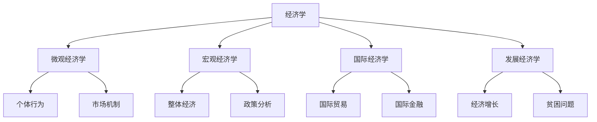
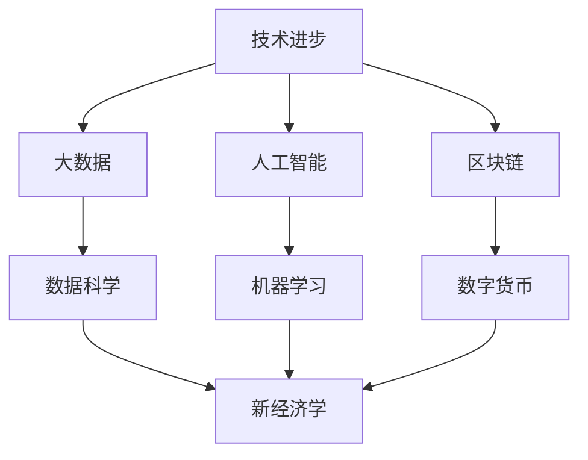

# 经济学分支

## 分类体系

### 按研究范围分类

## 微观经济学

### 研究对象
**定义**：研究个体经济单位（消费者、生产者）的经济行为。

### 核心内容

#### 1. 消费者理论
- **效用理论**：[[01-微观经济学/02-消费者行为/01-效用理论]]
- **需求理论**：[[01-微观经济学/01-市场机制/01-需求理论]]
- **消费者选择**：[[01-微观经济学/02-消费者行为/04-消费者选择]]

#### 2. 生产者理论
- **生产函数**：[[01-微观经济学/03-生产者行为/01-生产函数]]
- **成本理论**：[[01-微观经济学/03-生产者行为/02-成本理论]]
- **利润最大化**：[[01-微观经济学/03-生产者行为/03-利润最大化]]

#### 3. 市场理论
- **市场结构**：[[01-微观经济学/04-市场结构]]
- **价格机制**：[[01-微观经济学/01-市场机制/03-市场均衡]]
- **效率分析**：[[01-微观经济学/01-市场机制/05-消费者剩余与生产者剩余]]

### 分析方法
- **边际分析**：增量变化分析
- **均衡分析**：供需平衡分析
- **最优化分析**：效用/利润最大化

## 宏观经济学

### 研究对象
**定义**：研究整个经济体的总体经济现象。

### 核心内容

#### 1. 国民收入核算
- **GDP理论**：[[02-宏观经济学/01-国民收入核算/01-GDP概念与计算]]
- **收入循环**：[[02-宏观经济学/01-国民收入核算/02-国民收入循环]]
- **价格指数**：[[02-宏观经济学/01-国民收入核算/03-价格指数]]

#### 2. 宏观经济模型
- **IS-LM模型**：[[02-宏观经济学/02-宏观经济模型/01-IS-LM模型]]
- **AD-AS模型**：[[02-宏观经济学/02-宏观经济模型/02-AD-AS模型]]
- **经济增长**：[[02-宏观经济学/02-宏观经济模型/04-经济增长模型]]

#### 3. 宏观经济政策
- **财政政策**：[[02-宏观经济学/03-宏观经济政策/01-财政政策]]
- **货币政策**：[[02-宏观经济学/03-宏观经济政策/02-货币政策]]
- **政策协调**：[[02-宏观经济学/03-宏观经济政策/03-政策协调]]

### 分析方法
- **总量分析**：宏观经济总量
- **政策分析**：政府政策效果
- **周期分析**：经济周期波动

## 国际经济学

### 研究对象
**定义**：研究国际经济关系和国际经济活动的学科。

### 核心内容

#### 1. 国际贸易理论
- **比较优势**：[[03-高级理论/01-国际经济学/01-国际贸易理论]]
- **要素禀赋**：H-O理论
- **新贸易理论**：规模经济、产品差异

#### 2. 国际金融理论
- **汇率理论**：[[03-高级理论/01-国际经济学/02-汇率理论]]
- **国际收支**：[[03-高级理论/01-国际经济学/03-国际收支]]
- **国际资本流动**：FDI、证券投资

#### 3. 经济全球化
- **全球化进程**：[[03-高级理论/01-国际经济学/04-经济全球化]]
- **跨国公司**：全球生产网络
- **国际协调**：G20、WTO

### 分析方法
- **比较分析**：国际比较
- **汇率分析**：汇率决定
- **政策分析**：国际政策协调

## 发展经济学

### 研究对象
**定义**：研究发展中国家经济发展问题的学科。

### 核心内容

#### 1. 经济发展理论
- **发展模式**：[[03-高级理论/02-发展经济学/01-经济发展理论]]
- **增长理论**：哈罗德-多马模型
- **结构变化**：刘易斯模型

#### 2. 贫困与不平等
- **贫困测量**：[[03-高级理论/02-发展经济学/02-贫困与不平等]]
- **收入分配**：基尼系数
- **社会政策**：扶贫政策

#### 3. 可持续发展
- **环境经济**：[[03-高级理论/02-发展经济学/03-可持续发展]]
- **绿色经济**：低碳发展
- **社会包容**：包容性增长

### 分析方法
- **比较分析**：国际比较
- **案例研究**：发展经验
- **政策评估**：发展政策效果

## 应用经济学

### 主要分支

| 分支 | 研究对象 | 应用领域 |
|------|----------|----------|
| **劳动经济学** | 劳动力市场 | 就业政策 |
| **金融经济学** | 金融市场 | 金融监管 |
| **产业经济学** | 产业结构 | 产业政策 |
| **区域经济学** | 区域发展 | 区域政策 |
| **环境经济学** | 环境问题 | 环保政策 |
| **公共经济学** | 公共部门 | 公共政策 |

### 分析方法
- **实证分析**：数据验证
- **政策分析**：政策设计
- **案例研究**：经验总结

## 跨学科分支

### 新兴领域

#### 1. 行为经济学
- **心理学基础**：[[03-高级理论/03-行为经济学]]
- **实验方法**：控制实验
- **政策应用**：行为政策

#### 2. 实验经济学
- **实验设计**：实验室实验
- **市场机制**：实验市场
- **行为验证**：理论检验

#### 3. 神经经济学
- **神经科学**：大脑机制
- **决策过程**：神经基础
- **行为预测**：神经指标

### 技术驱动

## 学习路径

### 基础阶段
1. **微观经济学**：个体行为分析
2. **宏观经济学**：整体经济分析
3. **国际经济学**：国际经济关系

### 进阶阶段
4. **发展经济学**：发展问题分析
5. **应用经济学**：专业领域应用
6. **跨学科分支**：前沿理论探索

### 专业选择

#### 学术研究
- **理论经济学**：理论创新
- **应用经济学**：政策研究
- **跨学科研究**：前沿探索

#### 实务应用
- **政策分析**：政府决策
- **商业分析**：企业决策
- **投资分析**：金融市场

## 刻意练习

### 分支理解
- [ ] 掌握各分支研究对象
- [ ] 理解分支间关系
- [ ] 选择专业方向

### 方法应用
- [ ] 运用分支分析方法
- [ ] 分析实际问题
- [ ] 设计解决方案

### 前沿探索
- [ ] 关注新兴分支
- [ ] 学习跨学科方法
- [ ] 参与前沿研究

---

**相关链接**：
- [[03-经济学发展史]] - 分支发展历史
- [[05-经济思维模式]] - 分支思维模式
- [[06-经济学与其他学科]] - 跨学科关系
