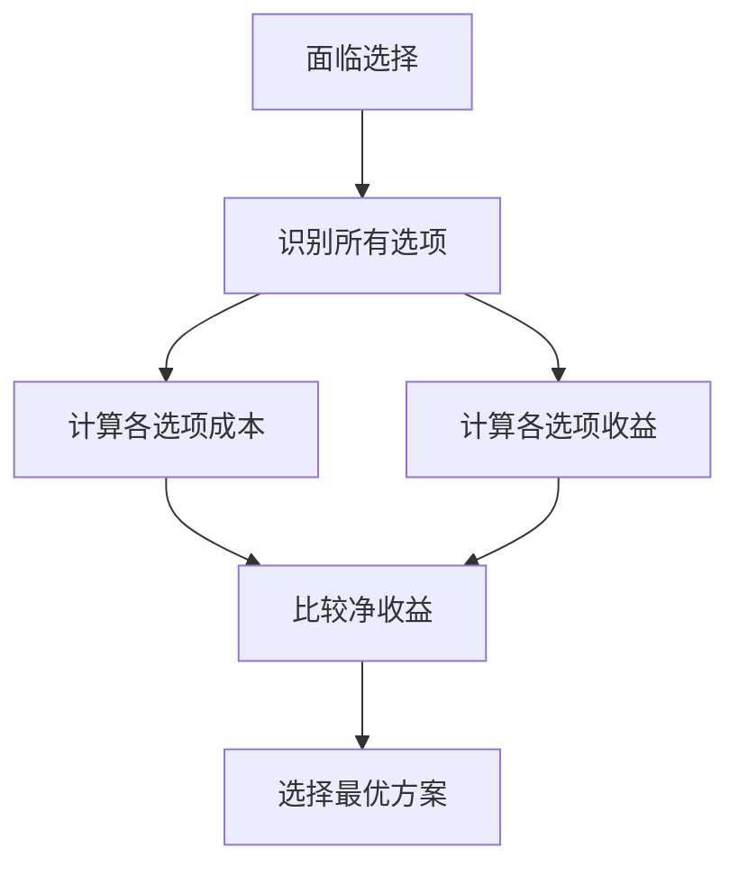
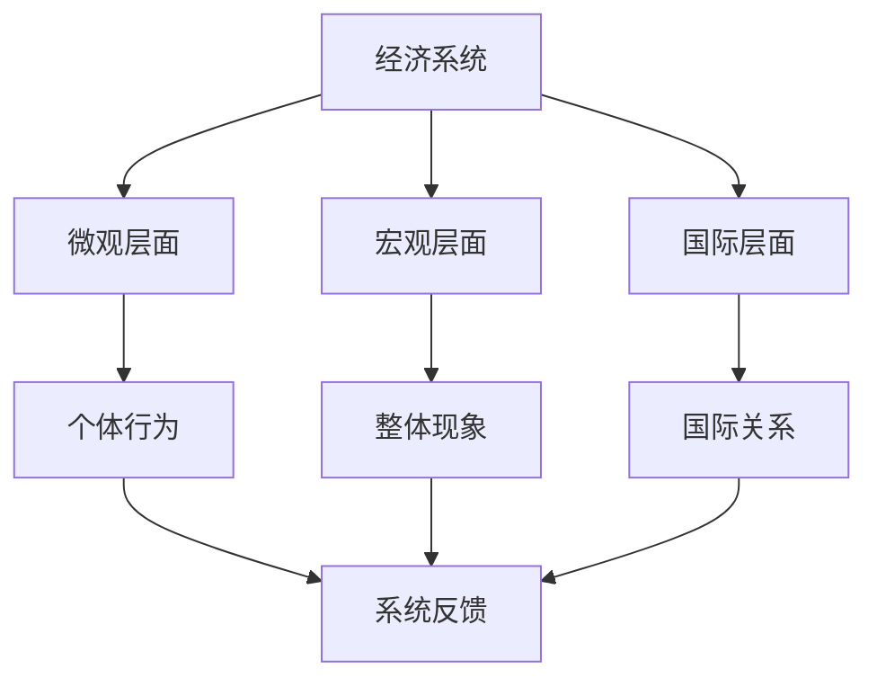
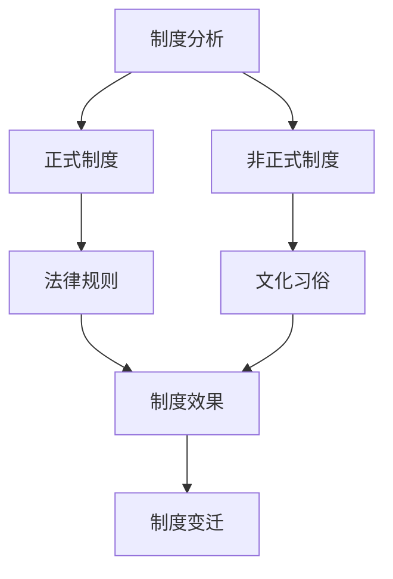
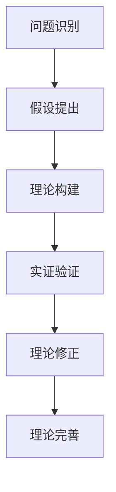

# 经济思维模式

## 核心概念

### 经济思维
**定义**：运用经济学原理和方法分析问题的思维方式。

> **费曼技巧**：经济思维 = 用经济学家的眼光看世界

## 基本思维模式

### 1. 成本-收益思维

#### 核心原则
- **机会成本**：选择A的成本是放弃B的收益
- **边际分析**：考虑增量变化
- **沉没成本**：已发生成本不影响未来决策

#### 应用框架

#### 实际应用
- **教育选择**：专业、学校、时间成本
- **职业选择**：行业、公司、职位收益
- **投资决策**：风险、收益、流动性

### 2. 激励思维

#### 核心原理
- **激励相容**：个人利益与集体利益一致
- **激励扭曲**：激励不当导致行为扭曲
- **制度设计**：通过制度引导行为

#### 激励类型

| 激励类型 | 特点 | 应用 |
|----------|------|------|
| **正向激励** | 奖励期望行为 | 绩效奖金 |
| **负向激励** | 惩罚不期望行为 | 罚款制度 |
| **内在激励** | 自我驱动 | 成就感 |
| **外在激励** | 外部驱动 | 物质奖励 |

### 3. 均衡思维

#### 均衡概念
- **市场均衡**：供需平衡
- **博弈均衡**：策略最优
- **制度均衡**：制度稳定

#### 均衡分析

## 高级思维模式

### 1. 系统思维

#### 系统特征
- **整体性**：系统大于部分之和
- **关联性**：各部分相互影响
- **动态性**：系统不断变化

#### 经济系统

### 2. 博弈思维

#### 博弈要素
- **参与者**：决策主体
- **策略**：可选行动
- **收益**：结果评价
- **信息**：决策依据

#### 博弈类型

| 博弈类型 | 特征 | 例子 |
|----------|------|------|
| **零和博弈** | 一方收益=另一方损失 | 价格战 |
| **正和博弈** | 双方都受益 | 合作创新 |
| **负和博弈** | 双方都受损 | 军备竞赛 |

### 3. 制度思维

#### 制度功能
- **降低交易成本**：减少不确定性
- **提供激励机制**：引导行为
- **分配资源**：决定资源配置

#### 制度分析框架

## 批判性思维

### 1. 假设质疑

#### 常见假设
- **理性人假设**：完全理性？
- **完全信息假设**：信息充分？
- **市场出清假设**：市场有效？

#### 质疑方法
- **现实检验**：假设是否符合现实？
- **逻辑检验**：假设是否逻辑一致？
- **经验检验**：假设是否经验支持？

### 2. 理论批判

#### 批判维度
- **假设合理性**：假设是否现实？
- **逻辑一致性**：理论是否自洽？
- **实证支持**：理论是否验证？
- **适用条件**：理论适用范围？

### 3. 政策分析

#### 分析框架

#### 分析要点
- **目标明确性**：目标是否清晰？
- **工具适当性**：工具是否有效？
- **效果预期性**：效果是否可预期？
- **副作用控制**：副作用是否可控？

## 创新思维

### 1. 问题发现

#### 问题类型
- **理论问题**：理论缺陷
- **现实问题**：现实矛盾
- **方法问题**：方法局限

#### 发现方法
- **观察法**：仔细观察现象
- **比较法**：比较不同情况
- **质疑法**：质疑既有理论

### 2. 理论创新

#### 创新路径
- **假设创新**：修正既有假设
- **方法创新**：采用新方法
- **视角创新**：转换分析视角

#### 创新过程

### 3. 应用创新

#### 应用领域
- **政策设计**：创新政策工具
- **制度设计**：创新制度安排
- **机制设计**：创新激励机制

## 实际应用

### 个人决策
- **教育选择**：专业、学校、时间
- **职业规划**：行业、公司、职位
- **投资理财**：资产配置、风险管理

### 企业管理
- **战略决策**：市场定位、竞争策略
- **运营管理**：生产、营销、财务
- **组织管理**：激励、考核、文化

### 政策制定
- **政策设计**：目标、工具、机制
- **政策评估**：效果、效率、公平
- **政策调整**：优化、完善、创新

## 刻意练习

### 思维训练
- [ ] 运用成本-收益分析日常决策
- [ ] 分析激励机制的合理性
- [ ] 识别经济系统中的均衡

### 批判训练
- [ ] 质疑经济学假设的合理性
- [ ] 分析理论的适用条件
- [ ] 评估政策的有效性

### 创新训练
- [ ] 发现现实中的经济问题
- [ ] 提出新的理论假设
- [ ] 设计创新的解决方案

---

**相关链接**：
- [[02-经济学方法论]] - 分析方法
- [[01-稀缺性与选择]] - 基本问题
- [[07-批判与反思]] - 批判思维
