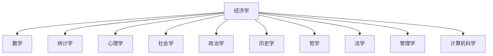
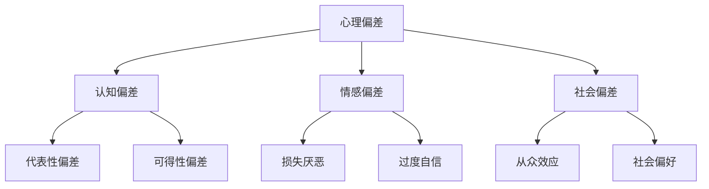
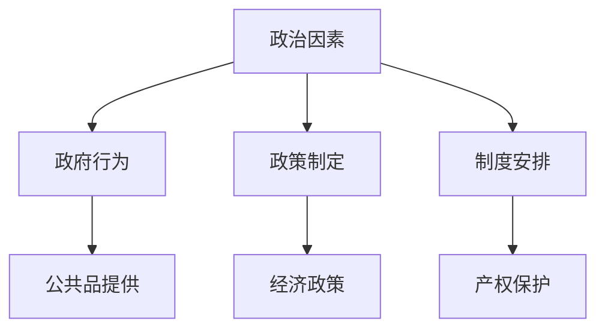
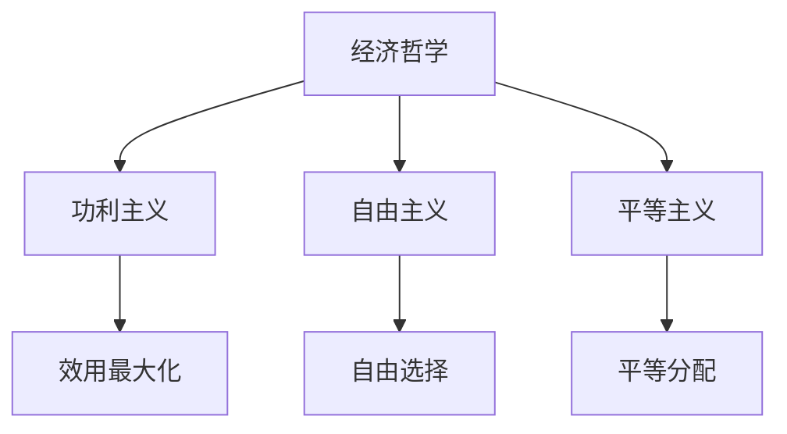
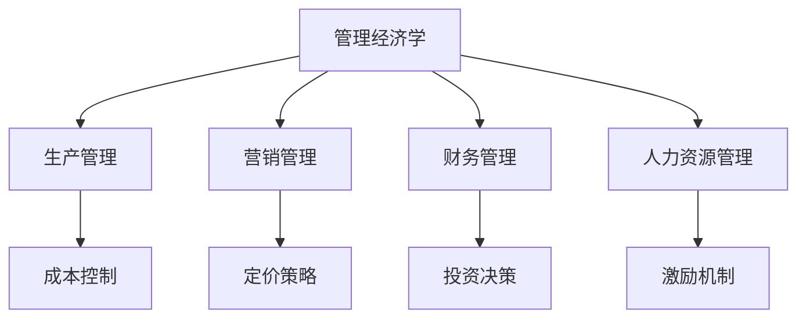

# 经济学与其他学科

## 跨学科关系

### 学科网络图

## 数学与经济学

### 数学工具

#### 1. 微积分
- **导数**：边际分析
- **积分**：总量计算
- **微分方程**：动态分析

#### 2. 线性代数
- **矩阵**：投入产出分析
- **向量**：多维分析
- **特征值**：稳定性分析

#### 3. 概率统计
- **概率论**：不确定性分析
- **统计学**：实证分析
- **计量经济学**：因果关系分析

### 应用领域

| 数学分支 | 经济学应用 | 具体例子 |
|----------|------------|----------|
| **微积分** | 边际分析 | 边际效用、边际成本 |
| **线性代数** | 一般均衡 | 投入产出模型 |
| **概率论** | 风险分析 | 投资组合理论 |
| **统计学** | 实证分析 | 回归分析 |

## 心理学与经济学

### 行为经济学

#### 核心理论
- **有限理性**：认知能力限制
- **启发式偏差**：决策偏差
- **前景理论**：风险决策

#### 心理偏差

### 应用领域
- **消费行为**：非理性消费
- **投资决策**：行为金融
- **政策设计**：助推理论

## 社会学与经济学

### 经济社会学

#### 核心概念
- **社会网络**：关系影响行为
- **社会资本**：社会资源
- **制度分析**：社会制度

#### 社会因素

| 社会因素 | 经济影响 | 例子 |
|----------|----------|------|
| **社会网络** | 信息传递 | 就业信息 |
| **社会资本** | 信任合作 | 商业合作 |
| **社会规范** | 行为约束 | 消费习惯 |
| **社会地位** | 资源分配 | 收入差距 |

### 应用领域
- **劳动力市场**：社会网络影响就业
- **金融市场**：社会信任影响投资
- **消费市场**：社会地位影响消费

## 政治学与经济学

### 政治经济学

#### 核心理论
- **公共选择理论**：政治决策分析
- **制度经济学**：制度影响经济
- **发展政治学**：政治与发展的关系

#### 政治因素

### 应用领域
- **政策分析**：政策制定过程
- **制度分析**：制度对经济的影响
- **发展分析**：政治与发展的关系

## 历史学与经济学

### 经济史

#### 研究方法
- **历史比较**：不同时期对比
- **案例分析**：历史事件分析
- **趋势分析**：长期趋势分析

#### 历史视角

| 历史维度 | 经济意义 | 例子 |
|----------|----------|------|
| **长期趋势** | 经济发展规律 | 工业革命 |
| **周期性** | 经济周期 | 大萧条 |
| **结构性** | 经济结构变化 | 产业结构升级 |
| **制度性** | 制度变迁 | 改革开放 |

### 应用领域
- **发展分析**：历史经验借鉴
- **政策分析**：历史政策效果
- **理论验证**：历史数据验证理论

## 哲学与经济学

### 经济哲学

#### 核心问题
- **价值判断**：什么是好的？
- **公平正义**：如何分配？
- **自由选择**：选择的边界？

#### 哲学流派

### 应用领域
- **政策评价**：政策的价值判断
- **制度设计**：制度的哲学基础
- **理论批判**：理论的哲学前提

## 法学与经济学

### 法经济学

#### 核心理论
- **法律的经济分析**：法律效率
- **产权理论**：产权安排
- **契约理论**：契约设计

#### 法律影响

| 法律领域 | 经济影响 | 例子 |
|----------|----------|------|
| **产权法** | 产权保护 | 投资激励 |
| **合同法** | 交易成本 | 商业合作 |
| **反垄断法** | 市场竞争 | 市场效率 |
| **劳动法** | 劳动力市场 | 就业保护 |

### 应用领域
- **法律制定**：法律的经济效果
- **法律执行**：执法的经济分析
- **法律改革**：法律制度改革

## 管理学与经济学

### 管理经济学

#### 核心理论
- **企业理论**：企业性质
- **战略管理**：竞争策略
- **组织理论**：组织结构

#### 管理应用

### 应用领域
- **企业决策**：生产、营销、财务
- **组织设计**：组织结构、激励机制
- **战略规划**：竞争策略、发展路径

## 计算机科学与经济学

### 计算经济学

#### 技术应用
- **大数据**：海量数据分析
- **人工智能**：智能决策
- **区块链**：去中心化交易

#### 新兴领域

| 技术领域 | 经济应用 | 例子 |
|----------|----------|------|
| **大数据** | 行为分析 | 消费者画像 |
| **机器学习** | 预测分析 | 价格预测 |
| **区块链** | 数字货币 | 比特币 |
| **物联网** | 智能经济 | 智能城市 |

### 应用领域
- **金融科技**：数字货币、智能投顾
- **共享经济**：平台经济、共享模式
- **数字经济**：数字贸易、数字支付

## 跨学科研究方法

### 1. 多学科整合
- **理论整合**：不同学科理论结合
- **方法整合**：不同学科方法结合
- **数据整合**：不同学科数据结合

### 2. 跨学科合作
- **团队合作**：不同学科专家合作
- **项目合作**：跨学科项目研究
- **平台合作**：跨学科研究平台

### 3. 跨学科教育
- **课程设计**：跨学科课程
- **人才培养**：跨学科人才
- **研究训练**：跨学科研究能力

## 学习策略

### 基础学科
- **数学**：掌握基本工具
- **统计学**：掌握分析方法
- **计算机**：掌握技术工具

### 相关学科
- **心理学**：理解行为动机
- **社会学**：理解社会影响
- **政治学**：理解政策过程

### 应用学科
- **管理学**：企业应用
- **法学**：法律应用
- **历史学**：历史视角

## 刻意练习

### 跨学科理解
- [ ] 理解各学科与经济学的关系
- [ ] 掌握跨学科研究方法
- [ ] 运用跨学科视角分析问题

### 方法应用
- [ ] 运用数学工具分析经济问题
- [ ] 运用心理学理论解释经济行为
- [ ] 运用社会学方法研究经济现象

### 创新思维
- [ ] 发现跨学科研究机会
- [ ] 设计跨学科研究方案
- [ ] 整合跨学科研究成果

---

**相关链接**：
- [[04-经济学分支]] - 经济学分支
- [[03-高级理论/03-行为经济学]] - 行为经济学
- [[06-工具与方法]] - 分析工具
