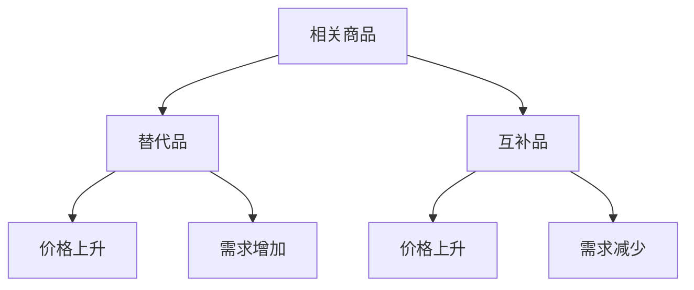
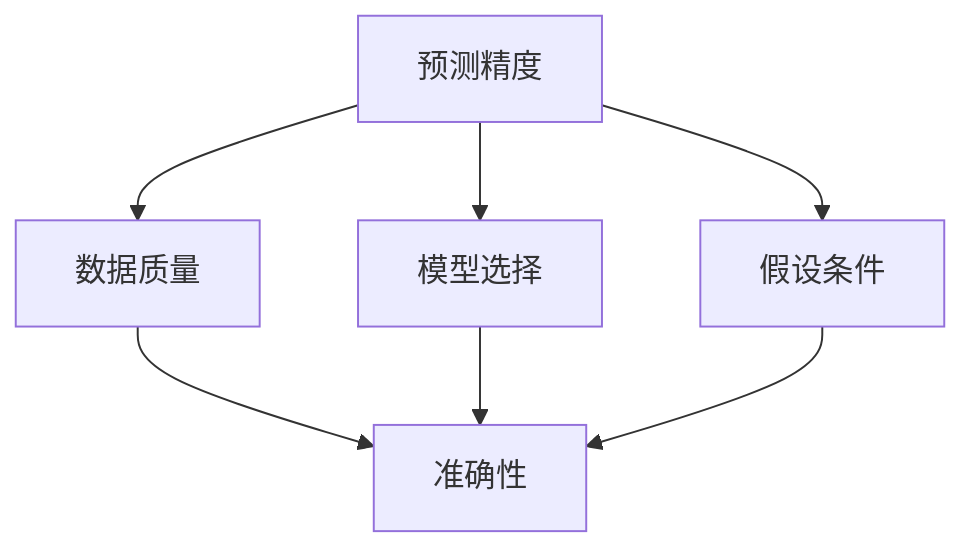

# 需求理论

## 核心概念

### 需求定义
**需求**：在特定时期内，消费者愿意且能够购买的商品数量。

> **费曼技巧**：需求 = 想要 + 能够 + 愿意

### 需求要素

| 要素 | 含义 | 例子 |
|------|------|------|
| **愿意** | 消费者偏好 | 喜欢苹果 |
| **能够** | 购买能力 | 有足够收入 |
| **特定时期** | 时间限制 | 每月需求 |
| **特定价格** | 价格条件 | 在给定价格下 |

## 需求函数

### 数学表达
```
Qd = f(P, I, Ps, Pc, T, E)
```

其中：
- **Qd**：需求量
- **P**：商品价格
- **I**：收入
- **Ps**：替代品价格
- **Pc**：互补品价格
- **T**：消费者偏好
- **E**：预期

### 需求曲线

#### 基本特征
- **向下倾斜**：价格上升，需求量下降
- **连续函数**：价格与需求量连续变化
- **个体差异**：不同消费者需求不同

#### 需求曲线图


## 需求规律

### 需求定律
**内容**：在其他条件不变的情况下，商品价格与需求量呈反方向变化。

#### 例外情况

| 例外 | 原因 | 例子 |
|------|------|------|
| **吉芬商品** | 收入效应大于替代效应 | 土豆 |
| **炫耀性商品** | 地位象征 | 奢侈品 |
| **预期商品** | 价格预期 | 股票 |
| **质量信号** | 质量判断 | 二手车 |

### 需求弹性

#### 价格弹性
**定义**：需求量对价格变化的敏感程度。

```
Ed = (ΔQ/Q) / (ΔP/P) = (ΔQ/ΔP) × (P/Q)
```

#### 弹性分类

| 弹性值 | 类型 | 特征 | 例子 |
|--------|------|------|------|
| **Ed > 1** | 富有弹性 | 需求变化大 | 奢侈品 |
| **Ed = 1** | 单位弹性 | 需求变化相等 | 特殊商品 |
| **Ed < 1** | 缺乏弹性 | 需求变化小 | 必需品 |
| **Ed = 0** | 完全无弹性 | 需求不变 | 救命药 |
| **Ed = ∞** | 完全弹性 | 价格不变 | 完全竞争 |

## 需求影响因素

### 1. 价格因素

#### 自身价格
- **直接影响**：价格变化直接影响需求量
- **替代效应**：价格上升，寻找替代品
- **收入效应**：价格上升，实际收入下降

#### 相关商品价格



### 2. 收入因素

#### 收入效应

| 商品类型 | 收入增加 | 需求变化 | 例子 |
|----------|----------|----------|------|
| **正常商品** | 收入增加 | 需求增加 | 汽车 |
| **劣等商品** | 收入增加 | 需求减少 | 方便面 |
| **奢侈品** | 收入增加 | 需求大幅增加 | 珠宝 |

#### 恩格尔曲线
**定义**：表示收入与需求量关系的曲线。

### 3. 偏好因素

#### 偏好变化
- **广告影响**：改变消费者偏好
- **时尚变化**：流行趋势影响
- **文化因素**：文化背景影响

#### 偏好函数
```
T = f(广告, 时尚, 文化, 教育)
```

### 4. 预期因素

#### 价格预期
- **价格上涨预期**：当前需求增加
- **价格下跌预期**：当前需求减少

#### 收入预期
- **收入增加预期**：当前需求增加
- **收入减少预期**：当前需求减少

## 市场需求

### 市场需求函数
**定义**：所有消费者需求的总和。

```
Qd = ΣQi = f(P, I, Ps, Pc, T, E)
```

### 市场需求曲线

#### 推导过程
1. **个体需求**：每个消费者的需求
2. **水平加总**：相同价格下需求量相加
3. **市场需求**：所有消费者需求总和

#### 市场需求特征
- **向下倾斜**：遵循需求定律
- **更平滑**：个体差异被平均化
- **更稳定**：个体波动被平滑

## 需求分析应用

### 1. 消费者行为分析

#### 消费决策
- **预算约束**：收入限制
- **效用最大化**：选择最优组合
- **需求函数**：反映选择结果

#### 消费模式
- **必需品消费**：基本生活需求
- **奢侈品消费**：享受型需求
- **投资性消费**：未来收益需求

### 2. 企业决策分析

#### 定价策略
- **需求弹性**：影响定价策略
- **市场细分**：不同群体定价
- **价格歧视**：差异化定价

#### 产品策略
- **产品定位**：目标消费群体
- **产品设计**：满足消费者需求
- **产品创新**：创造新需求

### 3. 政策分析

#### 税收政策
- **需求弹性**：影响税收效果
- **税收负担**：消费者和生产者分担
- **税收效率**：无谓损失分析

#### 补贴政策
- **需求刺激**：增加需求量
- **价格支持**：保护消费者
- **市场调节**：平衡供需

## 需求预测

### 预测方法

#### 1. 时间序列分析
- **趋势分析**：长期趋势
- **季节分析**：季节性变化
- **周期分析**：周期性波动

#### 2. 回归分析
- **单变量回归**：价格与需求
- **多变量回归**：多因素分析
- **非线性回归**：复杂关系

#### 3. 市场调研
- **消费者调查**：直接询问
- **实验设计**：控制实验
- **观察研究**：行为观察

### 预测精度



## 刻意练习

### 概念理解
- [ ] 理解需求的定义和要素
- [ ] 掌握需求定律和例外
- [ ] 分析需求影响因素

### 计算应用
- [ ] 计算需求弹性
- [ ] 分析需求变化
- [ ] 预测需求趋势

### 实际应用
- [ ] 分析消费者行为
- [ ] 制定企业策略
- [ ] 评估政策效果

---

**相关链接**：
- [[02-供给理论]] - 供给分析
- [[03-市场均衡]] - 市场平衡
- [[02-消费者行为/01-效用理论]] - 消费者理论基础
