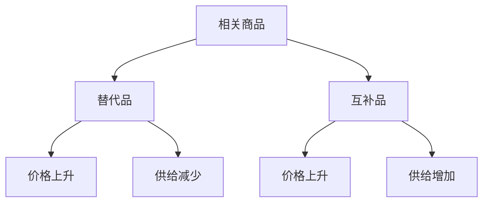
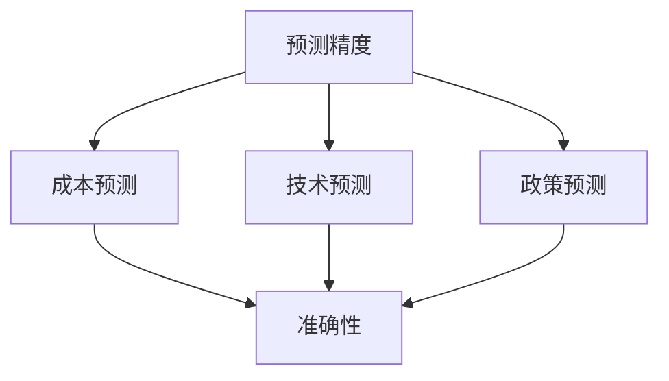
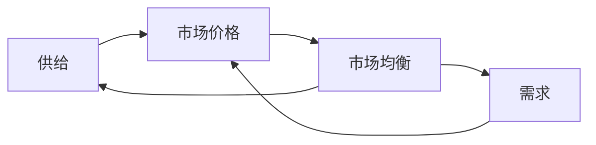

# 供给理论

## 核心概念

### 供给定义
**供给**：在特定时期内，生产者愿意且能够提供的商品数量。

> **费曼技巧**：供给 = 愿意 + 能够 + 生产

### 供给要素

| 要素 | 含义 | 例子 |
|------|------|------|
| **愿意** | 生产者意愿 | 愿意生产苹果 |
| **能够** | 生产能力 | 有生产技术 |
| **特定时期** | 时间限制 | 每月供给 |
| **特定价格** | 价格条件 | 在给定价格下 |

## 供给函数

### 数学表达
```
Qs = f(P, C, T, E, G)
```

其中：
- **Qs**：供给量
- **P**：商品价格
- **C**：生产成本
- **T**：技术水平
- **E**：生产者预期
- **G**：政府政策

### 供给曲线

#### 基本特征
- **向上倾斜**：价格上升，供给量增加
- **连续函数**：价格与供给量连续变化
- **个体差异**：不同生产者供给不同

#### 供给曲线图


## 供给规律

### 供给定律
**内容**：在其他条件不变的情况下，商品价格与供给量呈正方向变化。

#### 供给定律基础
- **利润动机**：价格上升，利润增加
- **边际成本**：边际成本递增
- **资源配置**：资源向高价格商品转移

### 供给弹性

#### 价格弹性
**定义**：供给量对价格变化的敏感程度。

```
Es = (ΔQ/Q) / (ΔP/P) = (ΔQ/ΔP) × (P/Q)
```

#### 弹性分类

| 弹性值 | 类型 | 特征 | 例子 |
|--------|------|------|------|
| **Es > 1** | 富有弹性 | 供给变化大 | 制造业 |
| **Es = 1** | 单位弹性 | 供给变化相等 | 特殊商品 |
| **Es < 1** | 缺乏弹性 | 供给变化小 | 农业 |
| **Es = 0** | 完全无弹性 | 供给不变 | 古董 |
| **Es = ∞** | 完全弹性 | 价格不变 | 完全竞争 |

## 供给影响因素

### 1. 价格因素

#### 自身价格
- **直接影响**：价格变化直接影响供给量
- **利润效应**：价格上升，利润增加
- **替代效应**：资源向高价格商品转移

#### 相关商品价格



### 2. 成本因素

#### 生产成本

| 成本类型 | 影响 | 例子 |
|----------|------|------|
| **原材料成本** | 成本上升，供给减少 | 钢铁价格 |
| **劳动力成本** | 工资上升，供给减少 | 人工成本 |
| **资本成本** | 利率上升，供给减少 | 资金成本 |
| **能源成本** | 能源价格上升，供给减少 | 电力价格 |

#### 成本函数
```
C = f(原材料, 劳动力, 资本, 能源)
```

### 3. 技术因素

#### 技术进步
- **生产效率**：提高单位产出
- **成本降低**：降低生产成本
- **供给增加**：增加供给能力

#### 技术创新
- **新产品**：创造新供给
- **新工艺**：改进生产方法
- **新设备**：提高生产能力

### 4. 预期因素

#### 价格预期
- **价格上涨预期**：当前供给减少
- **价格下跌预期**：当前供给增加

#### 成本预期
- **成本上升预期**：当前供给增加
- **成本下降预期**：当前供给减少

### 5. 政策因素

#### 税收政策
- **税收增加**：供给减少
- **税收减少**：供给增加

#### 补贴政策
- **补贴增加**：供给增加
- **补贴减少**：供给减少

#### 管制政策
- **管制加强**：供给减少
- **管制放松**：供给增加

## 市场供给

### 市场供给函数
**定义**：所有生产者供给的总和。

```
Qs = ΣQi = f(P, C, T, E, G)
```

### 市场供给曲线

#### 推导过程
1. **个体供给**：每个生产者的供给
2. **水平加总**：相同价格下供给量相加
3. **市场供给**：所有生产者供给总和

#### 市场供给特征
- **向上倾斜**：遵循供给定律
- **更平滑**：个体差异被平均化
- **更稳定**：个体波动被平滑

## 供给分析应用

### 1. 生产者行为分析

#### 生产决策
- **成本约束**：生产成本限制
- **利润最大化**：选择最优产量
- **供给函数**：反映生产选择

#### 生产模式
- **规模生产**：大规模生产
- **定制生产**：个性化生产
- **创新生产**：技术驱动生产

### 2. 企业决策分析

#### 定价策略
- **供给弹性**：影响定价策略
- **成本结构**：影响价格水平
- **竞争策略**：影响市场定位

#### 生产策略
- **产能规划**：生产能力规划
- **技术选择**：生产技术选择
- **供应链管理**：供应链优化

### 3. 政策分析

#### 产业政策
- **供给弹性**：影响政策效果
- **产业扶持**：促进产业发展
- **结构调整**：优化产业结构

#### 环保政策
- **环保成本**：增加生产成本
- **技术升级**：促进技术进步
- **供给调整**：调整供给结构

## 供给预测

### 预测方法

#### 1. 成本分析
- **成本趋势**：成本变化趋势
- **技术影响**：技术进步影响
- **政策影响**：政策变化影响

#### 2. 产能分析
- **现有产能**：当前生产能力
- **新增产能**：计划新增产能
- **产能利用率**：产能利用情况

#### 3. 市场分析
- **竞争格局**：市场竞争情况
- **进入壁垒**：市场进入难度
- **退出成本**：市场退出成本

### 预测精度



## 供给与需求关系

### 相互作用



### 动态调整
- **供给增加**：价格下降，需求增加
- **供给减少**：价格上升，需求减少
- **需求增加**：价格上升，供给增加
- **需求减少**：价格下降，供给减少

## 刻意练习

### 概念理解
- [ ] 理解供给的定义和要素
- [ ] 掌握供给定律和弹性
- [ ] 分析供给影响因素

### 计算应用
- [ ] 计算供给弹性
- [ ] 分析供给变化
- [ ] 预测供给趋势

### 实际应用
- [ ] 分析生产者行为
- [ ] 制定企业策略
- [ ] 评估政策效果

---

**相关链接**：
- [[01-需求理论]] - 需求分析
- [[03-市场均衡]] - 市场平衡
- [[03-生产者行为/01-生产函数]] - 生产者理论基础
