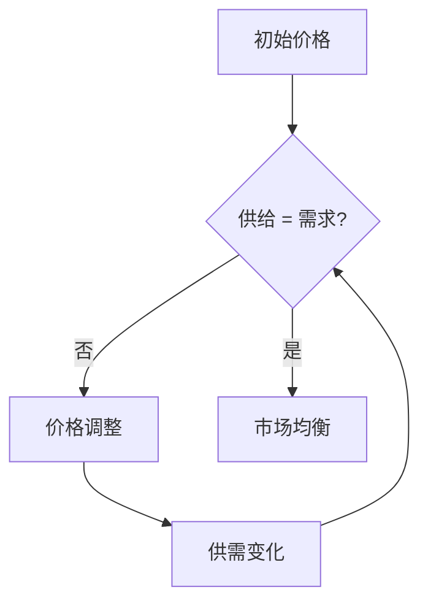
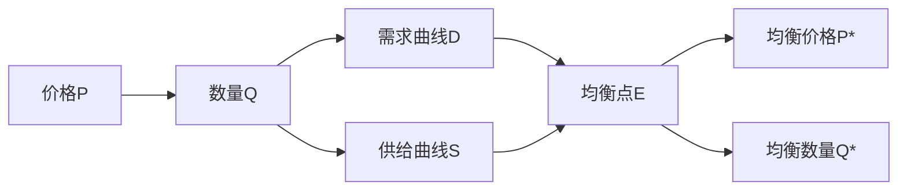
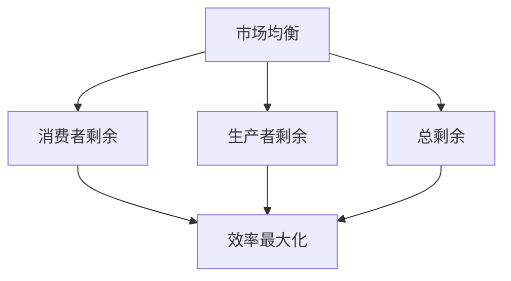

# 市场均衡

## 核心概念

### 市场均衡定义
**市场均衡**：供给量与需求量相等时的市场状态。

> **费曼技巧**：市场均衡 = 供给 = 需求 = 价格稳定

### 均衡要素

| 要素 | 含义 | 特征 |
|------|------|------|
| **均衡价格** | 市场出清价格 | 供需相等时的价格 |
| **均衡数量** | 市场出清数量 | 供需相等时的数量 |
| **市场出清** | 无超额供需 | 市场完全出清 |

## 均衡形成过程

### 均衡机制



### 价格调整过程

#### 1. 超额需求（供不应求）
- **价格上升**：需求减少，供给增加
- **调整方向**：价格向上调整
- **调整结果**：供需趋于平衡

#### 2. 超额供给（供过于求）
- **价格下降**：需求增加，供给减少
- **调整方向**：价格向下调整
- **调整结果**：供需趋于平衡

### 均衡稳定性

#### 稳定均衡
- **特征**：偏离后自动回归
- **条件**：需求曲线向下倾斜，供给曲线向上倾斜
- **结果**：市场自动调节

#### 不稳定均衡
- **特征**：偏离后继续偏离
- **条件**：特殊的需求或供给曲线
- **结果**：市场无法自动调节

## 均衡分析

### 均衡图解

#### 基本图形



#### 均衡特征
- **交点**：需求曲线与供给曲线交点
- **坐标**：均衡价格和均衡数量
- **稳定**：自动回归均衡点

### 均衡计算

#### 数学方法
```
需求函数：Qd = a - bP
供给函数：Qs = c + dP
均衡条件：Qd = Qs
```

#### 求解过程
1. **建立方程组**：Qd = Qs
2. **求解价格**：P* = (a-c)/(b+d)
3. **求解数量**：Q* = a - bP*

## 均衡变化

### 需求变化

#### 需求增加
- **需求曲线右移**：需求增加
- **均衡价格上升**：价格上升
- **均衡数量增加**：数量增加

#### 需求减少
- **需求曲线左移**：需求减少
- **均衡价格下降**：价格下降
- **均衡数量减少**：数量减少

### 供给变化

#### 供给增加
- **供给曲线右移**：供给增加
- **均衡价格下降**：价格下降
- **均衡数量增加**：数量增加

#### 供给减少
- **供给曲线左移**：供给减少
- **均衡价格上升**：价格上升
- **均衡数量减少**：数量减少

### 同时变化

#### 需求供给同向变化

| 变化类型 | 价格变化 | 数量变化 | 例子 |
|----------|----------|----------|------|
| **需求供给都增加** | 不确定 | 增加 | 技术进步 |
| **需求供给都减少** | 不确定 | 减少 | 经济衰退 |

#### 需求供给反向变化

| 变化类型 | 价格变化 | 数量变化 | 例子 |
|----------|----------|----------|------|
| **需求增加，供给减少** | 上升 | 不确定 | 自然灾害 |
| **需求减少，供给增加** | 下降 | 不确定 | 技术进步 |

## 均衡效率

### 帕累托最优

#### 定义
**帕累托最优**：在不损害他人利益的前提下，无法使任何人的状况变得更好。

#### 市场均衡的帕累托最优性
- **消费者剩余最大化**：消费者福利最大
- **生产者剩余最大化**：生产者福利最大
- **总剩余最大化**：社会总福利最大

### 效率分析



## 市场失灵

### 失灵类型

#### 1. 外部性
- **正外部性**：社会收益大于私人收益
- **负外部性**：社会成本大于私人成本
- **结果**：市场均衡非最优

#### 2. 公共品
- **非排他性**：无法排除他人使用
- **非竞争性**：使用不影响他人
- **结果**：市场无法提供

#### 3. 信息不对称
- **逆向选择**：信息劣势方受损
- **道德风险**：行为改变风险
- **结果**：市场效率降低

#### 4. 市场势力
- **垄断**：单一卖方
- **寡头**：少数卖方
- **结果**：价格高于边际成本

### 政府干预

#### 干预方式
- **价格管制**：限制价格水平
- **数量管制**：限制数量水平
- **税收补贴**：调节市场行为
- **反垄断**：限制市场势力

## 均衡应用

### 1. 价格预测

#### 预测方法
- **需求分析**：需求变化趋势
- **供给分析**：供给变化趋势
- **均衡分析**：均衡价格预测

#### 预测精度
- **短期预测**：相对准确
- **长期预测**：需要考虑更多因素
- **突发事件**：难以预测

### 2. 政策分析

#### 政策效果
- **价格政策**：影响均衡价格
- **数量政策**：影响均衡数量
- **税收政策**：影响市场行为

#### 政策评估
- **效率分析**：政策效率评估
- **公平分析**：政策公平性评估
- **成本分析**：政策成本分析

### 3. 投资决策

#### 市场分析
- **供需分析**：市场供需状况
- **价格分析**：价格变化趋势
- **竞争分析**：市场竞争状况

#### 投资策略
- **时机选择**：进入退出时机
- **价格策略**：定价策略
- **风险控制**：风险控制策略

## 刻意练习

### 概念理解
- [ ] 理解市场均衡的定义
- [ ] 掌握均衡形成机制
- [ ] 分析均衡变化规律

### 计算应用
- [ ] 计算均衡价格和数量
- [ ] 分析均衡变化
- [ ] 预测均衡趋势

### 实际应用
- [ ] 分析市场价格变化
- [ ] 评估政策效果
- [ ] 制定投资策略

---

**相关链接**：
- [[01-需求理论]] - 需求分析
- [[02-供给理论]] - 供给分析
- [[04-弹性理论]] - 弹性分析
