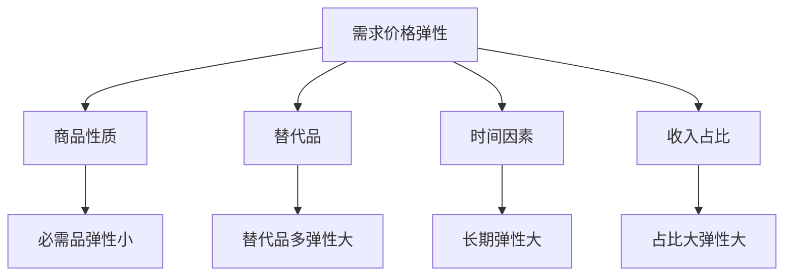
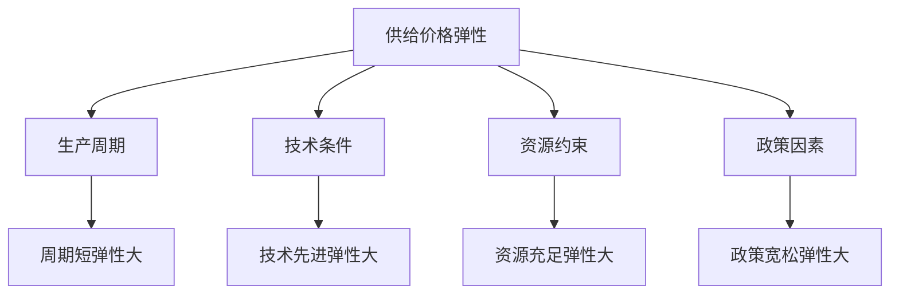
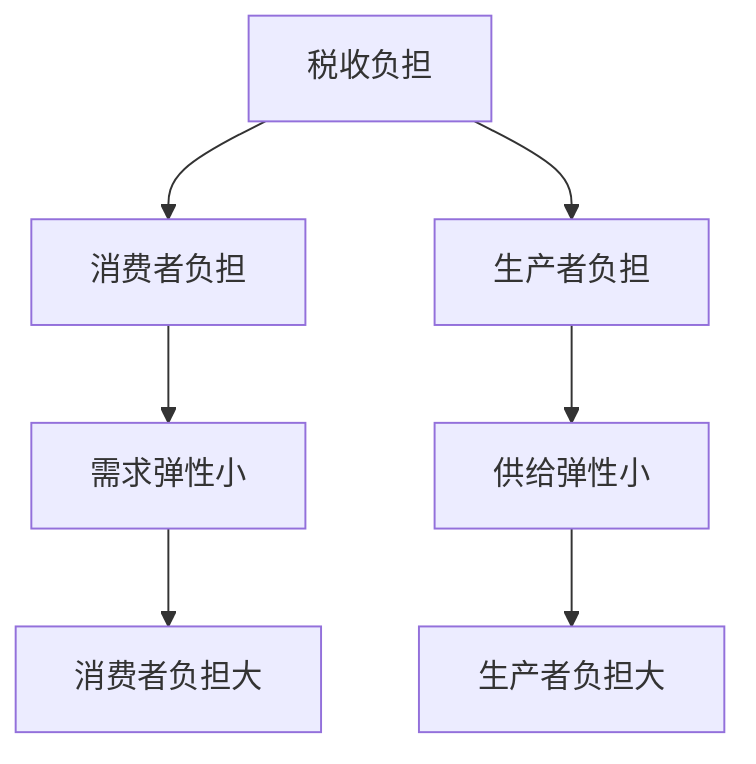

# 弹性理论

## 核心概念

### 弹性定义
**弹性**：衡量一个变量对另一个变量变化的敏感程度。

> **费曼技巧**：弹性 = 变化率之比 = 敏感程度

### 弹性公式
```
弹性 = (因变量变化率) / (自变量变化率)
```

## 需求弹性

### 需求价格弹性

#### 定义
**需求价格弹性**：需求量对价格变化的敏感程度。

```
Ed = (ΔQ/Q) / (ΔP/P) = (ΔQ/ΔP) × (P/Q)
```

#### 弹性分类

| 弹性值 | 类型 | 特征 | 例子 |
|--------|------|------|------|
| **Ed > 1** | 富有弹性 | 需求变化大 | 奢侈品 |
| **Ed = 1** | 单位弹性 | 需求变化相等 | 特殊商品 |
| **Ed < 1** | 缺乏弹性 | 需求变化小 | 必需品 |
| **Ed = 0** | 完全无弹性 | 需求不变 | 救命药 |
| **Ed = ∞** | 完全弹性 | 价格不变 | 完全竞争 |

#### 影响因素



### 需求收入弹性

#### 定义
**需求收入弹性**：需求量对收入变化的敏感程度。

```
Ei = (ΔQ/Q) / (ΔI/I) = (ΔQ/ΔI) × (I/Q)
```

#### 商品分类

| 弹性值 | 商品类型 | 特征 | 例子 |
|--------|----------|------|------|
| **Ei > 1** | 奢侈品 | 收入增加，需求大幅增加 | 珠宝 |
| **0 < Ei < 1** | 正常商品 | 收入增加，需求增加 | 汽车 |
| **Ei < 0** | 劣等商品 | 收入增加，需求减少 | 方便面 |

### 需求交叉弹性

#### 定义
**需求交叉弹性**：一种商品需求量对另一种商品价格变化的敏感程度。

```
Exy = (ΔQx/Qx) / (ΔPy/Py) = (ΔQx/ΔPy) × (Py/Qx)
```

#### 商品关系

| 弹性值 | 商品关系 | 特征 | 例子 |
|--------|----------|------|------|
| **Exy > 0** | 替代品 | 价格上升，需求增加 | 苹果与梨 |
| **Exy < 0** | 互补品 | 价格上升，需求减少 | 汽车与汽油 |
| **Exy = 0** | 无关商品 | 价格变化，需求不变 | 苹果与汽车 |

## 供给弹性

### 供给价格弹性

#### 定义
**供给价格弹性**：供给量对价格变化的敏感程度。

```
Es = (ΔQ/Q) / (ΔP/P) = (ΔQ/ΔP) × (P/Q)
```

#### 弹性分类

| 弹性值 | 类型 | 特征 | 例子 |
|--------|------|------|------|
| **Es > 1** | 富有弹性 | 供给变化大 | 制造业 |
| **Es = 1** | 单位弹性 | 供给变化相等 | 特殊商品 |
| **Es < 1** | 缺乏弹性 | 供给变化小 | 农业 |
| **Es = 0** | 完全无弹性 | 供给不变 | 古董 |
| **Es = ∞** | 完全弹性 | 价格不变 | 完全竞争 |

#### 影响因素



## 弹性应用

### 1. 定价策略

#### 弹性与定价

| 需求弹性 | 定价策略 | 原因 |
|----------|----------|------|
| **富有弹性** | 降价策略 | 降价增加收入 |
| **缺乏弹性** | 提价策略 | 提价增加收入 |
| **单位弹性** | 价格不变 | 价格变化不影响收入 |

#### 收入最大化
```
总收入 = P × Q
边际收入 = P(1 - 1/|Ed|)
```

### 2. 税收分析

#### 税收负担分配



#### 税收效率
- **无谓损失**：税收造成的效率损失
- **弹性影响**：弹性越大，无谓损失越大
- **政策建议**：对缺乏弹性商品征税

### 3. 政策分析

#### 价格管制

| 弹性情况 | 管制效果 | 政策建议 |
|----------|----------|----------|
| **需求缺乏弹性** | 效果明显 | 适合价格管制 |
| **需求富有弹性** | 效果有限 | 不适合价格管制 |

#### 补贴政策

| 弹性情况 | 补贴效果 | 政策建议 |
|----------|----------|----------|
| **供给富有弹性** | 效果明显 | 适合补贴政策 |
| **供给缺乏弹性** | 效果有限 | 不适合补贴政策 |

## 弹性计算

### 点弹性

#### 定义
**点弹性**：在需求曲线上某一点的弹性。

```
Ed = (dQ/dP) × (P/Q)
```

#### 计算步骤
1. **求导数**：dQ/dP
2. **确定点**：P和Q的值
3. **计算弹性**：Ed = (dQ/dP) × (P/Q)

### 弧弹性

#### 定义
**弧弹性**：需求曲线上两点间的平均弹性。

```
Ed = [(Q2-Q1)/(Q2+Q1)] / [(P2-P1)/(P2+P1)]
```

#### 计算步骤
1. **确定两点**：(P1,Q1)和(P2,Q2)
2. **计算变化率**：ΔQ/Q和ΔP/P
3. **计算弹性**：Ed = (ΔQ/Q) / (ΔP/P)

### 弹性计算实例

#### 实例1：需求价格弹性
```
价格从10元降到8元，需求量从100增加到120
Ed = [(120-100)/(120+100)] / [(8-10)/(8+10)]
   = [20/220] / [-2/18]
   = 0.091 / (-0.111)
   = -0.82
```

#### 实例2：需求收入弹性
```
收入从5000元增加到6000元，需求量从50增加到60
Ei = [(60-50)/(60+50)] / [(6000-5000)/(6000+5000)]
   = [10/110] / [1000/11000]
   = 0.091 / 0.091
   = 1.0
```

## 弹性与市场结构

### 完全竞争市场
- **需求弹性**：完全弹性（Ed = ∞）
- **供给弹性**：完全弹性（Es = ∞）
- **价格决定**：市场决定

### 垄断市场
- **需求弹性**：缺乏弹性（Ed < 1）
- **供给弹性**：完全无弹性（Es = 0）
- **价格决定**：垄断者决定

### 寡头市场
- **需求弹性**：中等弹性
- **供给弹性**：中等弹性
- **价格决定**：寡头博弈

## 刻意练习

### 概念理解
- [ ] 理解弹性的定义和计算
- [ ] 掌握各种弹性的分类
- [ ] 分析弹性的影响因素

### 计算应用
- [ ] 计算需求价格弹性
- [ ] 计算需求收入弹性
- [ ] 计算需求交叉弹性

### 实际应用
- [ ] 运用弹性制定定价策略
- [ ] 分析税收政策效果
- [ ] 评估市场管制政策

---

**相关链接**：
- [[01-需求理论]] - 需求分析
- [[02-供给理论]] - 供给分析
- [[03-市场均衡]] - 市场平衡
