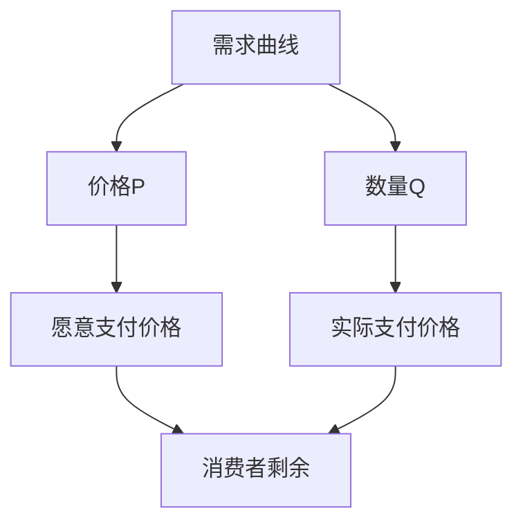
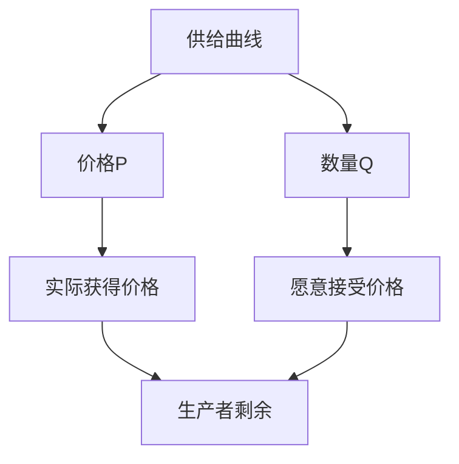
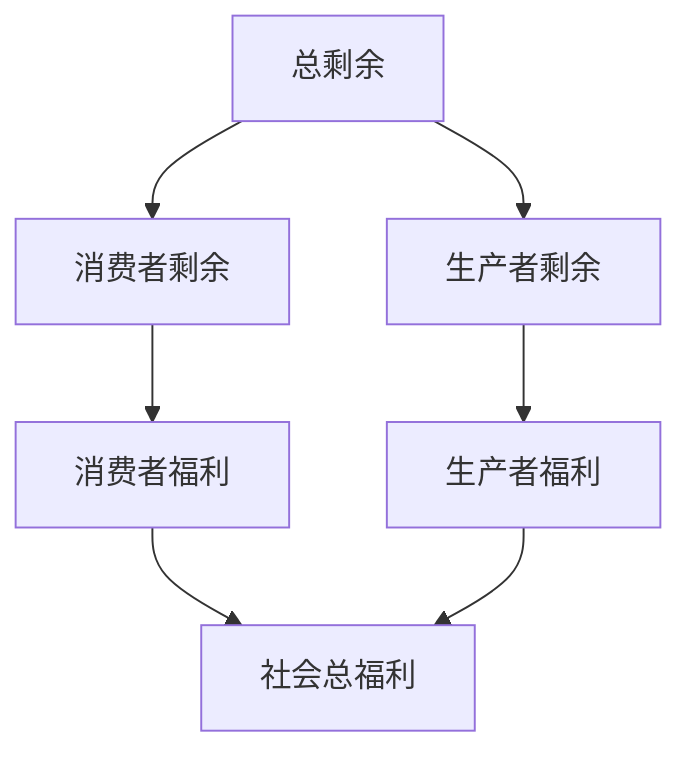
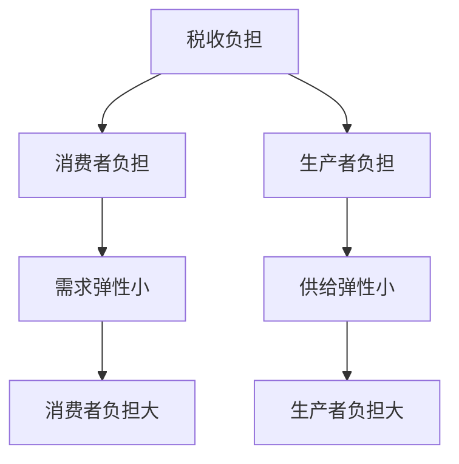

# 消费者剩余与生产者剩余

## 核心概念

### 消费者剩余
**定义**：消费者愿意支付的最高价格与实际支付价格之间的差额。

> **费曼技巧**：消费者剩余 = 愿意支付 - 实际支付 = 消费者福利

### 生产者剩余
**定义**：生产者实际获得的价格与愿意接受的最低价格之间的差额。

> **费曼技巧**：生产者剩余 = 实际获得 - 愿意接受 = 生产者福利

## 消费者剩余

### 概念理解

#### 个人消费者剩余
```
消费者剩余 = 愿意支付价格 - 实际支付价格
```

#### 市场消费者剩余
```
总消费者剩余 = Σ(个人消费者剩余)
```

### 图形表示

#### 需求曲线与消费者剩余



#### 消费者剩余计算
- **几何意义**：需求曲线下方，价格线上方的面积
- **数学表达**：CS = ∫[0 to Q*] (P(Q) - P*) dQ

### 消费者剩余变化

#### 价格变化影响

| 价格变化 | 消费者剩余变化 | 原因 |
|----------|----------------|------|
| **价格下降** | 增加 | 实际支付减少 |
| **价格上升** | 减少 | 实际支付增加 |

#### 需求变化影响

| 需求变化 | 消费者剩余变化 | 原因 |
|----------|----------------|------|
| **需求增加** | 增加 | 愿意支付价格上升 |
| **需求减少** | 减少 | 愿意支付价格下降 |

## 生产者剩余

### 概念理解

#### 个人生产者剩余
```
生产者剩余 = 实际获得价格 - 愿意接受价格
```

#### 市场生产者剩余
```
总生产者剩余 = Σ(个人生产者剩余)
```

### 图形表示

#### 供给曲线与生产者剩余



#### 生产者剩余计算
- **几何意义**：价格线下方，供给曲线上方的面积
- **数学表达**：PS = ∫[0 to Q*] (P* - P(Q)) dQ

### 生产者剩余变化

#### 价格变化影响

| 价格变化 | 生产者剩余变化 | 原因 |
|----------|----------------|------|
| **价格上升** | 增加 | 实际获得价格上升 |
| **价格下降** | 减少 | 实际获得价格下降 |

#### 供给变化影响

| 供给变化 | 生产者剩余变化 | 原因 |
|----------|----------------|------|
| **供给增加** | 减少 | 愿意接受价格下降 |
| **供给减少** | 增加 | 愿意接受价格上升 |

## 总剩余

### 定义
**总剩余**：消费者剩余与生产者剩余之和。

```
总剩余 = 消费者剩余 + 生产者剩余
```

### 总剩余最大化

#### 市场均衡的总剩余
- **市场均衡**：总剩余最大化
- **效率条件**：边际成本 = 边际收益
- **帕累托最优**：无法在不损害他人利益的情况下改善任何人的状况

### 总剩余分析



## 剩余分析应用

### 1. 税收分析

#### 税收对剩余的影响

| 剩余类型 | 税收影响 | 变化方向 |
|----------|----------|----------|
| **消费者剩余** | 减少 | 下降 |
| **生产者剩余** | 减少 | 下降 |
| **总剩余** | 减少 | 下降 |
| **政府收入** | 增加 | 上升 |

#### 税收负担分配



### 2. 补贴分析

#### 补贴对剩余的影响

| 剩余类型 | 补贴影响 | 变化方向 |
|----------|----------|----------|
| **消费者剩余** | 增加 | 上升 |
| **生产者剩余** | 增加 | 上升 |
| **总剩余** | 减少 | 下降 |
| **政府支出** | 增加 | 上升 |

#### 补贴效果分析
- **消费者受益**：价格下降，剩余增加
- **生产者受益**：价格上升，剩余增加
- **社会成本**：政府支出，总剩余减少

### 3. 价格管制分析

#### 价格上限

| 剩余类型 | 价格上限影响 | 变化方向 |
|----------|--------------|----------|
| **消费者剩余** | 不确定 | 取决于弹性 |
| **生产者剩余** | 减少 | 下降 |
| **总剩余** | 减少 | 下降 |

#### 价格下限

| 剩余类型 | 价格下限影响 | 变化方向 |
|----------|--------------|----------|
| **消费者剩余** | 减少 | 下降 |
| **生产者剩余** | 不确定 | 取决于弹性 |
| **总剩余** | 减少 | 下降 |

## 剩余计算实例

### 实例1：市场均衡的剩余

```
需求函数：Qd = 100 - 2P
供给函数：Qs = 20 + 2P
均衡条件：Qd = Qs

求解：
100 - 2P = 20 + 2P
80 = 4P
P* = 20
Q* = 100 - 2×20 = 60

消费者剩余：
CS = (1/2) × (50-20) × 60 = 900

生产者剩余：
PS = (1/2) × (20-10) × 60 = 300

总剩余：
TS = CS + PS = 900 + 300 = 1200
```

### 实例2：税收对剩余的影响

```
原均衡：P* = 20, Q* = 60
税收：t = 5

新均衡：
需求价格：Pd = 22.5
供给价格：Ps = 17.5
数量：Q = 55

消费者剩余变化：
ΔCS = (1/2) × (22.5-20) × (60+55) = 143.75

生产者剩余变化：
ΔPS = (1/2) × (20-17.5) × (60+55) = 143.75

政府收入：
GR = 5 × 55 = 275

无谓损失：
DWL = (1/2) × 5 × (60-55) = 12.5
```

## 剩余与效率

### 效率分析

#### 市场效率
- **完全竞争**：总剩余最大化
- **垄断**：总剩余减少
- **外部性**：总剩余非最优

#### 效率损失
- **无谓损失**：总剩余的减少
- **原因**：市场失灵、政府干预
- **测量**：哈伯格三角形

### 效率改进

#### 政策工具
- **价格机制**：市场调节
- **税收补贴**：政府调节
- **管制政策**：行政调节

#### 效率标准
- **帕累托改进**：至少一人受益，无人受损
- **卡尔多-希克斯改进**：受益者补偿受损者后仍有剩余

## 刻意练习

### 概念理解
- [ ] 理解消费者剩余和生产者剩余的定义
- [ ] 掌握剩余的计算方法
- [ ] 分析剩余的变化规律

### 计算应用
- [ ] 计算市场均衡的剩余
- [ ] 分析税收对剩余的影响
- [ ] 评估补贴政策效果

### 实际应用
- [ ] 分析市场效率
- [ ] 评估政策效果
- [ ] 设计效率改进方案

---

**相关链接**：
- [[01-需求理论]] - 需求分析
- [[02-供给理论]] - 供给分析
- [[03-市场均衡]] - 市场平衡
