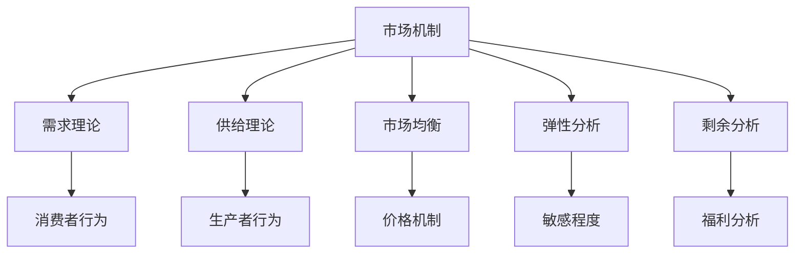
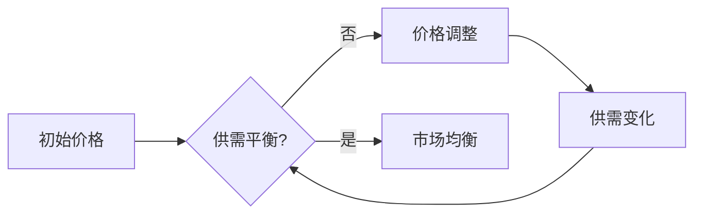
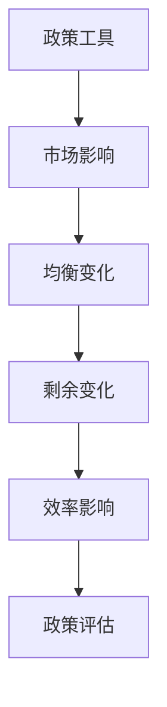

# 市场机制总结

## 核心框架

### 市场机制要素

## 理论体系

### 1. 需求理论

#### 核心概念
- **需求定义**：愿意且能够购买的数量
- **需求定律**：价格与需求量反方向变化
- **需求函数**：Qd = f(P, I, Ps, Pc, T, E)

#### 关键要素
| 要素 | 影响 | 例子 |
|------|------|------|
| **价格** | 直接影响 | 价格上升，需求减少 |
| **收入** | 间接影响 | 收入增加，需求增加 |
| **替代品** | 交叉影响 | 替代品价格上升，需求增加 |
| **互补品** | 交叉影响 | 互补品价格上升，需求减少 |

### 2. 供给理论

#### 核心概念
- **供给定义**：愿意且能够提供的数量
- **供给定律**：价格与供给量正方向变化
- **供给函数**：Qs = f(P, C, T, E, G)

#### 关键要素
| 要素 | 影响 | 例子 |
|------|------|------|
| **价格** | 直接影响 | 价格上升，供给增加 |
| **成本** | 间接影响 | 成本上升，供给减少 |
| **技术** | 间接影响 | 技术进步，供给增加 |
| **政策** | 间接影响 | 政策支持，供给增加 |

### 3. 市场均衡

#### 均衡机制
- **均衡条件**：供给量 = 需求量
- **均衡价格**：市场出清价格
- **均衡数量**：市场出清数量

#### 均衡稳定性

### 4. 弹性分析

#### 弹性类型
- **需求价格弹性**：需求量对价格变化的敏感程度
- **需求收入弹性**：需求量对收入变化的敏感程度
- **需求交叉弹性**：需求量对其他商品价格变化的敏感程度
- **供给价格弹性**：供给量对价格变化的敏感程度

#### 弹性应用
| 弹性值 | 定价策略 | 政策建议 |
|--------|----------|----------|
| **富有弹性** | 降价策略 | 适合税收政策 |
| **缺乏弹性** | 提价策略 | 适合价格管制 |

### 5. 剩余分析

#### 剩余类型
- **消费者剩余**：愿意支付价格 - 实际支付价格
- **生产者剩余**：实际获得价格 - 愿意接受价格
- **总剩余**：消费者剩余 + 生产者剩余

#### 效率分析
- **市场均衡**：总剩余最大化
- **帕累托最优**：无法在不损害他人利益的情况下改善任何人状况
- **无谓损失**：偏离均衡造成的效率损失

## 分析方法

### 1. 静态分析

#### 比较静态分析
- **需求变化**：分析需求曲线移动对均衡的影响
- **供给变化**：分析供给曲线移动对均衡的影响
- **政策变化**：分析政策变化对均衡的影响

#### 静态均衡分析
- **均衡求解**：通过供需函数求解均衡
- **均衡稳定性**：分析均衡的稳定性
- **均衡效率**：分析均衡的效率性

### 2. 动态分析

#### 时间序列分析
- **价格调整**：分析价格调整过程
- **数量调整**：分析数量调整过程
- **均衡收敛**：分析均衡收敛过程

#### 动态均衡分析
- **均衡路径**：分析均衡调整路径
- **均衡稳定性**：分析动态稳定性
- **均衡预测**：预测均衡变化趋势

### 3. 政策分析

#### 政策工具
- **价格管制**：价格上限、价格下限
- **数量管制**：数量限制、配额管理
- **税收政策**：税收、补贴
- **管制政策**：准入管制、行为管制

#### 政策效果

## 实际应用

### 1. 消费者决策

#### 购买决策
- **需求分析**：分析自身需求
- **价格比较**：比较不同商品价格
- **收入约束**：考虑收入限制
- **效用最大化**：选择最优组合

#### 消费模式
- **必需品消费**：基本生活需求
- **奢侈品消费**：享受型需求
- **投资性消费**：未来收益需求

### 2. 生产者决策

#### 生产决策
- **供给分析**：分析市场供给
- **成本控制**：控制生产成本
- **技术选择**：选择生产技术
- **利润最大化**：选择最优产量

#### 经营策略
- **定价策略**：根据弹性定价
- **产品策略**：根据需求设计产品
- **营销策略**：根据市场特点营销

### 3. 政府决策

#### 政策制定
- **市场分析**：分析市场状况
- **政策设计**：设计政策工具
- **效果预测**：预测政策效果
- **政策评估**：评估政策效果

#### 政策工具选择
- **市场失灵**：选择适当政策工具
- **政策目标**：根据目标选择工具
- **政策成本**：考虑政策成本
- **政策效果**：评估政策效果

## 理论局限

### 1. 假设局限

#### 完全信息假设
- **现实**：信息不对称普遍存在
- **影响**：市场效率降低
- **对策**：信息政策、信息披露

#### 理性人假设
- **现实**：非理性行为普遍存在
- **影响**：市场行为偏离理论预测
- **对策**：行为经济学、政策设计

### 2. 市场失灵

#### 外部性
- **定义**：私人成本与社会成本不一致
- **影响**：市场均衡非最优
- **对策**：税收、补贴、管制

#### 公共品
- **定义**：非排他性、非竞争性
- **影响**：市场无法提供
- **对策**：政府提供、市场机制

#### 垄断
- **定义**：单一卖方
- **影响**：价格高于边际成本
- **对策**：反垄断、管制

### 3. 政策局限

#### 政策时滞
- **识别时滞**：识别问题需要时间
- **决策时滞**：制定政策需要时间
- **执行时滞**：执行政策需要时间
- **效果时滞**：政策效果需要时间

#### 政策冲突
- **目标冲突**：不同政策目标冲突
- **工具冲突**：不同政策工具冲突
- **效果冲突**：不同政策效果冲突

## 学习要点

### 1. 概念掌握
- [ ] 理解市场机制的基本要素
- [ ] 掌握供需理论的核心概念
- [ ] 理解市场均衡的形成机制

### 2. 方法应用
- [ ] 运用供需分析实际问题
- [ ] 计算市场均衡和弹性
- [ ] 分析政策效果

### 3. 批判思维
- [ ] 质疑市场机制假设
- [ ] 分析市场失灵原因
- [ ] 评估政策工具效果

---

**相关链接**：
- [[02-消费者行为]] - 消费者理论基础
- [[03-生产者行为]] - 生产者理论基础
- [[04-市场结构]] - 不同市场结构
