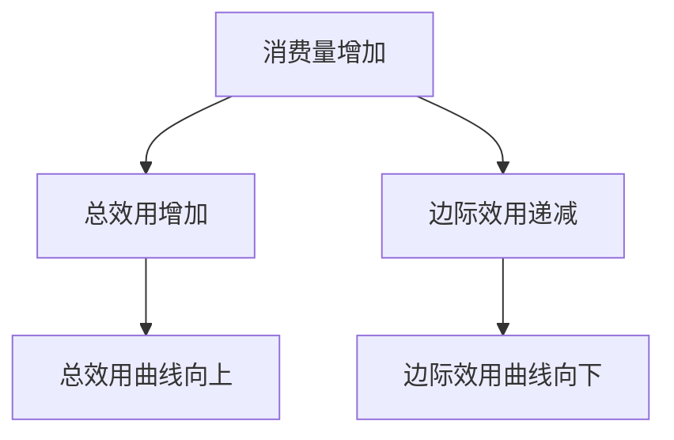
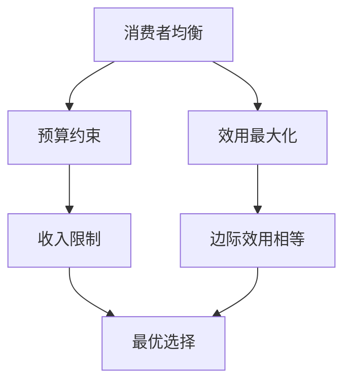
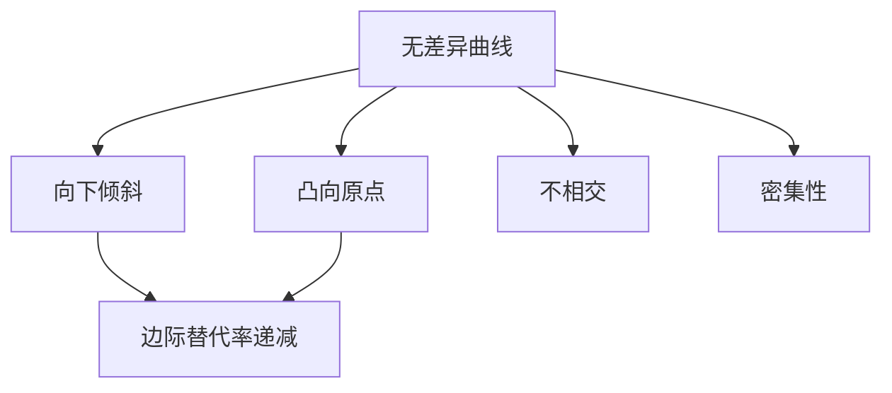
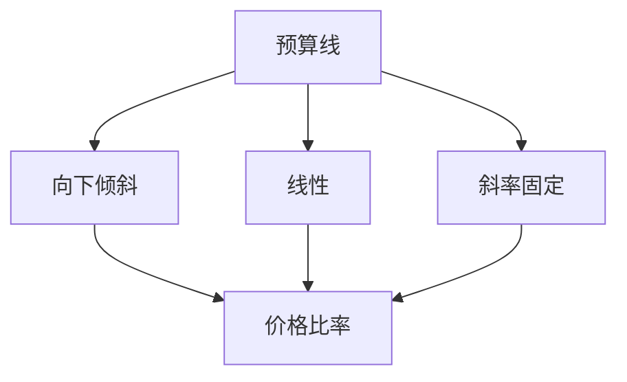
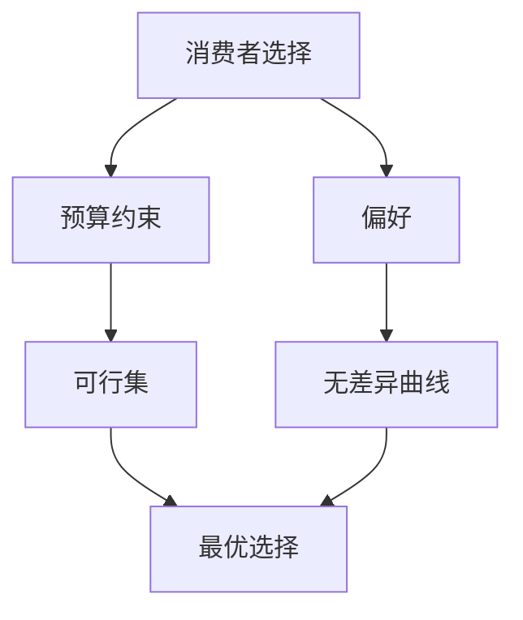

# 效用理论

## 核心概念

### 效用定义
**效用**：消费者从消费商品中获得的满足程度。

> **费曼技巧**：效用 = 满足程度 = 主观感受

### 效用特征

| 特征 | 含义 | 例子 |
|------|------|------|
| **主观性** | 个人感受 | 同一商品对不同人效用不同 |
| **相对性** | 比较概念 | 效用大小是相对的 |
| **可比较性** | 可以比较 | 可以比较不同商品效用 |

## 基数效用论

### 基本假设

#### 1. 效用可测量
- **假设**：效用可以用数字表示
- **单位**：效用单位（utils）
- **测量**：可以精确测量效用大小

#### 2. 边际效用递减
- **定义**：随着消费量增加，边际效用递减
- **原因**：生理和心理因素
- **表现**：消费越多，满足感增加越少

### 边际效用

#### 定义
**边际效用**：增加一单位商品消费所增加的效用。

```
MU = ΔU / ΔQ
```

#### 边际效用递减规律



#### 总效用与边际效用关系

| 消费量 | 总效用 | 边际效用 | 关系 |
|--------|--------|----------|------|
| **0** | 0 | - | 起点 |
| **1** | 10 | 10 | MU > 0 |
| **2** | 18 | 8 | MU > 0, 递减 |
| **3** | 24 | 6 | MU > 0, 递减 |
| **4** | 28 | 4 | MU > 0, 递减 |
| **5** | 30 | 2 | MU > 0, 递减 |
| **6** | 30 | 0 | MU = 0, 最大值 |

### 消费者均衡

#### 均衡条件
**消费者均衡**：在预算约束下，效用最大化。

```
MU1/P1 = MU2/P2 = ... = MUn/Pn = λ
```

其中：
- **MU**：边际效用
- **P**：价格
- **λ**：货币边际效用

#### 均衡分析



## 序数效用论

### 基本假设

#### 1. 效用不可测量
- **假设**：效用无法用数字表示
- **比较**：只能比较效用大小
- **排序**：可以排序不同商品组合

#### 2. 偏好公理
- **完备性**：可以比较任意两种商品组合
- **传递性**：偏好关系具有传递性
- **非饱和性**：更多商品总是更好

### 无差异曲线

#### 定义
**无差异曲线**：给消费者带来相同效用水平的商品组合的轨迹。

#### 无差异曲线特征



#### 特征说明

| 特征 | 含义 | 原因 |
|------|------|------|
| **向下倾斜** | 一种商品增加，另一种减少 | 保持效用不变 |
| **凸向原点** | 曲线凸向原点 | 边际替代率递减 |
| **不相交** | 不同曲线不相交 | 偏好一致性 |
| **密集性** | 曲线密集分布 | 连续性假设 |

### 边际替代率

#### 定义
**边际替代率**：在保持效用不变的情况下，消费者愿意用一种商品替代另一种商品的比率。

```
MRS = -ΔY/ΔX = MUx/MUy
```

#### 边际替代率递减


#### 边际替代率类型

| 类型 | 特征 | 例子 |
|------|------|------|
| **完全替代** | MRS常数 | 不同品牌的可乐 |
| **完全互补** | MRS为0或∞ | 左鞋和右鞋 |
| **一般替代** | MRS递减 | 大多数商品 |

## 预算约束

### 预算线

#### 定义
**预算线**：在给定收入和价格下，消费者能够购买的所有商品组合。

```
PxX + PyY = I
```

#### 预算线特征



#### 预算线变化

| 变化类型 | 预算线变化 | 原因 |
|----------|------------|------|
| **收入增加** | 平行外移 | 购买力增加 |
| **收入减少** | 平行内移 | 购买力减少 |
| **价格上升** | 向内旋转 | 购买力下降 |
| **价格下降** | 向外旋转 | 购买力上升 |

### 预算约束分析

#### 预算约束类型

| 约束类型 | 特征 | 例子 |
|----------|------|------|
| **硬约束** | 严格限制 | 收入限制 |
| **软约束** | 弹性限制 | 信贷限制 |
| **时间约束** | 时间限制 | 时间分配 |

## 消费者选择

### 最优选择

#### 选择条件
**最优选择**：无差异曲线与预算线的切点。

```
MRS = Px/Py
```

#### 选择分析



### 选择变化

#### 价格变化

| 变化类型 | 选择变化 | 原因 |
|----------|----------|------|
| **价格下降** | 消费增加 | 替代效应和收入效应 |
| **价格上升** | 消费减少 | 替代效应和收入效应 |

#### 收入变化

| 变化类型 | 选择变化 | 原因 |
|----------|----------|------|
| **收入增加** | 消费增加 | 购买力增加 |
| **收入减少** | 消费减少 | 购买力减少 |

## 效用理论应用

### 1. 消费者行为分析

#### 消费决策
- **效用最大化**：选择最优商品组合
- **预算约束**：考虑收入限制
- **偏好分析**：分析消费者偏好

#### 消费模式
- **必需品消费**：基本生活需求
- **奢侈品消费**：享受型需求
- **投资性消费**：未来收益需求

### 2. 企业决策分析

#### 产品设计
- **效用分析**：分析消费者效用
- **偏好分析**：分析消费者偏好
- **需求预测**：预测消费者需求

#### 营销策略
- **效用宣传**：宣传产品效用
- **偏好引导**：引导消费者偏好
- **需求刺激**：刺激消费者需求

### 3. 政策分析

#### 消费政策
- **效用分析**：分析政策对效用的影响
- **福利分析**：分析政策对福利的影响
- **效率分析**：分析政策的效率

#### 税收政策
- **效用影响**：分析税收对效用的影响
- **行为影响**：分析税收对行为的影响
- **福利影响**：分析税收对福利的影响

## 理论比较

### 基数效用论 vs 序数效用论

| 维度 | 基数效用论 | 序数效用论 |
|------|------------|------------|
| **效用测量** | 可以测量 | 无法测量 |
| **分析方法** | 边际分析 | 无差异曲线 |
| **均衡条件** | MU/P相等 | MRS = 价格比 |
| **应用范围** | 有限 | 广泛 |
| **理论地位** | 历史意义 | 现代主流 |

### 理论选择

#### 基数效用论适用
- **简单分析**：单一商品分析
- **教学目的**：概念理解
- **历史研究**：理论发展

#### 序数效用论适用
- **复杂分析**：多商品分析
- **实际应用**：政策分析
- **现代研究**：前沿研究

## 刻意练习

### 概念理解
- [ ] 理解效用的定义和特征
- [ ] 掌握边际效用递减规律
- [ ] 理解无差异曲线特征

### 计算应用
- [ ] 计算边际效用
- [ ] 计算边际替代率
- [ ] 求解消费者均衡

### 实际应用
- [ ] 分析消费者行为
- [ ] 设计产品策略
- [ ] 评估政策效果

---

**相关链接**：
- [[02-无差异曲线]] - 无差异曲线分析
- [[03-预算约束]] - 预算约束分析
- [[04-消费者选择]] - 消费者选择分析
