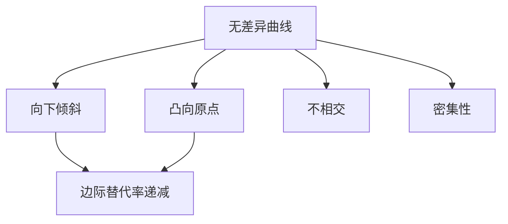
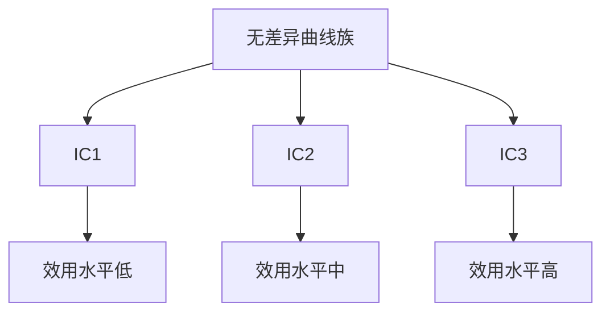
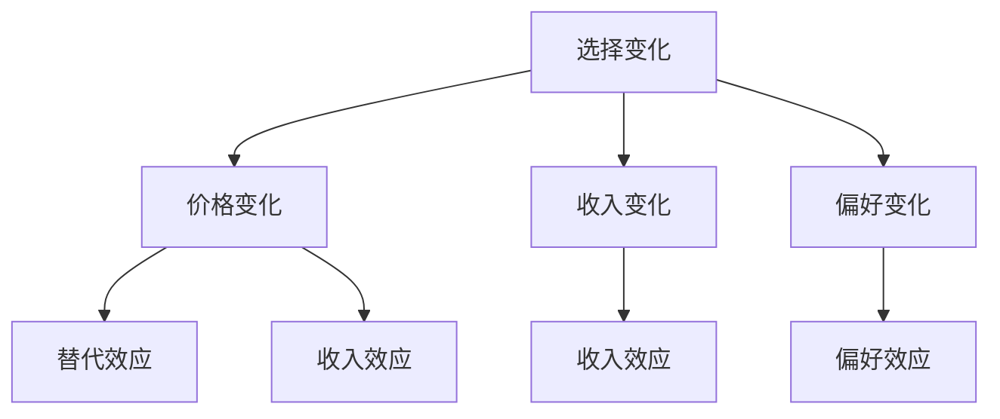

# 无差异曲线

## 核心概念

### 无差异曲线定义
**无差异曲线**：给消费者带来相同效用水平的商品组合的轨迹。

> **费曼技巧**：无差异曲线 = 效用相等的点连成的线

### 基本特征



## 无差异曲线特征

### 1. 向下倾斜

#### 特征说明
- **含义**：一种商品增加，另一种商品减少
- **原因**：保持效用水平不变
- **表现**：斜率为负

#### 数学表达
```
dY/dX < 0
```

### 2. 凸向原点

#### 特征说明
- **含义**：曲线凸向原点
- **原因**：边际替代率递减
- **表现**：二阶导数大于零

#### 数学表达
```
d²Y/dX² > 0
```

### 3. 不相交

#### 特征说明
- **含义**：不同无差异曲线不相交
- **原因**：偏好一致性
- **表现**：每条曲线代表不同效用水平

#### 证明
假设两条无差异曲线相交于点A，则：
- 点A在两条曲线上
- 两条曲线效用水平不同
- 矛盾：同一点不能有两个效用水平

### 4. 密集性

#### 特征说明
- **含义**：无差异曲线密集分布
- **原因**：连续性假设
- **表现**：任意两点间都有无差异曲线

## 边际替代率

### 定义
**边际替代率**：在保持效用不变的情况下，消费者愿意用一种商品替代另一种商品的比率。

```
MRS = -ΔY/ΔX = MUx/MUy
```

### 边际替代率递减

#### 规律
- **定义**：随着X商品增加，边际替代率递减
- **原因**：边际效用递减
- **表现**：无差异曲线凸向原点

#### 图形表示


### 边际替代率计算

#### 计算方法
1. **几何方法**：无差异曲线斜率
2. **代数方法**：效用函数求导
3. **数值方法**：离散点计算

#### 计算实例
```
效用函数：U = X^0.5 × Y^0.5
边际效用：MUx = 0.5X^(-0.5) × Y^0.5
边际效用：MUy = 0.5X^0.5 × Y^(-0.5)
边际替代率：MRS = MUx/MUy = Y/X
```

## 特殊无差异曲线

### 1. 完全替代

#### 特征
- **边际替代率**：常数
- **无差异曲线**：直线
- **例子**：不同品牌的可乐

#### 数学表达
```
U = aX + bY
MRS = a/b = 常数
```

### 2. 完全互补

#### 特征
- **边际替代率**：0或∞
- **无差异曲线**：L形
- **例子**：左鞋和右鞋

#### 数学表达
```
U = min(aX, bY)
MRS = 0 (当aX < bY)
MRS = ∞ (当aX > bY)
```

### 3. 一般替代

#### 特征
- **边际替代率**：递减
- **无差异曲线**：凸向原点
- **例子**：大多数商品

#### 数学表达
```
U = f(X, Y)
MRS = f'(X)/f'(Y) (递减)
```

## 无差异曲线分析

### 1. 效用水平比较

#### 比较方法
- **位置比较**：离原点越远，效用越高
- **数量比较**：商品数量越多，效用越高
- **质量比较**：商品质量越好，效用越高

#### 比较实例



### 2. 偏好分析

#### 偏好类型

| 偏好类型 | 特征 | 例子 |
|----------|------|------|
| **单调偏好** | 更多商品更好 | 正常商品 |
| **凸偏好** | 平均消费更好 | 风险厌恶 |
| **凹偏好** | 极端消费更好 | 风险偏好 |

#### 偏好表示
- **效用函数**：数学表示
- **无差异曲线**：图形表示
- **偏好关系**：逻辑表示

### 3. 选择分析

#### 选择条件
- **预算约束**：收入限制
- **偏好约束**：偏好限制
- **最优选择**：无差异曲线与预算线切点

#### 选择变化



## 无差异曲线应用

### 1. 消费者行为分析

#### 消费决策
- **效用最大化**：选择最优商品组合
- **预算约束**：考虑收入限制
- **偏好分析**：分析消费者偏好

#### 消费模式
- **必需品消费**：基本生活需求
- **奢侈品消费**：享受型需求
- **投资性消费**：未来收益需求

### 2. 企业决策分析

#### 产品设计
- **效用分析**：分析消费者效用
- **偏好分析**：分析消费者偏好
- **需求预测**：预测消费者需求

#### 营销策略
- **效用宣传**：宣传产品效用
- **偏好引导**：引导消费者偏好
- **需求刺激**：刺激消费者需求

### 3. 政策分析

#### 消费政策
- **效用分析**：分析政策对效用的影响
- **福利分析**：分析政策对福利的影响
- **效率分析**：分析政策的效率

#### 税收政策
- **效用影响**：分析税收对效用的影响
- **行为影响**：分析税收对行为的影响
- **福利影响**：分析税收对福利的影响

## 无差异曲线与需求

### 需求推导

#### 推导过程
1. **无差异曲线**：表示偏好
2. **预算线**：表示约束
3. **最优选择**：切点
4. **需求曲线**：价格变化轨迹

#### 推导方法


### 需求分析

#### 价格变化
- **替代效应**：相对价格变化
- **收入效应**：实际收入变化
- **总效应**：替代效应 + 收入效应

#### 收入变化
- **正常商品**：收入增加，需求增加
- **劣等商品**：收入增加，需求减少
- **奢侈品**：收入增加，需求大幅增加

## 理论局限

### 1. 假设局限

#### 连续性假设
- **假设**：偏好连续
- **现实**：偏好可能不连续
- **影响**：无差异曲线可能不存在

#### 凸性假设
- **假设**：偏好凸性
- **现实**：偏好可能不凸
- **影响**：边际替代率可能不递减

### 2. 测量局限

#### 效用测量
- **问题**：效用无法直接测量
- **解决**：通过行为推断
- **局限**：推断可能不准确

#### 偏好测量
- **问题**：偏好难以测量
- **解决**：通过选择推断
- **局限**：选择可能不反映真实偏好

### 3. 应用局限

#### 复杂偏好
- **问题**：偏好可能复杂
- **解决**：简化假设
- **局限**：可能偏离现实

#### 动态偏好
- **问题**：偏好可能变化
- **解决**：静态分析
- **局限**：可能不适用动态情况

## 刻意练习

### 概念理解
- [ ] 理解无差异曲线的定义和特征
- [ ] 掌握边际替代率的概念和计算
- [ ] 理解特殊无差异曲线的特征

### 图形分析
- [ ] 绘制无差异曲线
- [ ] 分析无差异曲线变化
- [ ] 比较不同效用水平

### 实际应用
- [ ] 分析消费者偏好
- [ ] 设计产品策略
- [ ] 评估政策效果

---

**相关链接**：
- [[01-效用理论]] - 效用理论基础
- [[03-预算约束]] - 预算约束分析
- [[04-消费者选择]] - 消费者选择分析
