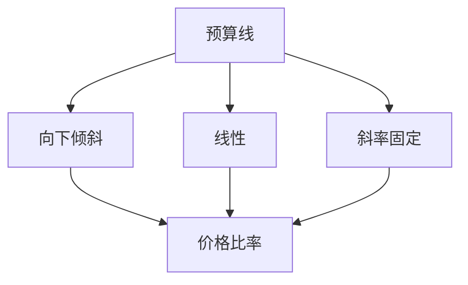
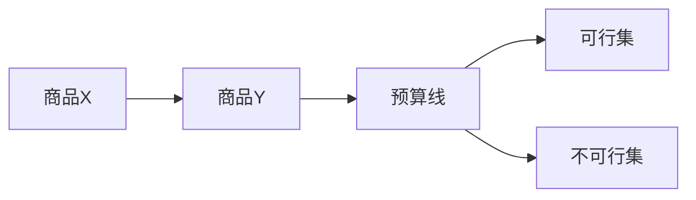
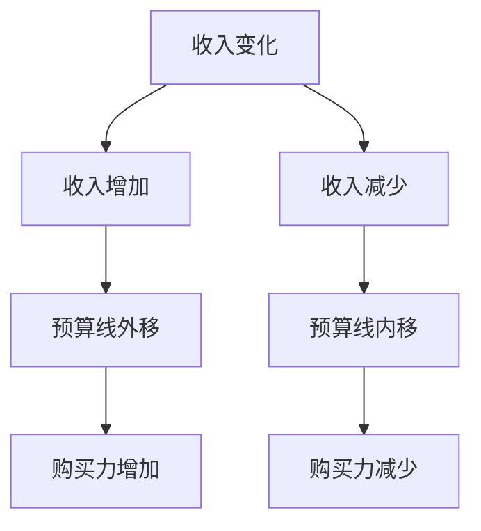
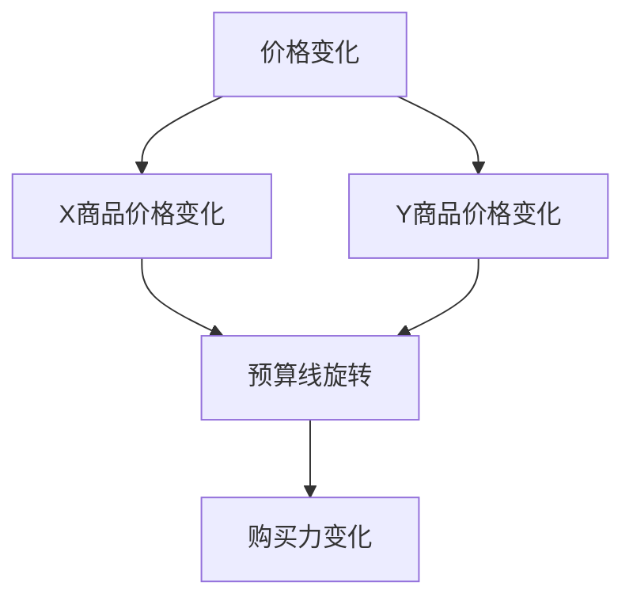
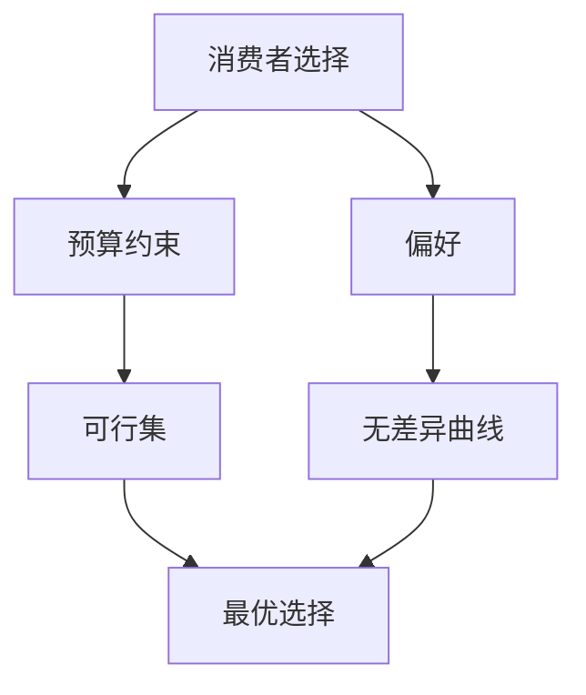

# 预算约束

## 核心概念

### 预算约束定义
**预算约束**：在给定收入和价格下，消费者能够购买的所有商品组合。

> **费曼技巧**：预算约束 = 收入限制 = 购买能力

### 预算约束方程
```
PxX + PyY = I
```

其中：
- **Px, Py**：商品价格
- **X, Y**：商品数量
- **I**：收入

## 预算线

### 预算线特征



### 预算线方程

#### 一般形式
```
Y = (I/Py) - (Px/Py)X
```

#### 截距和斜率
- **Y截距**：I/Py（全部收入买Y商品）
- **X截距**：I/Px（全部收入买X商品）
- **斜率**：-Px/Py（价格比率）

### 预算线图形

#### 基本图形



#### 可行集
- **定义**：预算线下方和预算线上的点
- **特征**：消费者能够购买的商品组合
- **边界**：预算线

## 预算约束变化

### 1. 收入变化

#### 收入增加
- **预算线变化**：平行外移
- **截距变化**：X和Y截距都增加
- **斜率不变**：价格比率不变

#### 收入减少
- **预算线变化**：平行内移
- **截距变化**：X和Y截距都减少
- **斜率不变**：价格比率不变

#### 收入变化图形



### 2. 价格变化

#### X商品价格变化

| 价格变化 | 预算线变化 | 原因 |
|----------|------------|------|
| **价格上升** | 向内旋转 | X商品购买力下降 |
| **价格下降** | 向外旋转 | X商品购买力上升 |

#### Y商品价格变化

| 价格变化 | 预算线变化 | 原因 |
|----------|------------|------|
| **价格上升** | 向内旋转 | Y商品购买力下降 |
| **价格下降** | 向外旋转 | Y商品购买力上升 |

#### 价格变化图形



### 3. 同时变化

#### 收入价格同向变化
- **收入增加，价格上升**：购买力变化不确定
- **收入减少，价格下降**：购买力变化不确定

#### 收入价格反向变化
- **收入增加，价格下降**：购买力大幅增加
- **收入减少，价格上升**：购买力大幅减少

## 预算约束类型

### 1. 线性预算约束

#### 特征
- **价格固定**：商品价格不变
- **预算线**：直线
- **斜率**：固定

#### 应用
- **完全竞争市场**：价格接受者
- **标准化商品**：价格固定
- **短期分析**：价格不变

### 2. 非线性预算约束

#### 特征
- **价格变化**：商品价格变化
- **预算线**：曲线
- **斜率**：变化

#### 应用
- **垄断市场**：价格制定者
- **差异化商品**：价格变化
- **长期分析**：价格变化

### 3. 分段预算约束

#### 特征
- **分段定价**：不同数量不同价格
- **预算线**：折线
- **斜率**：分段变化

#### 应用
- **数量折扣**：批量购买优惠
- **阶梯定价**：分段收费
- **促销活动**：特殊定价

## 预算约束分析

### 1. 消费者选择

#### 选择条件
- **预算约束**：收入限制
- **偏好约束**：偏好限制
- **最优选择**：无差异曲线与预算线切点

#### 选择分析



### 2. 需求分析

#### 需求推导
- **价格变化**：预算线旋转
- **最优选择**：切点变化
- **需求曲线**：价格与数量关系

#### 需求分析

| 变化类型 | 需求变化 | 原因 |
|----------|----------|------|
| **价格下降** | 需求增加 | 购买力增加 |
| **价格上升** | 需求减少 | 购买力减少 |
| **收入增加** | 需求增加 | 购买力增加 |
| **收入减少** | 需求减少 | 购买力减少 |

### 3. 福利分析

#### 福利变化
- **收入变化**：购买力变化
- **价格变化**：购买力变化
- **福利变化**：效用变化

#### 福利测量
- **消费者剩余**：愿意支付与实际支付差额
- **等价变化**：收入变化等价
- **补偿变化**：价格变化补偿

## 预算约束应用

### 1. 消费者决策

#### 购买决策
- **预算分析**：分析购买能力
- **选择分析**：分析最优选择
- **决策制定**：制定购买决策

#### 消费模式
- **必需品消费**：基本生活需求
- **奢侈品消费**：享受型需求
- **投资性消费**：未来收益需求

### 2. 企业决策

#### 产品定价
- **预算分析**：分析消费者预算
- **价格策略**：制定价格策略
- **市场定位**：确定市场定位

#### 营销策略
- **预算引导**：引导消费者预算
- **价格宣传**：宣传价格优势
- **促销活动**：设计促销活动

### 3. 政策分析

#### 收入政策
- **收入分配**：分析收入分配
- **贫困问题**：分析贫困问题
- **福利政策**：设计福利政策

#### 价格政策
- **价格管制**：分析价格管制
- **价格支持**：分析价格支持
- **价格稳定**：分析价格稳定

## 预算约束扩展

### 1. 多商品预算约束

#### 一般形式
```
P1X1 + P2X2 + ... + PnXn = I
```

#### 分析复杂
- **高维空间**：n维商品空间
- **预算超平面**：n-1维超平面
- **选择复杂**：多商品选择

### 2. 时间预算约束

#### 时间分配
- **工作时间**：获得收入
- **消费时间**：消费商品
- **时间约束**：时间有限

#### 时间预算
```
Tw + Tc = T
```

其中：
- **Tw**：工作时间
- **Tc**：消费时间
- **T**：总时间

### 3. 信贷预算约束

#### 信贷约束
- **当期收入**：当期收入限制
- **未来收入**：未来收入预期
- **信贷额度**：信贷额度限制

#### 跨期预算
```
C1 + C2/(1+r) = Y1 + Y2/(1+r)
```

其中：
- **C1, C2**：当期和未来消费
- **Y1, Y2**：当期和未来收入
- **r**：利率

## 刻意练习

### 概念理解
- [ ] 理解预算约束的定义和特征
- [ ] 掌握预算线的绘制和分析
- [ ] 理解预算约束变化的影响

### 图形分析
- [ ] 绘制预算线
- [ ] 分析预算线变化
- [ ] 比较不同预算约束

### 实际应用
- [ ] 分析消费者选择
- [ ] 设计企业策略
- [ ] 评估政策效果

---

**相关链接**：
- [[01-效用理论]] - 效用理论基础
- [[02-无差异曲线]] - 无差异曲线分析
- [[04-消费者选择]] - 消费者选择分析
