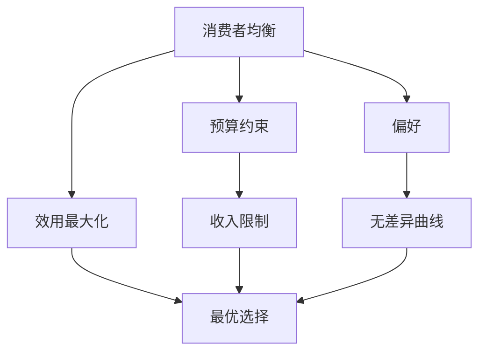
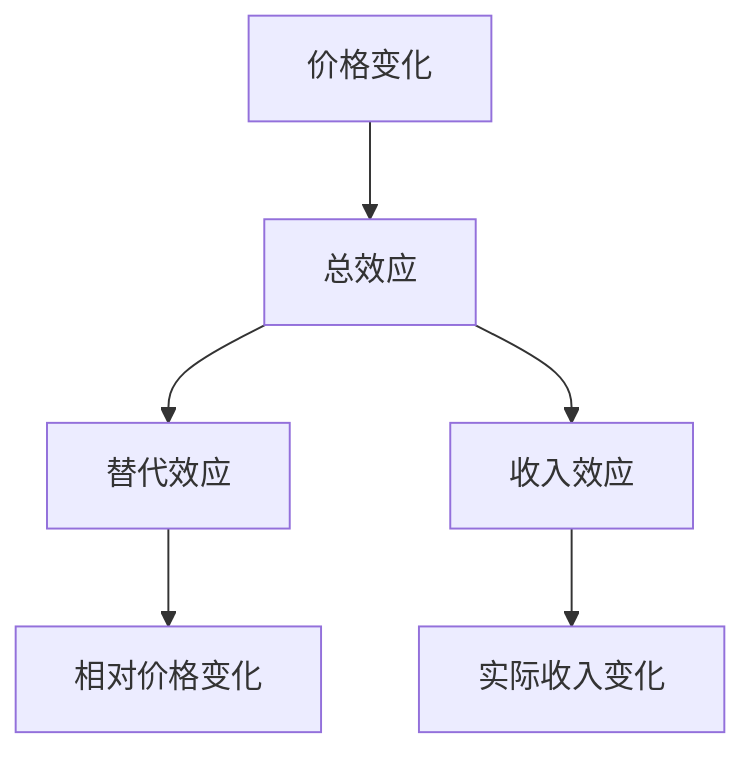
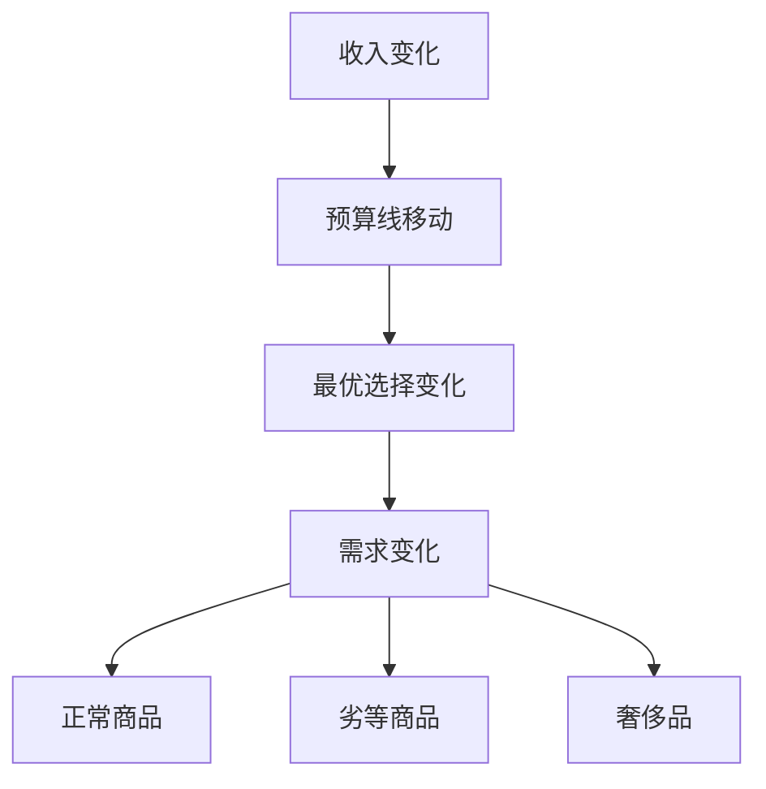
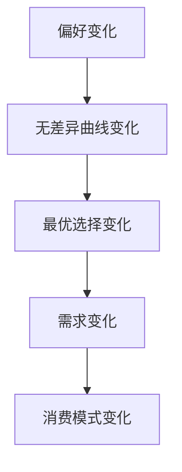

# 消费者选择

## 核心概念

### 消费者选择定义
**消费者选择**：在预算约束下，消费者选择最优商品组合以实现效用最大化。

> **费曼技巧**：消费者选择 = 预算约束 + 偏好 + 效用最大化

### 选择条件
```
MRS = Px/Py
```

其中：
- **MRS**：边际替代率
- **Px/Py**：价格比率

## 消费者均衡

### 均衡条件

#### 数学条件
```
MUx/Px = MUy/Py = λ
```

其中：
- **MUx, MUy**：边际效用
- **Px, Py**：价格
- **λ**：货币边际效用

#### 几何条件
- **切点条件**：无差异曲线与预算线相切
- **斜率相等**：MRS = 价格比率
- **效用最大**：在预算约束下效用最大

### 均衡分析



### 均衡求解

#### 求解步骤
1. **建立预算约束**：PxX + PyY = I
2. **建立效用函数**：U = f(X, Y)
3. **求边际效用**：MUx, MUy
4. **建立均衡条件**：MUx/Px = MUy/Py
5. **求解最优选择**：X*, Y*

#### 求解实例
```
预算约束：2X + 3Y = 100
效用函数：U = X^0.5 × Y^0.5
边际效用：MUx = 0.5X^(-0.5) × Y^0.5
边际效用：MUy = 0.5X^0.5 × Y^(-0.5)
均衡条件：MUx/2 = MUy/3
求解：X* = 25, Y* = 16.67
```

## 选择变化

### 价格变化

#### 价格效应分解



#### 替代效应
- **定义**：相对价格变化引起的需求变化
- **方向**：价格下降，需求增加
- **原因**：相对价格变化

#### 收入效应
- **定义**：实际收入变化引起的需求变化
- **方向**：收入增加，需求增加（正常商品）
- **原因**：实际收入变化

#### 总效应
```
总效应 = 替代效应 + 收入效应
```

### 收入变化

#### 收入效应

| 商品类型 | 收入增加 | 需求变化 | 例子 |
|----------|----------|----------|------|
| **正常商品** | 收入增加 | 需求增加 | 汽车 |
| **劣等商品** | 收入增加 | 需求减少 | 方便面 |
| **奢侈品** | 收入增加 | 需求大幅增加 | 珠宝 |

#### 收入变化分析



### 偏好变化

#### 偏好变化类型
- **广告影响**：改变消费者偏好
- **时尚变化**：流行趋势影响
- **文化因素**：文化背景影响

#### 偏好变化分析



## 选择分析

### 1. 角点解

#### 角点解条件
- **定义**：最优选择在预算线端点
- **条件**：MRS ≠ 价格比率
- **原因**：极端偏好或价格极端

#### 角点解分析

| 情况 | 条件 | 结果 |
|------|------|------|
| **只买X** | MRS > Px/Py | X = I/Px, Y = 0 |
| **只买Y** | MRS < Px/Py | X = 0, Y = I/Py |

### 2. 内点解

#### 内点解条件
- **定义**：最优选择在预算线内部
- **条件**：MRS = 价格比率
- **原因**：平衡偏好和价格

#### 内点解分析
- **切点条件**：无差异曲线与预算线相切
- **斜率相等**：MRS = 价格比率
- **效用最大**：在预算约束下效用最大

### 3. 多重解

#### 多重解条件
- **定义**：存在多个最优选择
- **条件**：无差异曲线与预算线重合
- **原因**：特殊偏好或价格

#### 多重解分析
- **解集**：预算线上的所有点
- **选择**：任意选择预算线上的点
- **结果**：需求不确定

## 选择应用

### 1. 消费者行为分析

#### 消费决策
- **预算分析**：分析购买能力
- **偏好分析**：分析消费者偏好
- **选择分析**：分析最优选择

#### 消费模式
- **必需品消费**：基本生活需求
- **奢侈品消费**：享受型需求
- **投资性消费**：未来收益需求

### 2. 企业决策分析

#### 产品设计
- **偏好分析**：分析消费者偏好
- **需求分析**：分析消费者需求
- **产品定位**：确定产品定位

#### 营销策略
- **偏好引导**：引导消费者偏好
- **需求刺激**：刺激消费者需求
- **市场细分**：细分目标市场

### 3. 政策分析

#### 消费政策
- **选择分析**：分析政策对选择的影响
- **福利分析**：分析政策对福利的影响
- **效率分析**：分析政策的效率

#### 税收政策
- **选择影响**：分析税收对选择的影响
- **行为影响**：分析税收对行为的影响
- **福利影响**：分析税收对福利的影响

## 选择理论扩展

### 1. 不确定性选择

#### 风险偏好
- **风险厌恶**：偏好确定性
- **风险中性**：对风险无偏好
- **风险偏好**：偏好不确定性

#### 期望效用
```
EU = p1U1 + p2U2 + ... + pnUn
```

其中：
- **pi**：概率
- **Ui**：效用

### 2. 跨期选择

#### 时间偏好
- **现期偏好**：偏好现期消费
- **未来偏好**：偏好未来消费
- **时间中性**：对时间无偏好

#### 跨期效用
```
U = U(C1) + δU(C2)
```

其中：
- **C1, C2**：现期和未来消费
- **δ**：贴现因子

### 3. 社会选择

#### 社会偏好
- **个人偏好**：个人效用函数
- **社会偏好**：社会福利函数
- **偏好聚合**：个人偏好聚合

#### 社会选择
- **投票机制**：多数投票
- **市场机制**：价格机制
- **协商机制**：协商一致

## 理论局限

### 1. 假设局限

#### 完全信息假设
- **假设**：消费者拥有完全信息
- **现实**：信息不对称普遍存在
- **影响**：选择可能非最优

#### 理性假设
- **假设**：消费者完全理性
- **现实**：非理性行为普遍存在
- **影响**：选择可能非理性

### 2. 测量局限

#### 效用测量
- **问题**：效用无法直接测量
- **解决**：通过行为推断
- **局限**：推断可能不准确

#### 偏好测量
- **问题**：偏好难以测量
- **解决**：通过选择推断
- **局限**：选择可能不反映真实偏好

### 3. 应用局限

#### 复杂偏好
- **问题**：偏好可能复杂
- **解决**：简化假设
- **局限**：可能偏离现实

#### 动态偏好
- **问题**：偏好可能变化
- **解决**：静态分析
- **局限**：可能不适用动态情况

## 刻意练习

### 概念理解
- [ ] 理解消费者选择的定义和条件
- [ ] 掌握消费者均衡的求解方法
- [ ] 理解选择变化的影响因素

### 计算应用
- [ ] 求解消费者均衡
- [ ] 分析价格效应
- [ ] 计算收入效应

### 实际应用
- [ ] 分析消费者行为
- [ ] 设计企业策略
- [ ] 评估政策效果

---

**相关链接**：
- [[01-效用理论]] - 效用理论基础
- [[02-无差异曲线]] - 无差异曲线分析
- [[03-预算约束]] - 预算约束分析
