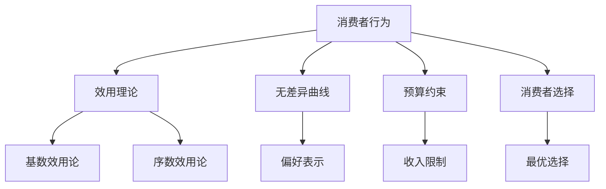
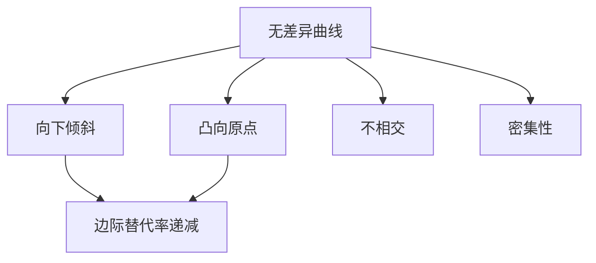
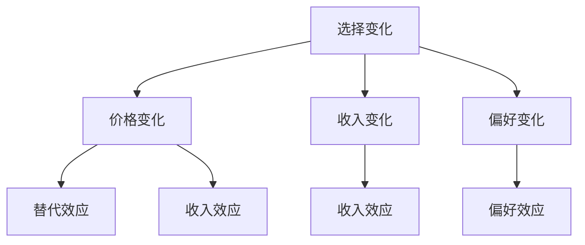
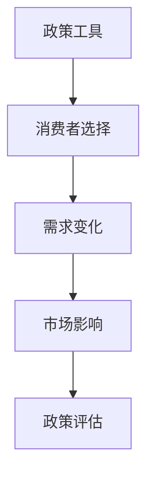

# 消费者行为总结

## 核心框架

### 消费者行为理论体系



## 理论体系

### 1. 效用理论

#### 核心概念
- **效用定义**：消费者从消费商品中获得的满足程度
- **效用特征**：主观性、相对性、可比较性
- **边际效用**：增加一单位商品消费所增加的效用

#### 理论分支

| 理论分支 | 核心假设 | 分析方法 | 应用范围 |
|----------|----------|----------|----------|
| **基数效用论** | 效用可测量 | 边际分析 | 有限 |
| **序数效用论** | 效用不可测量 | 无差异曲线 | 广泛 |

#### 关键规律
- **边际效用递减**：随着消费量增加，边际效用递减
- **效用最大化**：在预算约束下，效用最大化
- **均衡条件**：边际效用与价格比率相等

### 2. 无差异曲线

#### 核心概念
- **无差异曲线**：给消费者带来相同效用水平的商品组合轨迹
- **边际替代率**：在保持效用不变的情况下，消费者愿意用一种商品替代另一种商品的比率
- **偏好公理**：完备性、传递性、非饱和性

#### 曲线特征



#### 特殊曲线

| 曲线类型 | 特征 | 例子 |
|----------|------|------|
| **完全替代** | 直线 | 不同品牌可乐 |
| **完全互补** | L形 | 左鞋右鞋 |
| **一般替代** | 凸向原点 | 大多数商品 |

### 3. 预算约束

#### 核心概念
- **预算约束**：在给定收入和价格下，消费者能够购买的所有商品组合
- **预算线**：预算约束的边界
- **可行集**：消费者能够购买的商品组合

#### 约束方程
```
PxX + PyY = I
```

#### 约束变化

| 变化类型 | 预算线变化 | 原因 |
|----------|------------|------|
| **收入增加** | 平行外移 | 购买力增加 |
| **收入减少** | 平行内移 | 购买力减少 |
| **价格上升** | 向内旋转 | 购买力下降 |
| **价格下降** | 向外旋转 | 购买力上升 |

### 4. 消费者选择

#### 核心概念
- **消费者选择**：在预算约束下，消费者选择最优商品组合
- **消费者均衡**：效用最大化的选择
- **均衡条件**：无差异曲线与预算线相切

#### 选择条件
```
MRS = Px/Py
```

#### 选择变化



## 分析方法

### 1. 静态分析

#### 比较静态分析
- **价格变化**：分析价格变化对选择的影响
- **收入变化**：分析收入变化对选择的影响
- **偏好变化**：分析偏好变化对选择的影响

#### 静态均衡分析
- **均衡求解**：通过数学方法求解均衡
- **均衡稳定性**：分析均衡的稳定性
- **均衡效率**：分析均衡的效率性

### 2. 动态分析

#### 时间序列分析
- **选择调整**：分析选择调整过程
- **均衡收敛**：分析均衡收敛过程
- **长期选择**：分析长期选择趋势

#### 动态均衡分析
- **均衡路径**：分析均衡调整路径
- **均衡稳定性**：分析动态稳定性
- **均衡预测**：预测均衡变化趋势

### 3. 政策分析

#### 政策工具
- **价格政策**：价格管制、价格支持
- **收入政策**：收入分配、收入补贴
- **税收政策**：消费税、所得税

#### 政策效果


## 实际应用

### 1. 消费者决策

#### 购买决策
- **预算分析**：分析购买能力
- **偏好分析**：分析消费者偏好
- **选择分析**：分析最优选择
- **决策制定**：制定购买决策

#### 消费模式
- **必需品消费**：基本生活需求
- **奢侈品消费**：享受型需求
- **投资性消费**：未来收益需求

### 2. 企业决策

#### 产品设计
- **偏好分析**：分析消费者偏好
- **需求分析**：分析消费者需求
- **产品定位**：确定产品定位
- **产品设计**：设计产品特性

#### 营销策略
- **偏好引导**：引导消费者偏好
- **需求刺激**：刺激消费者需求
- **市场细分**：细分目标市场
- **促销活动**：设计促销活动

### 3. 政策制定

#### 消费政策
- **选择分析**：分析政策对选择的影响
- **福利分析**：分析政策对福利的影响
- **效率分析**：分析政策的效率
- **政策设计**：设计政策工具

#### 税收政策
- **选择影响**：分析税收对选择的影响
- **行为影响**：分析税收对行为的影响
- **福利影响**：分析税收对福利的影响
- **政策评估**：评估政策效果

## 理论扩展

### 1. 不确定性选择

#### 风险偏好
- **风险厌恶**：偏好确定性
- **风险中性**：对风险无偏好
- **风险偏好**：偏好不确定性

#### 期望效用
```
EU = p1U1 + p2U2 + ... + pnUn
```

### 2. 跨期选择

#### 时间偏好
- **现期偏好**：偏好现期消费
- **未来偏好**：偏好未来消费
- **时间中性**：对时间无偏好

#### 跨期效用
```
U = U(C1) + δU(C2)
```

### 3. 社会选择

#### 社会偏好
- **个人偏好**：个人效用函数
- **社会偏好**：社会福利函数
- **偏好聚合**：个人偏好聚合

#### 社会选择
- **投票机制**：多数投票
- **市场机制**：价格机制
- **协商机制**：协商一致

## 理论局限

### 1. 假设局限

#### 完全信息假设
- **假设**：消费者拥有完全信息
- **现实**：信息不对称普遍存在
- **影响**：选择可能非最优

#### 理性假设
- **假设**：消费者完全理性
- **现实**：非理性行为普遍存在
- **影响**：选择可能非理性

### 2. 测量局限

#### 效用测量
- **问题**：效用无法直接测量
- **解决**：通过行为推断
- **局限**：推断可能不准确

#### 偏好测量
- **问题**：偏好难以测量
- **解决**：通过选择推断
- **局限**：选择可能不反映真实偏好

### 3. 应用局限

#### 复杂偏好
- **问题**：偏好可能复杂
- **解决**：简化假设
- **局限**：可能偏离现实

#### 动态偏好
- **问题**：偏好可能变化
- **解决**：静态分析
- **局限**：可能不适用动态情况

## 学习要点

### 1. 概念掌握
- [ ] 理解效用、偏好、选择的概念
- [ ] 掌握无差异曲线和预算约束
- [ ] 理解消费者均衡的条件

### 2. 方法应用
- [ ] 运用消费者行为理论分析实际问题
- [ ] 计算消费者均衡和需求
- [ ] 分析政策对消费者行为的影响

### 3. 批判思维
- [ ] 质疑消费者行为理论假设
- [ ] 分析理论的适用条件
- [ ] 评估理论的局限性

---

**相关链接**：
- [[01-市场机制]] - 市场机制分析
- [[03-生产者行为]] - 生产者行为分析
- [[04-市场结构]] - 不同市场结构
