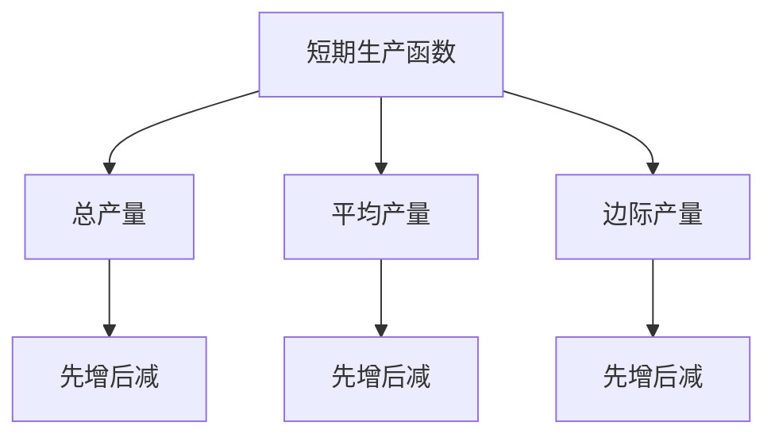
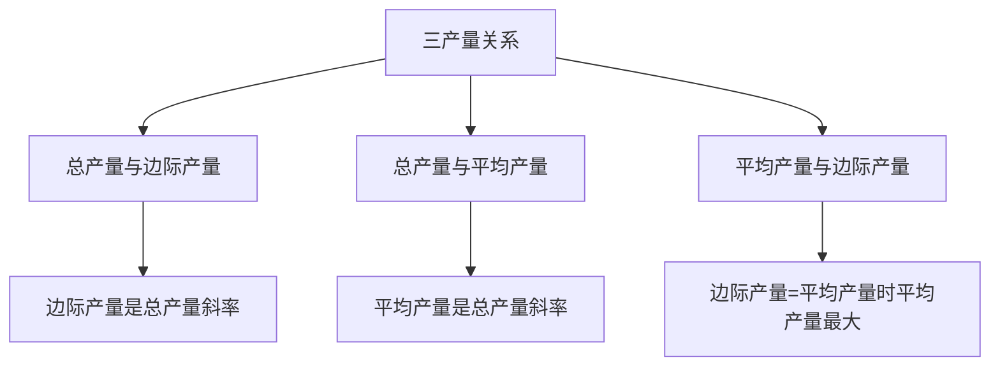
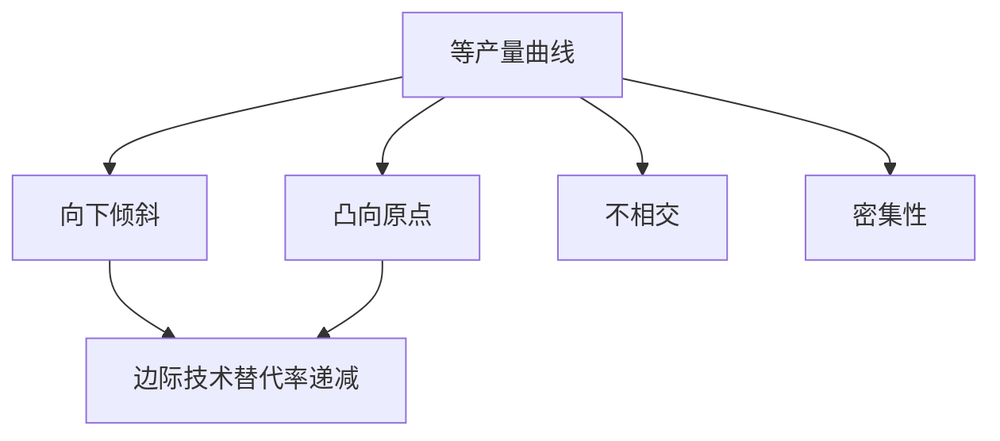
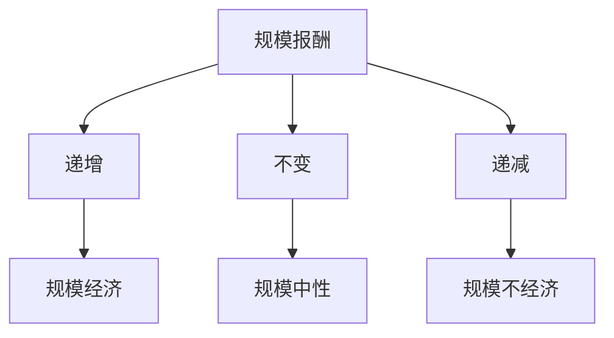

# 生产函数

## 核心概念

### 生产函数定义
**生产函数**：描述在给定技术条件下，生产要素投入与产出之间关系的函数。

> **费曼技巧**：生产函数 = 投入 + 技术 + 产出

### 生产函数表达式
```
Q = f(L, K, T, ...)
```

其中：
- **Q**：产出
- **L**：劳动
- **K**：资本
- **T**：技术
- **...**：其他要素

## 生产函数类型

### 1. 短期生产函数

#### 特征
- **固定要素**：资本固定
- **可变要素**：劳动可变
- **时间限制**：短期

#### 数学表达
```
Q = f(L, K̄)
```

其中：
- **K̄**：固定资本

#### 短期生产函数特征



### 2. 长期生产函数

#### 特征
- **可变要素**：所有要素可变
- **时间充足**：长期
- **技术不变**：技术固定

#### 数学表达
```
Q = f(L, K)
```

#### 长期生产函数特征

| 特征 | 含义 | 表现 |
|------|------|------|
| **规模报酬** | 所有要素同比例变化 | 产出变化 |
| **要素替代** | 要素间可以替代 | 等产量曲线 |
| **技术效率** | 技术不变 | 生产前沿 |

## 短期生产分析

### 1. 总产量（TP）

#### 定义
**总产量**：在给定资本下，劳动投入与总产出的关系。

```
TP = f(L, K̄)
```

#### 总产量曲线特征


#### 总产量阶段

| 阶段 | 特征 | 原因 |
|------|------|------|
| **第I阶段** | 总产量递增 | 边际产量递增 |
| **第II阶段** | 总产量递增 | 边际产量递减但为正 |
| **第III阶段** | 总产量递减 | 边际产量为负 |

### 2. 平均产量（AP）

#### 定义
**平均产量**：每单位劳动的平均产出。

```
AP = TP/L = f(L, K̄)/L
```

#### 平均产量曲线特征
- **先增后减**：平均产量先增后减
- **最大值**：平均产量最大值
- **与边际产量关系**：边际产量 = 平均产量时，平均产量最大

### 3. 边际产量（MP）

#### 定义
**边际产量**：增加一单位劳动所增加的产出。

```
MP = ΔTP/ΔL = dTP/dL
```

#### 边际产量曲线特征
- **先增后减**：边际产量先增后减
- **最大值**：边际产量最大值
- **与总产量关系**：边际产量 = 0时，总产量最大

### 4. 三产量关系

#### 关系分析



#### 关系总结

| 关系 | 含义 | 表现 |
|------|------|------|
| **TP与MP** | 边际产量是总产量斜率 | MP > 0时TP递增 |
| **TP与AP** | 平均产量是总产量斜率 | AP = TP/L |
| **AP与MP** | 边际产量=平均产量时平均产量最大 | MP = AP时AP最大 |

## 长期生产分析

### 1. 等产量曲线

#### 定义
**等产量曲线**：给生产者带来相同产出水平的生产要素组合的轨迹。

```
Q = f(L, K) = 常数
```

#### 等产量曲线特征



#### 特征说明

| 特征 | 含义 | 原因 |
|------|------|------|
| **向下倾斜** | 一种要素增加，另一种减少 | 保持产出不变 |
| **凸向原点** | 曲线凸向原点 | 边际技术替代率递减 |
| **不相交** | 不同曲线不相交 | 技术一致性 |
| **密集性** | 曲线密集分布 | 连续性假设 |

### 2. 边际技术替代率

#### 定义
**边际技术替代率**：在保持产出不变的情况下，生产者愿意用一种要素替代另一种要素的比率。

```
MRTS = -ΔK/ΔL = MPL/MPK
```

#### 边际技术替代率递减


#### 边际技术替代率类型

| 类型 | 特征 | 例子 |
|------|------|------|
| **完全替代** | MRTS常数 | 不同品牌机器 |
| **完全互补** | MRTS为0或∞ | 机器和操作员 |
| **一般替代** | MRTS递减 | 大多数要素 |

### 3. 规模报酬

#### 定义
**规模报酬**：所有生产要素同比例变化时，产出的变化。

```
Q(λL, λK) = λ^r Q(L, K)
```

#### 规模报酬类型

| 类型 | 条件 | 特征 | 例子 |
|------|------|------|------|
| **规模报酬递增** | r > 1 | 产出增加比例大于要素增加比例 | 大规模生产 |
| **规模报酬不变** | r = 1 | 产出增加比例等于要素增加比例 | 完全竞争 |
| **规模报酬递减** | r < 1 | 产出增加比例小于要素增加比例 | 管理困难 |

#### 规模报酬分析



## 生产函数应用

### 1. 生产者决策

#### 生产决策
- **要素选择**：选择最优要素组合
- **产量选择**：选择最优产量
- **技术选择**：选择最优技术

#### 生产策略
- **规模策略**：确定最优规模
- **技术策略**：选择最优技术
- **要素策略**：确定要素比例

### 2. 企业分析

#### 生产效率
- **技术效率**：技术前沿效率
- **配置效率**：要素配置效率
- **规模效率**：规模经济效率

#### 成本分析
- **生产成本**：生产总成本
- **平均成本**：单位产品成本
- **边际成本**：增加一单位产出的成本

### 3. 政策分析

#### 产业政策
- **规模政策**：促进规模经济
- **技术政策**：促进技术进步
- **要素政策**：优化要素配置

#### 效率政策
- **效率提升**：提高生产效率
- **成本降低**：降低生产成本
- **质量提升**：提高产品质量

## 生产函数类型

### 1. 柯布-道格拉斯生产函数

#### 数学表达
```
Q = AL^α K^β
```

其中：
- **A**：技术参数
- **α, β**：产出弹性

#### 特征
- **规模报酬**：α + β
- **要素替代**：弹性替代
- **技术中性**：技术中性

### 2. 固定比例生产函数

#### 数学表达
```
Q = min(aL, bK)
```

其中：
- **a, b**：技术参数

#### 特征
- **完全互补**：要素完全互补
- **无替代**：要素无法替代
- **固定比例**：要素比例固定

### 3. 线性生产函数

#### 数学表达
```
Q = aL + bK
```

其中：
- **a, b**：技术参数

#### 特征
- **完全替代**：要素完全替代
- **常数替代**：替代率常数
- **线性关系**：产出与要素线性关系

## 理论局限

### 1. 假设局限

#### 技术不变假设
- **假设**：技术不变
- **现实**：技术不断进步
- **影响**：生产函数可能过时

#### 完全竞争假设
- **假设**：完全竞争
- **现实**：市场不完全竞争
- **影响**：生产决策可能偏离理论

### 2. 测量局限

#### 产出测量
- **问题**：产出难以精确测量
- **解决**：使用代理变量
- **局限**：可能不准确

#### 要素测量
- **问题**：要素难以精确测量
- **解决**：使用代理变量
- **局限**：可能不准确

### 3. 应用局限

#### 复杂生产
- **问题**：生产可能复杂
- **解决**：简化假设
- **局限**：可能偏离现实

#### 动态生产
- **问题**：生产可能动态
- **解决**：静态分析
- **局限**：可能不适用动态情况

## 刻意练习

### 概念理解
- [ ] 理解生产函数的定义和类型
- [ ] 掌握短期和长期生产分析
- [ ] 理解规模报酬的概念

### 计算应用
- [ ] 计算总产量、平均产量、边际产量
- [ ] 计算边际技术替代率
- [ ] 分析规模报酬

### 实际应用
- [ ] 分析生产者决策
- [ ] 设计企业策略
- [ ] 评估政策效果

---

**相关链接**：
- [[02-成本理论]] - 成本分析
- [[03-利润最大化]] - 利润分析
- [[04-企业理论]] - 企业理论
