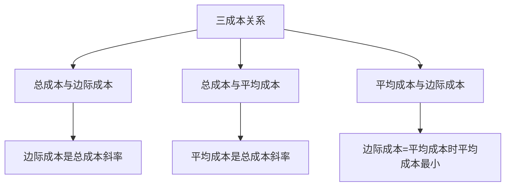
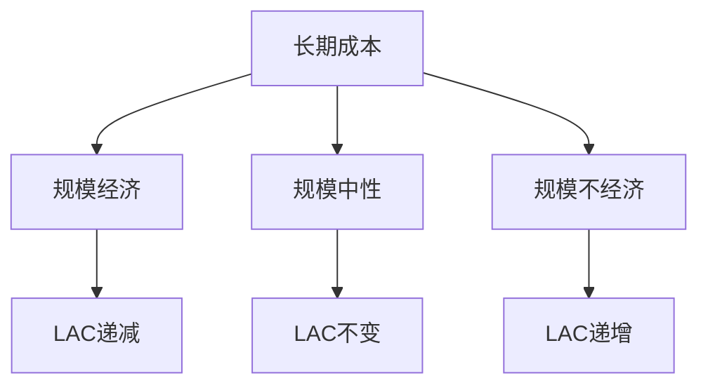

# 成本理论

## 核心概念

### 成本定义
**成本**：生产一定数量产品所耗费的生产要素价值。

> **费曼技巧**：成本 = 生产要素价值 = 机会成本

### 成本分类

| 分类标准 | 成本类型 | 含义 | 例子 |
|----------|----------|------|------|
| **时间** | 短期成本 | 部分要素固定 | 厂房租金 |
| **时间** | 长期成本 | 所有要素可变 | 所有成本 |
| **性质** | 显性成本 | 直接支付 | 工资、原材料 |
| **性质** | 隐性成本 | 机会成本 | 自有资金利息 |
| **变化** | 固定成本 | 不随产量变化 | 厂房租金 |
| **变化** | 可变成本 | 随产量变化 | 原材料 |

## 短期成本分析

### 1. 总成本（TC）

#### 定义
**总成本**：生产一定数量产品的总费用。

```
TC = FC + VC
```

其中：
- **FC**：固定成本
- **VC**：可变成本

#### 总成本曲线特征


#### 总成本组成

| 成本类型 | 特征 | 曲线形状 |
|----------|------|----------|
| **固定成本** | 不随产量变化 | 水平线 |
| **可变成本** | 随产量变化 | 先缓后陡 |
| **总成本** | 固定成本+可变成本 | 先缓后陡 |

### 2. 平均成本（AC）

#### 定义
**平均成本**：每单位产品的平均成本。

```
AC = TC/Q = FC/Q + VC/Q = AFC + AVC
```

其中：
- **AFC**：平均固定成本
- **AVC**：平均可变成本

#### 平均成本曲线特征
- **先减后增**：平均成本先减后增
- **最小值**：平均成本最小值
- **与边际成本关系**：边际成本 = 平均成本时，平均成本最小

### 3. 边际成本（MC）

#### 定义
**边际成本**：增加一单位产品所增加的成本。

```
MC = ΔTC/ΔQ = dTC/dQ
```

#### 边际成本曲线特征
- **先减后增**：边际成本先减后增
- **最小值**：边际成本最小值
- **与总成本关系**：边际成本是总成本斜率

### 4. 三成本关系

#### 关系分析



#### 关系总结

| 关系 | 含义 | 表现 |
|------|------|------|
| **TC与MC** | 边际成本是总成本斜率 | MC > 0时TC递增 |
| **TC与AC** | 平均成本是总成本斜率 | AC = TC/Q |
| **AC与MC** | 边际成本=平均成本时平均成本最小 | MC = AC时AC最小 |

## 长期成本分析

### 1. 长期总成本（LTC）

#### 定义
**长期总成本**：在长期中，生产一定数量产品的最小成本。

```
LTC = min(TC)
```

#### 长期总成本曲线特征
- **向上倾斜**：产量增加，成本增加
- **先缓后陡**：先规模经济，后规模不经济
- **包络线**：短期总成本曲线的包络线

### 2. 长期平均成本（LAC）

#### 定义
**长期平均成本**：每单位产品的长期平均成本。

```
LAC = LTC/Q
```

#### 长期平均成本曲线特征
- **U形曲线**：先减后增
- **最小值**：长期平均成本最小值
- **规模经济**：LAC递减阶段
- **规模不经济**：LAC递增阶段

### 3. 长期边际成本（LMC）

#### 定义
**长期边际成本**：增加一单位产品的长期边际成本。

```
LMC = dLTC/dQ
```

#### 长期边际成本曲线特征
- **U形曲线**：先减后增
- **最小值**：长期边际成本最小值
- **与LAC关系**：LMC = LAC时，LAC最小

### 4. 长期成本关系

#### 关系分析



#### 规模经济分析

| 阶段 | 特征 | 原因 | 表现 |
|------|------|------|------|
| **规模经济** | LAC递减 | 专业化、分工 | 大规模生产 |
| **规模中性** | LAC不变 | 规模效应消失 | 完全竞争 |
| **规模不经济** | LAC递增 | 管理困难 | 规模过大 |

## 成本函数类型

### 1. 线性成本函数

#### 数学表达
```
TC = a + bQ
```

其中：
- **a**：固定成本
- **b**：边际成本

#### 特征
- **固定成本**：a
- **边际成本**：b（常数）
- **平均成本**：a/Q + b

### 2. 二次成本函数

#### 数学表达
```
TC = a + bQ + cQ²
```

其中：
- **a**：固定成本
- **b**：线性系数
- **c**：二次系数

#### 特征
- **固定成本**：a
- **边际成本**：b + 2cQ
- **平均成本**：a/Q + b + cQ

### 3. 三次成本函数

#### 数学表达
```
TC = a + bQ + cQ² + dQ³
```

其中：
- **a**：固定成本
- **b, c, d**：系数

#### 特征
- **固定成本**：a
- **边际成本**：b + 2cQ + 3dQ²
- **平均成本**：a/Q + b + cQ + dQ²

## 成本分析应用

### 1. 生产者决策

#### 生产决策
- **产量选择**：选择最优产量
- **成本控制**：控制生产成本
- **效率提升**：提高生产效率

#### 生产策略
- **规模策略**：确定最优规模
- **技术策略**：选择最优技术
- **成本策略**：优化成本结构

### 2. 企业分析

#### 成本分析
- **成本结构**：分析成本构成
- **成本控制**：控制成本水平
- **成本优化**：优化成本结构

#### 效率分析
- **技术效率**：技术前沿效率
- **配置效率**：要素配置效率
- **规模效率**：规模经济效率

### 3. 政策分析

#### 成本政策
- **成本控制**：控制成本水平
- **成本补贴**：提供成本补贴
- **成本监管**：监管成本水平

#### 效率政策
- **效率提升**：提高生产效率
- **成本降低**：降低生产成本
- **质量提升**：提高产品质量

## 成本与生产

### 1. 成本与生产函数

#### 关系
- **生产函数**：技术关系
- **成本函数**：经济关系
- **转换**：通过要素价格转换

#### 转换过程


### 2. 成本与利润

#### 关系
- **成本**：生产费用
- **收益**：销售收入
- **利润**：收益 - 成本

#### 利润分析
```
π = TR - TC = PQ - TC
```

其中：
- **π**：利润
- **TR**：总收益
- **TC**：总成本
- **P**：价格
- **Q**：产量

### 3. 成本与市场

#### 关系
- **成本**：供给基础
- **价格**：市场决定
- **利润**：价格 - 成本

#### 市场分析
- **完全竞争**：价格接受者
- **垄断**：价格制定者
- **寡头**：价格博弈

## 理论局限

### 1. 假设局限

#### 完全信息假设
- **假设**：生产者拥有完全信息
- **现实**：信息不对称普遍存在
- **影响**：成本可能不准确

#### 技术不变假设
- **假设**：技术不变
- **现实**：技术不断进步
- **影响**：成本函数可能过时

### 2. 测量局限

#### 成本测量
- **问题**：成本难以精确测量
- **解决**：使用会计成本
- **局限**：可能不准确

#### 机会成本
- **问题**：机会成本难以测量
- **解决**：使用市场价格
- **局限**：可能不准确

### 3. 应用局限

#### 复杂生产
- **问题**：生产可能复杂
- **解决**：简化假设
- **局限**：可能偏离现实

#### 动态生产
- **问题**：生产可能动态
- **解决**：静态分析
- **局限**：可能不适用动态情况

## 刻意练习

### 概念理解
- [ ] 理解成本的定义和分类
- [ ] 掌握短期和长期成本分析
- [ ] 理解成本与生产的关系

### 计算应用
- [ ] 计算总成本、平均成本、边际成本
- [ ] 分析成本曲线特征
- [ ] 计算最优产量

### 实际应用
- [ ] 分析生产者决策
- [ ] 设计企业策略
- [ ] 评估政策效果

---

**相关链接**：
- [[01-生产函数]] - 生产函数分析
- [[03-利润最大化]] - 利润分析
- [[04-企业理论]] - 企业理论
