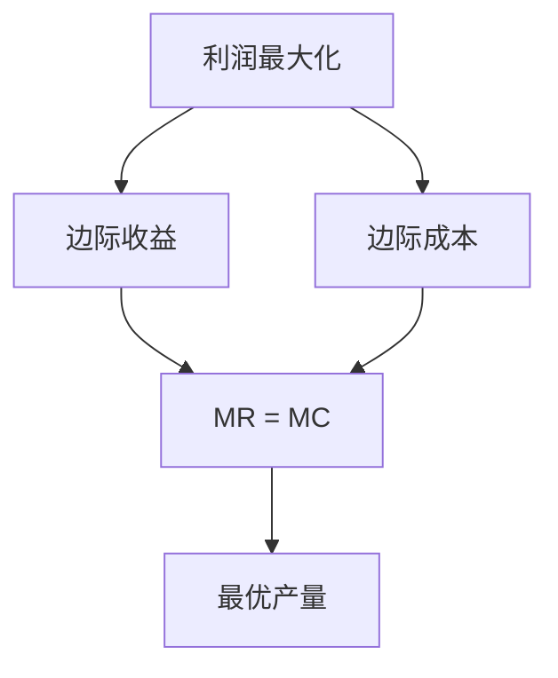
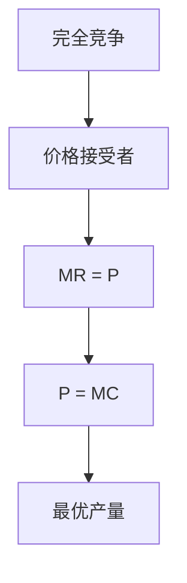
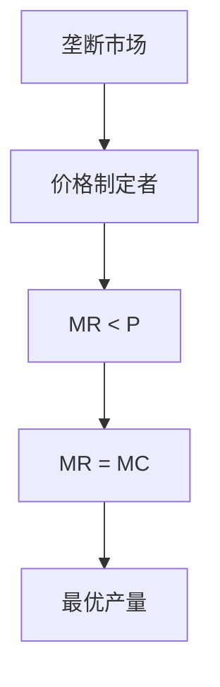
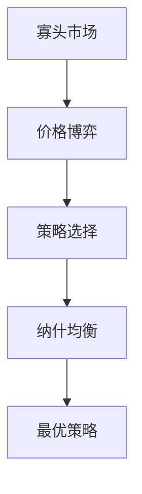

# 利润最大化

## 核心概念

### 利润定义
**利润**：总收益与总成本的差额。

> **费曼技巧**：利润 = 收益 - 成本 = 收入 - 支出

### 利润函数
```
π = TR - TC = PQ - TC
```

其中：
- **π**：利润
- **TR**：总收益
- **TC**：总成本
- **P**：价格
- **Q**：产量

## 利润最大化条件

### 1. 数学条件

#### 一阶条件
```
dπ/dQ = dTR/dQ - dTC/dQ = MR - MC = 0
```

即：
```
MR = MC
```

其中：
- **MR**：边际收益
- **MC**：边际成本

#### 二阶条件
```
d²π/dQ² = dMR/dQ - dMC/dQ < 0
```

即：
```
dMR/dQ < dMC/dQ
```

### 2. 经济条件

#### 边际分析
- **边际收益**：增加一单位产量所增加的收益
- **边际成本**：增加一单位产量所增加的成本
- **利润最大化**：边际收益 = 边际成本

#### 利润最大化分析



### 3. 几何条件

#### 图形分析
- **总收益曲线**：TR = PQ
- **总成本曲线**：TC = f(Q)
- **利润曲线**：π = TR - TC
- **最优产量**：利润曲线最高点

#### 边际分析图形
- **边际收益曲线**：MR = dTR/dQ
- **边际成本曲线**：MC = dTC/dQ
- **最优产量**：MR = MC的交点

## 不同市场结构下的利润最大化

### 1. 完全竞争市场

#### 市场特征
- **价格接受者**：企业无法影响价格
- **边际收益**：MR = P（常数）
- **需求曲线**：水平线

#### 利润最大化条件
```
P = MC
```

#### 利润分析



#### 利润类型

| 利润类型 | 条件 | 表现 |
|----------|------|------|
| **经济利润** | P > AC | 超额利润 |
| **正常利润** | P = AC | 零经济利润 |
| **亏损** | P < AC | 负经济利润 |

### 2. 垄断市场

#### 市场特征
- **价格制定者**：企业可以影响价格
- **边际收益**：MR < P
- **需求曲线**：向下倾斜

#### 利润最大化条件
```
MR = MC
```

#### 利润分析



#### 垄断利润
- **垄断利润**：P > MC
- **价格歧视**：不同价格
- **效率损失**：无谓损失

### 3. 寡头市场

#### 市场特征
- **价格博弈**：企业间价格博弈
- **边际收益**：不确定
- **需求曲线**：不确定

#### 利润最大化条件
```
MR = MC
```

#### 利润分析



#### 寡头利润
- **寡头利润**：P > MC
- **策略选择**：价格策略、产量策略
- **均衡分析**：纳什均衡

## 利润最大化应用

### 1. 生产者决策

#### 产量决策
- **最优产量**：MR = MC时的产量
- **价格决策**：根据需求曲线定价
- **成本控制**：控制生产成本

#### 生产策略
- **规模策略**：确定最优规模
- **技术策略**：选择最优技术
- **市场策略**：选择目标市场

### 2. 企业分析

#### 利润分析
- **利润结构**：分析利润构成
- **利润趋势**：分析利润变化趋势
- **利润预测**：预测未来利润

#### 效率分析
- **技术效率**：技术前沿效率
- **配置效率**：要素配置效率
- **规模效率**：规模经济效率

### 3. 政策分析

#### 利润政策
- **利润控制**：控制利润水平
- **利润分配**：分配利润
- **利润监管**：监管利润水平

#### 效率政策
- **效率提升**：提高生产效率
- **成本降低**：降低生产成本
- **质量提升**：提高产品质量

## 利润最大化扩展

### 1. 多产品利润最大化

#### 多产品生产
- **产品组合**：多种产品组合
- **资源分配**：资源在不同产品间分配
- **利润最大化**：总利润最大化

#### 数学表达
```
π = Σ(PiQi - TCi)
```

其中：
- **Pi**：第i种产品价格
- **Qi**：第i种产品产量
- **TCi**：第i种产品总成本

### 2. 多期利润最大化

#### 跨期决策
- **现期利润**：当期利润
- **未来利润**：未来利润
- **总利润**：现期利润 + 未来利润现值

#### 数学表达
```
π = π1 + π2/(1+r) + ... + πn/(1+r)^(n-1)
```

其中：
- **πi**：第i期利润
- **r**：贴现率

### 3. 风险下的利润最大化

#### 不确定性
- **风险偏好**：风险厌恶、风险中性、风险偏好
- **期望利润**：期望利润最大化
- **风险调整**：风险调整后的利润

#### 数学表达
```
E[π] = E[TR] - E[TC]
```

其中：
- **E[π]**：期望利润
- **E[TR]**：期望总收益
- **E[TC]**：期望总成本

## 利润最大化局限

### 1. 假设局限

#### 完全信息假设
- **假设**：生产者拥有完全信息
- **现实**：信息不对称普遍存在
- **影响**：利润可能非最优

#### 理性假设
- **假设**：生产者完全理性
- **现实**：非理性行为普遍存在
- **影响**：决策可能非理性

### 2. 测量局限

#### 收益测量
- **问题**：收益难以精确测量
- **解决**：使用市场价格
- **局限**：可能不准确

#### 成本测量
- **问题**：成本难以精确测量
- **解决**：使用会计成本
- **局限**：可能不准确

### 3. 应用局限

#### 复杂生产
- **问题**：生产可能复杂
- **解决**：简化假设
- **局限**：可能偏离现实

#### 动态生产
- **问题**：生产可能动态
- **解决**：静态分析
- **局限**：可能不适用动态情况

## 刻意练习

### 概念理解
- [ ] 理解利润最大化的定义和条件
- [ ] 掌握不同市场结构下的利润最大化
- [ ] 理解利润最大化的应用

### 计算应用
- [ ] 计算最优产量
- [ ] 分析利润最大化条件
- [ ] 计算最大利润

### 实际应用
- [ ] 分析生产者决策
- [ ] 设计企业策略
- [ ] 评估政策效果

---

**相关链接**：
- [[01-生产函数]] - 生产函数分析
- [[02-成本理论]] - 成本分析
- [[04-企业理论]] - 企业理论
