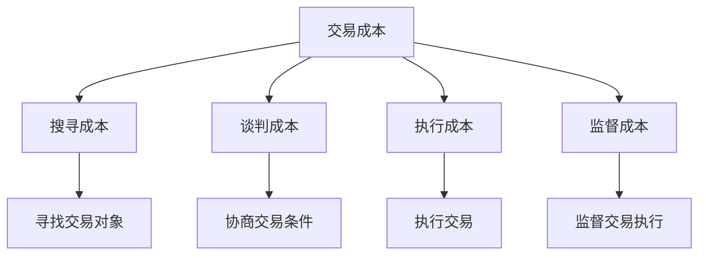
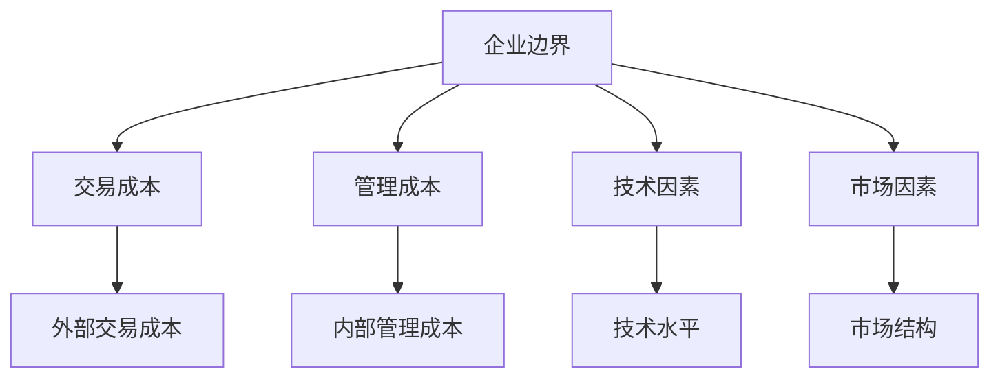
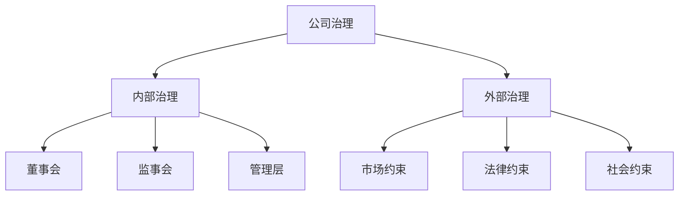

# 企业理论

## 核心概念

### 企业定义
**企业**：以盈利为目的，从事生产、经营活动的经济组织。

> **费曼技巧**：企业 = 生产组织 + 盈利目的 + 经济活动

### 企业特征

| 特征 | 含义 | 例子 |
|------|------|------|
| **法人资格** | 独立的法律主体 | 公司 |
| **盈利目的** | 追求利润最大化 | 商业企业 |
| **生产活动** | 从事生产、经营 | 制造企业 |
| **资源整合** | 整合各种资源 | 生产要素 |

## 企业存在理论

### 1. 交易成本理论

#### 科斯理论
**核心观点**：企业存在是为了降低交易成本。

#### 交易成本类型



#### 企业优势
- **降低搜寻成本**：内部协调
- **降低谈判成本**：权威关系
- **降低执行成本**：内部管理
- **降低监督成本**：内部监督

### 2. 团队生产理论

#### 阿尔钦-德姆塞茨理论
**核心观点**：企业是团队生产的组织形式。

#### 团队生产特征
- **联合生产**：多人合作生产
- **不可分离**：产出不可分离
- **监督困难**：监督成本高
- **激励问题**：激励相容问题

#### 企业优势
- **专业化分工**：提高效率
- **规模经济**：降低成本
- **风险分担**：分散风险
- **知识积累**：积累经验

### 3. 资产专用性理论

#### 威廉姆森理论
**核心观点**：企业存在是为了保护专用性资产。

#### 资产专用性类型

| 类型 | 含义 | 例子 |
|------|------|------|
| **物理专用性** | 物理资产专用 | 专用设备 |
| **人力专用性** | 人力资产专用 | 专业技能 |
| **地点专用性** | 地点资产专用 | 地理位置 |
| **时间专用性** | 时间资产专用 | 时间安排 |

#### 企业优势
- **保护投资**：保护专用性投资
- **降低风险**：降低投资风险
- **提高效率**：提高投资效率
- **促进创新**：促进技术创新

## 企业边界理论

### 1. 企业边界决定

#### 边界决定因素



#### 边界决定条件
```
外部交易成本 = 内部管理成本
```

### 2. 企业边界变化

#### 边界扩张
- **纵向一体化**：上下游整合
- **横向一体化**：同行业整合
- **多元化经营**：跨行业经营

#### 边界收缩
- **外包**：外部采购
- **剥离**：出售业务
- **分拆**：业务分离

### 3. 企业边界优化

#### 优化原则
- **成本最小化**：总成本最小
- **效率最大化**：效率最高
- **风险最小化**：风险最小

#### 优化方法
- **成本分析**：分析各种成本
- **效率分析**：分析各种效率
- **风险分析**：分析各种风险

## 企业治理理论

### 1. 委托代理理论

#### 委托代理关系
- **委托人**：企业所有者
- **代理人**：企业管理者
- **代理问题**：利益不一致

#### 代理问题类型

| 问题类型 | 含义 | 表现 |
|----------|------|------|
| **道德风险** | 行为改变风险 | 偷懒、过度消费 |
| **逆向选择** | 信息不对称 | 能力不足 |
| **利益冲突** | 利益不一致 | 追求个人利益 |

#### 治理机制
- **激励机制**：薪酬激励
- **监督机制**：内部监督
- **约束机制**：外部约束

### 2. 公司治理

#### 治理结构
- **股东大会**：最高权力机构
- **董事会**：决策机构
- **监事会**：监督机构
- **管理层**：执行机构

#### 治理机制



#### 治理效果
- **提高效率**：提高经营效率
- **降低风险**：降低经营风险
- **保护利益**：保护股东利益

### 3. 企业社会责任

#### 社会责任内容
- **经济责任**：盈利责任
- **法律责任**：守法责任
- **道德责任**：道德责任
- **慈善责任**：慈善责任

#### 社会责任实现
- **内部实现**：内部管理
- **外部实现**：外部监督
- **社会实现**：社会参与

## 企业类型

### 1. 按所有制分类

#### 国有企业
- **特征**：国家所有
- **优势**：资源充足
- **劣势**：效率较低

#### 民营企业
- **特征**：私人所有
- **优势**：效率较高
- **劣势**：资源有限

#### 外资企业
- **特征**：外资所有
- **优势**：技术先进
- **劣势**：文化差异

### 2. 按规模分类

#### 大型企业
- **特征**：规模大
- **优势**：规模经济
- **劣势**：管理复杂

#### 中型企业
- **特征**：规模中等
- **优势**：灵活性
- **劣势**：资源有限

#### 小型企业
- **特征**：规模小
- **优势**：灵活性
- **劣势**：资源有限

### 3. 按行业分类

#### 制造业
- **特征**：生产制造
- **优势**：技术积累
- **劣势**：投资大

#### 服务业
- **特征**：提供服务
- **优势**：投资小
- **劣势**：标准化难

#### 高科技
- **特征**：技术密集
- **优势**：技术先进
- **劣势**：风险高

## 企业发展理论

### 1. 生命周期理论

#### 生命周期阶段


#### 各阶段特征

| 阶段 | 特征 | 策略 |
|------|------|------|
| **创业期** | 高风险、高回报 | 创新、冒险 |
| **成长期** | 快速发展 | 扩张、投资 |
| **成熟期** | 稳定发展 | 效率、质量 |
| **衰退期** | 下降趋势 | 转型、退出 |

### 2. 竞争优势理论

#### 竞争优势来源
- **成本优势**：低成本
- **差异化优势**：产品差异化
- **集中优势**：市场集中

#### 竞争优势保持
- **持续创新**：技术创新
- **资源积累**：资源积累
- **能力建设**：能力建设

### 3. 企业成长理论

#### 成长驱动因素
- **市场需求**：市场需求增长
- **技术进步**：技术进步
- **资源积累**：资源积累
- **能力提升**：能力提升

#### 成长路径
- **内生成长**：内部发展
- **外生成长**：外部并购
- **混合成长**：内外结合

## 企业理论应用

### 1. 企业决策

#### 战略决策
- **企业定位**：确定企业定位
- **竞争策略**：制定竞争策略
- **发展路径**：选择发展路径

#### 经营决策
- **生产决策**：生产决策
- **营销决策**：营销决策
- **财务决策**：财务决策

### 2. 政策制定

#### 企业政策
- **企业扶持**：扶持企业发展
- **企业监管**：监管企业行为
- **企业改革**：推进企业改革

#### 产业政策
- **产业规划**：制定产业规划
- **产业扶持**：扶持产业发展
- **产业升级**：推进产业升级

### 3. 理论研究

#### 理论发展
- **理论创新**：理论创新
- **理论验证**：理论验证
- **理论应用**：理论应用

#### 实证研究
- **实证分析**：实证分析
- **案例研究**：案例研究
- **比较研究**：比较研究

## 理论局限

### 1. 假设局限

#### 完全信息假设
- **假设**：信息完全
- **现实**：信息不对称
- **影响**：理论可能不适用

#### 理性假设
- **假设**：完全理性
- **现实**：有限理性
- **影响**：决策可能非最优

### 2. 测量局限

#### 成本测量
- **问题**：成本难以测量
- **解决**：使用代理变量
- **局限**：可能不准确

#### 效率测量
- **问题**：效率难以测量
- **解决**：使用代理变量
- **局限**：可能不准确

### 3. 应用局限

#### 复杂企业
- **问题**：企业可能复杂
- **解决**：简化假设
- **局限**：可能偏离现实

#### 动态企业
- **问题**：企业可能动态
- **解决**：静态分析
- **局限**：可能不适用动态情况

## 刻意练习

### 概念理解
- [ ] 理解企业的定义和特征
- [ ] 掌握企业存在理论
- [ ] 理解企业边界理论

### 理论应用
- [ ] 分析企业治理问题
- [ ] 设计企业战略
- [ ] 评估企业政策

### 实际应用
- [ ] 分析企业发展
- [ ] 设计企业改革
- [ ] 评估企业绩效

---

**相关链接**：
- [[01-生产函数]] - 生产函数分析
- [[02-成本理论]] - 成本分析
- [[03-利润最大化]] - 利润分析
