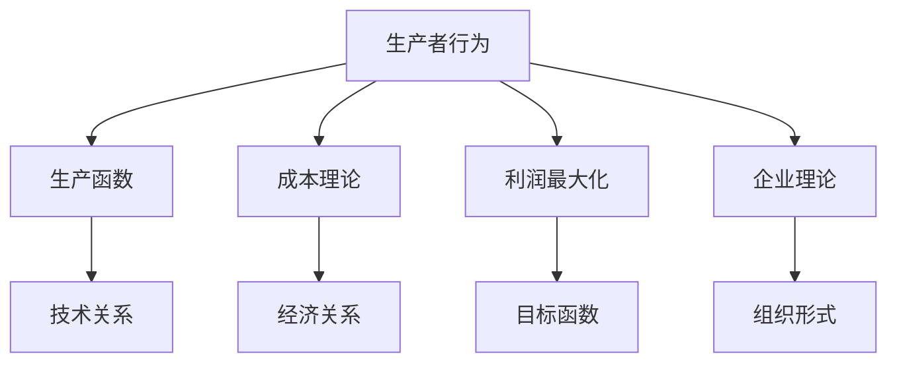
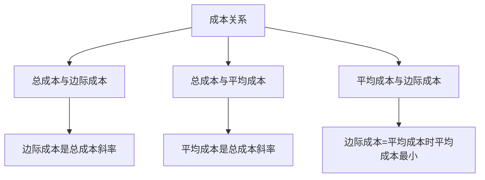
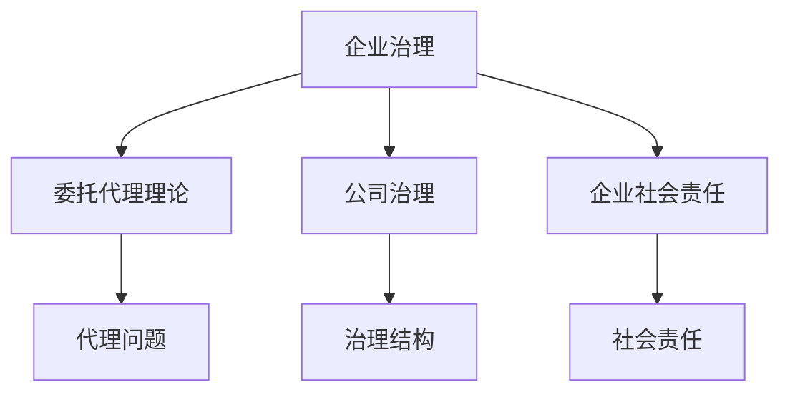
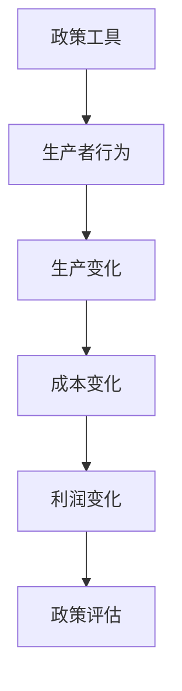

# 生产者行为总结

## 核心框架

### 生产者行为理论体系

## 理论体系

### 1. 生产函数

#### 核心概念
- **生产函数定义**：描述生产要素投入与产出之间关系的函数
- **生产函数类型**：短期生产函数、长期生产函数
- **生产函数特征**：总产量、平均产量、边际产量

#### 关键规律

| 规律 | 含义 | 表现 |
|------|------|------|
| **边际产量递减** | 边际产量先增后减 | 短期生产特征 |
| **规模报酬** | 所有要素同比例变化 | 长期生产特征 |
| **要素替代** | 要素间可以替代 | 等产量曲线 |

#### 生产函数类型

| 类型 | 特征 | 例子 |
|------|------|------|
| **柯布-道格拉斯** | 弹性替代 | 制造业 |
| **固定比例** | 完全互补 | 机器操作 |
| **线性** | 完全替代 | 简单生产 |

### 2. 成本理论

#### 核心概念
- **成本定义**：生产一定数量产品所耗费的生产要素价值
- **成本分类**：短期成本、长期成本、显性成本、隐性成本
- **成本特征**：总成本、平均成本、边际成本

#### 成本关系

#### 成本函数类型

| 类型 | 特征 | 应用 |
|------|------|------|
| **线性** | 边际成本常数 | 简单生产 |
| **二次** | 边际成本递增 | 一般生产 |
| **三次** | 边际成本先减后增 | 复杂生产 |

### 3. 利润最大化

#### 核心概念
- **利润定义**：总收益与总成本的差额
- **利润最大化条件**：边际收益 = 边际成本
- **利润最大化方法**：数学方法、几何方法

#### 不同市场结构

| 市场结构 | 特征 | 利润最大化条件 |
|----------|------|----------------|
| **完全竞争** | 价格接受者 | P = MC |
| **垄断** | 价格制定者 | MR = MC |
| **寡头** | 价格博弈 | MR = MC |

#### 利润类型

| 利润类型 | 条件 | 表现 |
|----------|------|------|
| **经济利润** | P > AC | 超额利润 |
| **正常利润** | P = AC | 零经济利润 |
| **亏损** | P < AC | 负经济利润 |

### 4. 企业理论

#### 核心概念
- **企业定义**：以盈利为目的的经济组织
- **企业存在理论**：交易成本理论、团队生产理论、资产专用性理论
- **企业边界理论**：边界决定、边界变化、边界优化

#### 企业治理

#### 企业类型

| 分类标准 | 类型 | 特征 |
|----------|------|------|
| **所有制** | 国有企业 | 国家所有 |
| **所有制** | 民营企业 | 私人所有 |
| **规模** | 大型企业 | 规模大 |
| **规模** | 小型企业 | 规模小 |

## 分析方法

### 1. 静态分析

#### 比较静态分析
- **生产变化**：分析生产函数变化对成本的影响
- **成本变化**：分析成本变化对利润的影响
- **价格变化**：分析价格变化对利润的影响

#### 静态均衡分析
- **生产均衡**：最优要素组合
- **成本均衡**：最优成本结构
- **利润均衡**：最优产量和价格

### 2. 动态分析

#### 时间序列分析
- **生产调整**：分析生产调整过程
- **成本调整**：分析成本调整过程
- **利润调整**：分析利润调整过程

#### 动态均衡分析
- **均衡路径**：分析均衡调整路径
- **均衡稳定性**：分析动态稳定性
- **均衡预测**：预测均衡变化趋势

### 3. 政策分析

#### 政策工具
- **生产政策**：生产补贴、生产限制
- **成本政策**：成本控制、成本补贴
- **利润政策**：利润控制、利润分配

#### 政策效果

## 实际应用

### 1. 生产者决策

#### 生产决策
- **要素选择**：选择最优要素组合
- **产量选择**：选择最优产量
- **技术选择**：选择最优技术

#### 生产策略
- **规模策略**：确定最优规模
- **技术策略**：选择最优技术
- **成本策略**：优化成本结构

### 2. 企业分析

#### 生产分析
- **生产效率**：分析生产效率
- **成本分析**：分析成本结构
- **利润分析**：分析利润水平

#### 企业策略
- **生产策略**：制定生产策略
- **成本策略**：制定成本策略
- **利润策略**：制定利润策略

### 3. 政策制定

#### 生产政策
- **生产扶持**：扶持生产发展
- **生产监管**：监管生产行为
- **生产改革**：推进生产改革

#### 产业政策
- **产业规划**：制定产业规划
- **产业扶持**：扶持产业发展
- **产业升级**：推进产业升级

## 理论扩展

### 1. 多产品生产

#### 多产品生产
- **产品组合**：多种产品组合
- **资源分配**：资源在不同产品间分配
- **利润最大化**：总利润最大化

#### 多产品分析
- **产品间关系**：替代关系、互补关系
- **资源约束**：资源约束条件
- **利润优化**：利润优化方法

### 2. 多期生产

#### 跨期决策
- **现期生产**：当期生产决策
- **未来生产**：未来生产决策
- **总利润**：现期利润 + 未来利润现值

#### 跨期分析
- **时间偏好**：现期偏好、未来偏好
- **投资决策**：投资决策分析
- **利润优化**：跨期利润优化

### 3. 不确定性生产

#### 风险生产
- **风险偏好**：风险厌恶、风险中性、风险偏好
- **期望利润**：期望利润最大化
- **风险调整**：风险调整后的利润

#### 风险分析
- **风险识别**：识别生产风险
- **风险评估**：评估风险水平
- **风险管理**：管理生产风险

## 理论局限

### 1. 假设局限

#### 完全信息假设
- **假设**：生产者拥有完全信息
- **现实**：信息不对称普遍存在
- **影响**：决策可能非最优

#### 技术不变假设
- **假设**：技术不变
- **现实**：技术不断进步
- **影响**：生产函数可能过时

### 2. 测量局限

#### 产出测量
- **问题**：产出难以精确测量
- **解决**：使用代理变量
- **局限**：可能不准确

#### 成本测量
- **问题**：成本难以精确测量
- **解决**：使用会计成本
- **局限**：可能不准确

### 3. 应用局限

#### 复杂生产
- **问题**：生产可能复杂
- **解决**：简化假设
- **局限**：可能偏离现实

#### 动态生产
- **问题**：生产可能动态
- **解决**：静态分析
- **局限**：可能不适用动态情况

## 学习要点

### 1. 概念掌握
- [ ] 理解生产函数、成本理论、利润最大化的概念
- [ ] 掌握企业理论的核心内容
- [ ] 理解生产者行为的分析方法

### 2. 方法应用
- [ ] 运用生产者行为理论分析实际问题
- [ ] 计算最优产量和利润
- [ ] 分析政策对生产者行为的影响

### 3. 批判思维
- [ ] 质疑生产者行为理论假设
- [ ] 分析理论的适用条件
- [ ] 评估理论的局限性

---

**相关链接**：
- [[01-市场机制]] - 市场机制分析
- [[02-消费者行为]] - 消费者行为分析
- [[04-市场结构]] - 不同市场结构
