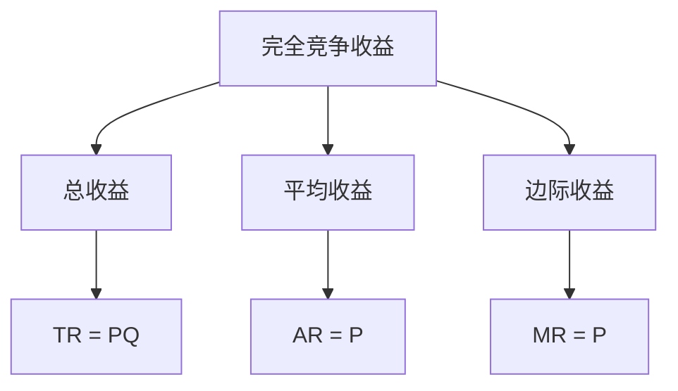
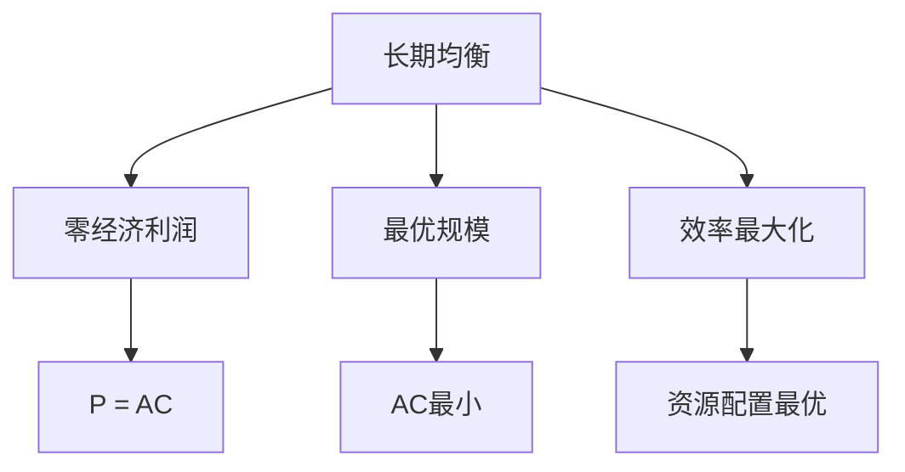
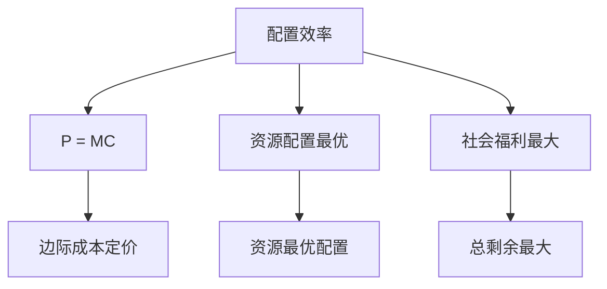

# 完全竞争市场

## 核心概念

### 完全竞争市场定义
**完全竞争市场**：具有以下特征的市场结构：
1. 大量买者和卖者
2. 产品同质
3. 完全信息
4. 自由进出
5. 价格接受者

> **费曼技巧**：完全竞争 = 大量参与者 + 同质产品 + 完全信息 + 自由进出

### 市场特征

| 特征 | 含义 | 影响 |
|------|------|------|
| **大量参与者** | 买者和卖者数量众多 | 单个参与者无法影响价格 |
| **产品同质** | 产品完全相同 | 无产品差异化 |
| **完全信息** | 信息完全对称 | 无信息优势 |
| **自由进出** | 无进入退出壁垒 | 长期利润为零 |
| **价格接受者** | 无法影响价格 | 需求曲线水平 |

## 企业行为分析

### 1. 需求曲线

#### 企业需求曲线
- **特征**：水平线
- **原因**：价格接受者
- **含义**：企业可以按市场价格销售任意数量

#### 市场需求曲线
- **特征**：向下倾斜
- **原因**：市场需求规律
- **含义**：市场价格由市场供需决定

### 2. 收益分析

#### 收益函数
```
TR = PQ
AR = TR/Q = P
MR = dTR/dQ = P
```

其中：
- **TR**：总收益
- **AR**：平均收益
- **MR**：边际收益
- **P**：价格

#### 收益特征



### 3. 利润最大化

#### 利润最大化条件
```
MR = MC = P
```

#### 利润分析

| 利润类型 | 条件 | 表现 |
|----------|------|------|
| **经济利润** | P > AC | 超额利润 |
| **正常利润** | P = AC | 零经济利润 |
| **亏损** | P < AC | 负经济利润 |

#### 利润最大化图形


## 市场均衡分析

### 1. 短期均衡

#### 短期均衡条件
- **市场均衡**：市场供需相等
- **企业均衡**：MR = MC
- **均衡价格**：市场决定
- **均衡数量**：企业决定

#### 短期均衡类型

| 均衡类型 | 条件 | 表现 |
|----------|------|------|
| **经济利润** | P > AC | 超额利润 |
| **正常利润** | P = AC | 零经济利润 |
| **亏损** | P < AC | 负经济利润 |

### 2. 长期均衡

#### 长期均衡条件
- **市场均衡**：市场供需相等
- **企业均衡**：MR = MC = AC
- **零经济利润**：P = AC
- **最优规模**：AC最小

#### 长期均衡特征



### 3. 均衡调整

#### 短期调整
- **价格调整**：市场供需变化
- **产量调整**：企业产量变化
- **利润调整**：企业利润变化

#### 长期调整
- **进入退出**：企业进入退出
- **规模调整**：企业规模调整
- **技术调整**：企业技术调整

## 效率分析

### 1. 配置效率

#### 配置效率条件
- **边际成本** = **边际收益**
- **价格** = **边际成本**
- **资源配置最优**

#### 配置效率分析



### 2. 生产效率

#### 生产效率条件
- **平均成本最小**
- **技术效率最高**
- **规模最优**

#### 生产效率分析
- **技术效率**：技术前沿效率
- **规模效率**：规模经济效率
- **配置效率**：要素配置效率

### 3. 动态效率

#### 动态效率条件
- **技术进步**：促进技术进步
- **创新激励**：激励创新
- **长期增长**：促进长期增长

#### 动态效率分析
- **创新激励**：竞争激励创新
- **技术进步**：技术进步
- **长期增长**：长期经济增长

## 市场失灵

### 1. 外部性

#### 外部性类型
- **正外部性**：社会收益大于私人收益
- **负外部性**：社会成本大于私人成本

#### 外部性影响
- **市场失灵**：市场无法有效配置资源
- **效率损失**：资源配置非最优
- **政策干预**：需要政府干预

### 2. 公共品

#### 公共品特征
- **非排他性**：无法排除他人使用
- **非竞争性**：使用不影响他人

#### 公共品问题
- **市场失灵**：市场无法提供
- **搭便车**：免费搭车问题
- **政府提供**：需要政府提供

### 3. 信息不对称

#### 信息不对称类型
- **逆向选择**：信息劣势方受损
- **道德风险**：行为改变风险

#### 信息不对称影响
- **市场失灵**：市场效率降低
- **交易成本**：交易成本增加
- **市场萎缩**：市场可能萎缩

## 政策分析

### 1. 价格政策

#### 价格支持
- **目标价格**：设定目标价格
- **支持价格**：价格支持
- **效果分析**：分析政策效果

#### 价格管制
- **价格上限**：设定价格上限
- **价格下限**：设定价格下限
- **效果分析**：分析政策效果

### 2. 数量政策

#### 产量限制
- **产量配额**：设定产量配额
- **生产限制**：限制生产
- **效果分析**：分析政策效果

#### 产量补贴
- **产量补贴**：提供产量补贴
- **生产激励**：激励生产
- **效果分析**：分析政策效果

### 3. 质量政策

#### 质量标准
- **质量标准**：设定质量标准
- **质量监管**：监管质量
- **效果分析**：分析政策效果

#### 质量认证
- **质量认证**：质量认证
- **质量标识**：质量标识
- **效果分析**：分析政策效果

## 实际应用

### 1. 农业市场

#### 农业特征
- **产品同质**：农产品同质
- **大量生产者**：农民数量众多
- **完全信息**：价格信息透明

#### 农业政策
- **价格支持**：农产品价格支持
- **产量补贴**：农产品产量补贴
- **质量监管**：农产品质量监管

### 2. 金融市场

#### 金融市场特征
- **产品同质**：金融产品同质
- **大量参与者**：参与者众多
- **完全信息**：信息透明

#### 金融政策
- **利率管制**：利率管制
- **市场准入**：市场准入管制
- **风险监管**：风险监管

### 3. 劳动力市场

#### 劳动力市场特征
- **产品同质**：劳动力同质
- **大量参与者**：参与者众多
- **完全信息**：信息透明

#### 劳动力政策
- **最低工资**：最低工资制度
- **就业保障**：就业保障制度
- **技能培训**：技能培训制度

## 理论局限

### 1. 假设局限

#### 完全信息假设
- **假设**：信息完全对称
- **现实**：信息不对称普遍存在
- **影响**：市场可能失灵

#### 产品同质假设
- **假设**：产品完全相同
- **现实**：产品差异化普遍存在
- **影响**：市场可能非完全竞争

### 2. 现实局限

#### 进入壁垒
- **假设**：自由进出
- **现实**：进入壁垒普遍存在
- **影响**：市场可能非完全竞争

#### 规模经济
- **假设**：无规模经济
- **现实**：规模经济普遍存在
- **影响**：市场可能非完全竞争

### 3. 应用局限

#### 复杂市场
- **问题**：市场可能复杂
- **解决**：简化假设
- **局限**：可能偏离现实

#### 动态市场
- **问题**：市场可能动态
- **解决**：静态分析
- **局限**：可能不适用动态情况

## 刻意练习

### 概念理解
- [ ] 理解完全竞争市场的定义和特征
- [ ] 掌握企业行为分析方法
- [ ] 理解市场均衡和效率分析

### 计算应用
- [ ] 计算企业最优产量
- [ ] 分析市场均衡
- [ ] 计算效率损失

### 实际应用
- [ ] 分析完全竞争市场
- [ ] 设计市场政策
- [ ] 评估政策效果

---

**相关链接**：
- [[02-垄断市场]] - 垄断市场分析
- [[03-寡头垄断]] - 寡头垄断分析
- [[04-垄断竞争]] - 垄断竞争分析
