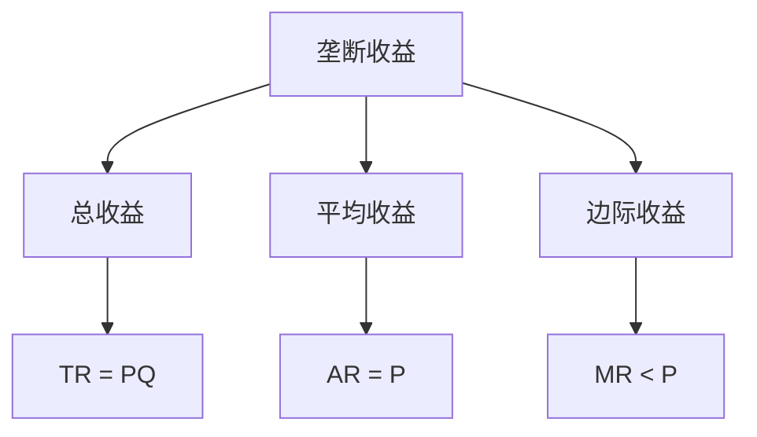
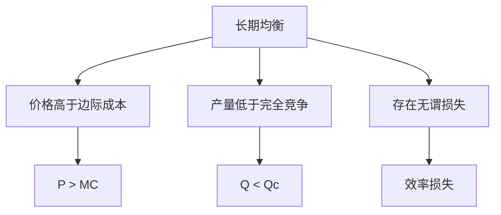
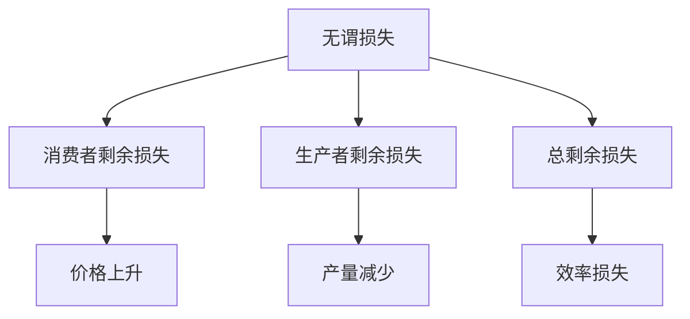

# 垄断市场

## 核心概念

### 垄断市场定义
**垄断市场**：只有一个卖者的市场结构。

> **费曼技巧**：垄断 = 单一卖者 + 价格制定者 + 无替代品

### 垄断特征

| 特征 | 含义 | 影响 |
|------|------|------|
| **单一卖者** | 只有一个生产者 | 完全控制供给 |
| **无替代品** | 产品无替代品 | 完全控制需求 |
| **进入壁垒** | 无法进入 | 长期垄断 |
| **价格制定者** | 可以制定价格 | 价格高于边际成本 |

### 垄断形成原因

#### 1. 自然垄断
- **规模经济**：大规模生产更经济
- **网络效应**：网络效应
- **资源垄断**：控制关键资源

#### 2. 技术垄断
- **专利保护**：专利技术保护
- **技术优势**：技术领先优势
- **创新垄断**：创新技术垄断

#### 3. 政府垄断
- **特许经营**：政府特许经营
- **行政垄断**：行政权力垄断
- **政策垄断**：政策保护垄断

## 企业行为分析

### 1. 需求曲线

#### 市场需求曲线
- **特征**：向下倾斜
- **原因**：市场需求规律
- **含义**：价格上升，需求减少

#### 企业需求曲线
- **特征**：向下倾斜
- **原因**：企业就是市场
- **含义**：企业需求曲线就是市场需求曲线

### 2. 收益分析

#### 收益函数
```
TR = PQ
AR = TR/Q = P
MR = dTR/dQ = P + Q(dP/dQ)
```

其中：
- **TR**：总收益
- **AR**：平均收益
- **MR**：边际收益
- **P**：价格

#### 收益特征



#### 边际收益与价格关系
```
MR = P(1 - 1/|Ed|)
```

其中：
- **Ed**：需求价格弹性

### 3. 利润最大化

#### 利润最大化条件
```
MR = MC
```

#### 利润分析

| 利润类型 | 条件 | 表现 |
|----------|------|------|
| **经济利润** | P > AC | 超额利润 |
| **正常利润** | P = AC | 零经济利润 |
| **亏损** | P < AC | 负经济利润 |

#### 利润最大化图形


## 市场均衡分析

### 1. 短期均衡

#### 短期均衡条件
- **市场均衡**：企业决定
- **企业均衡**：MR = MC
- **均衡价格**：企业制定
- **均衡数量**：企业决定

#### 短期均衡特征
- **价格高于边际成本**：P > MC
- **产量低于完全竞争**：Q < Qc
- **存在经济利润**：π > 0

### 2. 长期均衡

#### 长期均衡条件
- **市场均衡**：企业决定
- **企业均衡**：MR = MC
- **零经济利润**：P = AC
- **最优规模**：AC最小

#### 长期均衡特征



### 3. 均衡比较

#### 垄断与完全竞争比较

| 比较项目 | 完全竞争 | 垄断 |
|----------|----------|------|
| **价格** | P = MC | P > MC |
| **产量** | Qc | Qm < Qc |
| **利润** | 零经济利润 | 经济利润 |
| **效率** | 配置效率 | 配置无效率 |

## 效率分析

### 1. 配置效率

#### 配置效率条件
- **边际成本** = **边际收益**
- **价格** = **边际成本**
- **资源配置最优**

#### 垄断配置无效率
- **价格高于边际成本**：P > MC
- **产量低于最优**：Q < Qc
- **无谓损失**：效率损失

#### 无谓损失分析



### 2. 生产效率

#### 生产效率条件
- **平均成本最小**
- **技术效率最高**
- **规模最优**

#### 垄断生产效率
- **可能非最优规模**：规模可能非最优
- **技术效率**：技术效率可能非最优
- **创新激励**：创新激励可能不足

### 3. 动态效率

#### 动态效率条件
- **技术进步**：促进技术进步
- **创新激励**：激励创新
- **长期增长**：促进长期增长

#### 垄断动态效率
- **创新激励**：创新激励可能不足
- **技术进步**：技术进步可能缓慢
- **长期增长**：长期增长可能缓慢

## 价格歧视

### 1. 价格歧视定义

#### 价格歧视条件
- **市场分割**：市场可以分割
- **需求弹性不同**：不同市场需求弹性不同
- **无套利**：无法套利

#### 价格歧视类型

| 类型 | 特征 | 例子 |
|------|------|------|
| **一级价格歧视** | 完全价格歧视 | 拍卖 |
| **二级价格歧视** | 数量价格歧视 | 批量折扣 |
| **三级价格歧视** | 市场分割 | 学生票 |

### 2. 价格歧视分析

#### 一级价格歧视
- **完全价格歧视**：每个消费者不同价格
- **效率**：配置效率
- **利润**：最大利润

#### 二级价格歧视
- **数量价格歧视**：不同数量不同价格
- **效率**：部分效率
- **利润**：增加利润

#### 三级价格歧视
- **市场分割**：不同市场不同价格
- **效率**：部分效率
- **利润**：增加利润

### 3. 价格歧视效果

#### 效率效果
- **配置效率**：可能提高配置效率
- **生产效率**：可能提高生产效率
- **总效率**：可能提高总效率

#### 福利效果
- **消费者福利**：可能增加消费者福利
- **生产者福利**：增加生产者福利
- **总福利**：可能增加总福利

## 政策分析

### 1. 反垄断政策

#### 反垄断目标
- **促进竞争**：促进市场竞争
- **提高效率**：提高市场效率
- **保护消费者**：保护消费者利益

#### 反垄断工具
- **结构控制**：控制市场结构
- **行为控制**：控制企业行为
- **绩效控制**：控制市场绩效

### 2. 价格管制

#### 价格管制目标
- **控制价格**：控制垄断价格
- **保护消费者**：保护消费者利益
- **提高效率**：提高市场效率

#### 价格管制工具
- **价格上限**：设定价格上限
- **价格下限**：设定价格下限
- **价格指导**：价格指导

### 3. 质量管制

#### 质量管制目标
- **保证质量**：保证产品质量
- **保护消费者**：保护消费者利益
- **提高效率**：提高市场效率

#### 质量管制工具
- **质量标准**：设定质量标准
- **质量认证**：质量认证
- **质量监管**：质量监管

## 实际应用

### 1. 自然垄断

#### 自然垄断特征
- **规模经济**：大规模生产更经济
- **网络效应**：网络效应
- **资源垄断**：控制关键资源

#### 自然垄断政策
- **价格管制**：价格管制
- **质量管制**：质量管制
- **准入管制**：准入管制

### 2. 技术垄断

#### 技术垄断特征
- **专利保护**：专利技术保护
- **技术优势**：技术领先优势
- **创新垄断**：创新技术垄断

#### 技术垄断政策
- **专利制度**：专利制度
- **反垄断**：反垄断
- **技术转移**：技术转移

### 3. 政府垄断

#### 政府垄断特征
- **特许经营**：政府特许经营
- **行政垄断**：行政权力垄断
- **政策垄断**：政策保护垄断

#### 政府垄断政策
- **改革**：垄断改革
- **竞争**：引入竞争
- **监管**：加强监管

## 理论局限

### 1. 假设局限

#### 完全垄断假设
- **假设**：完全垄断
- **现实**：完全垄断罕见
- **影响**：理论可能不适用

#### 静态分析假设
- **假设**：静态分析
- **现实**：市场动态
- **影响**：可能不适用动态情况

### 2. 现实局限

#### 进入壁垒
- **假设**：完全进入壁垒
- **现实**：进入壁垒可能不完整
- **影响**：垄断可能不持久

#### 替代品
- **假设**：无替代品
- **现实**：替代品可能存在
- **影响**：垄断可能不完整

### 3. 应用局限

#### 复杂市场
- **问题**：市场可能复杂
- **解决**：简化假设
- **局限**：可能偏离现实

#### 动态市场
- **问题**：市场可能动态
- **解决**：静态分析
- **局限**：可能不适用动态情况

## 刻意练习

### 概念理解
- [ ] 理解垄断市场的定义和特征
- [ ] 掌握企业行为分析方法
- [ ] 理解市场均衡和效率分析

### 计算应用
- [ ] 计算企业最优产量和价格
- [ ] 分析市场均衡
- [ ] 计算无谓损失

### 实际应用
- [ ] 分析垄断市场
- [ ] 设计反垄断政策
- [ ] 评估政策效果

---

**相关链接**：
- [[01-完全竞争市场]] - 完全竞争市场分析
- [[03-寡头垄断]] - 寡头垄断分析
- [[04-垄断竞争]] - 垄断竞争分析
