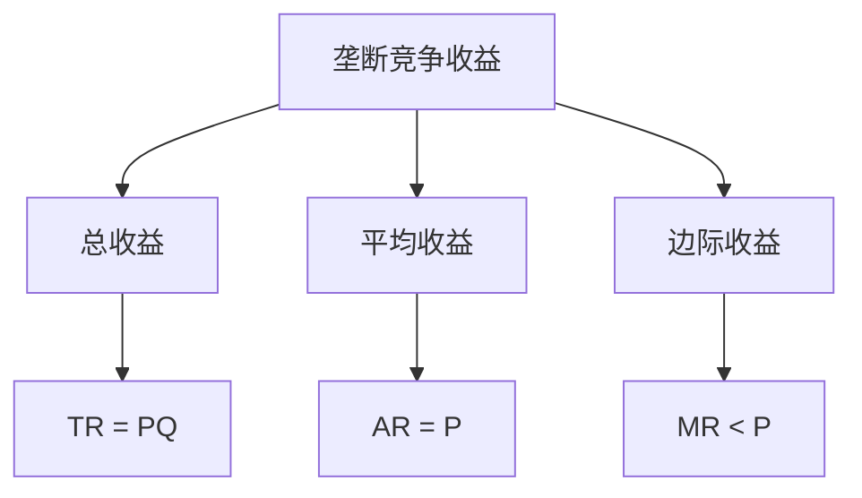
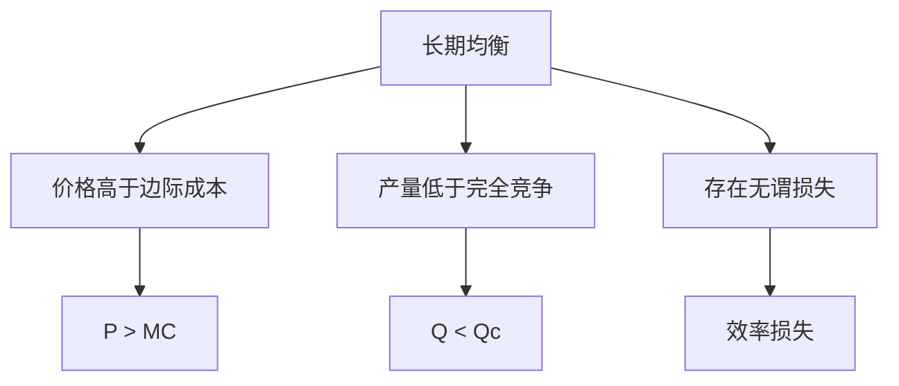
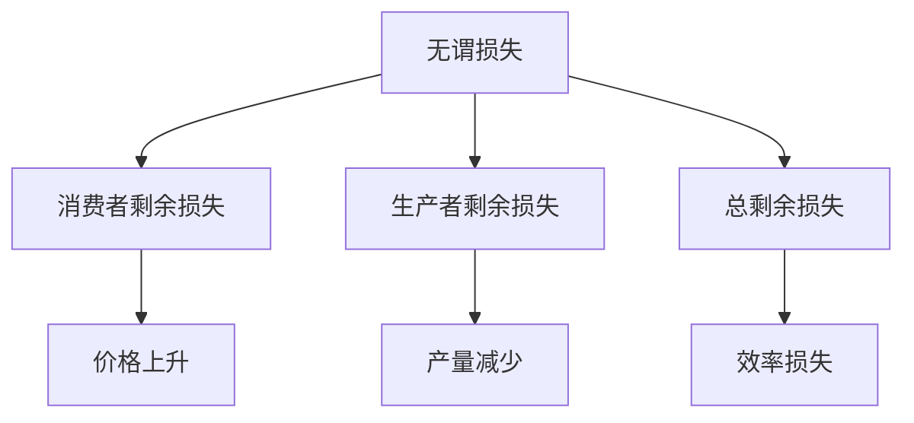

# 垄断竞争

## 核心概念

### 垄断竞争定义
**垄断竞争**：具有以下特征的市场结构：
1. 大量企业
2. 产品差异化
3. 自由进出
4. 价格制定者

> **费曼技巧**：垄断竞争 = 大量企业 + 产品差异化 + 自由进出 + 价格制定者

### 垄断竞争特征

| 特征 | 含义 | 影响 |
|------|------|------|
| **大量企业** | 企业数量众多 | 单个企业影响有限 |
| **产品差异化** | 产品有差异 | 有市场势力 |
| **自由进出** | 进出自由 | 长期利润为零 |
| **价格制定者** | 可以制定价格 | 价格高于边际成本 |

### 垄断竞争形成原因

#### 1. 产品差异化
- **产品特性**：产品特性不同
- **品牌效应**：品牌效应
- **服务差异**：服务差异

#### 2. 消费者偏好
- **偏好差异**：消费者偏好不同
- **品牌忠诚**：品牌忠诚
- **服务偏好**：服务偏好

#### 3. 市场细分
- **市场细分**：市场细分
- **目标市场**：目标市场
- **定位策略**：定位策略

## 企业行为分析

### 1. 需求曲线

#### 企业需求曲线
- **特征**：向下倾斜
- **原因**：产品差异化
- **含义**：价格上升，需求减少

#### 市场需求曲线
- **特征**：向下倾斜
- **原因**：市场需求规律
- **含义**：价格上升，需求减少

### 2. 收益分析

#### 收益函数
```
TR = PQ
AR = TR/Q = P
MR = dTR/dQ = P + Q(dP/dQ)
```

其中：
- **TR**：总收益
- **AR**：平均收益
- **MR**：边际收益
- **P**：价格

#### 收益特征



### 3. 利润最大化

#### 利润最大化条件
```
MR = MC
```

#### 利润分析

| 利润类型 | 条件 | 表现 |
|----------|------|------|
| **经济利润** | P > AC | 超额利润 |
| **正常利润** | P = AC | 零经济利润 |
| **亏损** | P < AC | 负经济利润 |

## 市场均衡分析

### 1. 短期均衡

#### 短期均衡条件
- **市场均衡**：企业决定
- **企业均衡**：MR = MC
- **均衡价格**：企业制定
- **均衡数量**：企业决定

#### 短期均衡特征
- **价格高于边际成本**：P > MC
- **产量低于完全竞争**：Q < Qc
- **存在经济利润**：π > 0

### 2. 长期均衡

#### 长期均衡条件
- **市场均衡**：企业决定
- **企业均衡**：MR = MC
- **零经济利润**：P = AC
- **最优规模**：AC最小

#### 长期均衡特征



### 3. 均衡比较

#### 垄断竞争与完全竞争比较

| 比较项目 | 完全竞争 | 垄断竞争 |
|----------|----------|----------|
| **价格** | P = MC | P > MC |
| **产量** | Qc | Qmc < Qc |
| **利润** | 零经济利润 | 零经济利润 |
| **效率** | 配置效率 | 配置无效率 |

#### 垄断竞争与垄断比较

| 比较项目 | 垄断 | 垄断竞争 |
|----------|------|----------|
| **价格** | Pm | Pmc < Pm |
| **产量** | Qm | Qmc > Qm |
| **利润** | 最大利润 | 零经济利润 |
| **效率** | 最低效率 | 效率较高 |

## 产品差异化分析

### 1. 产品差异化类型

#### 水平差异化
- **产品特性**：产品特性不同
- **消费者偏好**：消费者偏好不同
- **市场定位**：市场定位不同

#### 垂直差异化
- **产品质量**：产品质量不同
- **消费者偏好**：消费者偏好不同
- **市场定位**：市场定位不同

#### 服务差异化
- **服务质量**：服务质量不同
- **服务内容**：服务内容不同
- **服务方式**：服务方式不同

### 2. 产品差异化策略

#### 产品策略
- **产品创新**：产品创新
- **产品设计**：产品设计
- **产品定位**：产品定位

#### 营销策略
- **品牌策略**：品牌策略
- **广告策略**：广告策略
- **促销策略**：促销策略

#### 服务策略
- **服务创新**：服务创新
- **服务设计**：服务设计
- **服务定位**：服务定位

### 3. 产品差异化效果

#### 市场效果
- **市场细分**：市场细分
- **目标市场**：目标市场
- **市场定位**：市场定位

#### 竞争效果
- **竞争减少**：竞争减少
- **价格上升**：价格上升
- **利润增加**：利润增加

#### 效率效果
- **配置效率**：配置效率可能降低
- **生产效率**：生产效率可能降低
- **总效率**：总效率可能降低

## 效率分析

### 1. 配置效率

#### 配置效率条件
- **边际成本** = **边际收益**
- **价格** = **边际成本**
- **资源配置最优**

#### 垄断竞争配置无效率
- **价格高于边际成本**：P > MC
- **产量低于最优**：Q < Qc
- **无谓损失**：效率损失

#### 无谓损失分析



### 2. 生产效率

#### 生产效率条件
- **平均成本最小**
- **技术效率最高**
- **规模最优**

#### 垄断竞争生产效率
- **可能非最优规模**：规模可能非最优
- **技术效率**：技术效率可能非最优
- **创新激励**：创新激励可能不足

### 3. 动态效率

#### 动态效率条件
- **技术进步**：促进技术进步
- **创新激励**：激励创新
- **长期增长**：促进长期增长

#### 垄断竞争动态效率
- **创新激励**：创新激励可能不足
- **技术进步**：技术进步可能缓慢
- **长期增长**：长期增长可能缓慢

## 广告分析

### 1. 广告作用

#### 广告功能
- **信息传递**：传递产品信息
- **偏好改变**：改变消费者偏好
- **品牌建设**：建设品牌形象

#### 广告类型

| 类型 | 特征 | 例子 |
|------|------|------|
| **信息广告** | 传递产品信息 | 产品介绍 |
| **说服广告** | 改变消费者偏好 | 品牌宣传 |
| **提醒广告** | 提醒消费者 | 品牌提醒 |

### 2. 广告分析

#### 广告效果
- **需求增加**：需求增加
- **价格上升**：价格上升
- **利润增加**：利润增加

#### 广告成本
- **广告成本**：广告成本
- **成本增加**：成本增加
- **利润减少**：利润减少

#### 广告优化
- **广告投入**：最优广告投入
- **广告效果**：广告效果最大化
- **利润最大化**：利润最大化

### 3. 广告政策

#### 广告管制
- **广告内容**：广告内容管制
- **广告方式**：广告方式管制
- **广告时间**：广告时间管制

#### 广告政策
- **广告标准**：广告标准
- **广告审查**：广告审查
- **广告处罚**：广告处罚

## 政策分析

### 1. 反垄断政策

#### 反垄断目标
- **促进竞争**：促进市场竞争
- **提高效率**：提高市场效率
- **保护消费者**：保护消费者利益

#### 反垄断工具
- **结构控制**：控制市场结构
- **行为控制**：控制企业行为
- **绩效控制**：控制市场绩效

### 2. 价格管制

#### 价格管制目标
- **控制价格**：控制垄断竞争价格
- **保护消费者**：保护消费者利益
- **提高效率**：提高市场效率

#### 价格管制工具
- **价格上限**：设定价格上限
- **价格下限**：设定价格下限
- **价格指导**：价格指导

### 3. 质量管制

#### 质量管制目标
- **保证质量**：保证产品质量
- **保护消费者**：保护消费者利益
- **提高效率**：提高市场效率

#### 质量管制工具
- **质量标准**：设定质量标准
- **质量认证**：质量认证
- **质量监管**：质量监管

## 实际应用

### 1. 零售业

#### 零售业特征
- **产品差异化**：产品差异化
- **品牌效应**：品牌效应
- **服务差异**：服务差异

#### 零售业政策
- **反垄断**：反垄断政策
- **价格管制**：价格管制
- **质量管制**：质量管制

### 2. 餐饮业

#### 餐饮业特征
- **产品差异化**：产品差异化
- **品牌效应**：品牌效应
- **服务差异**：服务差异

#### 餐饮业政策
- **反垄断**：反垄断政策
- **价格管制**：价格管制
- **质量管制**：质量管制

### 3. 服务业

#### 服务业特征
- **服务差异化**：服务差异化
- **品牌效应**：品牌效应
- **服务差异**：服务差异

#### 服务业政策
- **反垄断**：反垄断政策
- **价格管制**：价格管制
- **质量管制**：质量管制

## 理论局限

### 1. 假设局限

#### 产品差异化假设
- **假设**：产品差异化
- **现实**：产品可能同质
- **影响**：理论可能不适用

#### 静态分析假设
- **假设**：静态分析
- **现实**：市场动态
- **影响**：可能不适用动态情况

### 2. 现实局限

#### 进入壁垒
- **假设**：自由进出
- **现实**：进入壁垒可能存在
- **影响**：长期利润可能不为零

#### 产品同质
- **假设**：产品差异化
- **现实**：产品可能同质
- **影响**：竞争策略可能不同

### 3. 应用局限

#### 复杂市场
- **问题**：市场可能复杂
- **解决**：简化假设
- **局限**：可能偏离现实

#### 动态市场
- **问题**：市场可能动态
- **解决**：静态分析
- **局限**：可能不适用动态情况

## 刻意练习

### 概念理解
- [ ] 理解垄断竞争的定义和特征
- [ ] 掌握企业行为分析方法
- [ ] 理解市场均衡和效率分析

### 计算应用
- [ ] 计算企业最优产量和价格
- [ ] 分析市场均衡
- [ ] 计算无谓损失

### 实际应用
- [ ] 分析垄断竞争市场
- [ ] 设计反垄断政策
- [ ] 评估政策效果

---

**相关链接**：
- [[01-完全竞争市场]] - 完全竞争市场分析
- [[02-垄断市场]] - 垄断市场分析
- [[03-寡头垄断]] - 寡头垄断分析
